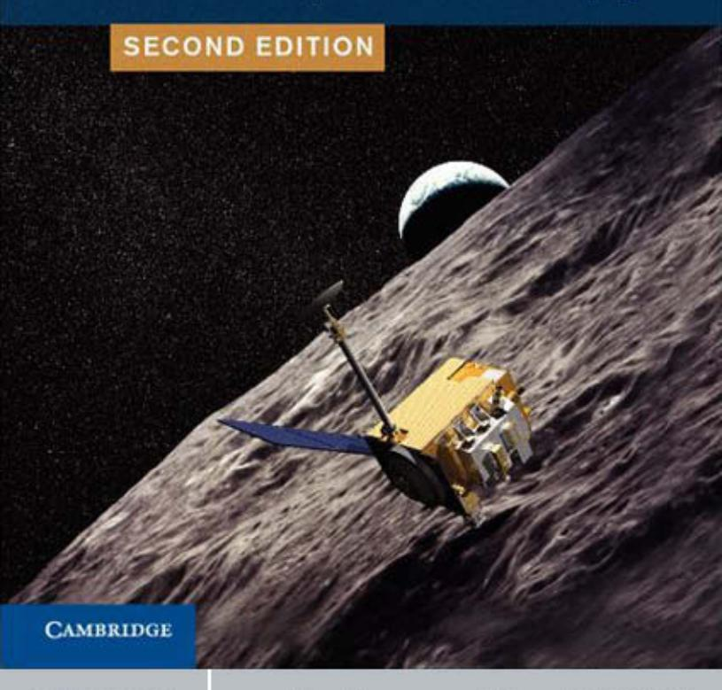

## **BRUCE HAPKE**

# Theory of Reflectance and Emittance Spectroscopy

# THEORY OF REFLECTANCE AND EMITTANCE SPECTROSCOPY

Reflectance and emittance spectroscopy have become increasingly important tools in remote sensing, and have been employed in virtually all recent planetary spacecraft missions. They are primarily used to measure properties of disordered materials, especially in the interpretation of remote observations of the surfaces of the Earth and other terrestrial planets.

*Theory of Reflectance and Emittance Spectroscopy* gives a quantitative treatment of the physics of the interaction of electromagnetic radiation with particulate media, such as powders and soils. Subjects covered include electromagnetic wave propagation, single particle scattering, diffuse reflectance, thermal emittance, and polarization. This new edition has been updated and expanded to include: extension of the equivalent slab model of irregular particle scattering to include particle phase functions and coated particles; a quantitative treatment of the effects of porosity; a detailed discussion of the coherent backscatter opposition effect, including polarization; a quantitative treatment of simultaneous transport of energy within the medium by conduction and radiation; and lists of relevant databases and software.

With a strong emphasis on physical insights, this book is an essential reference for research scientists, engineers, and advanced students of planetary remote sensing.

Bruce Hapke is Professor Emeritus of Geology and Planetary Science at the University of Pittsburgh, where he continues to study various bodies of the solar system. He was principal investigator for the analysis of lunar samples and was associated with several other NASA missions, to Mercury, Mars, Saturn, and the outer solar system. He is a Fellow of the American Geophysical Union and was awarded the Kuiper Prize by the Division for Planetary Sciences of the American Astronomical Society for "outstanding contributions to planetary science." He has an asteroid *3549 Hapke* and a mineral *hapkeite* named in his honor.

# THEORY OF REFLECTANCE AND EMITTANCE SPECTROSCOPY

*Second Edition*

## BRUCE HAPKE

*Department of Geology and Planetary Science University of Pittsburgh*

#### cambridge university press

Cambridge, New York, Melbourne, Madrid, Cape Town, Singapore, São Paulo, Delhi, Tokyo, Mexico City

Cambridge University Press The Edinburgh Building, Cambridge CB2 8RU, UK

Published in the United States of America by Cambridge University Press, New York

[www.cambridge.org](http://www.cambridge.org) Information on this title: [www.cambridge.org/9780521883498](http://www.cambridge.org/9780521883498)

© Bruce Hapke 2012

This publication is in copyright. Subject to statutory exception and to the provisions of relevant collective licensing agreements, no reproduction of any part may take place without the written permission of Cambridge University Press.

First published 2012

Printed in the United Kingdom at the University Press, Cambridge

*A catalogue record for this publication is available from the British Library*

*Library of Congress Cataloging in Publication data* Hapke, Bruce.

Theory of reflectance and emittance spectroscopy / Bruce Hapke. – 2nd ed.

p. cm.

Includes bibliographical references and index.

ISBN 978-0-521-88349-8

1. Reflectance spectroscopy. 2. Emission spectroscopy. 3. Moon–Surface–Spectra. I. Title. QC454.R4H37 2012 522! .67–dc23 2011040517

ISBN 978-0-521-88349-8 Hardback

Cambridge University Press has no responsibility for the persistence or accuracy of URLs for external or third-party internet websites referred to in this publication, and does not guarantee that any content on such websites is, or will remain, accurate or appropriate.

# Contents

|   | Acknowledgments                                                   | page xi |
|---|-------------------------------------------------------------------|------------|
| 1 | Introduction                                                      | 1          |
|   | 1.1 Scientific rationale                                    | 1          |
|   | 1.2 About this book                                      | 3          |
| 2 | Electromagnetic wave propagation                            | 5          |
|   | 2.1 Maxwell's equations                                     | 5          |
|   | 2.2 Electromagnetic waves in free space            | 6          |
|   | 2.3 Propagation in a linear nonabsorbing medium | 11         |
|   | 2.4 Propagation in a linear absorbing medium    | 17         |
|   | 2.5 Interference                                               | 22         |
|   | 2.6 Polarization; the Stokes vector                   | 23         |
| 3 | The absorption of light                                  | 27         |
|   | 3.1 Introduction                                               | 27         |
|   | 3.2 Classical dispersion theory                          | 27         |
|   | 3.3 Dispersion relations                                    | 33         |
|   | 3.4 Mechanisms of absorption                             | 34         |
|   | 3.5 Band shape and temperature effects             | 43         |
|   | 3.6 Spectral databases                                      | 44         |
| 4 | Specular reflection                                            | 45         |
|   | 4.1 Introduction                                               | 45         |
|   | 4.2 Boundary conditions in electromagnetic theory  | 45         |
|   | 4.3 The Fresnel equations                                | 46         |
|   | 4.4 The Kramers–Kronig reflectivity relations         | 61         |
|   | 4.5 Absorption bands in reflectivity                  | 62         |
|   | 4.6 Criterion for optical flatness                    | 64         |

viii *Contents*

| 5 | Single-particle scattering: perfect spheres                                              |                                                                                                |     |  |
|---|---------------------------------------------------------------------------------------------------|------------------------------------------------------------------------------------------------|-----|--|
|   | 5.1                                                                                               | Introduction                                                                                   | 66  |  |
|   | 5.2                                                                                               | Concepts and definitions                                                                 | 66  |  |
|   | 5.3                                                                                               | Scattering by a perfect, uniform sphere: Mie theory                       | 72  |  |
|   | 5.4                                                                                               | Properties of the Mie solution                                                     | 73  |  |
|   | 5.5                                                                                               | Other regular particles                                                                  | 95  |  |
|   | 5.6                                                                                               | The equivalent-slab approximation                                                        | 95  |  |
|   | 5.7                                                                                               | Computer programs                                                                           | 99  |  |
| 6 | Single-particle scattering: irregular particles                                          |                                                                                                |     |  |
|   | 6.1                                                                                               | Introduction                                                                                   | 100 |  |
|   | 6.2                                                                                               | Extension of definitions to nonspherical particles                              | 101 |  |
|   | 6.3                                                                                               | Empirical scattering functions                                                           | 101 |  |
|   | 6.4                                                                                               | Theoretical and experimental studies of nonspherical particles               | 109 |  |
|   | 6.5                                                                                               | The generalized equivalent-slab model                                                 | 122 |  |
|   | 6.6                                                                                               | Computer programs and databases                                                       | 144 |  |
| 7 | Propagation in a nonuniform medium: the equation of radiative transfer |                                                                                                |     |  |
|   | 7.1                                                                                               | Introduction                                                                                   | 145 |  |
|   | 7.2                                                                                               | Effective-medium theories                                                                   | 146 |  |
|   | 7.3                                                                                               | The transport of radiation in a particulate medium                        | 148 |  |
|   | 7.4                                                                                               | Radiative transfer in a medium of arbitrary particle separation        | 158 |  |
|   | 7.5                                                                                               | Methods of solution of radiative-transfer problems                              | 169 |  |
|   | 7.6                                                                                               | Computer programs                                                                           | 179 |  |
| 8 | The                                                                                               | bidirectional reflectance of a semi-infinite medium                             | 180 |  |
|   | 8.1                                                                                               | Introduction                                                                                   | 180 |  |
|   | 8.2                                                                                               | Reflectances                                                                                   | 180 |  |
|   | 8.3                                                                                               | Geometry and notation                                                                    | 183 |  |
|   | 8.4                                                                                               | The radiance at a detector viewing a horizontally stratified medium | 185 |  |
|   | 8.5                                                                                               | Empirical reflectance expressions                                                        | 187 |  |
|   | 8.6                                                                                               | The diffusive reflectance                                                                | 189 |  |
|   | 8.7                                                                                               | The bidirectional reflectance                                                            | 195 |  |
|   | 8.8                                                                                               | Comparison of the IMSA model with measurements                               | 210 |  |
|   | 8.9                                                                                               | Bidirectional reflectance of a medium of arbitrary filling factor      | 216 |  |
| 9 | The opposition effect                                                                       |                                                                                                |     |  |
|   | 9.1                                                                                               | Introduction                                                                                   | 221 |  |
|   | 9.2                                                                                               | The shadow-hiding opposition effect (SHOE)                                         | 224 |  |
|   | 9.3                                                                                               | The coherent backscatter opposition effect (CBOE)                               | 237 |  |
|   | 9.4                                                                                               | Combined SHOE, CBOE, and IMSA models                                            | 260 |  |

| 10 | A miscellany of bidirectional reflectances and related quantities |                                                                                        |            |  |
|----|----------------------------------------------------------------------------------------|----------------------------------------------------------------------------------------|------------|--|
|    | 10.1                                                                                   | Introduction                                                                           | 263        |  |
|    | 10.2                                                                                   | Some commonly encountered bidirectional reflectance quantities          | 263        |  |
|    | 10.3                                                                                   | Reciprocity                                                                            | 264        |  |
|    | 10.4                                                                                   | Diffuse reflectance from a medium with a specularly reflecting |            |  |
|    |                                                                                        | surface                                                                                | 266        |  |
|    | 10.5                                                                                   | Oriented scatterers: applications to vegetation canopies                | 268        |  |
|    | 10.6                                                                                   | Reflectance of a layered medium                                            | 272        |  |
|    | 10.7                                                                                   | Mixing formulas                                                                     | 282        |  |
| 11 | Integrated                                                                             | reflectances and planetary photometry                                         | 287        |  |
|    | 11.1                                                                                   | Introduction                                                                           | 287        |  |
|    | 11.2                                                                                   | Integrated reflectances                                                             | 287        |  |
|    | 11.3                                                                                   | Planetary photometry                                                                | 295        |  |
|    |                                                                                        |                                                                                        |            |  |
| 12 | 12.1                                                                                   | Photometric effects of large-scale roughness Introduction               | 303 303 |  |
|    | 12.2                                                                                   | Derivation                                                                             | 307        |  |
|    | 12.3                                                                                   | Applications to planetary photometry                                          | 323        |  |
|    | 12.4                                                                                   | Summary of the roughness correction model                               | 331        |  |
|    | 12.5                                                                                   | Other planetary photometric models                                            | 335        |  |
|    |                                                                                        |                                                                                        |            |  |
| 13 |                                                                                        | Polarization of light scattered by a particulate medium           | 339        |  |
|    | 13.1                                                                                   | Introduction                                                                           | 339        |  |
|    | 13.2                                                                                   | Linear polarization of particulate media                                   | 340        |  |
|    | 13.3                                                                                   | The positive branch of polarization                                        | 344        |  |
|    | 13.4                                                                                   | The negative branch of polarization                                        | 354        |  |
|    | 13.5                                                                                   | Summary                                                                                | 367        |  |
| 14 | Reflectance                                                                            | spectroscopy                                                                           | 369        |  |
|    | 14.1                                                                                   | Introduction                                                                           | 369        |  |
|    | 14.2                                                                                   | Measurement of reflectances                                                      | 370        |  |
|    | 14.3                                                                                   | Inverting the reflectance to find the scattering parameters       | 372        |  |
|    | 14.4                                                                                   | Absorption bands in reflectance                                               | 378        |  |
|    | 14.5                                                                                   | The reflectance spectra of intimate mixtures                            | 388        |  |
|    | 14.6                                                                                   | Absorption bands in layered media                                          | 392        |  |
|    | 14.7                                                                                   | Retrieving the absorption coefficient from the single-scattering     |            |  |
|    |                                                                                        | albedo                                                                                 | 395        |  |
|    | 14.8                                                                                   | Other methodologies                                                                 | 400        |  |
|    | 14.9                                                                                   | Particulate media with X"1                                                    | 406        |  |
|    | 14.10                                                                                  | Planetary applications                                                              | 407        |  |

x *Contents*

| 15    |                                                                                              | Thermal emission and emittance spectroscopy                        |     |  |
|-------|----------------------------------------------------------------------------------------------|--------------------------------------------------------------------------------|-----|--|
|       | 15.1                                                                                         | Introduction                                                                   | 412 |  |
|       | 15.2                                                                                         | Black-body thermal radiation                                             | 413 |  |
|       | 15.3                                                                                         | Emissivity                                                                     | 415 |  |
|       | 15.4                                                                                         | Kirchhoff's law                                                             | 425 |  |
|       | 15.5                                                                                         | Combined reflectance and emittance                                    | 427 |  |
|       | 15.6                                                                                         | Emittance spectroscopy                                                      | 428 |  |
|       | 15.7                                                                                         | The thermal shadow-hiding opposition effect: thermal beaming | 435 |  |
| 16    | Simultaneous transport of energy by radiation and thermal conduction |                                                                                |     |  |
|       | 16.1                                                                                         | Introduction                                                                   | 440 |  |
|       | 16.2                                                                                         | Equations                                                                      | 440 |  |
|       | 16.3                                                                                         | Some time-independent applications of the equations             | 449 |  |
|       | 16.4                                                                                         | Time-dependent radiative and conductive models                     | 460 |  |
|       | Appendix                                                                                     | A A brief review of vector calculus                          | 463 |  |
|       | Appendix                                                                                     | B Functions of a complex variable                               | 467 |  |
|       | Appendix                                                                                     | C The wave equation in spherical coordinates                 | 470 |  |
|       | Appendix D Fraunhofer diffraction by a circular hole                    |                                                                                |     |  |
|       | Appendix                                                                                     | E Table of symbols                                                    | 482 |  |
|       | Bibliography                                                                                 |                                                                                | 488 |  |
| Index |                                                                                              |                                                                                | 509 |  |

# Acknowledgments

## **From the first edition**

Many persons have contributed to this book. Foremost is my wife, Joyce, to whom this book is dedicated. Without her continuing support, to say nothing of pleas, cajoleries, and sometimes even threats, this book would not have been written. My children, Kevin, Jeff, and Cheryl, all managed to launch themselves successfully while this work was under way. In spite of several anxious moments, they have been a joy and an inspiration.

Next are my former students. Their suggestions, criticisms, measurements, and computations made important contributions. Bob Nelson built the goniometric photopolarimeter that took much of the data used in this book. He will be happy to know the instrument is still functional. I am especially grateful to Eddie Wells for his careful measurements and suggestions, and also to Jeff Wagner, Deborah Domingue, and Audrey McGuire.

Over the years I have benefited from conversations with many other persons, particularly Jack Salisbury, Paul Helfenstein, Carle Pieters, Joe Veverka, Roger Clark, Marcia Nelson, Jim Pollack, Ted Bowell, and Kaari Lumme. I also wish to thank Sophia Prybylski of Cambridge University Press. Her careful attention to the manuscript caught many errors of both typography and grammar.

My father was fond of quoting Albert Einstein to the effect that a scientist never really understands his own theories unless he can satisfactorily explain them to an average person. I never was able to verify whether or not Einstein actually said this, but it seemed like a good principle to follow. My colleague and friend Bill Cassidy is an explorer, finder of meteorites, and raconteur extraordinaire, but he has never claimed to be a mathematician, and thus he was an ideal man-on-the-street for my ideas. Many times he watched while I covered a blackboard with equations, and then asked me to explain in English what I had just written. I hope his patience has had a positive effect on the clarity of this book.

The major impetus behind the development of the reflectance models described here has been the desire to provide a tool that will enable planetary scientists to better understand the surfaces of the various bodies we study. I am grateful to the Planetary Geology and Geophysics Program, Solar System Exploration Division, Office of Space Science and Applications of the National Aeronautics and Space Administration (NASA) for their continuing support. I especially wish to thank former NASA program manager Steve Dwornik, who continued to approve my grant proposals even though at times he was not quite sure what I was attempting to do. I also thank the National Research Council of the NationalAcademy of Sciences for a senior research fellowship at NASA's Ames Research Center that supported me while I was working out some of these ideas.

I would be remiss if I did not especially acknowledge Thomas Gold, who may be said to have started it all. I had just finished my graduate studies at Cornell University when President Kennedy announced that we were going to the Moon. As a result, planetary science was suddenly revitalized. I thought that this would be a much more exciting field in which to do research than neutron physics, which was the subject of my doctoral dissertation, and Tommy agreed to accept me for postdoctoral research.

No one knew what the surface of the Moon was like, but Tommy thought that it was covered with a very fine-grained soil, which he referred to by the generic term "dust." At the time, that idea was at odds with the prevailing wisdom, which was divided between those who expected to find volcanic extrusive rock similar to Hawaiian aa and those who expected cobbly gravel, thought to have been generated by meteorite impacts. Tommy returned from a conference at which astronomers from the then Soviet Union had emphasized the strongly backscattering character of the lunar bidirectional refectance function. He was sure that "dust" could have this property and suggested that I build a goniometric photometer to investigate the diffuse reflectances of particulate media.

He assigned a young graduate student, Hugh Van Horn, as my research assistant. Hugh has since gone on to study brighter and denser objects than the Moon.We built the photometer and proceeded to measure the bidirectional reflectance functions of everything we could lay our hands on, including pulverized rocks, but the only material that was as backscattering as the Moon was reindeer moss – hardly a likely candidate. Somewhat in desperation, we began referring to the mysterious shapes that would produce a lunar type of photometric function as "fairy castle structures."

One day we discovered that very fine SiC abrasive powder was strongly backscattering, but that coarse SiC powder was not. There was no obvious reason for that difference in scattering properties, so I went off in search of microscope to see if a magnified inspection of the surface would give me a clue. It was late on Friday afternoon, and most of my colleagues had gone home, so that the only instrument I could borrow was a low-power, stereoscopic microscope. This turned out to be serendipitous. First, I looked through the microscope at the coarse-grained powder. It resembled a pile of gravel and was not very interesting. Then I placed the fine-grained powder on the stage, and there were the fairy castles.

The name we had given the structures turned out not to be facetious at all, but is in fact a rather accurate description of the morphology of a powder in which the surface forces that act between grains exceed the gravitational forces exerted on them by the Earth. As I looked through the microscope, I saw a miniature world of deep, mysterious valleys and soaring towers leaning at crazy angles atop rugged, porous hills, with flying buttresses, and all connected by lacy bridges. Readers can easily verify these features for themselves. The complexity of such a texture is impossible to perceive with a monocular microscope, but it is just what is necessary to produce a lunar-type reflectance function. This discovery, along with Lyot's polarization data, turned out to be among the strongest pre-Apollo evidences that the lunar surface consists of a fine-grained regolith.

After we had solved the problem experimentally, I thought I would see if I could describe it mathematically, and I have been thinking about reflectances, off and on, ever since.

Finally, I wish to thank Ted Bowell for proposing that an asteroid that he discovered be named 3549 Hapke after me. I hope that someday my granddaughter Carley will land on it.

## **Preface to the second edition**

In the years since the first edition of this book appeared reflectance and emitance spectroscopy have evolved into mature techniques for the remote study of surfaces of bodies of the solar system. The first edition had been generously received by my colleagues, so Cambridge University Press suggested that I write a second edition. Interactions with many colleagues, including those cited above and also Paul Lucey, Jack Mustard, and Mark Robinson, continue to help my understanding of reflectance. I am particularly indebted to my former students Jennifer Piatek and Amy Snyder Hale. The many discussions with them and their research while at the University of Pittsburgh made important contributions to this book. Jen's wizardy with MAC computers and her general programming skills were astonishing to someone who finished his formal schooling with only a slide rule. Bob Nelson has grown from a former graduate student into a respected planetary scientist and personal friend. We continue to collaborate on measurements of the reflectance and polarization of particulate media, and these measurements and his insights have been invaluable.

Finally, I thank Larry Taylor for naming the mineral hapkeite (Fe2Si) after me.