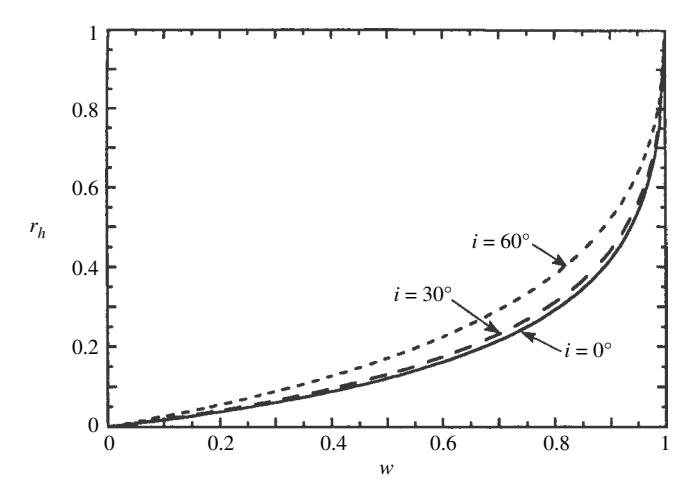
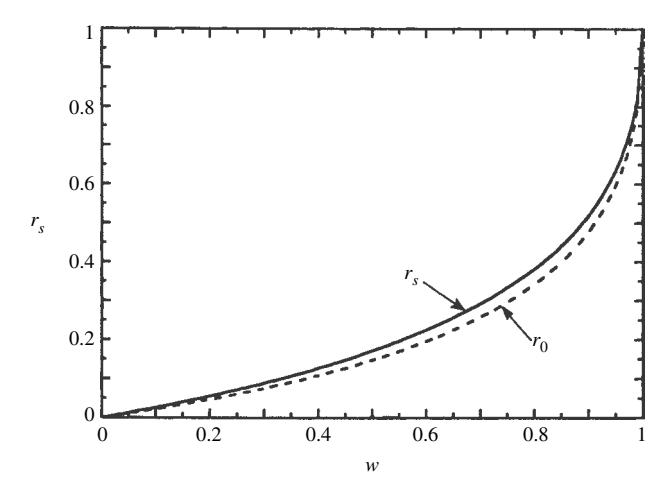
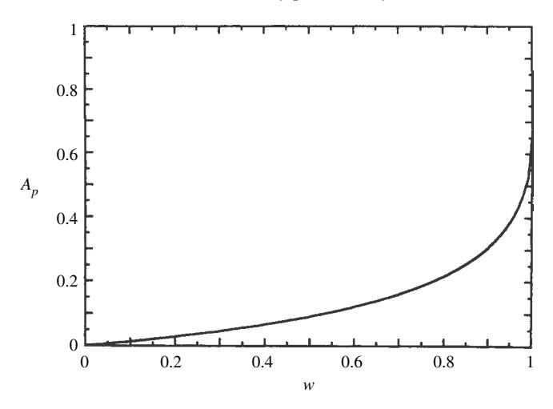

# **11**

# Integrated reflectances and planetary photometry

## **11.1 Introduction**

The basic expression for the bidirectional reflectance of a semi-infinite medium of isotropically scattering particles was derived in Chapter [8](#page--1-0) and is given by equation [\(8.48\)](#page--1-0). This expression was further refined to include an approximate correction for anisotropic scatterers [\(8.60\)](#page--1-0) and considerations of the effects of porosity [\(8.70\)](#page--1-0) and the opposition effect in Chapter [9](#page--1-0) [\(9.47\)](#page--1-0). Variants in different geometries were discussed in Chapter [10.](#page--1-0) In this chapter we will derive expressions that involve integration of the bidirectional reflectance over one or both hemispheres.The remote sensing of bodies of the solar system has its own nomenclature because of the special problems of astronomical observation. Expressions for quantities commonly encountered in planetary spectrophotometry will be derived. Only media for which the porosity factor *K* = 1 will be treated. Approximate expressions when *K >* 1 may be readily obtained by substituting one of the linear approximations [\(8.54](#page--1-0) or [8.55\)](#page--1-0) for the *H* function in the integrand.

# **11.2 Integrated reflectances**

### *11.2.1 Biconical reflectances*

If the source and detector do not occupy negligibly small solid angles as seen from the surface, appropriate expressions for the reflectances may be found by numerically integrating one of the above equations over the angular distribution of the radiance from the source and the angular distribution of the response of the detector. In general, such reflectances will be biconical. However, because they would be specific to each particular system, it would not be particularly useful to discuss biconical reflectances in detail.

# *11.2.2 The hemispherical reflectance (directional–hemispherical reflectance) 11.2.2.1 Introduction*

The directional–hemispherical reflectance, or, more simply, the hemispherical reflectance, is denoted by *rh*. It is defined as the ratio of the power scattered into the entire upper hemisphere by a unit area of the surface of the medium to the collimated power incident on the unit surface area. The hemispherical reflectance is also called the hemispherical albedo or the plane albedo in planetary photometric work, where it is denoted by *Ah* (see Section [11.3.4\)](#page--1-0).

The hemispherical reflectance is important for two reasons. First, it is the quantity that is measured by many commercial reflectance spectrometers. Second, it is one of the properties of a material that determines the radiative equilibrium temperature.

The power incident on a unit area of the surface of a medium is *J µ*0. The power emitted into unit solid angle per unit area of the surface is *Y* = *Jr(i,e, g)µ*. The total power emitted per unit area of the surface into the entire hemisphere above the surface is obtained by integrating the emitted power per unit area over the entire hemisphere into which the radiance is emitted. Hence, the general expression for the hemispherical reflectance is

$$r_h(i) = \frac{1}{J\mu_0} \int_{2\pi} Y(i, e, g) d\Omega_e = \frac{1}{\pi_0} \int_{e=0}^{\pi/2} \int_{\psi=0}^{2\pi} r(i, e, g) \mu d\omega_e,$$
 (11.1)

where *d*ω*e* = sin *e de d*Ψ = !*d µd*Ψ.

The general bidirectional reflectance includes the opposition effect. However, note that the opposition effect typically has an angular half-width of about 0.1 radian or less. Hence, its relative contribution to the integral over a hemisphere is ≤ π*(*0*.*1*)*2*/*2π # 1, so that it makes a negligible contribution to the integrated reflectances. Thus, to a sufficient approximation, the opposition effect may be ignored in the integrand.

### *11.2.2.2 The hemispherical reflectance of a medium of isotropic scatterers*

**Well-separated scatterers** The hemispherical reflectance *rh* is obtained by inserting equation [\(8.49\)](#page--1-0) for *r(i, e, g)* when the particles are well separated into [\(11.1\)](#page--1-0), which gives

$$r_h = \frac{w}{4\pi} \int_{\psi=0}^{2\pi} \int_{e=0}^{\pi/2} \frac{\mu}{\mu_0 + \mu} H(\mu_0) H(\mu) \sin e \, de \, d\psi.$$

$$= \frac{w}{2} \int_{\mu=0}^{1} \frac{\mu}{\mu_0 + \mu} H(\mu_0) H(\mu) d\mu,$$

which can be readily evaluated by writing *µ/(µ*0 +*µ)* = 1!*µ*0*/(µ*0 +*µ)*,

$$r_{hi} = \frac{w}{2} H(\mu_0) \int_0^1 H(\mu) d\mu - \frac{w}{2} \mu_0 H(\mu_0) \int_0^1 \frac{H(\mu)}{\mu_0 + \mu} d\mu$$

$$= \frac{1 - \gamma^2}{2} H(\mu_0) \frac{2}{1 + \gamma} - [H(\mu_0) + 1]$$

$$= 1 - \gamma H(\mu_0). \tag{11.2}$$

Using the two-stream approximation for *H (µ*0*)* gives

$$r_h(i) = \frac{1 - \gamma}{1 + 2\gamma \mu_0}. (11.3)$$

An alternate derivation of [\(11.3\)](#page-0-0) for isotropic scatterers can be found from equations [\(8.43\)](#page-0-0)–[\(8.45\)](#page-0-0). In the two-stream approximation, the upward-going flux at the surface is

$$I_1(0) = A(1-\gamma) + C\frac{2\mu_0 - 1}{2\mu_0} = \frac{J}{2\pi} 2\mu_0 \frac{1-\gamma}{1+2\gamma\mu_0}.$$

Hence, the total power per unit area leaving the surface in the upward direction is

$$\int_0^{\pi/2} I_1(0) \cos e 2\pi \sin e de = J \mu_0 \frac{1 - \gamma}{1 + 2\gamma \mu_0},$$

from which [\(11.3\)](#page-0-0) follows. This expression was first obtained by Reichman [\(1973\)](#page-0-0).

**Arbitrary separations between scatterers** The hemispherical reflectance for isotropically scattering particles with arbitrary separations can be similarly obtained from the two-stream approximation. The result is

$$r_h = \frac{1 - \gamma}{1 + 2\gamma \,\mu_0 / K}.\tag{11.4}$$

Equation [\(11.3\)](#page-0-0) for *rh(i)* is plotted versus *w* in Figure [11.1](#page-0-0) for several values of *i* for the case of isotropic scatterers.

*11.2.2.3 The IMSA model for the hemispherical reflectance*

Putting equation [\(8.60\)](#page-0-0) for *r* in [\(11.1\)](#page-0-0) gives

$$r_h(i) = \frac{w}{4\pi} \int_{\Psi=0}^{2\pi} \int_{\pi/2}^{e=0} \frac{\mu}{\mu_0 + \mu} [p(g) + H(\mu_0)H(\mu) - 1] \sin e \, de \, d\Psi \qquad (11.5)$$

Separating the integral into two parts,

$$r_h = r_{hi} + r_{ha},$$

Figure 11.1 Hemispherical reflectance *rh* (also called directional–hemispherical reflectance, hemispherical albedo, and plane albedo) for isotropic scatterers plotted against the single-scattering albedo for several values of the angle of incidence. The curve for *i* = 60◦ is identical with *r*0. The curves of the hemispherical–directional reflectance are identical if *i* is replaced by *e*.

where *rhi* is the contribution to *rh* by an equivalent medium of isotropic scatterers and has been evaluated in equation [\(11.3\)](#page-0-0), and

$$r_{ha} = \frac{w}{4\pi} \int_{\Psi=0}^{2\pi} \int_{\mu=0}^{1} \frac{\mu}{\mu_0 + \mu} [p(g) - 1] d\mu d\Psi.$$
 (11.6)

Equation [\(11.6\)](#page-0-0) can be evaluated analytically if *p(g)* can be expressed as a Legendre polynomial series,

$$p(g) = 1 + \sum_{n=1}^{\infty} b_n p_n(\cos g)$$

$$= 1 + \sum_{n=1}^{\infty} b \left[ p_n(\mu_0) p_n(\mu) + \sum_{m=1}^{n} \frac{(n-m)!}{(n+m)!} p_{nm}(\mu_0) p_{nm}(\mu) \cos \Psi \right],$$
(11.7)

where we have used the addition theorem for Legendre polynomials (Appendix [C\)](#page-0-0), in which *Pnm.(x)*is an associated Legendre polynomial. Inserting [\(11.7\)](#page-0-0) into [\(11.6\)](#page-0-0), the integral over cos Ψ vanishes and [\(11.6\)](#page-0-0) becomes

$$r_{ha} = \frac{w}{2} \sum_{n=1}^{\infty} b_n p_n(\mu_0) \int_0^1 \frac{\mu}{\mu_0 + \mu} p_n(\mu) d\mu.$$

Since a Legendre polynomial can be expressed as a sum of cosines, the integral in the last equation consists of terms of the form  $\int_0^1 \mu^j (\mu_0 + \mu)^{-1} d\mu$ . These can be evaluated using

$$\int \frac{x^{j}}{a+bx} = \frac{1}{b^{j+1}} \left[ (-a)^{j} \ln(a+bx) + \sum_{k=0}^{j-1} \frac{j!(-a)^{k}(a+bx)^{j-k}}{(j-k)!(j-k)k!} \right].$$
(11.8)

We will find  $r_h$  for the case where p(g) consists of a first-order Legendre series,  $p(g) = 1 + b_1 \cos g$ . Then the integral over  $\mu$  is

$$\int_0^1 \mu^2 (\mu_0 + \mu)^{-1} d\mu = 1/2 - \mu_0 + \mu_0^2 \ln(1/\mu_0 + 1).$$

Combining  $r_{hi}$  and  $r_{ha}$  gives

$$r_h(i) = 1 - \gamma H(\mu_0) + \frac{w}{2} b_1 \mu_0 \left[ \frac{1}{2} - \mu_0 + \mu_0^2 \ln \frac{\mu_0 + 1}{\mu_0} \right]. \tag{11.9}$$

If we substitute the two-stream approximation (8.53) for  $H(\mu_0)$  and use the approximation  $\mu_0 \ln[(\mu_0 + 1)/\mu_0] \approx 2\mu_0/(1 + 2\mu_0)$ , which has about the same accuracy as (8.53), equation (11.9) becomes

$$r_h(i) = \frac{1 - \gamma}{1 + 2\gamma\mu_0} + b_1 \frac{w}{4} \frac{\mu_0}{1 + 2\mu_0}.$$
 (11.10)

### 11.2.2.4 The modified IMSA model for the hemispherical reflectance

The directional-hemispherical reflectance of a medium of nonabsorbing particles must equal unity. However, equation (11.10) predicts that when w=1,  $r_h(i)=1+b_1\mu_0/4(1+2\mu_0)$ . For example, when i=0,  $r_h=1+b_1/12$ , so that if  $b_1$  is as large as 1, the discrepancy is 8%. This is an indication of the magnitude of the general errors inherent in the approximation that places all the effects of particle anisotropy in the single-scattering term of the bidirectional reflectance. The errors can be reduced by using the MIMSA model.

Inserting equation (8.63), in which p(g) is expressed in Legendre polynomials, into equation (11.1) gives

$$r_h(i) = \frac{w}{4\pi} \int_{\psi=0}^{2\pi} \int_{e=0}^{\pi/2} \frac{\mu}{\mu_0 + \mu} \{ p(g) + L_1(\mu_0) [H(\mu) - 1] + L_1(\mu) [H(\mu_0) - 1] + L_2[H(\mu) - 1] [H(\mu_0) - 1] \} d\mu,$$
(11.11)

where  $L_1(\mu_0)$ ,  $L_1(\mu)$ , and  $L_2$  have been defined in Section 8.7.4.4. Inserting the expressions for the  $L_S$ , with the Legendre polynomial addition theorem for p(g), and carrying out the integration over azimuth, after some algebra (11.11) can be

put into the form

$$r_{h}(i) = \frac{w}{2} \int_{0}^{1} \frac{\mu}{\mu_{0} + \mu} H(\mu_{0}) H(\mu) d\mu + \sum_{n=1}^{\infty} b_{n} \{ P_{n}(\mu_{0}) + A_{n} [H(\mu_{0}) - 1] \}$$

$$\times \left\{ \frac{w}{2} \int_{0}^{1} \frac{\mu}{\mu_{0} + \mu} P_{n}(\mu) d\mu + A_{n} \frac{w}{2} \int_{0}^{1} \frac{\mu}{\mu_{0} + \mu} H(\mu) d\mu - A_{n} \frac{w}{2} \int_{0}^{1} \frac{\mu}{\mu_{0} + \mu} d\mu \right\}, \qquad (11.12)$$

where  $A_n$  has been defined in (8.66d). The first term on the right of (11.12) is the hemispherical reflectance for isotropic scatterers, equation (11.2). The first and third integrals inside the curly brackets are all of the form  $\int_0^1 \mu^j (\mu_0 + \mu)^{-1} d\mu$  and, as discussed in the preceding section, can be evaluated using (11.8). The second integral inside the curly brackets is

$$\begin{split} A_n \frac{w}{2} \int_0^1 \frac{\mu}{\mu_0 + \mu} H(\mu) d\mu &= A_n \frac{w}{2} \int_0^1 \left( 1 - \frac{\mu_0}{\mu_0 + \mu} \right) H(\mu) d\mu \\ &= A_n \left[ (1 - \gamma) - \frac{H(\mu_0) - 1}{H(\mu_0)} \right] = A_n \left[ \frac{1}{H(\mu_0)} - \gamma \right]. \end{split}$$

For the case where p(g) is a first-order Legendre polynomial,

$$r_{h}(i) = 1 - \gamma H(\mu_{0}) + b_{1} \left\{ \mu_{0} - \frac{1}{2} [H(\mu_{0}) - 1] \right\}$$

$$\times \left\{ \frac{w}{2} \left[ \frac{1}{2} - \mu_{0} + \mu_{0}^{2} \ln \frac{1 + \mu_{0}}{\mu_{0}} \right] + \frac{1}{2} \left[ \frac{1}{H(\mu_{0})} - \gamma \right] - \frac{w}{4} \left[ 1 - \mu_{0} \ln \frac{1 + \mu_{0}}{\mu_{0}} \right] \right\}.$$
(11.13)

The improvement of the MIMSA over the IMSA model may be judged by the fact that when w = 1, conservation of energy requires that  $r_h(i) = 0$ . When i = 0 equation (11.13) predicts that  $r_h(0) = 1 + 0.0088b_1$ . Since  $|b_j| \le 1$ , the error is < 1%.

### 11.2.3 The hemispherical-directional reflectance

The hemispherical–directional reflectance is defined as the ratio of (1) the radiance scattered into a particular direction from the surface of a medium that is being uniformly illuminated from all directions in the hemisphere above the surface to (2) the incident radiance. To calculate the hemispherical–directional reflectance, the incident irradiance J must be replaced by  $I_0 d\Omega_i$ , where  $I_0$  is the incident radiance, assumed independent of direction, and  $d\Omega_i = \sin i \, di \, d\psi$ . The radiance scattered

from the surface into a given direction is the integral of  $I_0r(i,e,g)d\Omega_i$  over the hemisphere from which the incident radiance comes. Hence, the hemispherical-directional reflectance is

$$r_{hd}(e) = \frac{1}{I_0} \int_{2\pi} I_0 r(i, e, g) d\Omega_i = \int_{2\pi} r(i, e, g) d\Omega_i.$$
 (11.14)

By the same arguments as used in deriving the hemispherical reflectance, the contribution of the opposition effect to the total scattered radiance is negligible. Because the bidirectional reflectance must obey reciprocity (Section 10.3),

$$r_{hd} = \int_{2\pi} r(i, e, g) d\Omega_e = \int_{2\pi} r(e, i, g) \frac{\mu}{\mu_0} d\Omega_e = r_h(e).$$
 (11.15)

Hence, the hemispherical–directional reflectance has the same functional dependence on e that the directional–hemispherical reflectance has on i. For isotropic scatterers we can write, by inspection,

$$r_{hd}(e) = 1 - \gamma H(\mu)$$
 (11.16a)

Using the two-stream approximation for  $H(\mu)$ ,

$$r_{hd}(e)\frac{1-\gamma}{1+2\gamma\mu} \tag{11.16b}$$

If i is replaced by e in Figure 11.1, the curve shows  $r_{hd}$  as a function of w for several values of e.

Expressions for the IMSA and MIMSA models can be found by replacing i with e in the appropriate equations in Section 11.2.2.

## 11.2.4 The spherical reflectance (bihemispherical reflectance)

The bihemispherical reflectance, or, more simply, the spherical reflectance, is denoted by  $r_s$ . It is the ratio of (1) the total power scattered into the upward hemisphere from unit area of a surface that is being uniformly illuminated by diffuse radiance from the entire upper hemisphere to (2) the total power incident on unit area of the surface. In Section 11.3.7 this quantity will be shown to be equivalent to the Bond or spherical albedo  $A_s$  of a spherical planet.

The total power incident on unit area of the surface is  $\int_{2\pi} I_0 \mu_0 2\pi \sin i \ di = I_0 \pi$ , where  $I_0$  is the incident radiance. The total power scattered into the upper hemisphere is the integral of  $I_0 d\Omega_i r \mu d\Omega_e$  over both the direction from which the radiance comes and the direction into which it is scattered. Hence, the spherical reflectance is

$$r_s = \frac{1}{\pi} \int_{2\pi} \int_{2\pi} r(i, e, g) \mu d\Omega_e d\Omega_i.$$
 (11.17)

Figure 11.2 Spherical reflectance *rs* (also called bihemispherical reflectance and Bond albedo) vs. *w* for isotropic scatterers. The exact and approximate expressions are indistinguishable on this scale. Also shown is the diffusive reflectance *r*0.

Equation [\(11.17\)](#page-0-0) will be evaluated first for the case of isotropic scatterers. The opposition effect can be ignored. Then *r* is independent of azimuth and we may put *d*ζ*i* = 2π*dµ*0 and *d*ζ*e* = 2π*dµ*. Inserting [\(8.49\)](#page-0-0) for *r*, and using the result from [\(11.2\)](#page-0-0),

$$r_s = \frac{1}{\pi} \int_0^1 \int_0^1 \frac{w}{4\pi} \frac{\mu_0 \mu}{\mu_0 + \mu} H(\mu_0) H(\mu) 2\pi d\mu_0 = 2 \int_0^1 [1 - \gamma H(\mu_0)] \mu_0 d\mu_0.$$

Hence,

$$r_s = 1 - 2\gamma H_1, \tag{11.18}$$

where *H*1 is the first moment of the *H* function (equation [\[8.50\]](#page-0-0)). The quantities *H*1 and *rs* have been calculated by numerical integration by Chamberlain and Smith [\(1970](#page-0-0)). The spherical reflectance is plotted versus *w* in Figure [11.2.](#page-0-0)

An approximate expression for *rs* may be obtained by using [\(8.58\)](#page-0-0) for *H*1 in [\(11.18\)](#page-0-0) to obtain

$$r_s \simeq r_0 \left( 1 - \frac{1}{3} \frac{\gamma}{1 + \gamma} \right). \tag{11.19}$$

This approximation has relative errors of less than 2.0%.

Note that *rs* and the diffusive reflectance *r*0 are both types of bihemispherical reflectances and have very similar functional dependences on *w*. However, they are not equal. The reason has to do with the way the incident radiance is assumed to interact with the medium in the derivations of the two expressions. In the diffusive reflectance *r*0 the incidence radiance is assumed to become uniformly distributed with angle as soon as it crosses the mathematical upper surface. However, in the more physically realistic solution for *rs*, the interaction takes place via the source function within a layer a few times 1*/E* thick below the upper surface. This alters the distribution with depth of the radiance within the medium, and hence alters the reflectance.

It was emphasized in Chapter [8](#page-0-0) that the diffusive reflectance is a useful, mathematically simple quantity that gives surprisingly accurate first-order estimates of reflectance. As a demonstration of the power of the diffusive reflectance, it is left as an exercise for the reader to show that the following identities hold for media of isotropic scatterers:

(1) 
$$\Gamma(60^{\circ}, 60^{\circ}, g \gg h) = r_0,$$
 (11.20a)

(2) 
$$r_h(60^\circ) = r_0,$$
 (11.20b)

(3) 
$$r_{dh}(60^\circ) = r_0.$$
 (11.20c)

Because of the similar behaviors of the diffusive and spherical reflectances, it is reasonable to ask if similarity relations can be found that will convert the expression for*rs* for isotropic scatterers to one applicable to nonisotropic scatterers.Although a general answer cannot be given, this question has been investigated numerically by Van de Hulst [\(1974\)](#page-0-0). He calculated the spherical reflectance of a medium of scatterers having an angular function that can be described by the Henyey–Greenstein function,

$$p(\theta) = \frac{1 - \xi^2}{(1 - 2\xi \cos \theta + \xi^2)^{3/2}},$$

where ξ is the cosine asymmetry factor. Van de Hulst finds that replacing *w* and ς by *w*∗ and ς ∗, respectively, in [\(11.18\)](#page-0-0), where these quantities are given by the similarity relations

$$w^* = \frac{1 - \xi}{1 - \xi w} w,\tag{11.21a}$$

$$\gamma^* = \left[\frac{1-w}{1-\xi w}\right]^{1/2},\tag{11.21b}$$

gives an approximation for *rs* that is accurate to 0.002 for all values of *w* and ξ .

# **11.3 Planetary photometry** *11.3.1 Introduction*

Planetary scientists usually describe the photometric properties of solar-system bodies by several different kinds of reflectances known as albedos and photometric functions. The word *albedo* comes from the Latin word for whiteness. Just as there are many reflectances, so there are several different kinds of albedos, depending on the geometry. Historically, most of these quantities arose in attempts to characterize the scattering properties of the surface of the Moon as observed from the Earth, and the definitions were then extended to other bodies of the solar system.

In addition to defining the various quantities for a planet whose surface has arbitrary photometric properties, the following sections will derive approximate analytic expressions for these quantities on a spherical body covered with an optically thick, uniform, particulate regolith whose bidirectional reflectance can be described by the IMSA model with opposition effect, equation [\(9.47\)](#page-0-0) with *K* = 1. As usual, *r(i, e, g)* will denote the bidirectional reflectance of a surface, and *J* the incident collimated irradiance. The radiance *I (i, e, g)* interacting with the eye produces the sensation of brightness, and the terms *radiance* and *brightness* are often used interchangeably in planetary work.

### *11.3.2 The normal albedo*

The *normal albedo An* is the ratio of the brightness of a surface observed at zero phase angle from an arbitrary direction to the brightness of a perfectly diffuse surface located at the same position, but illuminated and observed perpendicularly. That is, the normal albedo is the radiance factor of the surface at zero phase.

Thus,

$$A_n = [Jr(e, e, 0)] / [J/\pi] = \pi r(e, e, 0).$$
 (11.22)

Using [\(9.47\)](#page-0-0) with *K* = 1,

$$A_n = \frac{w}{8} \{ p(0)(1 + B_{S0}) + [H(\mu)^2 - 1][1 + B_{C0}] \}.$$
 (11.23)

In general, the normal albedo is a function of *e*. However, for dark bodies of the solar system, including the Moon, Mercury, and many asteroids, [*H (µ)*2 !1] # 1, so that to a first approximation for these bodies

$$A_n \approx \frac{w}{8} p(0)(1 + B_{S0})(1 + B_{C0})$$
 (11.24)

which is constant, independent of *e*. Thus, the normal albedos of different areas on the surfaces of these bodies may be intercompared even though they are observed at different angles. Hence, the normal albedo is a useful parameter to characterize their surfaces.

### 11.3.3 The photometric function

The ratio of the brightness of a surface viewed at a fixed e, but varying i and g, to its value at g = 0 is called the *photometric function* of the surface:

$$f(i, e, g) = r(i, e, g)/r(e, e, 0).$$
 (11.25)

Then the radiance scattered by the surface is given by

$$I(i, e, g) = Jr(i, e, g) = Jr(e, e, 0) f(i, e, g) = \frac{J}{\pi} A_n f(i, e, g).$$
(11.26)

For a Lambert surface,  $A_n = A_L$ , and  $f(i, e, g) = \mu_0$ . For a particulate medium that obeys (9.47),

$$f(i, e, g) = 2 \frac{\mu_0}{\mu_0 + \mu} \frac{\{p(g)[1 + B_{S0}B_S(g)] + [H(\mu_0)H(\mu) - 1]\}[1 + B_{C0}B_C(g)]}{\{p(0)(1 + B_{S0}) + [H(\mu)^2 - 1]\}[1 + B_{C0}]}.$$
(11.27)

The Moon keeps the same face toward the Earth; hence, a given area will always be viewed from the Earth at nearly the same e. Because the lunar surface has a low albedo,  $H(\mu_0)H(\mu)-1\ll 1$ , and  $H(\mu)^2-1\ll 1$ . Hence, to a first appoximation, for areas on the Moon observed from Earth,

$$f(i, e, g) \simeq 2 \frac{\mu_0}{\mu_0 + \mu} \frac{p(g)}{p(0)} \frac{[1 + B_{S0}B_S(g)][1 + B_{C0}B_C(g)]}{(1 + B_{S0})(1 + B_{C0})}.$$
 (11.28)

This expression has the same functional dependence on i, e, and g as does the generalized Lommel–Seeliger law, equation (8.35a). KenKnight, Rosenberg, and Wehner (1967) have shown that the relative brightness of different areas on the Moon are described to a good approximation by the Lommel–Seeliger law.

#### 11.3.4 The hemispherical albedo (plane albedo)

The hemispherical albedo  $A_h$  is the total fraction of collimated irradiance incident on unit area of surface that is scattered into the upward hemisphere. It is also known as the plane albedo. The hemispherical albedo is the same as the directional–hemispherical or hemispherical reflectance; that is,

$$A_h(i) = r_h(i).$$
 (11.29)

Explicit expressions for this quantity have been defined, and analytic approximations derived in Section 11.2.2. It is plotted versus w and i in Figure 11.1.

### 11.3.5 The physical albedo (geometric albedo)

The *physical albedo* is also known as the *geometric albedo*. It is defined as the ratio of the integral brightness of a body at g = 0 to the brightness of a perfect Lambert disk of the same radius and at the same distance as the body, but illuminated and observed perpendicularly. The physical albedo is the weighted average of the normal albedo over the illuminated area of the body.

For a spherical body of radius R the physical albedo is given by

$$A_p = \left[ \int_{A(i)} Jr(e, e, 0) \mu dA \right] / \left[ (J/\pi)\pi R^2 \right] = R^{-2} \int_{A(i)} r(e, e, 0) \mu dA, \quad (11.30)$$

where  $dA = 2\pi R^2 \sin e \, de = -2\pi R^2 d\mu$  is the increment of area on the surface of the body, and A(i) is the area of the illuminated hemisphere. Using (9.47),

$$A_{p} = \frac{w}{4} \int_{0}^{1} \left\{ p(0)(1 + B_{S0}) + [H^{2}(\mu) - 1] \right\} [1 + B_{C0}] \mu d\mu$$

$$= \frac{w}{8} [p(0)(1 + B_{S0}) - 1](1 + B_{C0}) + \frac{w}{4} (1 + B_{C0}) \int_{0}^{1} H^{2}(\mu) \mu d\mu.$$
(11.31)

If the opposition effect is ignored, the last term on the right-hand side of (11.31) is the physical albedo of a planet covered with isotropically scattering particles. Denote this quantity by  $A_{pi}$ . It is plotted in Figure 11.3. An approximate expression for  $A_{pi}$  may be found be using the linear approximation for the H function, equation (8.55). If terms of order  $r_0^3/24$  are neglected, the expression

$$A_{pi} = \frac{w}{4} \int_0^1 H^2(\mu) \mu d\mu \approx \frac{1}{2} r_0 + \frac{1}{6} r_0^2$$
 (11.32)

is obtained. This has relative errors of less than 3% everywhere.

Alternatively, empirically fitting a second-order polynomial to  $A_{pi}$  gives an expression for  $A_{pi}$  that is accurate to better than 0.4% everywhere:

$$A_{pi} \simeq 0.49r_0 + 0.196r_0^2. \tag{11.33}$$

Then (11.31) becomes

$$A_p; \left\{ \frac{w}{8} [p(0)(1+B_{s0}) - 1] + (0.49r_0 + 0.19r_0^2) \right\} (1+B_{s0}). \tag{11.34}$$

Note that  $A_p$  may exceed unity if the opposition effect is large or if the particles of the medium are strongly backscattering. This simply means that the bidirectional reflectance of the medium is more backscattering than that of a Lambert surface and does not violate any restrictions imposed by conservation of energy.

Figure 11.3 Physical albedo *Ap* (also called geometric albedo) of a planet covered with a medium of isotropic scatterers vs. *w*. The opposition effect is ignored. The exact and approximate expressions are indistinguishable on this scale.

### *11.3.6 The integral phase function*

The *integral phase function* of a body is the relative brightness of the entire planet seen at a particular phase angle, normalized to its brightness at zero phase angle. Thus,

$$\Phi_{p}(g) = \left[ \int_{A(i,v)} Jr(i,e,g) \mu dA \right] / \left[ \int_{A(i)} Jr(e,e,0) \mu dA \right],$$
 (11.35)

where *A(i,*,*)* is the area of the planet that is both illuminated and visible at phase angle *g*, and *A(i)* is the area of the illuminated part. If the body is a sphere of radius *R*, then, from [\(11.30\)](#page-0-0),

$$\Phi_p(g) = \frac{1}{R^2 A_p} \int_{A(i,v)} r(i, e, g) \mu dA.$$
 (11.36)

We will derive an approximate expression for a spherical planet covered by a soil whose bidirectional reflectance can be described by [\(9.47\)](#page-0-0). The phase function can be written in the form

$$\Phi_p(g) = \Phi_{pi}(g) + \Phi_{pn}(g) \tag{11.37}$$

where +*pi(g)* is the isotropic portion of the phase function,

$$\Phi_{pi}(g) = \frac{1}{R^2 A_p} \int_{A(i,v)} \frac{w}{4\pi} \frac{\mu_0 \mu}{\mu_0 + \mu} H(\mu_0) H(\mu) [1 + B_{S0} B_S(g)] [1 + B_{C0} B_C(g)] dA,$$
(11.38)

and  $\Phi_{pn}(g)$  is the nonisotropic contribution,

$$\Phi_{pn}(g) = \frac{1}{R^2 A_p} \int_{A(i,v)} \frac{w}{4\pi} \frac{\mu_0 \mu}{\mu_0 + \mu} \times \{ [1 + B_{S0} B_S(g)] p(g) - 1 \} [1 + B_{C0} B_C(g)] dA.$$
(11.39)

A quantity proportional to the last integral has already been evaluated in Chapter 6 for a sphere whose surface obeys the Lommel–Seeliger law. Using that result gives

$$\Phi_{pn}(g) = \frac{w}{2A_p} \{ [1 + B_{S0}B_S(g)]p(g) - 1 \} [1 + B_{C0}B_C(g)] 
\times \left\{ 1 - \sin\frac{g}{2}\tan\frac{g}{2}\ln\left(\cot\frac{g}{4}\right) \right\}.$$
(11.40)

An approximate expression for  $\Phi_{pi}(g)$  may be obtained by using the linear approximation for the H functions, equation (8.55), and ignoring terms of order  $r_0^3/24$ , as was done in the derivation of the approximation for  $A_p$ . The integration is straightforward and gives

$$\Phi_{p}(g) = \frac{1}{2A_{p}} r_{0} \left\{ [1 - r_{0}] \left[ 1 - \sin \frac{g}{2} \tan \frac{g}{2} \ln \left( \cot \frac{g}{4} \right) \right] + \frac{4}{3} r_{0} \frac{\sin g + (\pi - g) \cos g}{\pi} \right\}$$

$$\times \{ 1 + B_{S0} B_{S}(g) \} \{ 1 + B_{C0} B_{C}(g) \}.$$

$$(11.41)$$

Combining equations (11.37)–(11.41) gives

$$\Phi(g) = \frac{r_0}{2A_p} \left\{ \left[ \frac{(1+\gamma)^2}{4} \{ [1+B_{S0}B_S(g)]p(g) - 1 \} + [1-r_0] \right] \right.$$

$$\times \left[ 1 - \sin\frac{g}{2}\tan\frac{g}{2}\ln\left(\cot\frac{g}{4}\right) \right]$$

$$+ \frac{4}{3}r_0 \frac{\sin g + (\pi - g)\cos g}{\pi} \left\{ [1+B_{c0}B_c(g)], (11.42) \right\}$$

where  $A_p$  is given by (11.34). The first term of (11.42) describes a sphere covered by a Lommel–Seeliger scattering surface, modified by the particle phase function and the opposition effect. This term will be dominant for low-albedo bodies, such as the Moon. The second term describes a sphere covered by a Lambert scattering surface. This term will dominate for high-albedo bodies, such as icy satellites.

Equations based on (11.42) have been used to describe the integral phase functions of a wide variety of bodies in the solar system (Hapke, 1984; Buratti, 1985; Helfenstein and Veverka, 1987; Herbst *et al.*, 1987; Simonelli and Veverka, 1987; Veverka *et al.*, 1988; Bowell *et al.*, 1989; Domingue *et al.*, 1991). In order to model light scattering from planetary bodies more realistically, equation (11.42) must be

modified to include the shadowing and other phenomena caused by large-scale roughness. These modifications will be described in Chapter [12.](#page--1-0)

## *11.3.7 The spherical albedo (Bond albedo)*

The *spherical albedo*, also called the *Bond albedo* and *global albedo*, is the total fraction of incident irradiance scattered by a body into all directions. It bears the same relation to a planet as the single-scattering albedo *w* does to a particle. The spherical albedo may be found by integrating the fraction of power incident on unit area of a planet emitted into all directions *Pdh(i)* over the illuminated area *A(i)* of the body. For a sphere,

$$A_{s} = \left[ \int_{A(i)} P_{dh}(i) dA \right] / \left[ J\pi R^{2} \right]$$

$$= \left[ \int_{A(i)} \int_{\Omega_{e=2\pi}} Jr(i, e, g) \mu d\Omega_{e} dA \right] / \left[ J\pi R^{2} \right].$$
(11.42)

Because the increment of the illuminated half of a sphere is

$$dA = R^{2} \sin i \, di \, d\Psi = R^{2} d\Omega_{i},$$

$$A_{s} = \frac{1}{\pi} \int_{2\pi} \int_{2\pi} r(i, e, g) \mu d\Omega_{i} d\Omega_{e}.$$
(11.43)

This is identical with equation [\(11.17\)](#page--1-0) for the bihemispherical or spherical reflectance *rs*. Thus,

$$A_s = r_s, (11.44)$$

as stated without proof in Section [11.2.4.](#page--1-0) In particular, the spherical albedo of a medium of isotropic scatterers is

$$A_s = 1 - 2\gamma H_1 \tag{11.45a}$$

and may be approximated by

$$A_s \simeq \frac{1-\gamma}{1+\gamma} \left( 1 - \frac{1}{3} \frac{\gamma}{1+\gamma} \right) = r_0 \left( 1 - \frac{1-r_0}{6} \right).$$
 (11.45b)

In Figure [11.2](#page--1-0) *As* is plotted as a function of *w*. For nonisotropic scatterers the similarity relations [\(11.21\)](#page--1-0) may be used. Conservation of energy requires that the spherical albedo cannot exceed unity.

### *11.3.8 The bolometric albedo*

The bolometric albedo *Ab* is also called the *radiometric albedo*. It is defined as the average of the spectral spherical albedo *As(*λ*)* weighted by the spectral irradiance of the Sun *Js(*λ*)*:

$$A_b = \left[ \int_0^\infty A_s(\lambda) J_s(\lambda) d\lambda \right] / \left[ \int_0^\infty J_s(\lambda) d\lambda \right], \tag{11.46}$$

where *Js(*λ*)* is approximately the Planck function of a black body at a temperature of 5770 K. The bolometric albedo is the primary quantity that determines the mean temperature of a planet, along with distance from the sum.

### *11.3.9 The phase integral*

The *phase integral q* of a body is defined as

$$q = \frac{1}{\pi} \int_{4\pi} \Phi_p(g) d\Omega_g = 2 \int_0^{\pi} \Phi_p(g) \sin g \, dg, \qquad (11.47)$$

where *d*ζ*g* = 2π sin *gdg* is the increment of solid angle associated with the phase angle.

An important relation involving *q*, *As*, and *Ap* may be derived as follows. From [\(11.36\)](#page--1-0),

$$q = \left[ \int_{4\pi} \int_{A(i,v)} Jr(i,e,g) \mu dA d\Omega_g \right] / \left[ J\pi R^2 A_p \right].$$

Now, the integral in this last expression for *q* is the total amount of light scattered into all directions by the entire surface of the body. But, by the definition of the spherical albedo, this is just *J*π*R*2*As*. Hence,

$$q = A_s/A_p. (11.48)$$

Russell [\(1916](#page--1-0)) has noted the following empirical relation, which is known as *Russell's rule:*

$$q \approx 2.17 \Phi_p(54^\circ).$$