# Photometric effects of large-scale roughness

## **12.1 Introduction**

The expressions for reflectance developed in previous chapters of this book implicitly assume that the apparent surface of the particulate medium is smooth on scales large compared with the particle size. Although that assumption may be valid for surfaces in the laboratory, it is certainly not the case for planetary regoliths. In this chapter the expressions that were derived in Chapters [8–10](#page--1-0) to describe the light scattered from a planet with a smooth surface will be modified so as to be applicable to surfaces with large-scale roughness. By "large-scale roughness" is meant that areas of the surface larger than the particle size but smaller than the detector footprint are tilted with an irregular distribution of slopes. Persons uninterested in the details of the derivation may wish to jump directly to the Summary Section 12.D, after reading this introductory section.

In calculations of this type we are immediately faced with the problem of choosing an appropriate geometric model to describe roughness. Some authors have chosen specific shapes, such as hemispherical cups (Van Diggelen, [1959;](#page--1-0) Hameen-Anttila, [1967\)](#page--1-0), that approximate impact craters on the surface of a planet. However, such models may not be applicable to other geometries such as hills or dunes. To make the expressions to be derived as general as possible, it will be assumed that the surfaces are randomly rough. There is a large body of literature that treats shadowing on such surfaces – see, for example, Muhleman [\(1964\)](#page--1-0), Saunders [\(1967\)](#page--1-0), Wagner [\(1967\)](#page--1-0), Hagfors [\(1968\)](#page--1-0), Lumme and Bowell [\(1981a,](#page--1-0)b), Simpson and Tyler [\(1982\)](#page--1-0), Van Ginneken *et al.* [\(1988\)](#page--1-0), Shepard and Campbell [\(1998](#page--1-0)), as well as the references cited in those papers. Many of these papers deal only with specular reflection, such as is involved in analyses of sea glitter or backscattered lunar radar signals. In order to treat diffuse bidirectional-reflectance functions, the approach of Hapke [\(1984\)](#page--1-0) will be followed. As in the other parts of this book, the emphasis will be on the development of useful approximate analytic expressions, rather than perfect mathematical rigor.

The derivation is based on the following assumptions:

- (1) Geometric optics is valid. If the medium is composed of particles smaller than the wavelength, the objects that control the scattering are large clumps rather than individual particles.
- (2) The macroscopically rough surface is considered to be made up of small, locally smooth facets that are large compared with the mean particle size and are tilted at a variety of angles. The normals to the facets are described by a two-dimensional slope distribution function *a(*ϑ*,* ζ *)d*ϑ*d*ζ , where ϑ is the zenith angle between a facet normal and the vertical, and ζ is the azimuth angle of the facet normal.
- (3) The distribution function of the facet orientations is independent of azimuth angle, so that *a(*ϑ*,* ζ *)* can be written simply as *a(*ϑ*)*. The assumption that the slope distribution function is independent of azimuth will certainly be true on the average for surfaces made up of craters and hills, and it also appears to be reasonable for the surface of the ocean (Cox and Munk, [1954\)](#page--1-0). Its validity may be questioned for morphologies with preferred orientations, like folded mountain ranges and fields of parallel sand dunes. However, on the small scales that dominate the distribution function, the slopes are likely to be caused by such erosive agents as microscopic impacts, eolian gusting, and fluvial action, which are roughly isotropic in azimuth. Hence, the assumption appears to be reasonable.

If the slope distribution function is independent of azimuth then, in general (Hagfors, [1968](#page--1-0)), if *a*! *(*ϑ*)* is the one-dimensional function that describes the distribution of slopes on any vertical cut through the surface made at an arbitrary azimuth angle, the corresponding two-dimensional, azimuth-independent distribution function can be written in the form

$$a(\vartheta)d\vartheta d\zeta = a'(\vartheta)\sin\vartheta d\vartheta d\zeta. \tag{12.1}$$

(4) It will be assumed that *a*! *(*ϑ*)* can be described by a Gaussian distribution of the form

$$a'(\vartheta)d\vartheta = A\exp[-B\tan^2\vartheta]d(\tan\vartheta), \tag{12.2}$$

where *A* and *B* are constants to be determined. Then,

$$a(\vartheta) = A \exp[-B \tan^2 \vartheta] \sec^2 \vartheta \sin \vartheta. \tag{12.3}$$

The slope distribution function is normalized such that

$$\int_0^{\pi/2} a(\vartheta)d\vartheta = 1 \tag{12.4}$$

and is characterized by a mean slope angle  $\overline{\theta}$  defined by

$$\tan \overline{\theta} = \frac{2}{\pi} \int_0^{\pi/2} a(\vartheta) \tan \vartheta d\vartheta. \tag{12.5}$$

Inserting (12.3) into (12.4) and (12.5) gives

$$A = 2/\pi \tan^2 \overline{\theta}, \tag{12.6a}$$

and

$$B = 1/\pi \tan^2 \overline{\theta}. \tag{12.6b}$$

- (5) The mean slope angle  $\overline{\theta}$  is assumed to be small. Vertical scarps and overhangs are assumed to constitute a negligible part of the surface. Although the general equations for the roughness effects will be derived for an arbitrary  $\overline{\theta}$ , their analytic solutions are greatly simplified if terms of order  $\overline{\theta}^3$  and higher can be ignored.
- (6) Light multiply scattered from one surface facet to another is neglected. However, radiance that is multiply scattered from one particle to another within each surface facet is included in the derivation. This is the most restrictive assumption of the model. The limitation that this assumption imposes can be estimated by the following calculation: consider a depression in the shape of a sector of a sphere of radius x and with maximum slope  $\vartheta_M$ . The inside is covered with a Lambert surface with albedo  $A_L$ . The depression is illuminated vertically by irradiance J (see Figure 12.1). Then the radiance scattered once from a small area  $\Delta A$  at the bottom of the cup is

$$I_1 = \frac{J}{\pi} A_{\rm L} \Delta A.$$

What is the radiance  $I_2$  due to light scattered onto  $\Delta A$  from the rest of the inside of the cup?

Consider an increment of area  $dA = x^2 \sin \vartheta \, d\vartheta \, d\psi$  located at zenith angle  $\vartheta$  and azimuth  $\psi$  on the inside of the cup. Then the doubly scattered radiance of light scattered from dA to  $\Delta A$  and then to the detetector is

$$dI_2 = \frac{J}{\pi} dA \cos \vartheta A_{\rm L} \cos \vartheta' \frac{\Delta A \cos \vartheta'}{v^2} \frac{1}{\pi} A_{\rm L},$$

where  $\vartheta'$  and y are defined in Figure 12.1. Now,  $\vartheta' = (\pi - \vartheta)/2$ , and  $y = 2x\sin(\vartheta/2)$ . Hence, the radiance from  $\Delta A$  due to light scattered from the entire inside of the cup is

$$I_2 = \int_{\vartheta=0}^{\vartheta M} \int_{r=0}^{2\pi} \frac{J \Delta A}{4\pi^2} A_{\rm L}^2 \sin \vartheta \cos \vartheta d\vartheta d\psi = \frac{J}{4} \Delta A A_{\rm L}^2 \sin^2 \vartheta_M,$$

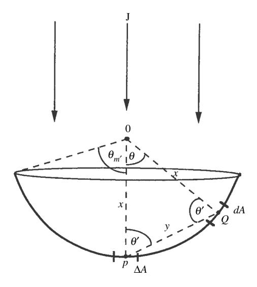

Figure 12.1

and the ratio of doubly to singly scattered radiance is

$$I_2/I_1 = \frac{1}{4} A_{\rm L} \sin^2 \vartheta_M.$$

For example, if *A*L = 0*.*5 and ϑ*M* = 45◦*, I*2*/I*1 = 6%. The assumption that interfacet scattering can be neglected is seen to be consistent with assumption (3). Light multiply scattered from one facet to another usually can be ignored if either the albedo or mean slope is small. The major exception to this statement occurs for high-albedo surfaces at large phase angles. Then most of the visible facets may be in the shadow of the direct irradiance from the source, but will still be illuminated by light scattered from adjacent surfaces not in shadow.

The major effect of multiple scattering is to fill in the shadows. The shadowed surfaces tend to be located at the bottoms of hills or depressions, where the slopes tend to be small. Illuminating these areas tends to increase the contribution of the surfaces with smaller slopes. Hence, neglect of facet-to-facet multiple scattering means that a value of θ obtained by fitting the model to observations underestimates the actual mean slope. so that the photometric θ is a lower limit. An empirical correction for this effect will be added later in Section [12.3.3.](#page-0-0)

Buratti and Veverka [\(1985](#page-0-0)) investigated the effects of neglecting multiple scattering between facets experimentally. They measured the reflectances of plasterof-Paris models with normal albedos of 2.1% and 95% with and without craters of hemi-elliptical cross section with a depth-to-diameter ratio of 0.4. The fractional differences in reflectance at *e* = 0 as *i* is varied with and without the craters are shown

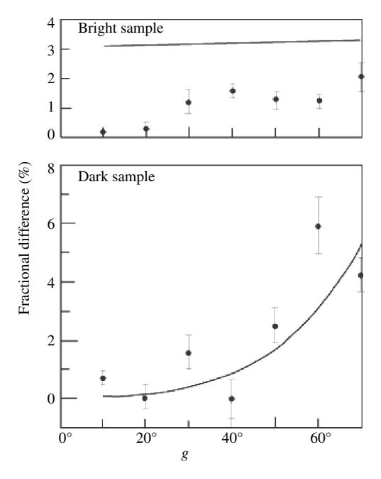

Figure 12.2 Comparison between predicted and measured changes caused in the reflectance by roughness for a bright *(r* = 0*.*95*)* and a dark *(r* = 0*.*02*)* surface. The dots are the measured fractional changes in percentage, and the lines are the predicted changes. (Reproduced from Buratti and Veverka [\[1985\]](#page-0-0), copyright [1985](#page-0-0) with permission of Elsevier.)

as the dots in Figure [12.2.](#page-0-0) Buratti and Veverka also calculated the reflectances of the models assuming that the surface facets scattered light according to the Lommel– Seeliger law for the dark surface, and Lambert's law for the bright surface, but neglecting interfacet scattering. The theoretical changes are shown as the solid lines in Figure [12.2.](#page-0-0) Theoretical and measured changes were similar for the dark surface, but differed by about 2% for the bright surface, which can be attributed to the effects of shadow-filling. Errors of 2% are within the accuracy with which absolute reflectances can be measured in most situations.

## **12.2 Derivation**

### *12.2.1 Derivation of the general equations*

The general scheme of the derivation will be as follows. We will seek a formalism by which the bidirectional reflectance of a medium having a smooth surface can be corrected to one describing the same medium, but with a surface roughness characterized by a mean slope angle θ. General equations that are mathematically rigorous will be derived first, and the parameters necessary for their evaluation will be defined. Because the effects of roughness are maximum at grazing illumination and viewing, these expressions will be evaluated to obtain analytic functions that are exact for these conditions. Next, the equations will be evaluated for vertical viewing and illumination. The two solutions will be connected by analytic interpolation to give approximate expressions for intermediate angles.

Consider a detector that views a surface having unresolved roughness from a large distance *R* and that accepts light from within a small solid angle Ψω about a direction with zenith angle *e*. The signal *I (i, e, g)* from this detector is interpreted as if it came from a smooth, horizontal area *A* = *R*2Ψωsec *e* on the mean surface with bidirectional reflectance *rR(i,e, g)*; that is,

$$I(i, e, g) = Jr_R(i, e, g)A\cos e, \qquad (12.7)$$

where *J* is the incident irradiance.

The model assumes that the light actually comes from a large number of unresolved facets that are tilted in a variety of directions and are both directly illuminated by light from the source and visible to the detector. Let the bidirectional reflectance of each individual facet be *r(i, e, g)*, and let each facet have area *Af* \$ *A*. The geometry is shown schematically in Figure [12.3.](#page-0-0) Then the true expression for the light reaching the detector is

$$I(i, e, g) = J \int_{A(i,v)} r(i_t, e_t, g) \cos e_t dA_t,$$
 (12.8)

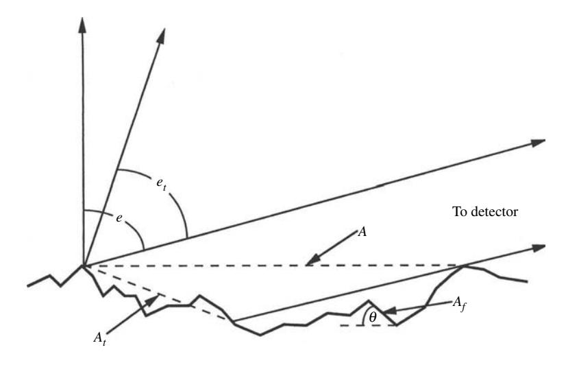

Figure 12.3 Schematic diagram of the intersection of the surface and a vertical plane containing the detector. Shown are the actual surface, consisting of a multitude of unresolved facets *Af* , the nominal surface *A*, and the effective tilted surface *At* . A cut by a vertical plane containing the source would be similar.

where the subscript *t* (standing for "tilted") on *i,e*, and *A* denotes values appropriate to an incremental surface of area

$$dA_t = A_f a(\vartheta) d\vartheta d\zeta, \tag{12.9a}$$

whose normal points in direction *(*ϑ*,* ζ *)*, and the symbol *A(i,v)* indicates that the integration is to be taken only over those surface facets within *A* that are both directly illuminated by the source and visible to the detector. Using the law of cosines it may be readily shown that the angles *it, et,*ϑ*,* ζ*,* and ς, where ς is the azimuth angle between the source and detector planes, are related by

$$\cos i_t = \cos i \cos \vartheta + \sin i \sin \vartheta \cos \zeta, \qquad (12.9b)$$

$$\cos e_t = \cos e \cos \vartheta + \sin e \sin \vartheta \cos(\zeta - \psi). \tag{12.9c}$$

Note that *g* is the same for all facets within the area viewed by the detector. The objective of this chapter is to find the relation between *r(i, e, g)* and *rR(i,e, g)* as a function of θ.

There are three important effects of macroscopic roughness that will modify the reflectance. (1) Scattering of light from one facet to another will increase the reflectance and decrease the apparent mean slope. This effect will be small if either the albedo or the mean slope is small, as argued in the preceding section, and will be ignored. (2) Unresolved shadows cast on one part of the surface by another will decrease the reflectance. (3) As the surface is viewed and illuminated at increasing zenith angles, the facets that are tilted away from the observer or source will tend to be hidden or in shadow, so that the surfaces that are visible and illuminated will tend to be those that are tilted preferentially toward the detector or source.

To account for the latter two effects, we will try to write the rough-surface bidirectional reflectance *rR(i,e, g)* as the product of a shadowing function *S(i, e, g)* and the bidirectional reflectance *r(ie, ee,g)* of a smooth surface of effective area *Ae* tilted so as to have effective angle of incidence *ie* and angle of emergence *ee*, and with the same phase angle *g*. That is, we will seek expressions for *ie(i,e, g),ee(i,e, g)*, and *S(i, e, g)* that will make the following equation true:

$$r_R(i, e, g) = r(i_e, e_e, g)S(i, e, g)$$
 (12.10)

From Figure [12.3,](#page-0-0) *A* and *Ae* are related by

$$A_e \cos e_e = A \cos e. \tag{12.11}$$

Let

$$\mu_{\ell} = \cos e_{\ell}, \tag{12.12a}$$

$$\mu_{0e} = \cos i_e, \tag{12.12b}$$

$$\mu_t = \cos e_t, \tag{12.12c}$$

$$\mu_{0t} = \cos i_t. \tag{12.12d}$$

Denote the reflectance per unit area of surface by Y; that is, let

$$Y_R(\mu_0, \mu, g) = r_R(i, e, g)\cos e,$$
 (12.13a)

$$Y(\mu_{0e}, \mu_e, g) = r(i_e, e_e, g) \cos e_e,$$
 (12.13b)

$$Y(\mu_{0t}, \mu_t, g) = r(i_t, e_t, g)\cos e_t.$$
 (12.13c)

Combining (12.7) - (12.9),

$$I(i, e, g) = JAY_R(i, e, g) = JA_eY(\mu_{0e}, \mu_e, g)S(\mu_0, \mu, g)$$
  
=  $J\int_{A(i,v)} Y(\mu_{0t}, \mu_t, g)dA_t.$  (12.14)

Assume that Y is mathematically well behaved so that it can be expanded in a Taylor series about  $\mu_0$  and  $\mu$ . Doing this on both sides of the third equal sign in (12.14), and using (12.11), gives

$$\frac{A\mu}{\mu_{e}}S(\mu_{0},\mu,g) \left[ Y(\mu_{0e},\mu_{e},g)|_{(\mu_{0},\mu)} + \frac{\partial Y}{\partial \mu_{0e}}(\mu_{0e},\mu_{e},g)|_{(\mu_{0},\mu)}(\mu_{0e}-\mu_{0}) + \frac{\partial Y}{\partial \mu_{e}}(\mu_{0e},\mu_{e},g)|_{(\mu_{0},\mu)}(\mu_{e}-\mu) + \cdots \right] \\
= \int_{A(i,v)} Y(\mu_{0t},\mu_{t},g)|_{(\mu_{0},\mu)}dA_{t} + \int_{A(i,v)} \frac{\partial Y}{\partial \mu_{0t}}(\mu_{0t},\mu_{t},g)|_{(\mu_{0},\mu)}(\mu_{0t}-\mu_{0})dA_{t} + \int_{A(i,v)} \frac{\partial Y}{\partial \mu_{t}}(\mu_{0t},\mu_{t},g)|_{(\mu_{0},\mu)}(\mu_{t}-\mu)dA_{t} + \cdots,$$

or

$$\frac{A\mu}{\mu_{e}}S(\mu_{0},\mu,g) \left[ Y(\mu_{0},\mu,g) + \frac{\partial Y}{\partial \mu_{0}}(\mu_{0},\mu,g)(\mu_{0e} - \mu_{0}) + \frac{\partial Y}{\partial \mu}(\mu_{0},\mu,g)(\mu_{e} - \mu) + \cdots \right] 
= Y(\mu_{0},\mu,g) \int_{A(i,v)} dA_{t} + \frac{\partial Y}{\partial \mu_{0}} \int_{A(i,v)} (\mu_{0t} - \mu_{0}) dA_{t} 
+ \frac{\partial Y}{\partial \mu}(\mu_{0},\mu,g) \int_{A(i,v)} (\mu_{t} - \mu) dA_{t} + \cdots .$$
(12.15)

Because  $\mu_0$  and  $\mu$  are independent variables and Y can be an arbitrary function of these variables, equation (12.15) will be satisfied if the coefficients of Y and its partial derivatives are separately equal on both sides of the equality. This gives

$$S(i, e, \psi) = \frac{\mu_e}{A\mu} \int_{A(i, v)} dA_t,$$
 (12.16)

$$\mu_{0e}(i, e, \psi) = \frac{\int_{A(i, v)} \mu_{0t} dA_t}{\int_{A(i, v)} dA_t},$$
(12.17)

$$\mu_e(i, e, \psi) = \frac{\int_{A(i, v)} \mu_t dA_t}{\int_{A(i, v)} dA_t}.$$
 (12.18)

In general, there will be two types of shadows. Some of the facets will not contribute to the scattered radiance because their normals will be tilted by more than 90° to the direction from the source or detector; such facets will be said to be in a *tilt shadow*. Some facets will not contribute because other parts of the surface will obstruct either the view of the detector or the light from the source; such facets will be said to be in a *projected shadow*. We shall follow Saunders (1967) and assume that any facet that is not in a tilt shadow has a statistical probability of being in a projected shadow that is independent of the slope or azimuth angle of its tilt.

Let P be the probability that a facet is not in a projected shadow. Then in equation (12.15),  $Y(\mu_{0t}, \mu_t, g)$  can be multiplied by P, if at the same time the boundaries of the integration are replaced by the tilt-shadow boundaries. This has the effect of multiplying both the numerators and denominators in (12.17) and (12.18) by P, which thus cancels out in these equations. Therefore, inserting (12.9) into (12.17)

and (12.18) and writing the latter out explicitly, these equations become

$$\mu_{0e}(i, e, \psi) = \frac{\cos i \int_{(A(\text{tilt})} \cos \vartheta a(\vartheta) d\vartheta d\zeta + \sin i \int_{A(\text{tilt})} \sin \vartheta \cos \zeta a(\vartheta) d\vartheta d\zeta}{\int_{A(\text{tilt})} a(\vartheta) d\vartheta d\zeta}, \quad (12.19)$$

$$\mu_{e}(i,e,\psi) = \frac{\cos e \int_{A(\text{tilt})} \cos \vartheta a(\vartheta) d\vartheta d\zeta + \sin e \int_{A(\text{tilt})} \sin \vartheta \cos(\zeta - \psi) a(\vartheta) d\vartheta d\zeta}{\int_{A(\text{tilt})} a(\vartheta) d\vartheta d\zeta},$$
(12.20)

where A(tilt) denotes the boundaries of the tilt shadows in A. These boundaries will depend on i, e, and  $\psi$ .

Let  $A_T$  be the total area of all the facets within the nominal area A, whether visible and illuminated or not:

$$A_T = \int_{\ell=0}^{2\pi} \int_{\vartheta=0}^{\pi/2} dA_t = 2\pi \int_0^{\pi/2} A_f a(\vartheta) d\vartheta = 2\pi A_f,$$

because of azimuthal symmetry and the normalization condition on  $a(\vartheta)$ . Now, A is just the projection of all the facets onto the horizontal plane:

$$A = \int_{\zeta=0}^{2\pi} \int_{\vartheta=0}^{\pi/2} \cos \vartheta \, dA_t = 2\pi \, A_f \int_{\vartheta 0}^{\pi/2} a(\vartheta) \cos \vartheta \, d\vartheta.$$

Hence,

$$A/A_T = \langle \cos \vartheta \rangle,$$

where

$$\langle \cos \vartheta \rangle = \int_0^{\pi/2} a(\vartheta) \cos \vartheta \, d\vartheta. \tag{12.21}$$

Thus, expression (12.16) for S can be written

$$S(\mu_0, \mu, \psi) = \frac{\mu_e}{\mu} \frac{A_T}{A} \frac{1}{A_T} \int_{A(i,v)} dA_t = \frac{\mu_e}{\mu \langle \cos \vartheta \rangle} F_{(i,v)}(\mu_0, \mu, \psi), \quad (12.22)$$

where

$$F_{(i,v)}(\mu_0, \mu, \psi) = \frac{1}{A_T} \int_{A(i,v)} dA_t$$
 (12.23)

is the probability that a facet is both illuminated and visible.

Let  $F_i(i)$  and  $F_e(e)$  be the fraction of the facets that are illuminated and the fraction that are visible, respectively. Because of azimuthal symmetry both  $F_i(i)$  and  $F_e(e)$  are independent of  $\psi$ , and furthermore,  $F_i(i)$  has the same functional dependence on i as  $F_e(e)$  has on e.

The solutions for S,  $\mu_{0e}$ , and  $\mu_e$  have different forms depending on whether i is larger or smaller than e. Suppose  $i \le e$ . Then an illumination shadow cast by a given object is always smaller than its visibility shadow, and the illumination

shadow may be regarded as partially hidden in the visibility shadow. When  $\psi = 0$  the illumination shadow is completely hidden, so that  $F_{(i,v)}(\mu_0, \mu, 0) = F_e(e)$ . But when  $\psi = 0$  and  $i \le e$ , no shadows are visible: the detector's field of view is completely filled by surfaces that are both visible and totally illuminated. Thus,

$$S(\mu_0, \mu, 0) = \frac{\eta_e(e)}{\mu \langle \cos \vartheta \rangle} F_e(e) = 1,$$

where

$$\eta_e(e) = \mu_e(i, e, \psi = 0), i \le e.$$
(12.24)

Hence.

$$F_e(e) = \frac{\mu \langle \cos \vartheta \rangle}{\eta_e(e)}.$$
 (12.25)

Now suppose that  $e \le i$ . Then by exactly the same arguments,

$$F_i(i) = \frac{\mu_0 \langle \cos \vartheta \rangle}{\eta_{0e}(i)}.$$
 (12.26)

where

$$\eta_{0e}(i) = \mu_{0e}(i, e, \psi = 0), e \le i.$$
(12.27)

#### 12.2.2 The case when i < e

We will derive the equations for the case when  $i \le e$  first. Then when  $\psi \ne 0$  the visibility shadow partially hides the illumination shadow. Let  $f(\psi)$  be the fraction of the illumination shadow that is hidden in the visibility shadow. Let

$$A_e/A_T = 1 - F_e(e)$$

be the fraction of the facets in the visibility shadows, and let

$$A_i/A_T = 1 - F_i(i)$$

be the fraction of the facets in the illumination shadows. These include both the tilt and projected shadows. As we have seen, when  $\psi = 0$ , all of the illumination shadows are hidden in the visibility shadows. The visibility and illumination shadows are perfectly correlated, so that f(0) = 1 and

$$F_{(i,v)} = F_e = 1 - A_e/A_T$$
.

As  $\psi$  increases, a fraction  $1 - f(\psi)$  of the illumination shadows will be exposed. When  $\psi = \pi$ ,  $f(\pi) = 0$ , and the two types of shadows are completely uncorrelated, so that

$$F_{(i,v)} = 1 - A_e/A_T - A_i/A_T + (A_e/A_T)(A_i/A_T)$$
  
=  $(1 - A_e/A_T)(1 - A_i/A_T) = F_e F_i$ ,

where the term  $A_e A_i / A_T^2$  corrects for the amount of random overlap. This last expression states that when the two types of shadows are completely uncorrelated, the probability that a facet will be both illuminated and visible is the product of the separate probabilities.

When  $0 < \psi < \pi$ ,  $A_i$  in the last expression for  $F_{(i,v)}$  must be replaced by  $(1 - f)A_i/(A_T - fA_i)$ . This accounts for the fact that only a portion 1 - f of the illumination shadow is randomly exposed, and only an area  $A_T - fA_i$  is available to be occupied by the uncorrelated part of the illumination shadow. Thus, the general expression for the probability that a facet will be both illuminated and visible is

$$F_{(i,v)} = [1 - A_e/A_T][1 - (1 - f)A_i/(A_T - fA_i)]$$

$$= [1 - A_e/A_T][1 - A_i/A_T]/[1 - fA_i/A_T]$$

$$= F_e F_i/(1 - f + fF_i).$$

Combining this result with (12.22), (12.25), and (12.26) gives

$$S(i, e, \psi) = \frac{\mu_e}{\mu_e(0)} \frac{\mu_0}{\mu_{0e}(0)} \frac{\langle \cos \vartheta \rangle}{1 - f(\psi) + f(\psi) [\mu_0/\mu_{0e}(0)] \langle \cos \vartheta \rangle}.$$
 (12.28)

Thus far, the derivation has been rigorous. In the remainder of this section we will derive approximate analytic expressions for  $\mu_{0e}$ ,  $\mu_{e}$ , and  $\mathcal{S}$  that are suitable for practical calculations. First, an expression for  $f(\psi)$ , the fraction of the illumination shadow hidden in the visibility shadow, will be found. It will be assumed that  $f(\psi)$  is a function of  $\psi$  only and is independent of i and e, which is reasonable if i and e are near  $90^{\circ}$ .

Recall that the shadows have two components, tilt and projected shadows. When i and e are near 90°, the contributions of the two components are roughly equal. As  $\psi$  increases from zero, the fraction of the tilt component of the illumination shadows that are exposed increases approximately linearly with  $\psi$ , and the exposure is complete when  $\psi = \pi$ . Hence, the contribution of the tilt component to f will be  $\sim \frac{1}{2}(\psi/\pi)$ . Now, the surface can be considered as consisting of depressions and protuberances of mean width  $\Delta d$  and mean height  $(\Delta d/2)\tan\overline{\theta}$ . When i and e are near 90°, the projected shadows are cast by objects of width  $\sim \Delta d$  onto surfaces a distance  $\sim \Delta d$  away, so that this component of the illumination shadows is nearly completely exposed when  $\psi \gtrsim 1$  radian. At  $\psi \approx 1$ , the fraction of each type of shadow exposed is approximately  $\frac{1}{2} \times (1/\pi) + \frac{1}{2} \times 1 \simeq \frac{2}{3}$ . Hence,  $f(\psi)$  may be described by a function that decreases linearly from a value of f(0) = 1 to  $f(1) \simeq 1 - \frac{2}{3} = \frac{1}{3}$ , and then decreases to zero as  $\psi \to \pi$ . A simple function with the required properties is

$$f(\psi) = \exp\left(-2\tan\frac{\psi}{2}\right),\tag{12.29}$$

and this will be adopted for  $f(\psi)$ .

Returning to  $\mu_{0e}$  and  $\mu_{e}$ , only the tilt shadows affect these quantities. The boundary of the tilt illumination shadow can be found by putting  $i_t = \pi/2$  in (12.9a). This gives

$$\cos \zeta = -\cot \vartheta \cot i. \tag{12.30}$$

This equation has no solution when  $0 \le \vartheta \le \pi/2 - i$ , but  $\pi/2 \le \zeta \le 3\pi/2$  when  $\pi/2 - i \le \vartheta \le \pi/2$ . Similarly, the boundary of the tilt visibility shadow is given by putting  $e_t = \pi/2$  in (12.9b),

$$\cos(\zeta - \psi) = -\cot\vartheta \cot e, \tag{12.31}$$

which has no solution when  $0 \le \vartheta \le \pi/2 - e$ , but  $\pi/2 + \psi \le \zeta \le 3\pi/2 + \psi$  when  $\pi/2 - e \le \vartheta \le \pi/2$ .

The integrals in equations (12.19) and (12.20) are readily evaluated when i = e = 0 and  $i = e = \pi/2$ . For vertical illumination and viewing, when there are no shadows, the integrals over  $\cos \zeta$  vanish because of azimuthal symmetry, so that

$$i = e = 0 \sim \mu_{0e} = \mu_e = \langle \cos \vartheta \rangle. \tag{12.32}$$

If the tilt shadows are represented in a polar diagram with  $\vartheta$  as the radial variable and  $\zeta$  as the angular variable, then at grazing incidence and viewing the tilt-shadow boundaries are the straight radial lines  $\zeta = \psi - \pi/2$  and  $\zeta = \pi/2$ , and the limits on  $\vartheta$  are 0 to  $\pi/2$ . Hence

$$i = e = \pi/2 : \mu_{0e} = \mu_e = (1 + \cos \psi) \frac{\langle \sin \vartheta \rangle}{\pi - \psi},$$
 (12.33)

where

$$\langle \sin \vartheta \rangle = \int_0^{\pi/2} \sin \vartheta \, a(\vartheta) \, d\vartheta.$$

Equation (12.33) shows that when  $\psi = 0$  the effective surface is tilted toward the source and detector by an angle  $\cos^{-1}[(2/\pi)\langle\sin\vartheta\rangle]$ .

For intermediate values of i and e these integrals are much more difficult to evaluate, because the shadow boundaries (12.30) and (12.31) are overlapping curves in the  $(\vartheta, \zeta)$  polar diagram. Approximate expressions may be obtained for these integrals as follows. First the separate effects of the illumination and viewing shadows will be found. Next, the effect of overlapping the two shadows will be estimated by replacing the curved boundary lines by straight lines of constant  $\zeta$  and circles of constant  $\vartheta$  in the  $(\vartheta, \zeta)$  plane. This approximation will then be improved by substituting the results from the solutions for the separate shadows. Finally, the integrals will be evaluated.

The effect of the illumination shadow alone on  $\mu_{0e}$  may be seen by setting e = 0 and using (12.30) as the A(tilt) boundary in (12.19). Then the integration over  $\zeta$  in the first integral in the numerator of (12.19) may be carried out exactly to give

$$\int_{A(\text{tilt})} \cos \vartheta a(\vartheta) d\vartheta d\zeta$$

$$= \int_{0}^{\pi/2 - i} 2\pi \cos \vartheta a(\vartheta) d\vartheta$$

$$+ \int_{\pi/2 - i}^{\pi/2} 2\sin^{-1} (1 - \cot^{2}\vartheta \cot^{2}i)^{1/2} \cos \vartheta a(\vartheta) d\vartheta, \qquad (12.34a)^{1/2}$$

where the value of the  $\sin^{-1}$  lies between  $\pi/2$  and  $\pi$ . Now, the factor  $(1-\cot^2\vartheta\cot^2i)^{1/2}$  has the following properties: it rises with infinite slope from 0 at  $\vartheta=\pi/2-i$ , then levels off to 1 at  $\vartheta=\pi/2$ , where it has slope 0. Thus, as a first approximation, this factor may be replaced by a unit step function at  $\vartheta=\pi/2-i$ . Then equation (12.34a) becomes

$$\int_{A(\text{tilt})} \cos \vartheta \, a(\vartheta) \, d\vartheta \, d\zeta$$

$$\simeq \int_{0}^{\pi/2 - i} 2\pi \cos \vartheta \, a(\vartheta) \, d\vartheta + \int_{\pi/2 - i}^{\pi/2} \pi \cos \vartheta \, a(\vartheta) \, d\vartheta. \qquad (12.34b)$$

Similarly, the effect of the visibility shadow alone may be ascertained by setting f = 0 and using (12.31) in the integrals in (12.19).

Then the first integral in the numerator of (12.19) is

$$\int_{A(\text{tilt})} \cos \vartheta a(\vartheta) d\vartheta d\zeta$$

$$= \int_{0}^{\pi/2 - e} 2\pi \cos \vartheta a(\vartheta) d\vartheta$$

$$+ \int_{\pi/2 - e}^{\pi/2} 2\sin^{-1} (1 - \cot^{2}\vartheta \cot^{2}e)^{1/2} \cos \vartheta a(\vartheta) d\vartheta, \qquad (12.34c)$$

which, upon approximating  $(1 - \cot^2 \vartheta \cot^2 e)^{1/2}$  by a unit step function at  $\vartheta = \pi/2 - e$ , becomes

$$\int_{A(\text{tilt})} \cos \vartheta a(\vartheta) d\vartheta d\zeta$$

$$\simeq \int_{0}^{\pi/2 - e} 2\pi \cos \vartheta a(\vartheta) d\vartheta + \int_{\pi/2 - e}^{\pi/2} \pi \cos \vartheta a(\vartheta) d\vartheta. \qquad (12.34d)$$

As shown in Figure 12.4, these approximations are equivalent to replacing the curved illumination shadow boundary in the  $(\vartheta, \zeta)$  diagram by a square-cornered

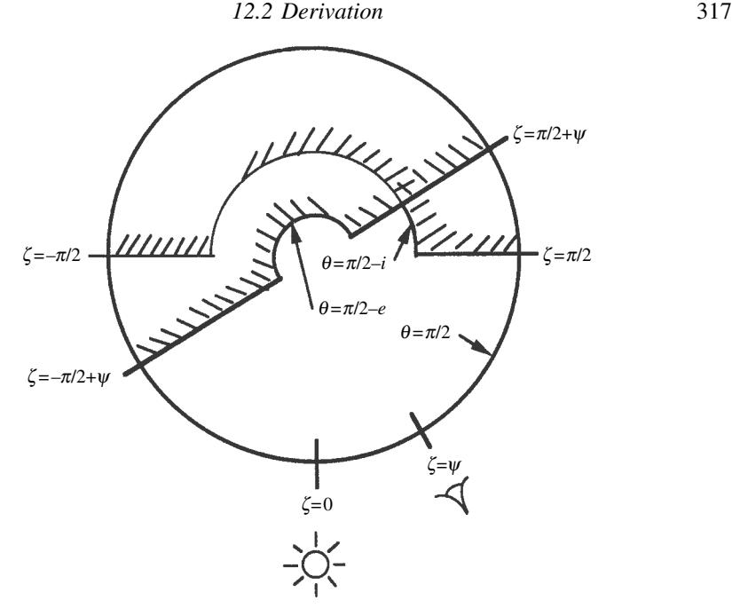

Figure 12.4 Schematic diagram showing the square-cornered approximation to the tilt shadows in *(*ϑ*,* ζ *)* space for the case when *i* ≤ *e*. The projected shadows are assumed to be randomly distributed over the part of *(*ϑ*,* ζ *)* space not in tilt shadows.

shadow bounded by the radial lines ζ = π*/*2 and 3π*/*2 and the circles ϑ = π*/*2−*i* and π*/*2, and replacing the visibility shadow by a square-cornered shadow bounded by the radial lines ζ = π*/*2 + ς and 3π*/*2 + ς and the circles ϑ = π*/*2 − *e* and π*/*2.At grazing illumination and viewing these approximations become exact. With the simplified boundaries of the squared-shadow approximation, the first integral in [\(12.19\)](#page-0-0) may be evaluated for the case in which neither *i* nor *e* nor ς is zero to give

$$f_{A(\text{tilt})}\cos\vartheta a(\vartheta)d\vartheta d\zeta \simeq \int_{0}^{\pi/2-e} 2\pi\cos\vartheta a(\vartheta)d\vartheta$$

$$+ \int_{\pi/2-e}^{\pi/2} \pi\cos\vartheta a(\vartheta)d\vartheta$$

$$- \frac{\psi}{\pi} \int_{\pi/2-i}^{\pi/2} \pi\cos\vartheta a(\vartheta)d\vartheta. \qquad (12.34e)$$

Now, the first two terms on the right-hand side of [\(12.34e\)](#page-0-0) are the same as those of [\(12.34d\)](#page-0-0). The third term on the right-hand side of [\(12.34e\)](#page-0-0) corrects for the fraction of the illumination shadow sticking out from behind the visibility shadow and is almost identical with the last term on the right-hand side of (12.34b), except that only a fraction  $\psi/\pi$  of this term contributes. But the terms in (12.34b) and (12.34d) are approximations to the exact expressions in (12.34a) and (12.34c), respectively. This suggests that the approximations in (12.38) may be improved by substituting the exact expressions from (12.34a) and (12.34c). If this is done, we obtain

$$\int_{A(\text{tilt})} \cos \vartheta a(\vartheta) d\vartheta d\zeta$$

$$\simeq \int_{0}^{\pi/2 - e} 2\pi \cos \vartheta a(\vartheta) d\vartheta$$

$$+ \int_{\pi/2 - e}^{\pi/2} 2\sin^{-1} (1 - \cot^{2}\vartheta \cot^{2}e)^{1/2} \cos \vartheta a(\vartheta) d\vartheta$$

$$- \frac{\psi}{\pi} \int_{\pi/2 - i}^{\pi/2} 2\sin^{-1} (1 - \cot^{2}\vartheta \cot^{2}i)^{1/2} \cos \vartheta a(\vartheta) d\vartheta, \qquad (12.35)$$

where the value of  $\sin^{-1}(1-\cot^2\vartheta\cot^2e)^{1/2}$  lies between  $\pi/2$  and  $\pi$ , but the value of  $\sin^{-1}(1-\cot^2\vartheta\cot^2i)^{1/2}$  lies between 0 and  $\pi/2$ .

By an identical argument the following expression for the integral in the denominator of (12.19) is obtained:

$$\begin{split} \int\limits_{A(\text{tilt})} a(\vartheta) d\vartheta d\zeta &\simeq \int_0^{\pi/2 - e} 2\pi a(\vartheta) d\vartheta \\ &+ \int_{\pi/2 - e}^{\pi/2} 2\sin^{-1}(1 - \cot^2\vartheta \cot^2 e)^{1/2} a(\vartheta) d\vartheta \\ &- \frac{\psi}{\pi} \int_{\pi/2 - i}^{\pi/2} 2\sin^{-1}(1 - \cot^2\vartheta \cot^2 i)^{1/2} a(\vartheta) d\vartheta. \end{split} \tag{12.36}$$

An approximate expression for the second integral in the numerator of (12.19) may be found using similar arguments. When e = 0,

$$\int_{A(\text{tilt})} \sin \vartheta \cos \zeta a(\vartheta) d\vartheta d\zeta$$

$$= \int_{\pi/2-i}^{\pi/2} 2(1 - \cot^2 \vartheta \cot^2 i)^{1/2} \sin \vartheta a(\vartheta) d\vartheta. \tag{12.37a}$$

Approximating  $(1 - \cot^2 \vartheta \cot^2 i)^{1/2}$  by a step function, this becomes

$$\int_{A(\text{tilt})} \sin \vartheta \cos \zeta \, a(\vartheta) d\vartheta d\zeta \simeq \int_{\pi/2-i}^{\pi/2} 2 \sin \vartheta \, a(\vartheta) d\vartheta. \tag{12.37b}$$

Setting i = 0, the integral is

$$\int_{A(\text{tilt})} \sin \vartheta \cos \zeta a(\vartheta) d\vartheta d\zeta$$

$$= \int_{\pi/2 - e}^{\pi/2} 2\cos \psi (1 - \cot^2 \vartheta \cot^2 e)^{1/2} \sin \vartheta a(\vartheta) d\vartheta, \qquad (12.37c)$$

which is approximately

$$\int_{A(\text{tilt})} \sin \vartheta \cos \zeta a(\vartheta) d\vartheta d\zeta \simeq \int_{\pi/2 - e}^{\pi/2} 2\cos \psi \sin \vartheta a(\vartheta) d\vartheta. \tag{12.37d}$$

Combining both shadows and using the square-boundary approximation gives

$$\begin{split} \int_{A(\text{tilt})} \sin \vartheta \cos \zeta \, a(\vartheta) \, d\vartheta \, d\zeta \\ &\simeq \int_{\pi/2 - e}^{\pi/2} 2 \cos \psi \sin \vartheta \, a(\vartheta) \, d\vartheta + \int_{\pi/2 - i}^{\pi/2} (1 - \cos \psi) \sin \vartheta \, a(\vartheta) \, d\vartheta. \end{aligned} \tag{12.37e}$$

The first term on the right-hand side of (12.37e) is the same as the right-hand side of (12.37d), which is an approximation to the right-hand side of (12.37c). Similarly, the second term on the right-hand side of (12.37e) is the same as the right-hand side of (12.37b), except for the coefficient that accounts for the fact that only part of the illumination shadow contributes to the integral, and may be replaced by the right-hand side of (12.37a). Thus, we obtain

$$\int_{A(\text{tilt})} \sin \vartheta \cos \zeta a(\vartheta) d\vartheta d\zeta$$

$$\simeq \int_{\pi/2 - e}^{\pi/2} 2\cos \psi (1 - \cot^2 \vartheta \cot^2 e)^{1/2} \sin \vartheta a(\vartheta) d\vartheta$$

$$+ \int_{\pi/2 - i}^{\pi/2} (1 - \cos \psi) (1 - \cot^2 \vartheta \cot^2 i)^{1/2} \sin \vartheta a(\vartheta) d\vartheta, \quad (12.38)$$

where the value of  $\sin^{-1}(1-\cot^2\vartheta\cot^2e)^{1/2}$  lies between  $\pi/2$  and  $\pi$ , and that of  $\sin^{-1}(1-\cot^2\vartheta\cot^2i)^{1/2}$  lies between 0 and  $\pi/2$ .

The next step is to carry out the integration over  $\vartheta$  in equations (12.35), (12.36), and (12.38). Let the average value of any function  $G(\vartheta)$  be defined as

$$\langle G(\vartheta) \rangle = \int_0^{\pi/2} G(\vartheta) a(\vartheta) d\vartheta. \tag{12.39}$$

We will obtain approximate analytic expressions that are valid for i and e near  $90^{\circ}$  by expanding the integrals in Taylor series in  $\cot e$  and  $\cot i$ . This gives, for the

integral in (12.35),

$$\int_{A(\text{tilt})} \cos \vartheta \, a(\vartheta) \, d\vartheta \, d\zeta$$

$$\simeq \pi \, \langle \cos \vartheta \rangle + 2 \langle \cot \vartheta \cos \vartheta \rangle \cot e$$

$$-\frac{\psi}{\pi} (\pi \, \langle \cos \vartheta \rangle - 2 \langle \cot \vartheta \cos \vartheta \rangle \cot i)$$

$$= \pi \, \langle \cos \vartheta \rangle \left[ 2 - \left( 1 - \frac{2}{\pi} \frac{\langle \cot \vartheta \cos \vartheta \rangle}{\langle \cos \vartheta \rangle} \cot e \right) \right]$$

$$-\frac{\psi}{\pi} \left( 1 - \frac{2}{\pi} \frac{\langle \cot \vartheta \cos \vartheta \rangle}{\langle \cos \vartheta \rangle} \cot i \right) \right]$$

$$\simeq \pi \, \langle \cos \vartheta \rangle \left[ 2 - \exp \left( -\frac{2}{\pi} \frac{\langle \cot \vartheta \cos \vartheta \rangle}{\langle \cos \vartheta \rangle} \cot e \right) \right]$$

$$-\frac{\psi}{\pi} \exp \left( -\frac{2}{\pi} \frac{\langle \cot \vartheta \cos \vartheta \rangle}{\langle \cos \vartheta \rangle} \cot i \right) \right]. \tag{12.40}$$

The derivation up to this point has not depended on  $\bar{\theta}$  being small. This assumption will now be used for the first time. Using the slope distribution function (12.3) and applying (12.4) and (12.5), it is found that, to second order in  $\bar{\theta}$ ,

$$\langle \cos \vartheta \rangle = 1/(1 + \pi \tan^2 \overline{\theta})^{1/2}, \tag{12.41a}$$

$$\langle \cot \vartheta \rangle = \cot \overline{\theta}, \tag{12.41b}$$

$$\langle \sin \vartheta \rangle = \frac{\pi}{2} \langle \cos \vartheta \rangle \tan \overline{\theta}, \qquad (12.41c)$$

$$\langle \cot \vartheta \cos \vartheta \rangle = \cot \overline{\theta} \langle \cos \vartheta \rangle = \frac{2}{\pi} \cot^2 \overline{\theta} \langle \sin \vartheta \rangle. \tag{12.41d}$$

Then (12.40) becomes

$$\int_{A(\text{tilt})} \cos \vartheta \, a(\vartheta) \, d\vartheta \, d\zeta$$

$$\simeq \left[ \frac{\pi}{(1 + \pi \tan^2 \overline{\theta})^{1/2}} \right]$$

$$\times \left[ 2 - \exp\left(-\frac{2}{\pi} \cot \overline{\theta} \cot e\right) - \frac{\psi}{\pi} \exp\left(-\frac{2}{\pi} \cot \overline{\theta} \cot i\right) \right]. \quad (12.42)$$

Expressions (12.36) and (12.38) may be evaluated in a similar way to give

$$\int_{A(\text{tilt})} a(\vartheta) d\vartheta d\zeta$$

$$\simeq \pi \left[ 2 - \exp\left(-\frac{2}{\pi} \cot \overline{\theta} \cot e\right) - \frac{\psi}{\pi} \exp\left(-\frac{2}{\pi} \cot \overline{\theta} \cot i\right) \right]. (12.43)$$

and

$$\int_{A(\text{tillt})} \sin \vartheta \cos \zeta a(\vartheta) d\vartheta d\zeta = \frac{\pi \tan \overline{\theta}}{(1 + \pi \tan^2 \overline{\theta})^{1/2}} \times \left[ \cos \psi \exp \left( -\frac{1}{\pi} \cot^2 \overline{\theta} \cot^2 e \right) + \sin^2 \frac{\psi}{2} \exp \left( -\frac{1}{\pi} \cot^2 \overline{\theta} \cot^2 i \right) \right]. \quad (12.44)$$

Let

$$\chi(\overline{\theta}) = \langle \cos \vartheta \rangle = 1/(1 + \pi \tan^2 \overline{\theta})^{1/2},$$
 (12.45a)

$$E_1(x) = \exp\left(-\frac{2}{\pi}\cot\overline{\theta}\cot x\right),$$
 (12.45b)

and

$$E_2(x) = \exp\left(-\frac{1}{\pi}\cot^2\overline{\theta}\cot^2x\right). \tag{12.45c}$$

Then the approximate analytic expression for (12.19) is

$$\mu_{0e}(i, e, \psi) = \chi(\overline{\theta}) \left[ \cos i + \sin i \tan \overline{\theta} \frac{\cos \psi E_2(e) + \sin^2(\psi/2) E_2(i)}{2 - E_1(e) - (\psi/\pi) E_1(i)} \right]. \quad (12.46)$$

Using the identical procedure to evaluate (12.20) gives

$$\mu_e(i, e, \psi) = \chi(\overline{\theta}) \left[ \cos e + \sin e \tan \overline{\theta} \frac{E_2(e) - \sin^2(\psi/2) E_2(i)}{2 - E_1(e) - (\psi/\pi) E_1(i)} \right]. \tag{12.47}$$

If desired, expressions correct to higher order in  $\overline{\theta}$  may be found, but such a complication probably would not be justified because of the assumption that interfacet scattering can be ignored.

Equations (12.46) and (12.47) describe the effective tilt of the surface when  $i \leq e$ . Although they are somewhat mathematically complicated, their behavior is relatively simple. When i and e are smaller than about  $\pi/2 - \overline{\theta}$ ,  $\mu_{0e} \simeq \mu_0 \chi(\overline{\theta})$  and  $\mu_e \simeq \mu \chi(\overline{\theta})$ . However, when either i or e exceeds about  $\pi/2 - \overline{\theta}$ , the effective surface tilts toward the source or detector by about  $\overline{\theta}$ , except that if both i and e are large and  $\psi$  is close to  $\pi$  the effective tilt angle goes to zero.

Finally, from (12.46) the effective cosines at  $\psi = 0$ , which appear in the shadow factor S, can be evaluated:

$$\eta_e(e) \simeq \chi(\overline{\theta}) \left[ \cos e + \sin e \tan \overline{\theta} \frac{E_2(e)}{2 - E_1(e)} \right],$$
(12.48)

and, by symmetry,

$$\eta_{0e}(i) \simeq \chi(\overline{\theta}) \left[ \cos i + \sin i \tan \overline{\theta} \frac{E_2(i)}{2 - E_1(i)} \right].$$
(12.49)

(This can also be derived by letting ς = 0 in [\[12.52\]](#page-0-0) for *µ*0*e* when *e* ≤ *i* below.) Hence, from [\(12.28\)](#page-0-0),

$$S(i, e, \psi); \frac{\mu_e}{\eta_e(e)} \frac{\mu_0}{\eta_{0e}(i)} \frac{\chi(\overline{\theta})}{1 - f(\psi) + f(\psi)\chi(\overline{\theta})[\mu_0/\eta_{0e}(i)]},$$
(12.50)

where

$$f(\psi) = \exp\left(-2\tan\frac{\psi}{2}\right). \tag{12.51}$$

# *12.2.3 The case when e* ≤ *i*

Similar reasoning when *e<i* leads to the following expressions:

$$\mu_{0e}(i, e, \psi) \simeq \chi(\overline{\theta}) \left[ \cos i + \sin i \tan \overline{\theta} \frac{E_2(i) - \sin^2(\psi/2)E_2(e)}{2 - E_1(i) - (\psi/\pi)E_1(e)} \right], \quad (12.52)$$

$$\mu_e(i, e, \psi) \simeq \chi(\overline{\theta}) \left[ \cos e + \sin e \tan \overline{\theta} \frac{\cos \psi E_2(i) + \sin^2(\psi/2) E_2(e)}{2 - E_1(i) - (\psi/\pi) E_1(e)} \right], \quad (12.53)$$

$$\mathbf{S}(i,e,\psi) \simeq \frac{\mu_e}{\eta_e(e)} \frac{\mu_0}{\eta_{0e}(i)} \frac{\chi(\overline{\theta})}{1 - f(\psi) + f(\psi)\chi(\overline{\theta})[\mu/\eta_e(e)]}, \quad (12.54)$$

where )0*e(i),* )*e(e)*, and *f (*ς*)* are the same as for the *i* ≤ *e* case and are given by [\(12.48\)](#page-0-0), [\(12.49\)](#page-0-0), and [\(12.51\)](#page-0-0), respectively, except that *f (*ς*)*is now to be interpreted as the fraction of the visibility shadow hidden in the illumination shadow.

## *12.2.4 The physical meaning of* θ¯

The approximate formalism developed in this chapter has been compared with detailed calculations of the brightness of an artificial rough surface generated by a computer model (Helfenstein, [1988](#page-0-0)), and its predictions have been found to be generally consistent with the model. However, an important question is the physical meaning of θ. This parameter is the mean slope angle averaged according to equation [\(12.5\)](#page-0-0) over all distances on the surface between upper and lower limits that are determined by the angular resolution of the detector and the physics of the radiative-transfer equation. The upper limit is the footprint of the detector on the surface of the planet, which in planetary remote sensing is typically meters to kilometers.

It might be thought that the lower limit is given by the sizes of the particles making up the surface. However, it must be remembered that the radiative-transfer equation for a particulate medium, on which the solutions for the reflectance are based, implicitly averages the radiance over a distance that not only is larger than the distances between the particles, but also contains a representative distribution of the various types of particles. Thus the lower limit is several times the mean particle separation, and is typically of the order of  $100-1000\,\mu m$ .

Moreover, the maximum slopes that can occur on natural surfaces are determined by the strengths of materials and the cohesiveness of the soil. The effects of these properties are strongly size-dependent, such that the small-scale slopes tend to be the highest. Thus, the slope distribution functions tend to be dominated by millimeter-scale roughness.

The physical meaning of  $\overline{\theta}$  has been investigated by several workers. Shepard and Campbell (1998) found that the shadowing behavior of this model was similar to a fractal surface they generated by computer modeling. By varying the parameters of their synthetic surface they concluded that the scale that dominates the photometric roughness, and thus determines  $\overline{\theta}$ , is the smallest scale at which well-defined shadows exist. Helfenstein and Shepard (1999) argued that for lunar regolith this scale is  $\sim 100 \, \mu m$ .

The main deficiency of the roughness model presented in this chapter is its neglect of interfacet multiple scattering, which by filling in shadows has the effect of making a surface appear to be photometrically smoother. This means that the photometric roughness will appear to decrease as the albedo increases. An empirical correction for this is given in Section 12.3.3. Since the actual roughness angle is a physical property of the surface it should, in principle, be independent of the wavelength at which the reflectance is measured. However, Cord *et al.* (2003) and others have pointed out that if the reflectance changes with wavelength the photometrically measured  $\overline{\theta}$  will also depend on wavelength.

# 12.3 Applications to planetary photometry 12.3.1 Disk-resolved photometry

The equations derived in Section 12.2 can be used to calculate the effects of macroscopic roughness on light scattered by a surface having an arbitrary diffuse-reflectance function. These results will now be applied to the approximate analytic IMSA bidirectional-reflectance equation (9.47). For a surface characterized by a mean roughness slope angle  $\overline{\theta}$ , this equation becomes

$$r_R(i, e, g) = K \frac{w}{4\pi} \frac{\mu_{0e}}{\mu_{0e} + \mu_e} \{ [p(g)[1 + B_{S0}B_S(g)] + [H(\mu_{0e}/K)H(\mu_e/K) - 1] \} [1 + B_{C0}B_C(g)] S(i, e, g).$$
 (12.55)

Without loss of generality, it may be assumed that  $g \ge 0$ . When  $i \le e$ , or luminance longitude  $\Lambda \le -g/2$ ,  $\mu_{0e}$ ,  $\mu_{e}$ , and  $\mathbf{S}(i, e, g)$  are given by equations (12.45) -(12.51); when  $i \ge e$ , or  $\Lambda \ge -g/2$ ,  $\mu_{0e}$ ,  $\mu_{e}$ , and  $\mathbf{S}(i, e, g)$  are given by equations

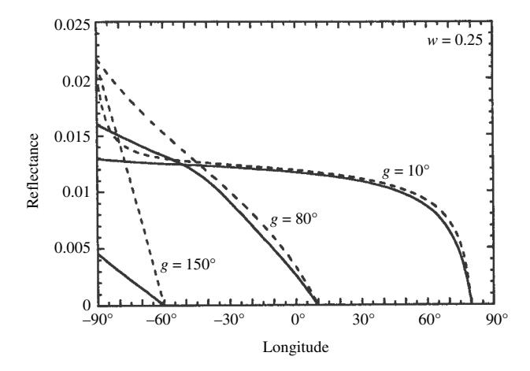

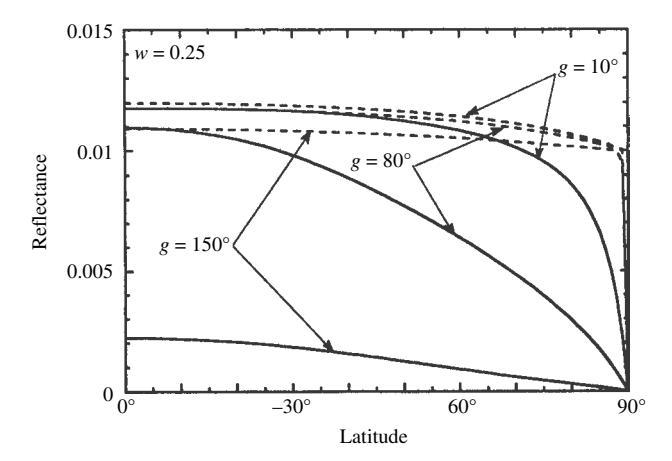

Figure 12.5 Effect of macroscopic roughness on the brightness profiles of a low-albedo (w=0.25) planet at three phase angles g. For simplicity, the surface is assumed to be covered with isotropically scattering particles, and the opposition effect is neglected. Solid lines, radiance factor for  $\bar{\theta}=25^\circ$ ; dashed lines, radiance factor for  $\bar{\theta}=0$ . (Top) Profiles along the luminance equator. (Bottom) Profiles along the central meridian of the illuminated part of the disk. (Reproduced from Hapke [1984], copyright 1984 with permission of Elsevier.)

(12.45) and (12.48) – (12.54); the mean slope angle  $\overline{\theta}$  is defined in (12.5), and the other quantities are defined in Chapters 8 and 9.

Equation (12.55) satisfies the reciprocity requirement (Section 10.3), as may be verified by writing down the detailed expressions for the various terms in the reflectance. If this is done, it must be remembered that if i < e for a given set of angles, then the reciprocal configuration will have i > e.

In order to illustrate the effects of roughness on the reflectance, let us see how the distribution of brightness across the surface of a planet is altered by increasing

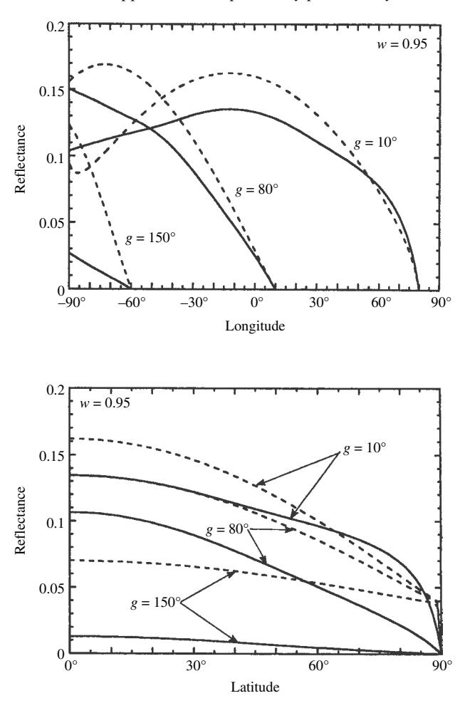

Figure 12.6 Same as Figure [12.5](#page-0-0) for a high-albedo *(w* =0*.*95*)* planet.(Reproduced from Hapke [\[1984](#page-0-0)], copyright [1984](#page-0-0) with permission of Elsevier.)

θ. These changes are illustrated in Figures [12.5](#page-0-0) and [12.6,](#page-0-0) which show relative reflectance profiles across the disks of hypothetical planets of varying roughnesses and albedos. Figure [12.5](#page-0-0) (top) shows the brightness as a function of longitude along an equatorial scan on a dark, uniform planet whose regolith is composed of particles of mean single-scattering albedo *w* = 0*.*25. Profiles for three phase angles are given for two values of θ. Figure [12.5](#page-0-0) (bottom) shows the brightness as a function of latitude along the central meridian of the illuminated crescent of this planet for the same phase angles and slope angles. Figure [12.6](#page-0-0) gives similar profiles for a bright planet with *w* = 0*.*95. For simplicity, the profiles were calculated from equation [\(12.55\)](#page-0-0) with *K* = 1, *p(g)* = 1 and neglecting the opposition effect.

Note that under most conditions the effect of increasing roughness is to decrease the reflectance. This decrease is especially important at large phase angles, where shadows hide much of the surface. It also occurs at the limb of the low-albedo planet, where the surface elements are selectively tilted toward the observer, eliminating the limb spike caused by the Lommel–Seeliger law. However, near the limb and terminator of the high-albedo planet seen at small phase angles, the effective tilt causes an increase in brightness with increasing roughness.

The brightness of a low-albedo planet is governed primarily by the Lommel– Seeliger law, which is independent of latitude (Section [8.7\)](#page-0-0). Hence, a dark planet with a smooth surface would not be expected to exhibit polar darkening. Roughening the surface causes the brightness to decrease with latitude. However, at small phase angles this decrease does not become pronounced until high latitudes, in agreement with observations by Minnaert [\(1961](#page-0-0)) that the Moon's photometric function is nearly independent of latitude. As the phase angle increases, the polar darkening moves to lower latitudes.

The theoretical profiles are compared with several planetary data sets taken by spacecraft in Figures [12.7–12.9.](#page-0-0) Figure [12.7](#page-0-0) shows an equatorial scan, and Figure [12.8](#page-0-0) a meridional scan of Mercury using data from the *Mariner 10* mission (Hapke, [1984](#page-0-0)). Figure [12.9](#page-0-0) shows an equatorial scan of Europa (Domingue *et al.*, [1991\)](#page-0-0) based on *Voyager* measurements. These equations have also been applied to the analysis of planetary data in papers by Helfenstein [\(1986](#page-0-0)), Helfenstein and Veverka [\(1987](#page-0-0)), Veverka *et al.* [\(1988](#page-0-0)), McEwan [\(1991](#page-0-0)), and others.

### *12.3.2 Disk-integrated photometry*

From equation [\(11.35\)](#page-0-0) the integral phase function of a uniform, rough-surfaced, spherical planet of radius *R* observed at phase angle *g* is

$$\Phi(g, w, \overline{\theta}) = \frac{1}{JR^2 A_p} \int_{A(i,v)} Jr_R(i, e, g) \mu dA 
= \frac{1}{JR^2 A_p} \int_{\Lambda = -\pi/2}^{\pi/2 - g} \int_{L = -\pi/2}^{\pi/2} Jr_R(\Lambda, L, g) \mu R^2 \cos L dL d\Lambda 
= \frac{4}{A_p} \int_{\Lambda = -\pi/2}^{-g/2} \int_{L = 0}^{\pi/2} r_R(\Lambda, L, g) \cos \Lambda \cos^2 L dL d\Lambda,$$
(12.56)

where

$$A_p(w, \overline{\theta}) = \frac{1}{JR^2} \int_{A(i)} Jr_R(i, e, 0) \mu dA$$
$$= 4 \int_{\Lambda = -\pi/2}^0 \int_{L=0}^{\pi/2} r_R(\Lambda, L, 0) \cos \Lambda \cos^2 L dL d\Lambda \qquad (12.57)$$

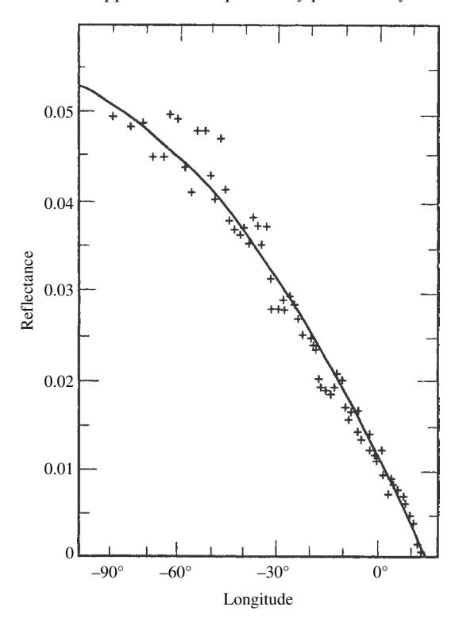

Figure 12.7 Measured and predicted brightness distributions along the equator of Mercury at *g* = 77◦. The line is the theoretical brightness for θ = 20◦; the crosses are data obtained by the *Mariner 10* spacecraft. (Reproduced from Hapke [\[1984\]](#page-0-0), copyright [1984](#page-0-0) with permission of Elsevier.)

is the physical albedo. In these equations we have used the fact that the bidirectional reflectance must be symmetric with respect to the northern and southern hemispheres and reciprocal with respect to the + = −*g/*2 meridian.

Equation [\(12.55\)](#page-0-0) was inserted into [\(12.56\)](#page-0-0) and [\(12.57\)](#page-0-0) and integrated numerically for values of θ up to 60◦*.* It was found that to a good approximation the physical albedo can be written

$$A_p(w,\overline{\theta}) = \frac{w}{8} \left\{ p(0)[1 + B_{S0}] - 1 + U(w,\overline{\theta}) \frac{r_0}{2} \left( 1 + \frac{r_0}{3} \right) \right\} [1 + B_{C0}], \quad (12.58)$$

and

$$\Phi(g, w, \overline{\theta}) = K(g, \overline{\theta})\Phi(g, w, 0), \tag{12.59}$$

where *r*0 is the diffusive reflectance, and ,*(g,w,*0*)* is given by [\(11.42\)](#page-0-0); in which *Ap(w,*0*)* is given by [\(11.34\)](#page-0-0). The quantities *U(w,* θ¯*)* and *K(g,* θ¯*)* are, respectively,

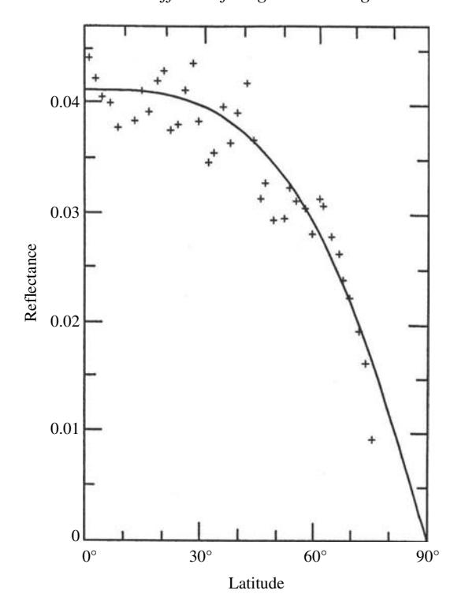

Figure 12.8 Measured and predicted brightness distributions along the  $\Lambda = -50^{\circ}$  meridian of luminance latitude of Mercury at  $g = 77^{\circ}$ . The line is the theoretical brightness for  $\bar{\theta} = 20^{\circ}$ ; the crosses are data obtained by the *Mariner 10* spacecraft. (Reproduced from Hapke [1984], copyright 1984 with permission of Elsevier.)

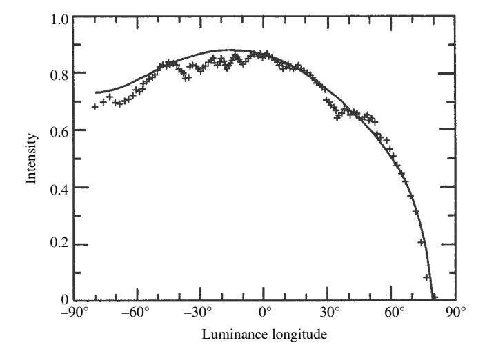

Figure 12.9 Measured and predicted brightness distributions along the luminance equator of Europa at  $g=10.5^{\circ}$ . The line is the theoretical brightness in relative units for  $\overline{\theta}=10^{\circ}$ ; the crosses are data obtained by the *Voyager* spacecraft. (Reproduced from Domingue *et al.* [1991], copyright 1991 with permission of Elsevier.)

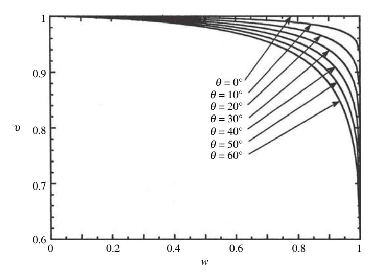

Figure 12.10 Physical-albedo correction factor *U(w,* θ*)* plotted against the singlescattering albedo for several values of θ. (Reproduced from Hapke [\[1984\]](#page-0-0), copyright [1984](#page-0-0) with permission of Elsevier.)

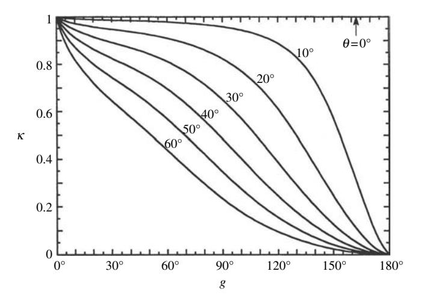

Figure 12.11 Integral-photometric-function correction factor *K(g,* θ*)* plotted against phase angle for several values of θ. This quantity is the ratio of the normalized integral brightness of a planet with a rough surface to that of one with a smooth surface. (Reproduced from Hapke [\[1984\]](#page-0-0), copyright [1984](#page-0-0) with permission of Elsevier.)

the factors by which the physical albedo and integral phase function of a planet with a smooth surface may be corrected for effects of macroscopic roughness. These correction factors are plotted in Figures [12.10](#page-0-0) and [12.11.](#page-0-0)

| g   | 0◦   | 10◦   | 20◦   | 30◦   | 40◦    | 50◦    | 60◦    |
|-----|------|-------|-------|-------|--------|--------|--------|
| 0   | 1.00 | 1.00  | 1.00  | 1.00  | 1.00   | 1.00   | 1.00   |
| 2   | 1.00 | 0.997 | 0.991 | 0.984 | 0.974  | 0.961  | 0.943  |
| 5   | 1.00 | 0.994 | 0.981 | 0.965 | 0.944  | 0.918  | 0.881  |
| 10  | 1.00 | 0.991 | 0.970 | 0.943 | 0.909  | 0.866  | 0.809  |
| 20  | 1.00 | 0.988 | 0.957 | 0.914 | 0.861  | 0.797  | 0.715  |
| 30  | 1.00 | 0.986 | 0.947 | 0.892 | 0.825  | 0.744  | 0.644  |
| 40  | 1.00 | 0.984 | 0.938 | 0.871 | 0.789  | 0.692  | 0.577  |
| 50  | 1.00 | 0.982 | 0.926 | 0.846 | 0.748  | 0.635  | 0.509  |
| 60  | 1.00 | 0.979 | 0.911 | 0.814 | 0.698  | 0.570  | 0.438  |
| 70  | 1.00 | 0.974 | 0.891 | 0.772 | 0.637  | 0.499  | 0.366  |
| 80  | 1.00 | 0.968 | 0.864 | 0.719 | 0.566  | 0.423  | 0.296  |
| 90  | 1.00 | 0.959 | 0.827 | 0.654 | 0.487  | 0.346  | 0.231  |
| 100 | 1.00 | 0.946 | 0.777 | 0.575 | 0.403  | 0.273  | 0.175  |
| 110 | 1.00 | 0.926 | 0.708 | 0.484 | 0.320  | 0.208  | 0.130  |
| 120 | 1.00 | 0.894 | 0.617 | 0.386 | 0.243  | 0.153  | 0.094  |
| 130 | 1.00 | 0.840 | 0.503 | 0.290 | 0.175  | 0.107  | 0.064  |
| 140 | 1.00 | 0.747 | 0.374 | 0.201 | 0.117  | 0.070  | 0.041  |
| 150 | 1.00 | 0.590 | 0.244 | 0.123 | 0.069  | 0.040  | 0.023  |
| 160 | 1.00 | 0.366 | 0.127 | 0.060 | 0.032  | 0.018  | 0.010  |
| 170 | 1.00 | 0.128 | 0.037 | 0.016 | 0.0085 | 0.0047 | 0.0026 |
| 180 | 1.00 | 0     | 0     | 0     | 0      | 0      | 0      |

Table 12.1. *Integral-phase-function roughness correction factors K(g,* θ*)*

It was found that to better than 1% the numerical values of *U(w,* θ*)* can be represented by the empirical expression

$$U(w, \overline{\theta}) = 1 - (0.048\overline{\theta} + 0.0041\overline{\theta}^{2})r_{0} - (0.33\overline{\theta} - 0.0049\overline{\theta}^{2})r_{0}^{2},$$
(12.60)

where θ is in radians. The factor *K(g,*θ*)* is tabulated in Table [12.1.](#page-0-0) It was found that for *g* ≤ 60◦, *K(g,* θ*)* can be approximated by the empirical function

$$K(g, \overline{\theta}) = \exp\left[-0.32\overline{\theta}\left(\tan\overline{\theta}\tan\frac{g}{2}\right)^{1/2} - 0.52\overline{\theta}\tan\overline{\theta}\tan\frac{g}{2}\right]. \tag{12.61}$$

If *g >* 60◦ this equation overestimates *K*, and Table [12.1](#page-0-0) should be used.

Note that macroscopic roughness causes a broad opposition effect in the integral phase function. This opposition effect is caused by macroscopic shadow hiding between the surface facets. It is superposed onto the microscopic shadow hiding and coherent backscatter peaks. This effect is also responsible for a surge in the thermally emitted radiance of many solar system bodies near zero phase in the infrared, where it is known as "thermal beaming."

At small phase angles the regions that are strongly shadowed tend to be close to the limb, where their effects are minimized by the factor *µ* in the integrand for ,*(g,w,* θ*)*. Over most of the disk, decreases in brightness of those facets that are oriented away from the Sun are largely compensated by increases in the brightness of other facets that are oriented more directly toward the Sun. The major effects of roughness are seen when *g >* 90◦, when the heavily shadowed areas are near the center of the disk. At very large phase angles the brightness of a rough planet is only a few percent of that of a corresponding smooth planet, thus accounting for the observation, known since antiquity, that the Moon is invisible when less than about 1 day from new.

The theoretical integral phase function is compared with observations of Mercury, a low-albedo planet, in Figure [12.12](#page-0-0) (Hapke, [1984\)](#page-0-0) and Europa, a high-albedo body, in Figure [12.13](#page-0-0) (Domingue *et al.*, [1991\)](#page-0-0). Equations [\(12.56\)](#page-0-0) – [\(12.61\)](#page-0-0) have been widely used in a number of analyses to describe the integral scattering properties of objectsin the solarsystem, including studies by Hapke [\(1984\)](#page-0-0),Buratti[\(1985\)](#page-0-0), Helfenstein and Veverka [\(1987\)](#page-0-0), Simonelli and Veverka [\(1987\)](#page-0-0), Herbst *et al.*, [\(1987\)](#page-0-0), Veverka *et al.* [\(1988\)](#page-0-0), Bowell *et al.* [\(1989\)](#page-0-0), and Domingue *et al.* [\(1991\)](#page-0-0).

## *12.3.3 An empirical correction for multiple interfacet scattering*

Mutiple scattering between the facets that are assumed to make up the surface should be similar to interparticle multiple scattering in the sense that it is small when the albedos of the facets are small, and increases nonlinearly as the albedo becomes close to 1. This suggests that, as an approximate correction for multiple scattering, θ be replaced in all equations by

$$\overline{\theta}_p = (1 - r_0)\overline{\theta}. \tag{12.62}$$

where *r*0 is the diffusive reflectance and θ*p* is the effective value of the roughness that is measured photometrically. Thus, θ = θ*p* /(1 − *r*0*)* should approximate the actual roughness. The correction has only a minor effect when the albedo is small, but reduces the photometric roughness θ*p* to nearly zero when the albedo is high. This also means that the calculated spherical reflectance of a medium of nonabsorbing particles will be close to 1, as conservation of energy requires.

### **12.4 Summary of the roughness correction model**

Suppose a semi-infinite, plane-parallel, particulate medium has a surface that is smooth on a scale larger than the particles, and has a bidirectional reflectance *r(i,e,g,w)*. Suppose also that a spherical planet covered with an optically thick layer of this medium has a physical albedo *Ap(w)* and integral phase function ,*(g,w)*. Suppose now that the surface of this medium is warped into a series of elevations and/or depressions whose geometry is unspecified, except that it is independent of

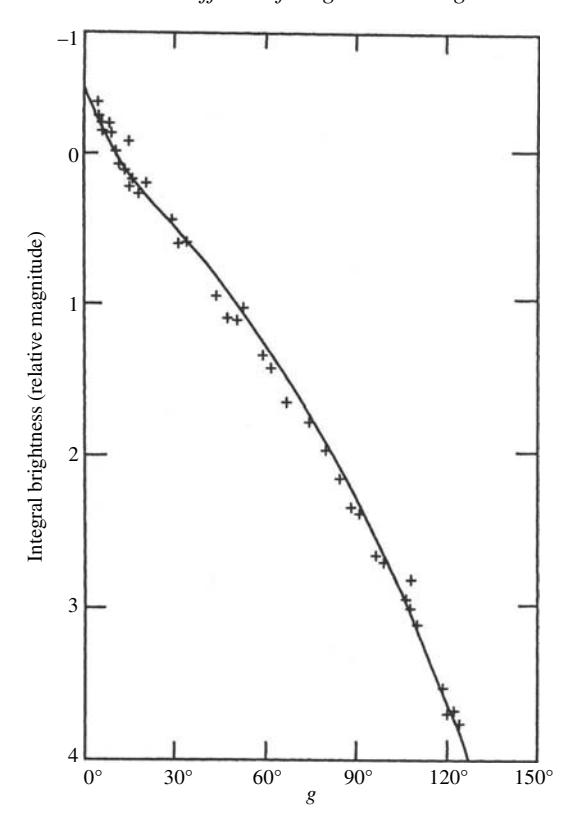

Figure 12.12 Measured and predicted integral phase functions of Mercury. The line is the theoretical phase function for θ = 20◦; the crosses are data of Danjon [\(1949](#page-0-0)) in magnitudes. (Reproduced from Hapke [\[1984](#page-0-0)], copyright [1984](#page-0-0) with permission of Elsevier.)

the azimuth angle ς, and is characterized by a distribution of slope angles relative to the horizontal by the Gaussian function

$$a(\vartheta) = \frac{2}{\pi \tan^2 \overline{\theta}} \exp\left(-\frac{\tan^2 \vartheta}{\pi \tan^2 \overline{\theta}}\right) \sec^2 \vartheta \sin \vartheta,$$

where

$$\tan \overline{\theta} = \left[ (\langle \cos \vartheta \rangle^{-2} - 1) / \pi \right]^{1/2}.$$

and *<* cosϑ *>* is the mean cosine of the slope angle.

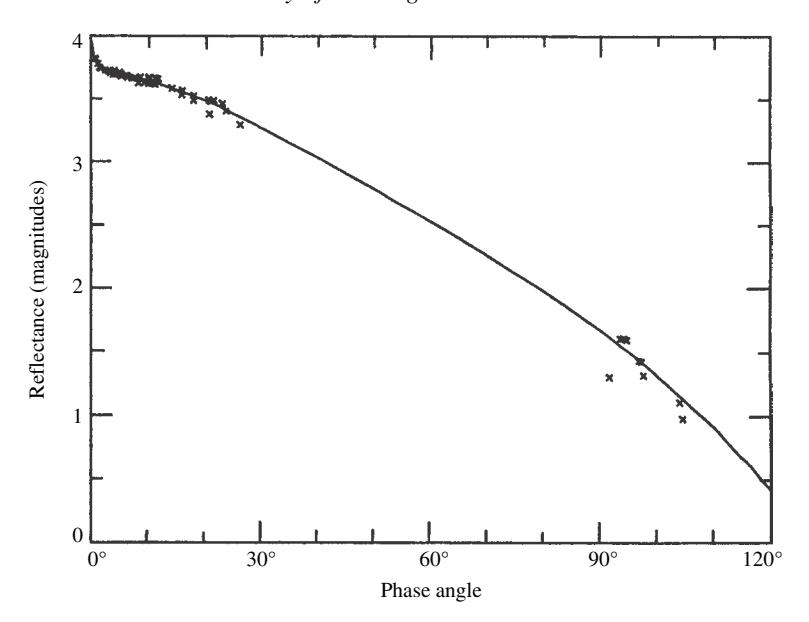

Figure 12.13 Measured and predicted integral phase functions of Europa. The line is the theoretical phase function for θ = 10◦; the crosses are combined telescopic and *Voyager* data. (Reproduced from Domingue *et al.* [\[1991\]](#page-0-0), copyright [1991](#page-0-0) with permission of Elsevier.)

Let

$$\begin{split} \overline{\theta}_p &= (1 - r_0)\overline{\theta}, \\ f(\psi) &= \exp\left(-2\tan\frac{\psi}{2}\right), \\ \chi(\overline{\theta_p}) &= 1/(1 + \pi\tan\overline{\theta_p}^2)^{1/2}, \\ E_1(y) &= \exp\left(-\frac{2}{\pi}\cot\overline{\theta}_p\cot y\right), \\ E_2(y) &= \exp\left(-\frac{1}{\pi}\cot^2\overline{\theta_p}\cot^2 y\right), \\ \eta(y) &= \chi(\overline{\theta_p}) \left[\cos y + \sin y\tan\overline{\theta_p}\frac{E_2(y)}{2 - E_1(y)}\right], \end{split}$$

where *y* = either *i* or *e*.

Then the bidirectional reflectance of the rough surface is

$$r_R(i, e, g, w, \overline{\theta}) = r(i_e, e_e, g, w) \mathcal{S}(i, e, g)$$
(12.63)

where the effective angles of incidence *ie* and emergence *ee* and the shadowing function *S(i,e,g)* are given by the following relations.

When *i* ≤ *e*,

$$\begin{split} \mu_{0e} &= \cos[i_e(i,e,\psi)] \\ &= \chi(\overline{\theta}_p) \left[ \cos i + \sin i \tan \overline{\theta}_p \frac{\cos \psi E_2(e) + \sin^2(\psi/2) E_2(i)}{2 - E_1(e) - (\psi/\pi) E_1(i)} \right], \\ \mu_e &= \cos[e_e(i,e,\psi)] \\ &= \chi(\overline{\theta}_p) \left[ \cos e + \sin e \tan \overline{\theta}_p \frac{E_2(e) - \sin^2(\psi/2) E_2(i)}{2 - E_1(e) - (\psi/\pi) E_1(i)} \right], \\ S(i,e,\psi) &= \frac{\mu_e}{\eta(e)} \frac{\mu_0}{\eta(i)} \frac{\chi(\overline{\theta}_p)}{1 - f(\psi) + f(\psi) \chi(\overline{\theta}_p) [\mu_0/\eta(i)]}, \end{split}$$

where *e* ≤ *i*,

$$\begin{split} \mu_{0e} &= \cos[i_e(i,e,\psi)] \\ &= \chi(\overline{\theta}_p) \left[ \cos i + \sin i \tan \overline{\theta}_p \frac{E_2(i) - \sin^2(\psi/2) E_2(e)}{2 - E_1(i) - (\psi/\pi) E_1(e)} \right], \\ \mu_e &= \cos[e_e(i,e,\psi)] \\ &= \chi(\overline{\theta_p}) \left[ \cos e + \sin e \tan \overline{\theta}_p \frac{\cos \psi E_2(i) + \sin^2(\psi/2) E_2(e)}{2 - E_1(i) - (\psi/\pi) E_1(e)} \right], \\ S(i,e,\psi) &= \frac{\mu_e}{\eta(e)} \frac{\mu_0}{\eta(i)} \frac{\chi(\overline{\theta_p})}{1 - f(\psi) + f(\psi) \chi(\overline{\theta_p}) [\mu/\eta(e)]}. \end{split}$$

The planetary physical albedo is

$$A_p(w, \overline{\theta}_p) = \frac{w}{8} \left\{ p(0)[1 + B_{S0}] - 1 + U(w, \overline{\theta_p}) \frac{r_0}{2} \left( 1 + \frac{r_0}{3} \right) \right\} [1 + B_{C0}],$$

and the integral phase function is

$$\Phi(g,w,\overline{\theta}_p) = \mathit{K}(g,\overline{\theta_p})\Phi(g,w,0),$$

where ,*(g,w,*0*)* is given by [\(11.42\)](#page-0-0), *Ap(w,*0*)* by [\(11.34\)](#page-0-0),

$$U(w, \overline{\theta}) = 1 - (0.048\overline{\theta} + 0.0041\overline{\theta}^2)r_0 - (0.33\overline{\theta} - 0.0049\overline{\theta}^2)r_0^2,$$

and *K(g,*θ*p)* is tabulated in Table [12.1;](#page-0-0) for *g* ≤ 60◦ a good approximation for *K(g,* θ*p)* is

$$\mathit{K}(g,\overline{\theta}) \approx \exp\left[-0.32\overline{\theta} \left(\tan\overline{\theta}\tan\frac{g}{2}\right)^{1/2} - 0.52\overline{\theta}\tan\overline{\theta}\tan\frac{g}{2}\right].$$

## **12.5 Other planetary photometric models** *12.5.1 Introduction*

There are a number of other models that attempt to describe the scattering of sunlight by bodies of the solar system. In this section we describe three of them in wide use, the Lumme–Bowell, Buratti–Veverka, and Shkuratov models. They will be given and discussed briefly without deriving them. For details of their derivation the oiginal references should be consulted.

### *12.5.2 The Lumme–Bowell model*

The Lumme–Bowell model is derived and described in three papers: Lumme and Bowell [\(1981a,](#page-0-0) b) and Bowell *et al.* [\(1989\)](#page-0-0). The bidirectional reflectance is given by

$$r(i, e, g) = r_1(i, e, g) + r_m(i, e),$$

where

$$r_m(i, e) = \frac{w*}{4\pi} H(\mu_0, w*) H(\mu, w*) - 1$$

is the contribution of mutiply scattered light. Thus, multiple scattering is described in a manner similar to the IMSA model, except that the reduced albedo *w*∗ is used in the *H* functions.

The term *r*1*(i,e, g)* is the singly scattered contribution to the reflectance,

$$r_1(i,e,g) = \frac{w}{4\pi} \frac{\mu_0}{\mu_0 + \mu} p(g) \frac{{}_1F_1(1,1+2x,x)}{2} \left( \frac{f}{1+s\varsigma} + 1 - f \right).$$

where *p(g)* is the volume-average particle phase function. The Lumme–Bowell model assumes that all particulate media have the same particle scattering function

$$p(g) = 0.95 \exp[-0.4g] + 16.11 \exp[-4.0(\pi - g)],$$

which was obtained by empirically fitting the phase functions of a number of particles measured in the laboratory.

The factor 1*F*1*(*1*,*1 + 2*x, x)/*2 describes the opposition surge, where 1*F*1 is the degenerate hypergeometric function. The factor *x* in the arguments of 1*F*1 is

$$x = \frac{\cos \Lambda + \cos(\Lambda - g)}{2.4 \sin g} \ln \frac{1}{1 - \phi},$$

where + is the luminance longitude, and . is the filling factor. The opposition effect factor amplifies only the single-scattering term and, thus, describes the SHOE. The model does not include the CBOE.

The last factor (in parentheses) in the singly scattered radiance accounts for the effects of roughness: the surface is assumed to be partially covered with holes whose sides cast shadows on their bottoms; *F* is the fraction of the surface occupied by the holes; *s* is a function of the depth to diameter ratio of the holes, and thus is a measure of the mean slope angle of the roughness; and

$$\varsigma = \frac{\left(\mu_0^2 - 2\mu_0\mu + \mu^2\right)^{1/2}}{\mu_0\mu}.$$

The roughness factor is assumed to affect only the singly scattered light. The Lumme–Bowell model justifies this by asserting that the multiple-scattering term describes light that is scattered several times between macroscopic tilted facets, as well as between individual grains. This assumption is debatable and is one of the uncertainties of the model.

The bidirectional reflectance contains four adjustable parameters: w,  $\phi$ , f, and s.

The disk-integrated reflectance scattered by a spherical body is given by integrating the bidrectional reflectance over the surface. Lumme and Bowell fitted approximate analytic functions to the resulting expressions. They find that the scattered radiance relative to a perfect Lambert disk expressed in astronomical magnitudes m is:

$$I/F = 10^{-0.40m(g)} = a_1F_1 + a_2F_2 + a_3F_1F_3$$

where

$$F_{1} = \exp\left[-3.33 \left(\tan\frac{g}{2}\right)^{0.63}\right],$$

$$F_{2} = \exp\left[-1.87 \left(\tan\frac{g}{2}\right)^{1.22}\right],$$

$$F_{3} = \exp\left(-\frac{g}{0.333 + 2.31g}\right),$$

$$a_{1} = (1 - c)(1 - Q)10^{-0.4m(0)},$$

$$a_{2} = Q10^{-0.4m(0)},$$

$$a_{3} = c(1 - Q)10^{-0.4m(0)}.$$

These equations contain three adjustable parameters: m(0) the magnitude at zero phase angle, Q the ratio of multiple to single scattering, and c the opposition effect parameter.

A simplified empirical version of the integral Lumme–Bowell equation has been adopted by the International Astromonmical Union to describe the phase function of asteroids:

$$H(g) = H(0) - 2.5 \ln[(1 - G)F_1(g) + GF_2(g)],$$

where  $\mathcal{H}(g)$  is the visual magnitude at phase angle g reduced to unit heliocentric and geocentric distances. Thus the brightness in magnitudes is characterized by two parameters:  $\mathcal{H}(0)$  the absolute magnitude at zero phase, and the so-called slope parameter G.

#### 12.5.3 The Buratti-Veverka model

The Buratti–Veverka model (Buratti and Veverka, 1985) is a combination of the generalized Lommel–Seeliger law, Lambert's law, and the Hameen-Anttila (1967) roughness model. A smooth surface is assumed to have a radiance factor given by

$$\frac{I}{F} = A \frac{\mu_0}{\mu_0 + \mu} p(g) + (1 - A)\mu_0.$$

Following Hameen-Anttila, this surface is then warped into a depression described by a paraboloid of revolution in order to account for the effects of roughness. The roughness corection is carried out by computer, so the model is not fully analytic.

The model contains three or more adjustable parameters: A, the depth-to-diameter ratio of the depressions, plus as many parameters as necessary to describe p(g). The model assumes that the second term on the right describes interfacet scattering as well as interparticle scattering.

#### 12.5.4 The Shkuratov reflectance model

The Shkuratov model (Shkuratov, 1989) is a semi-empirical description of the photometric function of a surface (Section 10.5.3). The bidirectional reflectance is

$$r(i, e, g) = \frac{A_n}{\pi} f(\Lambda, L, g) = \frac{A_n}{\pi} f_1(g) f_2(g) f_3(\Lambda, L, g)$$

where  $A_n$  is the normal albedo,  $f = f_1 f_2 f_3$  is the photometric function,  $\Lambda$  is the luminance longitude,  $\mathcal{L}$  is the luminance latitude, and g is the phase angle.

The first factor in the photometric function

$$f_1(g) = \exp(-kg)$$

describes the SHOE, where K is an empirical parameter that decreases with increasing albedo and depends on the geometry of the surface of the medium.

The second factor

$$f_2(g) = \frac{1}{2 + \exp(-d/\Lambda_E)} \left\{ 2 + \frac{\exp(-d/\Lambda_E)}{\sqrt{1 + [(4\pi \Lambda_E/\lambda)\sin(g/2)]^2}} \right\}$$

describes the CBOE, where  $\Lambda_E$  is the extinction mean free path, and d is a distance within the medium that is so small that coherent backscattering cannot occur within

it. If the particles are larger than the wavelength, then d is of the order of the radius of a particle; if the particles are smaller than the wavelength, then d is of the order of  $\lambda$ .

The third factor

$$f_3(\Lambda, L, g) = \frac{\cos\left[\frac{\pi}{\pi - g}(\Lambda - \frac{g}{2})\right]}{\cos \Lambda} (\cos L)^{g/(\pi - g)}$$

describes the angular distribution of brightness at larger angles than the opposition effects. It was first suggested by L. Akimov and is sometines known as the Akimov formula. It is based on considerations of shadowing on fractal-like surfaces.

The reflectance contains four adjustable parameters:  $A_n$ , K,  $\Lambda_E$ , and d. The integral brightness of a body relative to a Lambert disk is

$$A_P \Phi_P = A_P f_1(g) f_2(g) f_4(g),$$

where  $A_P$  is the physical albedo,  $\Phi_p = f_1 f_2 f_4$  is the integral phase function,

$$f_4(g) = \frac{2}{\sqrt{\pi}} \left( 1 - \frac{g}{\pi} \right) \frac{\Gamma\left(\frac{3\pi - g}{2(\pi - g)}\right)}{\Gamma\left(\frac{4\pi - 3g}{2(\pi - g)}\right)},$$

and  $\Gamma(z)$  is the gamma function

$$\Gamma(z) = \int_0^\infty t^{z-1} e^{-t} dt.$$

The disk-integrated function has four adjustable parameters:  $A_P$ , K,  $\Lambda_E$ , and d.

There are a number of difficulties with the Shkuratov model. The Shkuratov model is a useful way of describing the reflectance empirically, but the physical interpretation of the parameters is unclear. The assumption that the surface of a body covered with craters of all sizes can be described by fractals is probably reasonable down to the scale of the particles of the regolith, but the geometry of the surface changes drastically at this size, so the validity of this assumption is uncertain. It has been shown earlier in this chapter that individual particles can have a CBOE, so it is not at all clear that a finite value of d exists, particularly in view of the large number of observations of CBOEs exhibited by colloidal suspensions of particles smaller than the wavelength. Shkuratov points out that the observed independence of the opposition effect on wavelength can be explained if d and  $\Delta$  are both proportional to  $\lambda$ . However, the assumption that d is of the order of  $\lambda$  for particles smaller than  $\lambda$  does not seem to be valid. Also, there is no reason why the extinction mean free path should be proportional to wavelength.