# **13**

## Polarization of light scattered by a particulate medium

#### **13.1 Introduction**

In the radiative-transport equations for the reflectance and emittance of a particulate medium developed in Chapter [7](#page--1-0) it was assumed that polarization can be neglected. For irregular particles that are large compared with the wavelength of the observation, this assumption is justified on the grounds that the light scattered by such particles is relatively weakly polarized (e.g., Figure [6.7b](#page--1-0)). However, even though it may be small, the polarization of the light scattered by a medium does contain information about the medium and, thus, is potentially a useful tool for remote sensing. One of the advantages of using polarization is that it does not require absolute calibration of the detector, but only a measurement of the ratio of two radiances.

The discovery that sunlight scattered from a planetary regolith was polarized was made as early as 1811 by Arago, who noticed that moonlight was partially linearly polarized and that the dark lunar maria were more strongly polarized than the lighter highlands. Subsequent observations of planetary polarization were made by several persons, including Lord Rosse in Ireland. However, the quantitative measurement of polarization from bodies of the solar system was placed on a firm foundation in the 1920s by the classical studies of Lyot [\(1929\)](#page--1-0). This work was later continued by Dollfus [\(1956](#page--1-0), [1998\)](#page--1-0) and his colleagues. For a more detailed historical account, the reviews by Dollfus [\(1961](#page--1-0), [1962\)](#page--1-0) and Gehrels [\(1974](#page--1-0)) should be consulted. Other important contributions have been made by Gehrels and his co-workers (Gehrels and Teska, [1963;](#page--1-0) Gehrels *et al.*,, [1964](#page--1-0)), who emphasized the importance of the variation of polarization with wavelength, Shkuratov and his colleagues (Shkuratov *et al.*, [1992a](#page--1-0), b, [2007\)](#page--1-0) and many others. Egan [\(1985\)](#page--1-0) has discussed applications of polarization to terrestrial remote sensing.

One of the triumphs of photopolarization in planetary remote sensing occurred when Hansen and Arking [\(1971](#page--1-0)) were able to account for the observed variation of the polarization of Venus as a function of wavelength and phase angle by a cloud of spherical particles of refractive index n = 1.44 and radius  $1.1 \,\mu\text{m}$ . This was the key observation that led to the identification of the composition of the clouds as sulfuric acid by Young (1973).

# 13.2 Linear polarization of particulate media 13.2.1 The Jones and Mueller matrices

We saw in Chapter 2 that electromagnetic radiation consists of a transverse wave of electric and magnetic fields vibrating perpendicularly to the direction of propagation, and that the wave can be described by Jones and Stokes vectors. The Jones vector representation is most useful when a completely polarized wave interacts with an optical device, such as a mirror, a polarizer, or a quarter wave plate. Then the interaction of the device with the electric field can be written in matrix form as  $\mathbf{E} = \mathbf{J}\mathbf{E}_i$ , where  $\mathbf{E}_i$  and  $\mathbf{E}$  are the Jones vectors that describe the electric fields of the incident and exit radiation, respectively, and  $\mathbf{J}$  is a  $2 \times 2$  matrix called the *Jones matrix*.

When the radiation is only partially polarized or is unpolarized the intensity can be described by the Stokes vector. In that case the general scattering process of light interacting with a medium can be written as a matrix equation

$$\mathbf{I} = \mathbf{MI}_i, \tag{13.1}$$

where  $I_i$  and I are the 1 × 4 Stokes vectors that describe the incident and scattered radiances, respectively, and I is a 4 × 4 matrix called the *Mueller matrix* or *scattering matrix*. Thus, when the light is polarized the reflectance is actually a Mueller matrix. In general, I contains 16 elements. However, if the scattering medium consists of randomly oriented particles, and if each particle has a mirror particle, not all of the elements are independent and some are zero. These requirements are probably satisfied by most laboratory powders and planetary regoliths, at least in the first approximation. In that case the Mueller matrix can be written (Mishchenko *et al.*, 2000a)

$$\mathbf{M} = \begin{pmatrix} m_{11} & m_{12} & 0 & 0 \\ m_{12} & m_{22} & 0 & 0 \\ 0 & 0 & m_{33} & m_{34} \\ 0 & 0 & -m_{34} & m_{44} \end{pmatrix}, \tag{13.2}$$

which has only six non-zero independent elements.

Thus, in the case of unpolarized sunlight with Stokes vector

$$\mathbf{I}_i = \left(\begin{array}{c} I_i \\ 0 \\ 0 \\ 0 \end{array}\right)$$

incident on a planetary regolith with reflectance  $\mathbf{r} = \mathbf{M}$ , the Stokes vector of the scattered radiance is

$$\mathbf{I} = \left( \begin{array}{c} m_{11}I_i \\ m_{12}I_i \\ 0 \\ 0 \end{array} \right).$$

#### 13.2.2 The polarization

There are many situations in remote sensing when both the incident and scattered radiances are polarized. The light scattered from the atmosphere is partially linearly polarized (e.g., Coulson, 1971), and this may need to be taken into account in measurements of the reflectance of the surface of the Earth that are sensitive to polarization. Another important application in which the incident radiance is polarized is radar. The transmitted radio frequency pulse is usually completely polarized, either linearly or circularly, and the difference between the fractions of the power returned with the same and opposite senses of polarization as transmitted gives additional information about the medium (Evans and Hagfors, 1968). In some laboratory studies the incident irradiance is completely polarized, either linearly or circularly, and the polarized reflectances are of interest.

A general discussion of polarized reflectance and the Mueller matrix is beyond the scope of this book. Fortunately, this degree of complexity often is not needed in the interpretation of remote-sensing observations. In most field measurements the illumination is sunlight, which is essentially unpolarized and the scattered radiance is only weakly linearly polarized. Circular polarization can usually be ignored, because the polarization in the sunlight scattered from bodies of the solar system is extremely small, on the order of  $10^{-4} - 10^{-5}$  (Kemp, 1974).

This chapter will concentrate on the linear polarization in the radiance at optical wavelengths scattered by a medium of irregular particles large compared with the wavelength when illuminated by an unpolarized incident irradiance. Unfortunately, the discussion will necessarily be largely qualitative, because even this apparently simple case is still poorly understood theoretically 80 years after Lyot's pioneering investigations.

It is found observationally that when the incident light is unpolarized, the radiance scattered from a particulate medium is partially linearly polarized, and the plane of the polarized component is either parallel or perpendicular to the scattering plane. This allows the polarized light, which is a vector quantity, to be represented by a scalar, the polarization. In the discussion of Stokes vectors in Chapter 2 the coordinate system was unspecified. If the direction of propagation is taken to be the positive z-axis and the scattering plane is taken to be the x-z plane then the

polarization is defined as

$$P(i, e, g) = -\frac{Q}{I} = \frac{I_{\perp} - I_{||}}{I_{\perp} + I_{||}},$$
(13.3)

where I and Q are the first two quantities in the Stokes vector,  $I_{\perp}(i,e,g)$  is the component of intensity with its electric vector pointing perpendicular to the scattering plane (y direction), and  $I_{||}(i,e,g)$  is the component parallel to the scattering plane (x direction).

Thus, if the radiance scattered with the electric vector perpendicular to the scattering plane is larger than the radiance parallel, the polarization is said to be *positive*; if the opposite is true, the polarization is *negative*. With this choice of sign of equation (13.3), light specularly reflected from a plane surface (Fresnel reflection), and also light scattered by a small particle (Rayleigh scattering), will always have positive polarization.

The curves of Lyot (1929) for the Moon, shown in Figure 13.1, are typical of the variation of polarization with phase angle of a particulate medium. The curves for most of the airless bodies of the solar system and for particulate media in the laboratory are similar. Although these particular curves are for the integrated light from the entire body, the curves for individual areas are virtually identical (Dollfus, 1956). At zero phase angle the polarization is zero. The polarization is negative for small phase angles and goes through a minimum of  $P \sim -1\%$  at

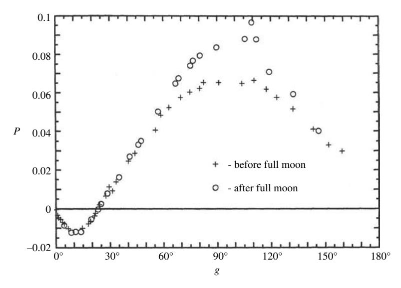

Figure 13.1 Polarization versus phase angle for the integrated light from the Moon. The crosses give the polarization before full moon, and the circles after (Lyot, 1929).

*g* ∼ 10◦. The negative branch of polarization may or may not be bimodal. The polarization increases to zero at phase angles between about 15◦ and 30◦, where the plane of polarization abruptly rotates and *P* becomes positive. It then goes through a maximum whose amplitude depends on the material, but is typically *P* ∼ 10% at *g* ∼ 100◦, after which *P* decreases to zero again at large phase angles.

The parameters commonly used to describe the polarization phase curve are the amount *Pp* and phase angle *gp* at which the positive maximum occurs, the amount *Pn* and phase angle *gn* at which the negative minimum occurs, the phase angle *gi* at which the inversion occurs and the slope *hi* = *dP/dg* at *gi*. If the negative branch of polarization is bimodal, *Pn* and *gn* refer to the broad minimum at the larger phase angle. All of these parameters seem to depend on particle size, composition, albedo, and porosity in nontrivial ways.

If the polarization of light scattered from the surface of a nonopaque solid or liquid, such as a mineral or the surface of water, is examined, it is found that when the source and detector are in the vicinity of the specular configuration the polarization is large and positive, as predicted by the Fresnel reflection coefficients. However, away from the specular region the electric vector lies in the plane formed by the surface normal and the emergent ray, and the polarization is not zero at *g* = 0 (Figure [13.2\)](#page-0-0). This residual negative polarization is caused by the light that has been volume-scattered within the material and is polarized by refraction as it leaves the surface, as described by the Fresnel transmission coefficients.

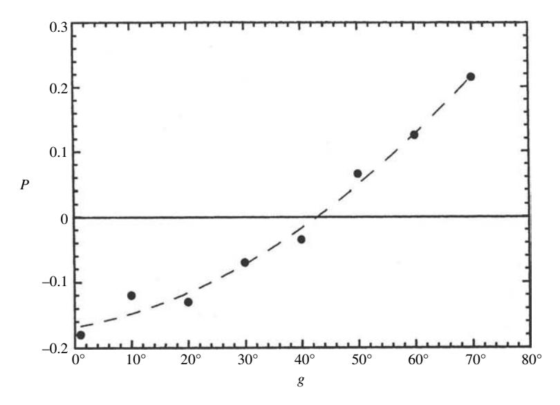

Figure 13.2 Polarization curve of light scattered from a glass plate viewed at *e* = 60◦.

However, the light scattered from a particulate medium almost always has its plane of polarization parallel or perpendicular to the scattering plane, rather than with respect to the plane containing the exit ray and the surface normal. Furthermore, for low-albedo surfaces, such as lunar regolith, the polarization is a function only of phase angle and is independent of *i* and *e*. However, in materials with higher albedos the polarization phase curve is somewhat dependent on *i* and *e* also. These observations suggest that the phenomena contributing to *P (g)* are primarily governed by single scattering by individual particles of the medium. In order to try to understand the polarization phase curve, at least qualitatively, the positive and negative branches of the curve will be discussed separately in the following sections.

## **13.3 The positive branch of polarization** *13.3.1 Factors affecting the positive polarization*

We start by hypothesizing that the positive branch of the polarization phase curve is controlled primarily by the properties of the individual particles of the medium. Recall that the light scattered from a particulate medium of particles large compared with the wavelength is the result of four phenomena:

- (1) Light passing near the particle is diffracted. However, it was shown in Chapter [7](#page-0-0) that single-particle Fraunhofer diffraction does not exist in a medium where the particles are close together.
- (2) Light that has been specularly reflected from the surface of the particle is positively polarized, in accordance with the Fresnel reflectance expressions (Chapter [4\)](#page-0-0).
- (3) Light that has penetrated into the interior of a particle is negatively polarized by refraction as it leaves. In a regular particle, such as a perfect sphere, the plane of scattering is preserved, so that the transmitted light is strongly negatively polarized. If the particle is not opaque, this once-transmitted light is important for phase angles larger than 2ϑ*C*, where ϑ*C* is the critical angle for total internal reflection. If the particle is irregular, with a rough surface and filled with internal scatterers, the polarization of this transmitted light is reduced and may be partially or completely randomized (see Figure [6.7b](#page-0-0)).
- (4) The final contribution is by light that has been multiply scattered by many particles. In this section it will be assumed that the planes of scattering between particles have been randomly rotated, so that this component is unpolarized. This assumption will be tested below.

If only the polarization by single-particle scattering contributes to the positive branch, then a theoretical expression for *P* may be derived as follows. The opposition effect is negligible for phase angles larger than about 20°. Therefore in the positive branch equation (12.55) becomes

$$I(i,e,g) = JK \frac{1}{4\pi} \frac{\mu_{0e}}{\mu_{0e} + \mu_e} \left\{ wp(g) + w \left[ H\left(\frac{\mu_{0e}}{K}\right) H\left(\frac{\mu_e}{K}\right) - 1 \right] \right\} S(i,e,g), \tag{13.4}$$

where the quantities in this equation are defined in Chapters 8 and 12.

In equation (13.4) the radiance that has been scattered only once by an average particle of the regolith is described by the term proportional to Jp(g). Let the portion of Jp(g) scattered with its electric vector perpendicular to the scattering plane of the medium be  $J[p(g)]_{\perp}$ , and let that parallel to the scattering plane be  $J[p(g)]_{\parallel}$ . Let

$$\Delta[p(g)] = [p(g)]_{\perp} - [p(g)]_{\parallel}. \tag{13.5}$$

Then if the incident radiance is unpolarized the two components of the scattered radiance are

$$I_{\perp}(i, e, g) = K \frac{w}{4\pi} \frac{\mu_{0e}}{\mu_{0e} + \mu_{e}} \left\{ J[p(g)]_{\perp} + \frac{J}{2} [H(\mu_{0e}/K)H(\mu_{e}/K) - 1] \right\} S(i, e, g)$$
(13.6a)

and

$$I_{\parallel}(i,e,g) = K \frac{w}{4\pi} \frac{\mu_{0e}}{\mu_{0e} + \mu_{e}} \left\{ J[p(g)]_{\parallel} + \frac{J}{2} [H(\mu_{0e}/K)H(\mu_{e}/K) - 1] \right\} S(i,e,g). \tag{13.6b}$$

If the assumption that the multiply scattered radiance has no net polarization is valid the polarization is

$$P(i, e, g) = \frac{JK \frac{w}{4\pi} \frac{\mu_{0e}}{\mu_{0e} + \mu_{e}} \{ [p(g)]_{\perp} - [p(g)]_{\parallel} \} S(i, e, g)}{JK \frac{w}{4\pi} \frac{\mu_{0e}}{\mu_{0e} + \mu_{e}} \{ p(g) + [H(\mu_{0e}/K)H(\mu_{e}/K) - 1] \} S(i, e, g)}, \quad (13.7)$$

which after clearing common factors becomes

$$P(i, e, g) \simeq \frac{\Delta[p(g)]}{p(g) + [H(\mu_{0e}/K)H(\mu_e/K) - 1]}.$$
 (13.8)

Note that P is independent of the shadowing function S(i, e, g). Thus, macroscopic roughness affects the polarization only through the effective tilt angles in the multiple-scattering contribution.

If w is so small that the H functions are not very different from 1 the polarization function of low-albedo objects is approximately

$$P(i, e, g) \simeq \frac{\Delta[p(g)]}{p(g)},\tag{13.9a}$$

which is independent of i and e, as is approximately true for the Moon (Dollfus, 1961, 1962). It is also independent of surface roughness and filling factor. Note that this expression is valid for very-low-albedo materials even if the multiply scattered light is not randomly polarized. Thus, for dark surfaces the polarization of the light scattered by the medium is approximately equal to that of an average single particle of the medium, which from equation (5.16) is

$$P(i, e, g) \approx -S_{12}(g)/S_{11}(g)$$
. (13.9b)

If the polarization curve, Figure 6.7b, of a single particle of olivine (a common mineral on the Moon) is compared with the lunar polarization curve, Figure 13.1, the two are indeed seen to be similar. However, expressions (13.9) are independent of albedo, whereas the polarization of moonlight varies inversely with the albedo; hence, the contribution of the multiply scattered light cannot be ignored.

Similarly, from equations (12.56) - (12.61), if the integral light from a body is being observed, the two components of its integral phase function outside of the opposition peak are

$$I_{\perp}(g) = \frac{J}{\pi} \pi R^2 A_p(w, \overline{\theta}) \Phi_{\perp}(g, \overline{\theta})$$
(13.10a)

$$= JR^{2} \frac{A_{p}(w, \overline{\theta})}{A_{p}(w, 0)} \left\{ \left[ \frac{w}{4} ([p(g)]_{\perp} - 1) + \frac{1}{2} r_{0} (1 - r_{0}) \right] \right\}$$
(13.10b)

$$\times \left[1 - \sin\frac{g}{2}\cos\frac{g}{2}\ln\left(\cot\frac{g}{4}\right)\right] \tag{13.10c}$$

$$+\frac{2}{3}\frac{r_0^2\sin g + (\pi - g)\cos g}{\pi} \left\{ \mathcal{K}(g, \overline{\theta}) \right\}$$
 (13.10d)

and

$$I_{\parallel}(g) = \frac{J}{\pi} \pi R^2 A_p(w, \overline{\theta}) \Phi_{P}(g, \overline{\theta})$$
 (13.10e)

$$= JR^{2} \frac{A_{p}(w,\overline{\theta})}{A_{p}(w,0)} \left\{ \left[ \frac{w}{4} ([p(g)]_{\parallel} - 1) + \frac{1}{2} r_{0} (1 - r_{0}) \right] \right\}$$
(13.10f)

$$\times \left[1 - \sin\frac{g}{2}\cos\frac{g}{2}\ln\left(\cot\frac{g}{4}\right)\right] \tag{13.10g}$$

$$+\frac{2}{3}\frac{r_0^2\sin g + (\pi - g)\cos g}{\pi} \left\{ \mathcal{K}(g, \overline{\theta}), \tag{13.10h} \right\}$$

where R is the radius of the body. Thus,

$$P(g) = \frac{w\Delta[p(g)]}{w[p(g)-1] + 4r_0(1-r_0) + \frac{16}{3\pi}r_0^2 \frac{\sin g + (\pi - g)\cos g}{1-\sin\frac{g}{2}\tan\frac{g}{2}\ln\left(\cot\frac{g}{4}\right)}}$$
(13.11)

Note that to the extent that the approximations of Chapter 12 are valid, this expression is independent of macroscopic roughness. If w = 1 so that terms of order  $r_0^2$  can be ignored,  $r_0 \approx w/4$ , and (13.11) reduces to (13.9), the polarization of an average regolith particle.

For applications of polarization to remote sensing we wish to know what properties of the particles or the medium control  $P_p$  and  $g_p$ . Now, the scattering by an individual particle consists of two parts: Fresnel reflection from the surface, and light that has been refracted and scattered from the interior. Many theoretical models of polarization assume that the refracted light is randomly polarized and does not contribute to  $\Delta[p(g)]$ . Because  $g_p$  occurs in the vicinity of  $2\vartheta_B$ , where  $\vartheta_B$  is the Brewster angle (Chapter 4), it is often assumed that in the positive branch of polarization  $\Delta[p(g)]$  is controlled only by Fresnel reflection from the surfaces of the particles and that  $P_x$  occurs at  $2\vartheta_B$ . Let us investigate these assumptions quantitatively.

We saw in Chapter 6 that the light transmitted through irregular, rough-surfaced particles retains some negative polarization. However, assume for the moment that the volume-scattered light is unpolarized. For simplicity, also assume that the refracted light is emitted isotropically, although this is not essential to the argument. Then the reflection from the surface should be described by the Fresnel reflection coefficients  $R_{\perp}(g/2)$  and  $R_{\parallel}(g/2)$ , and the volume scattering by the unpolarized remainder  $(w - S_e)$ , so that

$$w[p(g)]_{\perp} = R_{\perp}(g/2) + (w - S_e)/2,$$
  
 $w[p(g)]_{\parallel} = R_{\rm P}(g/2) + (w - S_e)/2.$ 

From equation (13.8) the polarization of the medium would then be given by

$$P(i, e, g) = \frac{1}{2} \frac{\Delta R(g)}{R_{\perp}(g/2) + R_{\parallel}(g/2) + w - S_e + w[H(\mu_{0e}/K)H(\mu_e/K) - 1]},$$
(13.12)

where

$$\Delta R(g) = R_{\perp}(g/2) - R_{\parallel}(g/2) \tag{13.13}$$

is the difference between the perpendicular and parallel Fresnel reflection coefficients.

Equation (13.12) is plotted in Figure 13.3 as a function of g for a macroscopically smooth area viewed at  $e=60^\circ$  in the principal plane of a medium of particles whose real refractive index is 1.50 for several values of w and K=1. Note that the maximum of P occurs close to  $2\vartheta_B$  only when  $w=S_e$ , that is, when the particle is completely opaque. As w increases,  $P_p$  decreases, and  $g_p$  shifts toward longer phase angles. The reason for this shift is that the numerator of equation (13.12) is

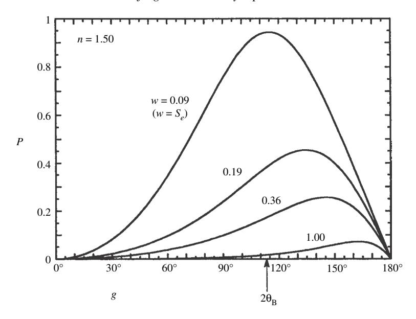

Figure 13.3 Theoretical positive-polarization curves of light scattered by a particulate medium of particles of refractive index n = 1.5 if the only polarized component is the light specularly reflected from the particle surfaces. Curves for several different values of the single-scattering albedo are shown. The angle of emergence is  $e = 60^{\circ}$ .

 $\Delta R$ , which does not peak at  $2\vartheta_B$ , but at much larger phase angles near  $160^\circ$ .  $\Delta R(g)$  is plotted versus g for several values of the refractive index in Figure 13.4.

Thus one or more of the assumptions on which equation (13.12) is based must be incorrect. Let us recall these assumptions: (1) multiply scattered radiance is unpolarized; (2) p(g) is approximately isotropic; (3) radiance transmitted through the particle is unpolarized. These assumptions were tested experimentally by measuring the bidirectional-radiance factors  $\pi r(i, e, g)$  of several size fractions of olivine basalt powders in the principal plane for parallel and perpendicular directions of polarization. Unpolarized light was incident, while i was varied with  $e = 60^{\circ}$ .

Assuming that the surface is macroscopically smooth, equation (13.7) can be written in the form

$$P(i, e, g) = \frac{\frac{1}{2}(1/4\pi)[\mu_0/(\mu_0 + \mu)]w\Delta[p(g)]}{r(i, e, g)},$$

which may be solved for  $w\Delta[p(g)]$ ,

$$w\Delta[p(g)] = 8\frac{\mu_0 + \mu}{\mu_0} \pi r(i, e, g) P(i, e, g).$$
 (13.14)

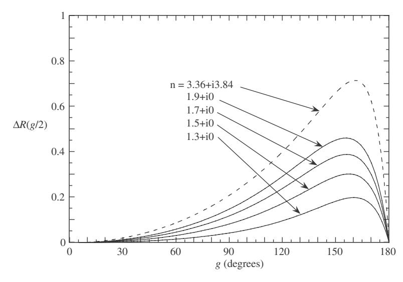

Figure 13.4 Difference between the perpendicular and parallel components of the Fresnel reflection coefficient as a function of phase angle for several values of the refractive index. The dashed curve is for the refractive index of metallic iron at  $\lambda = 0.55 \,\mu\text{m}$ . Calculated from the values of Yolken and Kruger (1965).

The quantity  $w\Delta[p(g)]$  was calculated from (13.14) using the measured values of r and P. The result is plotted in the top of Figure 13.5 along with the Fresnel difference function  $\Delta R(g)$  calculated for  $n_r = 1.7$ , which is representative of the refractive indices of the minerals in the olivine basalt. If all of the above assumptions are valid the data for  $w\Delta[p(g)]$  should be close to the curve of  $\Delta R(g)$ . This is indeed the case when  $g \stackrel{<}{\sim} 80^\circ$ . However, as the phase angle increases, the points of  $w\Delta[p(g)]$  fall below the  $\Delta R(g)$  curve. Shown in the bottom of Figure 13.5 is a similar analysis for lunar soil, which is seen to exhibit the same behavior as the fine basalt powder. Thus  $w\Delta[p(g)] \neq \Delta R(g)$ .

If the doubly scattered radiance is not randomly polarized its polarization is highly likely to be positive, because that of the singly scattered radiance is positive. This would have to be added to  $\Delta R(g)$ , which would increase the discrepancy. Making p(g) highly forward scattering would move  $g_p$  toward smaller angles; however, this would increase r(i,e,g) at large phases, which is a measured quantity and cannot be altered. The only remaining way in which  $g_p$  can be reduced is if the forward-transmitted component of the light is not randomly polarized, but retains some negative polarization, which partially cancels the positively polarized reflection from the surface. This was seen to be the case for large translucent particles studied in the laboratory by McGuire and Hapke (1995) and also for the olivine particle of Figure 6.7b.

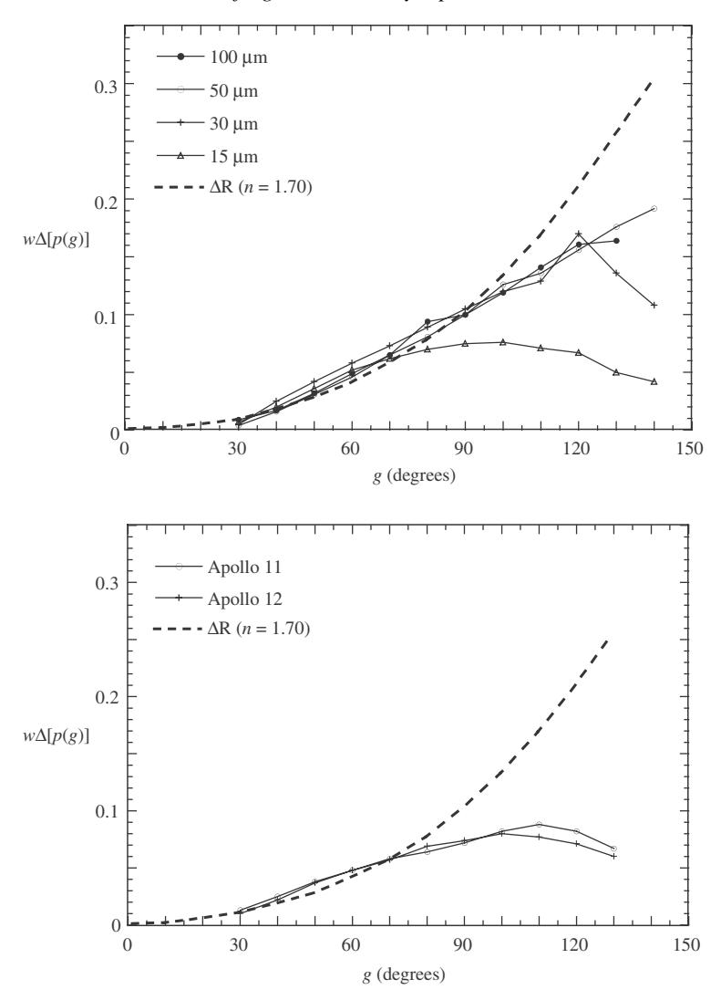

Figure 13.5 Difference between the the perpendicular and parallel components of polarization vs. phase angle measured for several different powders and compared with the difference between the Fresnel reflection coefficients. (Top) Powdered terrestrial olivine basalt of several sizes. (Bottom) *Apollo 11* and *12* soil samples. The dashed curves give #*R(g)* calculated for *n* = 1*.*7.

Additional support for this conclusion comes from observations of the Moon.

According to Dollfus and Bowell [\(1971\)](#page-0-0), *gp* and *Pp* increase as albedo decreases on the lunar surface. This behavior is consistent with the hypothesis that the transmitted light is partially negatively polarized, because brighter areas are more transparent and hence have smaller *Pp* and *gp*.

Vanderbilt *et al.* (1985) have published data on the intensity and polarization of light of several wavelengths reflected from wheat. The spectrum of the reflected radiance exhibits the strong absorption bands of chlorophyll at 0.48 and 0.66  $\mu$ m, but the difference spectrum  $I_{\perp} - I_{\parallel}$  does not. The authors argue correctly from this observation that only specular reflection contributed to  $I_{\perp} - I_{\parallel}$ . However, the largest phase angles in their measurement were about 80°, but the transmitted light is appreciable only at larger phase angles. Alternatively, this vegetation may have too large an optical thickness for the refracted light to have appreciable negative polarization. By contrast, Woessner and Hapke (1987) have measured the polarization of light scattered by clover and concluded that the light transmitted through this vegetation affects  $I_{\perp} - I_{\parallel}$  in a manner similar to that for the silicate materials of Figure 13.5.

It may be concluded that for a medium of nonopaque particles the amplitude and angle of the maximum of the positive branch of polarization is not determined by the Brewster angle, but by the negatively polarized light that is transmitted through the particles in the forward direction, which becomes important for  $g \gtrsim 2\vartheta_C$ . The polarization curves have maxima around  $100^\circ$  because the refracted light is an important component of the scattering for larger phase angles. This component is controlled by particle size and by the internal absorption and scattering coefficients. However, for a completely opaque mineral, only surface reflection contributes to the particle scattering, so that  $P_p$  and  $g_p$  should be close to the values predicted from the Fresnel equations. The differences between the Fresnel coefficients of materials with large imaginary components of refractive index, such as metals, also peak at very large phase angles (Figure 13.4). Thus, a value of  $g_p$  significantly less than  $160^\circ$  is evidence that the regolith particles are translucent, rather than opaque.

#### 13.3.2 The polarization-albedo relation (the Umov effect)

Returning to equation (13.8), for any given values of i, e, and g the denominator increases monotonically with w. In addition, if nonopaque minerals are present, any increase in w due to a decrease in internal absorption will be accompanied by a decrease in the numerator at large phase angles because of the increased, negatively polarized, transmitted light. Both effects will cause the amplitude of the positive branch to decrease as w increases. Hence, there is an inverse relation between the amplitude of the positive branch of the polarization curve and the reflectance. This relation is known as the Umov effect, after the Russian scientist who first observed and explained it (Umov, 1905). The Umov effect is one of those phenomena that keep getting rediscovered from time to time.

The Umov effect is illustrated in Figure 13.1. Before full Moon, the eastern hemisphere, which is dominated by brighter highlands, is illuminated and has a

lower *Pp*, whereas after full Moon, the western hemisphere, whose surface has a large number of dark maria, is illuminated and has a higher *Pp*.

Because of the Umov effect, a form of spectroscopy can be carried out by measuring *P (g)* as a function of ς, which has the advantage of requiring the measurement of only a ratio, rather than of an absolute intensity.

Two measures of reflectance are the normal albedo *An* of a resolved surface area and the physical or geometric albedo *Ap* of the integrated radiance from a body, which is the weighted average of *An*. Thus, the Umov effect implies that there should be an inverse relation between *Pp* and *An* or *Ap*, and this is indeed found to be the case.

Unfortunately, although the Umov effect describes a general trend, there is no unique relation that is valid for all materials. There are several reasons for this. First, equation [\(13.8\)](#page-0-0) shows that *Pp* is determined by *w*, #[*p(g)*], *p(g)*, and the *H* functions at large phase angles, whereas *An* and *Ap* depend on these quantities at *g* = 0. In general, these functions change in different ways in different materials as *w* changes. Second, the negative polarization in the transmitted component can be decreased by increasing the amount of internal scattering in the particles, which randomizes the polarization, but may not affect *w* appreciably. Third, *w* may also be increased either by decreasing the absorption of the transmitted light, which decreases both the numerator and the denominator of [\(13.8\)](#page-0-0), or by increasing the real part of the refractive index, which primarily increases the numerator.

However, homogeneous classes of materials may possess a quasi-unique Umov relation.An example is the lunar regolith, which is relatively homogeneous because it consists of mafic silicate minerals and glasses and is the product of meteorite impacts. Dollfus and Bowell [\(1971\)](#page-0-0) found that areas on the Moon observed telescopically from Earth obey the empirical relation

$$\log A_n = -c_1 \log P_p - c_2, \tag{13.15}$$

where *c*1 ' 0*.*724 and *c*2 ' 1*.*81. This is illustrated in Figure [13.6.](#page-0-0) Other materials, such as certain terrestrial silicate rock powders and pulverized meteorites, obey similar rules, except that the constants have different numerical values. Geake and Dollfus [\(1986](#page-0-0)) have suggested that there is a correlation between *c*2 and particle size, although the generality of such a relation is doubtful.

#### *13.3.3 The slope–albedo relation*

The inverse relation between the amplitude of the positive branch and the albedo also manifests itself in other properties of *P (g)* in the positive region. In particular, KenKnight *et al.* [\(1967](#page-0-0)) and Widorn [\(1967](#page-0-0)) independently pointed out that the slope *hi* = *dP/dg* of the polarization at the inversion angle *gi* is inversely related to

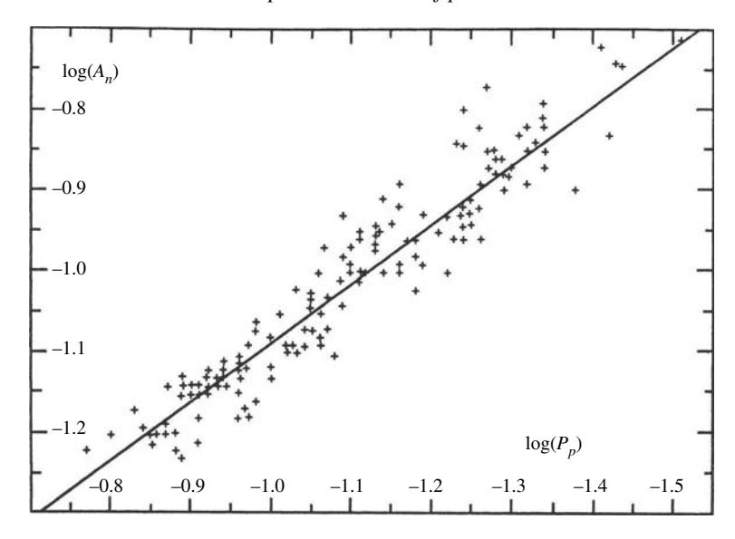

Figure 13.6 Plot of the normal albedo against the maximum polarization for 144 areas on the Moon. The line is the empirical function log*Ap* = −0*.*724log*Pp* − 1*.*81. (Reproduced fom Dollfus and Bowell [\[1971\]](#page-0-0), copyright [1971](#page-0-0) with permission of Springer-Verlag.)

albedo. This relation is shown in Figure [13.7.](#page-0-0) Over a fairly large range of albedos, *hi* and *An* obey the empirical rule

$$\log A_n = -c_3 \log h_i - c_4, \tag{13.16}$$

where *c*3 ' 1*.*00 and *c*4 ' 3*.*77 (Bowell *et al.*, [1973\)](#page-0-0). The physical albedo *Ap* may be substituted for *An* in [\(13.16\)](#page-0-0). However, the curve saturates for *An <* 0*.*04, so that there is not a unique relation between albedo and slope for very dark materials.

The slope–albedo relation appears to be unique for a wider range of materials than the maximum polarization–albedo relation. Probably, the reason is that the numerator of [\(13.8\)](#page-0-0) is less affected by the transmitted, negatively polarized light at phase angles significantly smaller than *gp*, and also the quantities in the denominator of [\(13.8\)](#page-0-0) are closer to their zero phase values at *gi* than at *gp*.

This relation has important applications in the determination of asteroid albedos and diameters. For many asteroids, *gi* is small enough that *hi* can be determined from the Earth, whereas the measurement of *Pp* at *gp* requires a polarimeter on board a spacecraft in the outer solar system. If the albedo of an object can be found from *hi*, its size can be calculated from a measurement of absolute integral brightness, even though the object is too small to be resolved (Zellner *et al.*, [1974;](#page-0-0) Zellner and Gradie, [1976\)](#page-0-0).

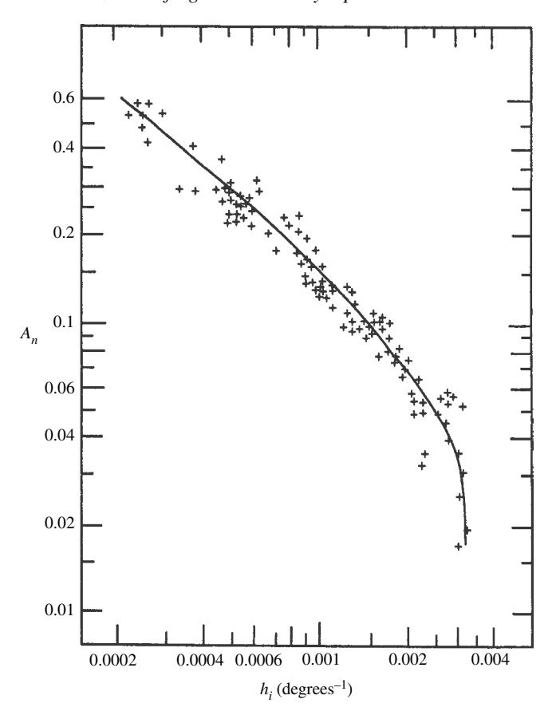

Figure 13.7 Log–log plot of normal albedo against the slope of the polarization phase curve at the inversion angle for 95 samples of lunar soil, pulverized terrestrial rocks, and pulverized meteorites. (Reproduced from Geake and Dollfus [\[1986\]](#page-0-0), copyright [1986](#page-0-0) with permission of the Royal Astronomical Society.)

## **13.4 The negative branch of polarization** *13.4.1 Introduction*

The negative branch of the polarization phase curve is one of the enigmas of planetary remote sensing. In spite of the fact that it has been known since the 1920s, it has defied repeated attempts to account for it quantitatively. Yet virtually all pulverized materials display negative polarization at small phase angles, and the strength of the negative branch increases as the particle size decreases. Indeed, the observation by Lyot of a well-developed negative branch of polarization in light reflected from the Moon was one of the earliest indications that the lunar surface was covered with a fine-grained regolith.

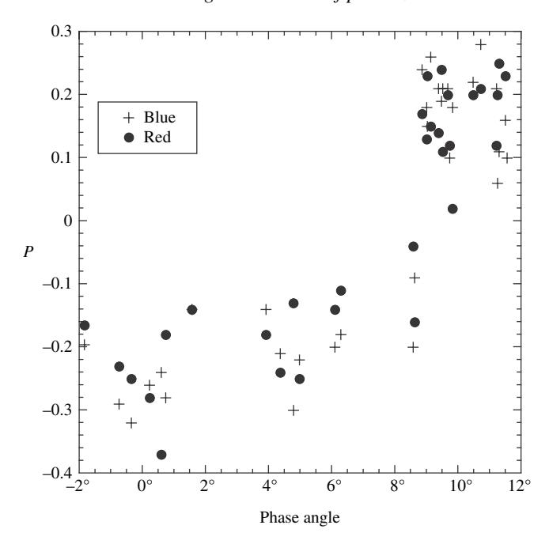

Figure 13.8 Polarization phase curve of Europa in red (crosses) and blue (circles) wavelengths. (Data from Rosenbush *et al.* [\[1997\]](#page-0-0) and Rosenbush and Kiselev [\[2005\]](#page-0-0).)

The negative branch is bimodal in some materials, with a narrow negative peak at a phase angle around 1◦ and only 1◦ or 2◦ wide, called the *polarization opposition effect* (POE), and a *broad negative polarization* (BNP) peak centered at a larger phase angle and 10◦ or 20◦ wide. Lyot [\(1929\)](#page-0-0) first observed what is, in retrospect, believed to be a POE peak in MgO smoke deposited on a plate. The negative polarization in most of the materials studied by Lyot were BNP peaks. However, he did not distinguish between the two. The first unambiguous observations of a bimodal negative branch were by Rosenbush *et al.* [\(1997\)](#page-0-0) in the Galilean satellites of Jupiter (Figure [13.8\)](#page-0-0). The two peaks are illustrated in Figure [13.9](#page-0-0) for 17-µm SiC abrasive powder.

It is not clear whether or not all negative polarization branches are, in fact, bimodal. The POE peak may actually be present in material for which it appears to be missing, but be so weak that it is hidden in the broad peak, or it may be missed because of low angular resolution of the measurements. The latter appears to be the case for the Moon which, paradoxically, is one of the most intensely studied objects in the universe. A separate POE peak has never been reported in light reflected from the Moon. However, high-angular-resolution laboratory measurements of lunar soil appear to show two distinct peaks (Figure [13.10\)](#page-0-0). There are several reasons why a

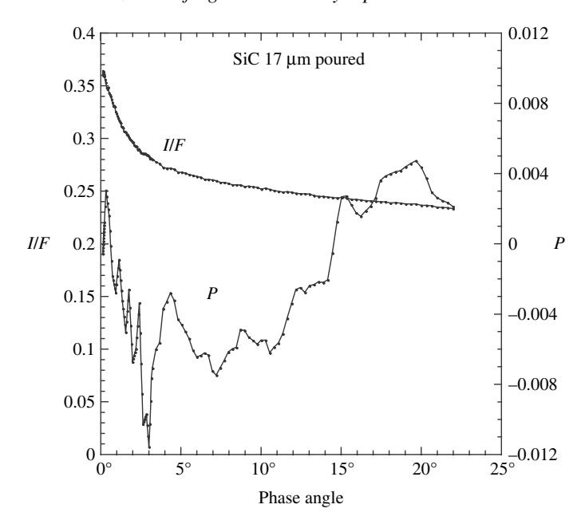

Figure 13.9 Intensity and polarization vs. phase angle for  $17-\mu m$  SiC abrasive powder showing the coherent backscatter opposition effect, the narrow polarization opposition effect, and the broad negative branch of polarization. The linear decrease in intensity at larger phase angles is probably part of the unresolved shadow-hiding peak.

lunar POE might have been missed. The source of illumination of the lunar surface is the Sun, which has an angular diameter of  $1/2^{\circ}$  at the Moon; thus all lunar phase curves are averaged over  $1/2^{\circ}$ . Most full Moons occur at phase angles larger than  $1^{\circ}$ , and the Moon enters the Earth's shadow at phase angles smaller thatn  $1^{\circ}$ . Hence, the Moon only enters the POE region infrequently, and when it does most of the peak is obscured. Finally, observations of lunar polarizations typically are spaced at about  $1^{\circ}$  intervals.

#### 13.4.2 The polarization opposition effect (POE)

The POE peak is caused by the same phenomenon as the coherent backscatter opposition effect and can be qualitatively explained as a coherent effect. The mechanism was first proposed independently by Shkuratov (1989) and Muinonen (1990). The coherent-backscatter phenomenon is discussed in detail in Chapter 9. Portions of the incident wave that are multiply reflected between scatterers over the same path, but in opposite directions, combine coherently upon emerging from the medium to produce a peak of increased intensity by constructive interference.

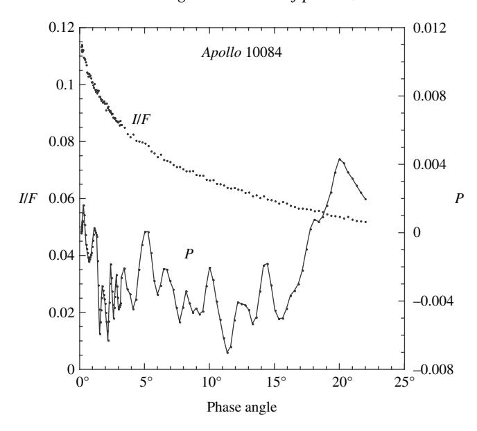

Figure 13.10 Intensity and polarization versus phase angle for *Apollo* lunar soil sample 10084 showing the POE, BNP, CBOE, and probably part of the SHOE.

Shkuratov [\(1989\)](#page-0-0) and Muinonen [\(1990\)](#page-0-0) pointed out that this phenomenon is inherently anisotropic in such a way as to emphasize the portions of the wave scattered transversely, perpendicular to the scattering plane. Muinonen [\(1990\)](#page-0-0) calculated the polarization from double scatterings between Rayleigh particles (dipoles) of varying separations and position. Shkuratov [\(1989\)](#page-0-0) calculated the polarization from double scatterings between particles larger than the wavelength, so that most of the light scattered into the CBOE was by Fresnel reflection from the particle surfaces. Mishchenko *et al.* [\(2000\)](#page-0-0) calculated the variation of polarization with phase angle of a medium of Rayleigh scatterers using an exact vector solution of the equation of radiative transfer and was able to fit Lyot's measurements of MgO powder.

The process is illustrated schematically in Figure [13.11.](#page-0-0) Plane C–2–3–D is the scattering plane. The portions of the incident wave that are transversely scattered perpendicular to the scattering plane along paths A–1–2–A\* and B–2–1–B\* are in phase for any value of *g*. As discussed in Chapter [9,](#page-0-0) the intermediate scatterings that contribute the most to the CBOE take place around angles not too different from 90◦. At these angles the coefficients for both Rayleigh scattering and Fresnel reflection for the waves with their electric vectors perpendicular to the plane A–1–2–B are larger than for the electric vectors parallel to this plane. Portions of the wave longitudinally scattered parallel to the scattering plane along paths C–2–3–C\*

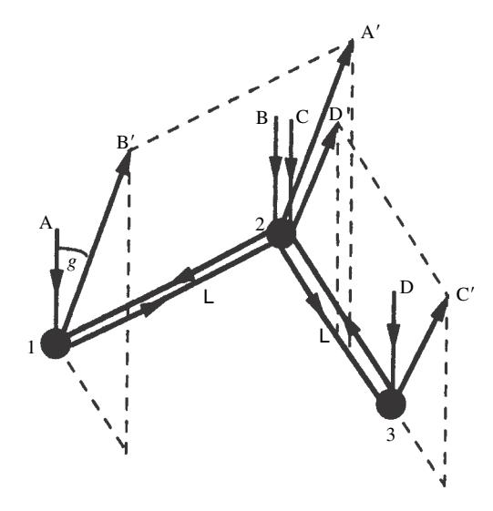

Figure 13.11 Schematic diagram of the Shkuratov–Muinonen coherent doublescattering model of the POE peak.

and D–3–2–D\* are in phase only at *g* = 0 and will be out of phase if *g* ! ς*/*2ζ*L*, where *L* is the separation of the scatterers. However, the reflection coefficients for the waves with their electric vectors perpendicular to the plane C–2–3–D are larger than for the electric vectors parallel to this plane. Hence, the intensity of the negatively polarized, transverse, doubly scattered wave is roughly twice that of the positively polarized, longitudinal, doubly scattered wave, except at phase angles close to zero. This produces a negative POE peak close to zero phase with a similar angular width as the CBOE.

While there is no doubt that the POE peak is a coherent phenomenon, present theories suffer from the same problems as the CBOE. These predict that the POE peak should be wide enough to be observable only when the particles of the medium are around a wavelength in size, They also predict a strong dependence on wavelength, particle size, and spacing. None of these been consistently reported (e.g., Figure [13.8;](#page-0-0) see also Shkuratov *et al.*, [2002](#page-0-0)).

#### *13.4.3 The broad negative polarization (BNP) branch*

By contrast with the POE peak, which is at least qualitatively understood, there is no agreement on the cause of the BNP peak. After the POE model was proposed it was thought that this might account for the entire negative branch. However, with the discovery of a separate POE peak this explanation became inadequate. The BNP peak is in the same general location as the shadow-hiding opposition effect.

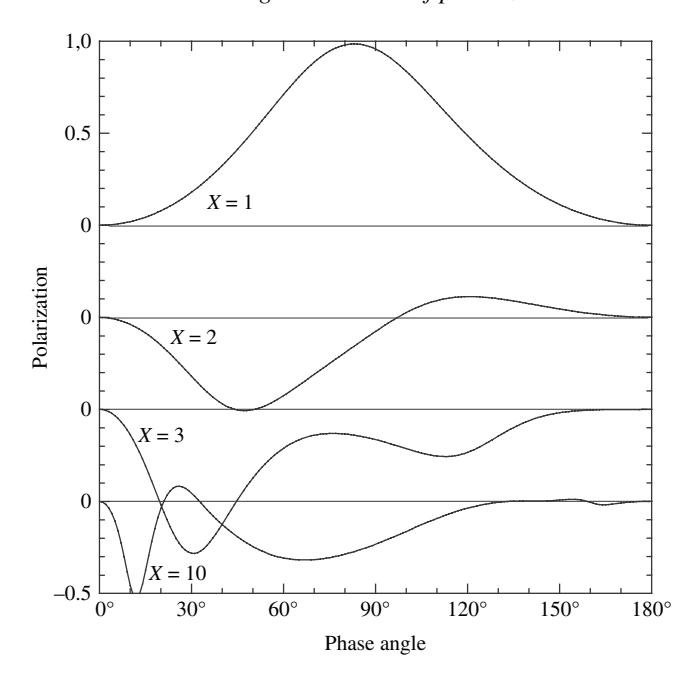

Figure 13.12 Theoretical polarization phase curves for different sized spheres with *n* = 1*.*50+*i*0, showing a BNP-like negative polarization feature.

Whether or not this is a coincidence is unknown, It may be that there are several causes, with the nature of the media determining which cause dominates.

It has long been known that spherical particles somewhat larger than the wavelength have a negative polarization peak at small phase angles (Figure [13.12\)](#page-0-0) whose angular width decreases with increasing size relative to the wavelength. Muinonen *et al.* [\(2007](#page-0-0)) studied scattering by spherical and nonspherical particles using the DDA method (Chapter [6\)](#page-0-0) and concluded that this peak is caused by coherent interference between different parts of the same particle. They also found that negative polarization can be caused by wavelength-scale roughness on the surface of a larger particle. They suggested that this is the cause of the BNP peak.

This hypothesis is attractive because it explains why the negative branch is particularly well developed for media of small particles. The difficulty with it is that, since the peak is an interference phenomenon, its width is strongly dependent on wavelength and particle size. However, Dollfus and Bowell [\(1971](#page-0-0)) measured the polarization of a large number of regions on the Moon at several wavelengths between 0.33 and 1*.*05µm. Over this interval, in which the wavelength varied by a factor of 3, there was no change in the negative branch. Although media of small particles generally have stronger BNP peaks, media of large particles also display them.

Furthermore, while single-particle scattering may contribute to the negative branch, it cannot be the entire cause. Several observations indicate that multiple scattering is a major contributor to the negative branch:

- (1) Dollfus [\(1956](#page-0-0); see also Bowell and Zellner, [1974](#page-0-0) and Dollfus *et al.*, [1989\)](#page-0-0) described experiments in which carbon particles rising in the smoke above a flame did not display negative polarization. However, when those particles were collected into a thick coating on a plate, they had a negative branch.
- (2) Similarly, when Dollfus [\(1956](#page-0-0)) allowed a stream of well-separated sand grains to fall in front of a polarimeter, there was no negative polarization, but a thick layer of the same grains had a negative branch.
- (3) In a particularly revealing experiment, Geake *et al*. [\(1984\)](#page-0-0) placed a single layer of glass particles on a surface of black silicone putty. As shown in Figure [13.13,](#page-0-0) the layer exhibited negative polarization. The particles were then pushed down into the putty until their tops were nearly flush with the putty. The negative polarization disappeared. The only notable difference between the two media

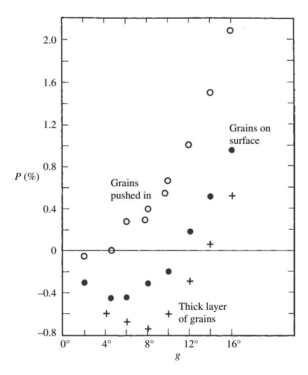

Figure 13.13 Polarization phase curves for powdered glass on silicone putty. Open circles, glass grains resting on surface of putty; filled circles, grains pushed into surface; crosses, thick layer of glass powder. (Reproduced from Geake *et al.*[\[1984\]](#page-0-0), copyright [1984](#page-0-0) with permission of the Royal Astronomical Society.)

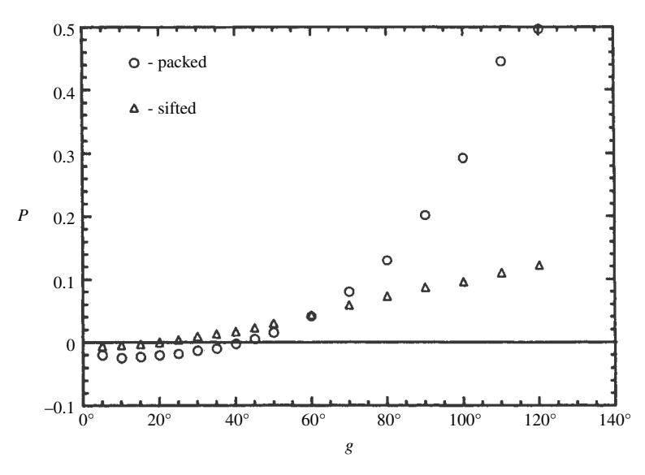

Figure 13.14 Polarization phase curves of SiC powder about 15 µm in size, showing the effect of porosity.

was that pushing the particles into the clay had the effect of separating them with an opaque layer and preventing double scatterings.

(4) The amplitude of the negative branch depends strongly on the filling factor in a particulate medium, in the sense that a more closely packed powder has a stronger negative polarization. This is illustrated in Figure [13.14.](#page-0-0) A commercial silicon carbide abrasive powder with particles about 15µm in size was sedimented in acetone, which was then allowed to evaporate. The sediment had a strong negative branch. Microscopic examination showed that the grains in the sediment were closely packed. However, when the particles were sifted into a low-density deposit, the negative polarization was much weaker. Shkuratov *et al.* [\(2002\)](#page-0-0) reported similar results.

The experiment with the silicon carbide abrasive indicated not only that the efficacy of the mechanism that produces the negative polarization is increased by placing the particles closer together but also that close packing increases the positive polarization dramatically, probably because the light transmitted through the particle is more readily blocked as the filling factor increases.

A possible mechanism for producing the broad negative branch is that the negatively polarized light transmitted through one particle in the forward direction is reflected off another in the backward direction to produce negative polarization at small phase angles. However, although the light forward-refracted through a

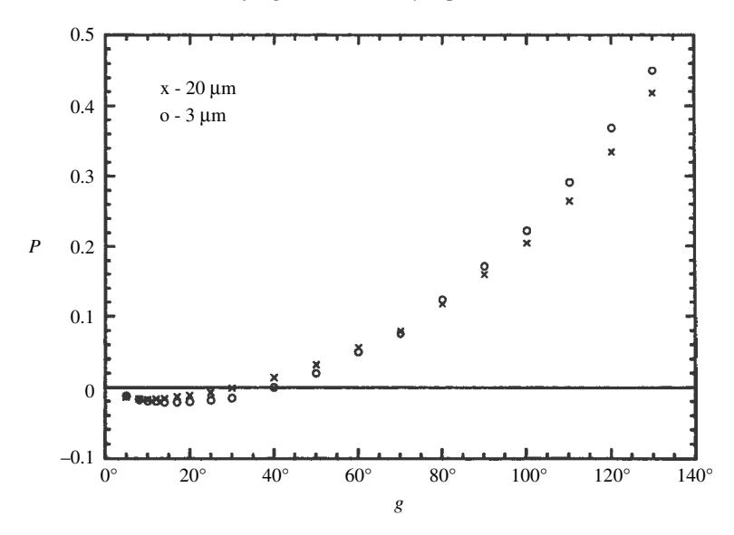

Figure 13.15 Polarization phase curve for two powders of metallic iron spheres about 20µm (crosses) and 3µm (circles) in size. Note that the smaller particles have larger negative polarization.

transparent particle is negatively polarized, transparency is not required. Powders of highly opaque materials, such as metals, display negative polarization (Figure [13.15;](#page-0-0) see also Shkuratov *et al.*, [2002](#page-0-0)).

One of the earliest explanations offered for the negative polarization, and the one that underlies many of the models proposed to explain it, is due to Ohman [\(1955](#page-0-0)). Ohman pointed out that double specular reflection, in which the intermediate path is perpendicular to the scattering plane, would generate negative polarization. This is illustrated schematically in Figure [13.16.](#page-0-0) The Fresnel coefficient for ray S-1- A, which is reflected from the surface of particle 1, is larger for the component with its electric vector perpendicular to the scattering plane, and so is positively polarized. However, for the doubly reflected ray S-1-2-B, which reflects at nearly right angles from particles 1 and 2, there is an intermediate scattering plane that is perpendicular to the main scattering plane. Hence, for the doubly scattered ray there are two Fresnel reflections, each of which produces light that is preferentially polarized parallel to the main scattering plane.

That the Ohman mechanism can produce negative polarization is verified by Figure [13.17,](#page-0-0) which shows the polarization in the light scattered by two large copper spheres just touching each other and resting on black velvet. When the line between the centers of the spheres is parallel to the scattering plane there is only a small amount of negative polarization. Strong negative polarization was observed when

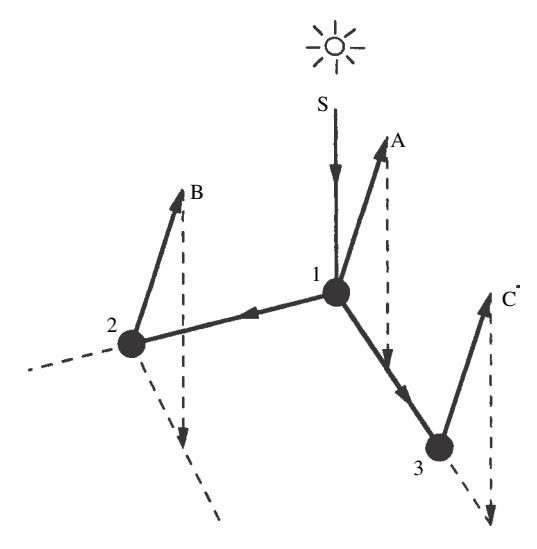

Figure 13.16 Schematic diagram of the Ohman incoherent double-scattering model of the BNP peak.

the line between the centers was perpendicular to the plane and sideways reflections could occur. A single sphere produced no negative polarization. (However, it is of interest to note that even the parallel configuration produced weak negative polarization.)

The difficulty with applying the Ohman mechanism to particulate media concerns the statistical azimuthal symmetry of the positions of the particles. Longitudinal scatterings such as S-1–3-C in Figure [13.16,](#page-0-0) in which all rays are parallel to the scattering plane, and for which the net polarization is positive, should be just as frequent as transverse scatterings, such as S-1–2-B. Quantitative calculations show that the polarizations caused by the longitudinal and transverse scatterings cancel each other to a high degree, leaving only the small net positive polarization due to single scatterings.

Most Ohman-type models to produce the BNP peak rely on some hypothesized geometric property of the surface to block the light from one of the longitudinal scatterings. Because of the coincidence in location with the SHOE intensity peak many persons have investigated shadows. Alternately, the surface may assumed to be covered with vertical-walled pits or cracks lined with particles (e.g., Wolff, [1975,](#page-0-0) [1980,](#page-0-0) [1981;](#page-0-0) Steigman, [1978;](#page-0-0) Bandermann *et al.*, [1972;](#page-0-0) Shkuratov [1982](#page-0-0); Kolokolova, [1985,](#page-0-0) [1990\)](#page-0-0). When such a pit is viewed from any direction other than vertical, the side closest to the detector is not visible, so that the light scattered from that surface element does not contribute to the polarization.

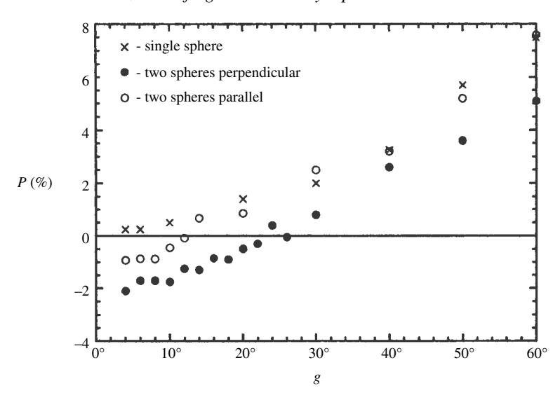

Figure 13.17 Polarization phase curves for a single copper sphere approximately 5 mm in diameter (crosses), for two copper spheres with the line perpendicular to the scattering plane (filled circles), and for two copper spheres with the line joining their centers parallel to the scattering plane (open circles).

The Wolff model is a detailed example of these types of models and is a numerical calculation in the form of a fortran computer program. It consists of semiempirical functions containing several parameters that, if properly chosen, can indeed describe the intensity and polarization quite well. The surface is assumed to be covered with pits, and scattering from each wall of a pit is assigned an empirical blocking function. One of the longitudinal scatterings is assigned a larger blocking function than any of the transverse scatterings, thus producing negative polarization. However, the basis for the choice of the values of the various parameters is obscure, and the Wolff model has not been widely accepted.

The difficulty with models involving pits is that pits do not seem to be necessary to cause negative polarization. Microscopic examination showed that the surface of the sedimented silicon carbide powder shown in Figure [13.14](#page-0-0) was quite smooth. Geake *et al.* [\(1984](#page-0-0)) measured the polarization from pits in black silicone putty that had been covered with a layer of glass particles. To be sure, the glass-lined pits produced negative polarization, but so did a simple layer without pits.

Some authors have assumed that the interstices between particles would act as pits. However, this is unconvincing. Negative polarization is observed from layers of particles that are equant, convex, and gently rounded in shape. There is a vast difference between the side of such a particle and the sharp vertical wall of a pit. No models that involve pits appear to be adequate to account for the negative polarization from general particulate media. However, negative polarization is observed in light scattered from some samples of volcanic foam and scoria, and the pit models may be appropriate for this type of material.

A different type of mechanism was proposed by Hopfield [\(1966\)](#page-0-0), who pointed out that the light diffracted past a straight edge is partially polarized with the electric vector parallel to the edge. Hopfield considered a particle of square cross section above a diffusely scattering substrate. If viewed from any angle other than zero phase, a shadow is visible under that edge which is nearest the detector and oriented perpendicular to the scattering plane. The light diffracted from this edge is reduced in intensity, because it comes from the shadow. However, Zellner (Geake *et al.*, [1984\)](#page-0-0) quoted some unpublished experiments he conducted with K. Lumme showing that the negative polarization produced by this mechanism was far too weak to explain the negative branch.

Videen *et al.* [\(2003\)](#page-0-0) found that coherence is able to provide the necessary asymmetry for the Ohman mechanism. They carried out second-order numerical modeling of a cloud of specular reflectors. When the coherent interference between two parts of the incident wave that traverses the same path in opposite directions

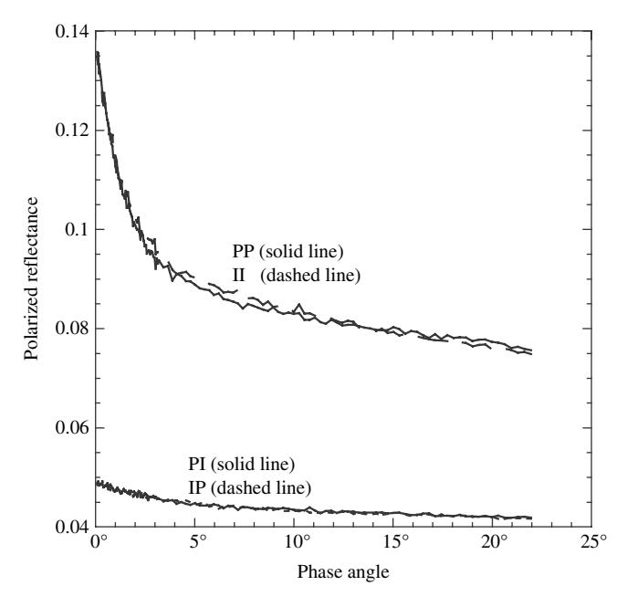

Figure 13.18 Individual components of the reflectance of poured 17-µm SiC powder when linearly polarized light is incident and measured. See text for definitions of the labels on the curves.

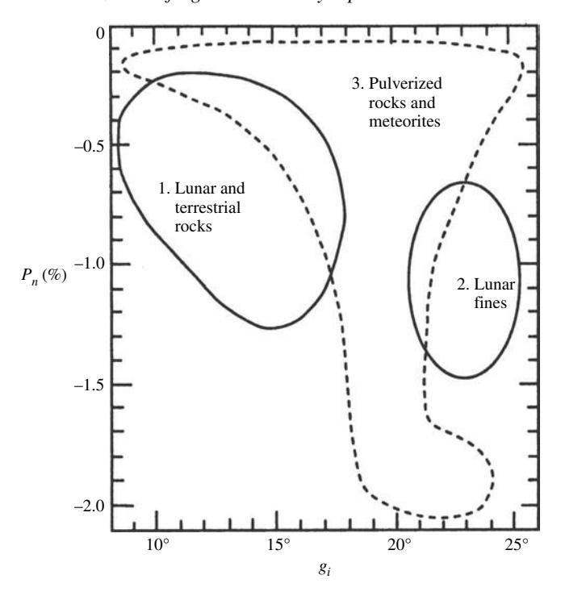

Figure 13.19 Plot of the BNP polarization minimum  $P_n$  against the inversion angle  $g_i$  showing the three fields. (Reproduced from Geake and Dollfus [1986], copyright 1986 with permission of the Royal Astronomical Society.)

was included in the model a broad negative polarization peak was produced, However, as with other models that invoke coherence, the BNP peak is predicted to depend on wavelength, which is contrary to observations.

Videen *et al.* were able to produce a POE peak in addition to the BNP peak when their media contained particles the size of a wavelength or smaller. This result, together with the success of Mishchenko *et al.* (2000) of fitting their Rayleigh scattering theoretical model to Lyot's POE of a MgO smoke deposit has led most workers to assert that the POE is caused by wavelength-sized scatterers. However, the POE peak in 17- $\mu$ m SiC powder (Figure 13.9) with size parameter X=85 shows that small particles are not required.

A possible clue to the origin of the BNP peak is illustrated in Figure 13.18, which shows the reflectances versus phase angle of 17- $\mu$ m poured SiC powder illuminated by light polarized perpendicular to and parallel to the scattering plane and measured in the two directions of polarization. The reflectances are denoted by two letters: either P (perpendicular to the scattering plane) and I (in or parallel to the scattering plane). The first letter is the direction of polarization of the incident light and the

second is that in which the reflectance was measured. Then

$$P = \frac{PP + IP - II - PI}{PP + IP + II + PI}.$$

Figure [13.18](#page-0-0) shows that the cross-polarized components PI and IP are indistinguishable.

Hence, effectively,

$$P = \frac{PP - II}{PP + IP + II + PI}$$

However, the copolarized reflectance II when the incident and scattered light are polarized in the scattering plane is slightly larger than the copolarized reflectance PP when the incident and scattered light are perpendicular to the scattering plane. Why this difference arises is unclear.

In spite of the lack of theoretical understanding, Dollfus and his co-workers (Geake and Dollfus, [1986;](#page-0-0) Dollfus *et al.*, [1989](#page-0-0)) have discovered a number of empirical relations between the size of the broad negative branch of polarization and the properties of various particulate media. These relations are summarized in Figure [13.19,](#page-0-0) which is a plot of the amplitude of the polarization minimum *Pn* versus *gi*, the inversion angle. There appear to be three regions, which are labeled 1, 2, and 3 in Figure [13.19.](#page-0-0) Coarse chunks of terrestrial and lunar rocks fall in region 1, and finely pulverized terrestrial volcanic rocks and meteorites lie in region 3. Lunar soil occupies region 2. Most asteroids fall in region 3, implying that these bodies are covered with a fine-grained regolith. However, until both peaks of the negative branch of the polarization phase curve are better understood, the general applicability of these types of empirical relations remains uncertain.

#### **13.5 Summary**

The following is a summary of our current understanding of polarization and the implications for the interpretation of remote polarization measurements of planetary regoliths.

- The positive branch is reasonably well understood. For materials that are sufficiently dark that multiple scattering makes only a minor contribution, the polarization in the positive branch is similar to the volume-averaged polarization of a single particle of the medium. The maximum polarization decreases as the albedo increases (Umov effect) and is a crude measure of albedo. The phase angle of the maximum does not occur at the Brewster angle and cannot be used to measure *nr*.
- The slope of the polarization at which the inversion occurs is linearly proportional to the albedo and can be used to estimate the albedo.

- The polarization opposition effect is qualitatively understood. It apparently is caused by coherent backscattering and is predicted by theories of the CBOE. However, like the CBOE, the predicted dependence on wavelength and porosity is not observed, either in the laboratory or in solar system objects, implying that our understanding of the phenomenon is incomplete.
- The broad negative branch of polarization is not understood at all, and a wide variety of explanations have been proposed, none of which are generally accepted. It is in the same angular region as the SHOE, but attempts to model it as a shadowhiding phenomenon have not met with success. It arises from a small difference between the two copolarized components of reflectance, but what causes this difference is unknown. However, the BNP is wider and deeper when the particles of the medium are not too much larger than the wavelength.