## **14**

### Reflectance spectroscopy

#### **14.1 Introduction**

One of the objectives of studying a planet by reflectance is to infer various properties of the surface by inverting a set of remote measurements. In the laboratory, the objective of a reflectance measurement is usually to determine the spectral absorption coefficient of the material, or at least some quantity proportional to it, by inversion of the spectral reflectance.

For several reasons reflectance spectroscopy is a powerful technique for measuring the characteristic absorption spectrum of a particulate material. The dynamic range of the measurement is extremely large. Multiple scattering amplifies the contrast within weak absorption bands in the light transmitted through the particles, while strong bands can be detected by anomalous dispersion in the radiation reflected from the particle surfaces. Hence, the measurement of a single spectrum can give information on the spectral absorption coefficient over a range of several orders of magnitude in α. This is especially true for the range *ni* = 10!3 ! 10!1, where both transmission and reflection techniques are difficult. Another advantage of reflectance methods is that sample preparation is convenient and simply requires grinding the material to the desired degree of fineness and sieving it to constrain the particle size. By contrast, if α*(*ζ*)* is measured by transmission, the sample must be sliced into a thin section that must then be polished on both sides, and the range by which α*(*ζ*)* can vary is not much more than about one order of magnitude.

The characteristics of a medium that can be measured directly by reflectance are those that occur in the expression for the bidirectional reflectance, equations [\(9.47\)](#page--1-0) and [\(12.63\)](#page--1-0), and are of two types: those that describe the average scattering properties of single particles, *w* and *p(g)*; and those that describe the physical structure of the surface *K*, θ, and the opposition-effect parameters. In this chapter we will discuss these quantities and the methods for inverting the reflectance data to estimate them.

Because the reflectance equations are nonlinear the relation between the absorption coefficient and the reflectance is not trivial. This relation will be discussed in detail, especially the shapes of absorption bands when seen in reflectance. The effects of layers on band contrast will also be considered. Spectral information is carried primarily by the volume-average single-scattering albedo. Hence, the first step in finding the spectral absorption coefficient α is to retrieve *w* from the reflectance. The next step is to use an appropriate relation to find α from *w*, and ways of doing this will be discussed. A few alternate methods, including the widely used Kubelka–Munk model, will also be discussed, along with some special cases of interest in planetary spectroscopy.

#### **14.2 Measurement of reflectances**

In this section we shall briefly describe the methods by which the various types of reflectances and albedos described in Chapters [8–11](#page--1-0) can be measured. In order to find the reflectance, both the scattered radiance and the incident intensity must be measured. This can be done by measuring the radiance scattered from the surface and then rotating the detector to measure the incident irradiance. However, under many experimental conditions this is inconvenient or even impossible. Hence, a common procedure is to calibrate the incident light by measuring the intensity reflected from a standard material of known scattering properties. Then the reflectance is given by

$$r(\text{sample}) = \frac{I(\text{sample})}{I(\text{standard})} r(\text{standard}). \tag{14.1}$$

Usually the standard is measured at *i*, *e*, and *g* close to 0◦, but outside the opposition surge.

Desirable properties of a standard are that it be highly reflecting with no absorption bands in the spectral region of interest, and stable with time. Standards in wide use in the near-UV/visible/near-IR region of the spectrum include finely ground MgO (Middleton and Sanders, [1951](#page--1-0)), BaSO4 (Grum and Luckey, [1968](#page--1-0)), and polytetrafluoroethylene (PTFE) (Weidner and Hsia, [1981;](#page--1-0) Weidner *et al.*, [1985](#page--1-0); Fairchild and Daoust, [1988](#page--1-0)). The latter compound is available under the trade name Halon (Allied Chemical Co.). One of the most widely used standards consists of pressed PTFE and is sold under the trade name Spectralon, available from the Labsphere Co. It has a calibrated hemispherical albedo of 0.992 in the near-UV/visible/near-IRwavelengthregion.Dependingonthewavelength,materialsused as standards in the IR include sulfur, gold, and KBr (Nash, [1986](#page--1-0); Salisbury *et al.*, [1987\)](#page--1-0).

The *bidirectional reflectance* can be measured by illuminating a material with light from a source of small angular aperture, as seen from the surface, and observing the scattered radiance with a detector that also subtends a small angle from the surface. To adequately constrain the scattering parameters, it is desirable that the reflectance be measured at many values of *i*, *e*, and *g*. However, frequently it is measured at only one fixed set of angles, in which case the values of the parameters cannot be uniquely determined.

The *hemispherical reflectance* (*directional–hemispherical reflectance*) is measured using an integrating sphere. This device consists of a hollow cavity whose inner walls are covered with a highly reflective, diffusely scattering paint, perforated by two small openings, or ports, one for admitting the incident irradiance and another for observing the radiance inside the sphere. The material whose reflectance is being measured is placed inside the sphere, where it is illuminated by collimated light. The scattered radiance is sampled by a detector that views the inside of the sphere, but not the material directly. For accurate values, the measurements must be corrected for losses out of the ports (Hisdal, [1965;](#page-0-0) Kortum, [1969](#page-0-0)).

The *hemispherical–directional reflectance* of a material can be measured using an integrating sphere operating in the reverse direction from that used to measure the directional–hemispherical reflectance. That is, light from the source does not illuminate the material directly, but only after multiple diffuse scatterings inside the sphere. The radiance scattered into a specific direction by the sample is viewed directly by a detector of small angular aperture.

The *bihemispherical reflectance* or *spherical reflectance* of a material can, in principle, be measured by covering an opaque sphere (actually, a hemisphere is sufficient) with an optically thick coating of the sample and placing it at the center of an integrating sphere. One side of the sphere is illuminated by collimated light, and the radiance that is scattered in all directions is measured by a detector that does not view the target directly. It was shown in Section 11.C.7 that the bihemispherical reflectance of a flat surface illuminated by a uniform flux from an entire hemisphere is equal to the spherical albedo of a sphere illuminated by collimated irradiance from one direction. I am not aware of any published values of bihemispherical reflectances that have actually been measured in this way in the laboratory. However, Bond or spherical albedos are routinely determined for planets, satellites, and other bodies of the solar system.

The *diffusive reflectance* should not be confused with the bihemispherical reflectance. The diffusive reflectance is strictly a useful mathematical artifice with no direct physical meaning and thus cannot be measured. The Kubelka–Munk reflectance (Section [14.8\)](#page-0-0) is a special case of the diffusive reflectance and similarly cannot be measured.

The *physical albedo* or *geometric albedo* of a body of the solar system can, in principle, be determined by measuring its brightness at zero phase angle. Usually the intensity is calibrated by observing comparison stars of known brightness. Using the intensity of sunlight, which is also assumed to be known, the radiance that would be detected if the body were replaced by a perfectly diffusing (Lambert) disk of the same radius can be calculated. The physical albedo is the ratio of the brightness of the body to that of the disk.

Unfortunately, orbits and trajectories of both natural bodies and artificial spacecraft are such that few bodies are ever observed exactly at zero phase angle. Hence, the brightness of an object must be measured at other phase angles and extrapolated to zero phase. The opposition effect complicates the extrapolation, and several conventions for carrying it out are in use. One convention is based on the fact that if the brightness *I* of a body as a function of phase angle is plotted on a logarithmic scale, such as astronomical magnitude *m*,

$$m = -2.5\log_{10}(I/I_r),$$

where *Ir* is some reference brightness, the data very nearly fall on a straight line over a limited range of phase angles. The opposition brightness is determined by extrapolating to zero phase. Some workers ignore the opposition effect, whereas others include it by using either a linear extrapolation of small-phase-angle data on a semilogarithmic plot or fitting a theoretical equation to the data. When it is necessary to use a physical albedo, the convention by which it was calculated should be ascertained.

The *spherical albedo* or *Bond albedo* is determined by measuring the integrated brightness of a body at a large number of phase angles and numerically calculating the phase integral and physical albedo. The spherical albedo is then calculated using equation [\(11.48\)](#page-0-0).

The *normal albedo* of an area on the surface of a body is determined in the same way as the physical albedo. The brightness is measured at several phase angles to yield the photometric function of the surface, which is then extrapolated to zero phase angle, and the normal albedo is calculated.

### **14.3 Inverting the reflectance to find the scattering parameters** *14.3.1 Numerical inversion methods*

If a large enough data set is available, the reflectance can, in principle, be inverted to find all of the parameters in the reflectance function. A major difficulty is that the parameters enter the function nonlinearly. Frequently a data set will consist of measurements of the bidirectional reflectance of a surface or the integral phase function of a planet at a much larger number of angles than the total number of parameters in the relevant expression for the reflectance. In this case the problem of finding the parameters is overdetermined. The general theory of finding parameters in an overdetermined problem is called *regression analysis* and is an important area in applied mathematics.

The most common method of parameter fitting is to compare the calculated and measured reflectances while varying the parameters according to some scheme until the best agreement is obtained. The usual criterion for finding the best fit of a theoretical reflectance model to an overdetermined data set is to minimize the root-mean-square (rms) residual between the calculated and measured data points

$$\varepsilon_{\rm rms} = \left[ \frac{\sum_{j=1}^{N} (I_{dj} - I_{cj})^2}{\mathcal{N} - 1} \right]^{1/2},$$
(14.2a)

where  $I_{dj}$  is the intensity of the jth measured data point,  $I_{cj}$  is the intensity calculated for that geometry using the appropriate equation, and  $\mathcal{N}$  is the number of points. (The denominator is usually taken as  $\mathcal{N}-1$  rather than  $\mathcal{N}$  because if there is only one data point then  $\varepsilon_{\rm rms}$  is meaningless.) However, certain parameters are most strongly influenced by the angles at which the reflectance is small. Hence, in finding the best fit, it is important that points of low intensity be given the same weight as points of high intensity. This can be done by using either relative or logarithmic residuals, rather than linear residuals. That is, the preferred procedure is to define  $\varepsilon_{\rm rms}$  either as

$$\varepsilon_{\rm rms} = \left[ \frac{\sum_{j=1}^{N} \frac{(I_{dj} - I_{cj})^2}{I_{dj}}}{N - 1} \right]^{1/2}$$
 (14.2b)

or

$$\varepsilon_{\text{rms}} = \left\lceil \frac{\sum_{j=1}^{N} (\log I_{cj} - \log I_{dj})^2}{N-1} \right\rceil^{1/2}$$
(14.2c)

In planetary photometry the intensity is frequently given in astronomical magnitudes, which is a logarithmic scale, so that equation (14.2c) is an appropriate form.

When the single-particle angular-scattering function p(g) is found by fitting equation (9.47), or one of the expressions derived from it, to the data, an important caveat must be kept in mind. In equation (9.47) all of the effects of particle anisotropy have been placed in the single-scattering term, whereas in a rigorous formulation the multiple-scattering term also exhibits some of the effects. Hence, when

a data set is inverted, the calculated *p(g)* overestimates the anisotropy (Figure [8.9\)](#page-0-0). A few inversion methods will now be discussed.

**The trial-and-error method** This method can be used on a personal computer with a plotting program. The data points and the appropriate equation with trial parameters are entered into the plotting routine, and a trial curve is generated. Of all the parameters in the equation of radiative transfer, the reflectance is dominated by the single-scattering albedo *w(*ζ*)* or, equivalently, the albedo factor Ψ *(*ζ*)* (Hapke *et al.*, [1981](#page-0-0); Helfenstein and Veverka, [1989\)](#page-0-0). This parameter determines both the amplitude of the reflectance and its general variation with angle, while *p(g)* essentially fine-tunes the angular dependence of the reflectance. The opposition effect is important only at small phase angles, the macroscopic roughness parameter has the greatest effect at large phase angles. Hence, with a little practice, the effect of changing each parameter becomes intuitive, and satisfactory fits can be found rapidly. This method was used by Hapke and Wells [\(1981](#page-0-0)), by Domingue and Hapke [\(1989](#page-0-0)), and by Domingue *et al.* [\(1991](#page-0-0)).

**Automated computer fitting routines** The rms residual can be regarded as a surface in a multidimensional space in which εrms is one coordinate and the reflectance parameters are the other coordinates. Mathematically, the objective of finding the best fit is that of finding the lowest minimum on this surface. There are several techniques for minimizing the residuals in such types of problems, as discussed in standard textbooks (e.g., Bevington, [1969](#page-0-0)). Computer programs are available in several places, such as the Numerical Algorithms Group (NAG) library. Many plotting programs have a subroutine for parameter fitting. One method is to set up a grid in the parameter space and search all points on the grid. The degree of fineness of such a search is limited by the available computer time and memory. Other methods involve varying the parameters according to some scheme to successively lower the residual until a minimum is located. Helfenstein [\(helfenst@astro.cornell.edu\)](mailto:helfenst@astro.cornell.edu) has developed a program that combines grid search and parameter variation to fit equation [\(9.47\)](#page-0-0) to observational data.

A problem with automated methods is that most of them require trial guesses of the initial values of the parameters. If a trial value is far from the actual value the computer may find a local minimum in the residual, rather than the deepest global minimum. Hence, any additional information that can constrain the parameters should be used. In addition, the solution should be checked for uniqueness (Domingue and Hapke, [1989](#page-0-0)).

The trial-value problem can be made more manageable by realizing that most of the parameters influence the curve only over restricted ranges of angles. For example, the opposition effect is important only at small phase angles. In this range the continuum reflectance is fairly constant. Hence, the amplitude and width parameters can be estimated by assuming that within this range the reflectance behaves like an opposition effect superimposed on a constant continuum. Roughness affects the reflectance mainly where 70◦ *<e<* 90◦, and can be ignored to a first approximation elsewhere. Using the reflectance data outside these angles reduces the problem to finding only *w* and *p(g)*. If the estimated solution is then extrapolated to the limb the brightness difference between the extrapolated and measured values can be used to estimate θ by asking through what angle an area at the limb must be tilted to bring the two into agreement. Values found in this way can then be used as initial guesses in an automated fitting program.

The exception to this discussion is the porosity parameter *K*. Unfortunately, the angular distribution of reflectance is extremely insensitive to *K* so that it is impossible to determine this parameter remotely. Hence, in the absence of other information, *K* is usually set equal to 1.00. However, this means that the value of *w* retrieved from the reflectance may be too high.

Other simplifications may be necessary. It is seldom the case that the range of angles at which the observations are made is sufficient to allow the retrieval of all photometric parameters. For example, most particles have a forward-scattering lobe, but unless the reflectance is measured at several phase angles considerably greater than 90◦ the strength and width of this lobe cannot be determined. In that case the analyst must decide whether to guess at these parameters or solve for a *p(g)* with only a backscattering lobe. If only one lobe is assumed, it must be realized that normalization of *p(g)* will cause the retrieved height of the backward lobe to be too high and, consequently, the retrieved value of *w* will be too low.

If the material has a narrow particle size distribution the angular width of the SHOE will be much wider than that of the coherent backscatter peak, so that the two maybe disentangled. However, if the particle size distribution is wide, as is the case with the lunar regolith, the SHOE will be almost as narrow as the CBOE, making unique retrieval impossible. In that case the best procedure may be to simply set the amplitude of the SHOE equal to zero and solve only for CBOE parameters. This will cause the retrieved amplitude to be too high, possibly even *>*1.

#### *14.3.2 Analytic solution for the single-scattering albedo*

Frequently the reflectances of both the sample and standard are measured in only one geometric configuration. This is usually the situation in laboratory spectrometers and may also be true in astronomical observations. In that case, all the parameters except *w* must be guessed at and then *w* found from the single observation. The simplest assumption that can be made concerning *p(g)* is that the particles scatter isotropically, so that we may set *p(g)* = 1. If the measurement is of the bidirectional reflectance, the angles may be outside the opposition peak, and if the measurement is of an integral reflectance, the opposition effect has little influence; hence, the opposition effect amplitude may be set equal to 0. In the laboratory and in planetary observations not too close to the limb or terminator, roughness may be assumed to be unimportant, so  $\overline{\theta}$  may be set equal to 0. Unfortunately, as we have seen, it is difficult to constrain the porosity parameter K unless the filling factor is known independently, so that K may be taken to be equal to 1.00.

If these assumptions are made w can be found analytically. The equations are easier to solve for  $\gamma$  than for w directly. Once  $\gamma$  is found, the single-scattering albedo can be calculated from

$$w = 1 - \gamma^2. (14.3)$$

Analytic solutions for several types of reflectances in which p(g) = 1 and  $\overline{\theta} = B_{C0} = B_{S0} = 0$  are given below.

The diffusive reflectance Although  $r_0$  has no direct physical meaning, the diffusive reflectance equations are useful for making rapid semiquantitative estimates of  $\gamma$  or w. The inversion formulas were derived previously (equations 8.27 and 8.28. Repeating them here, for completeness,

$$\gamma = \frac{1 - r_0}{1 + r_0},\tag{14.4a}$$

$$w = \frac{4r_0}{(1+r_0)^2}. (14.4b)$$

The relative reflectance The relative reflectance  $\Gamma$  is the bidirectional reflectance relative to a medium of nonabsorbing, isotropic scatterers, illuminated and observed at the same set of angles. From equation (10.7),

$$\Gamma(\mu_0, \mu, g) = \frac{1 - \gamma^2}{(1 + 2\gamma\mu_0)(1 + 2\gamma\mu)}.$$
 (14.5a)

Solving this for  $\gamma$  gives

$$\gamma(\Gamma) = \frac{[(\mu_0 + \mu)^2 \Gamma^2 + (1 + 4\mu_0 \mu \Gamma)(1 - \Gamma)]^{1/2} - (\mu_0 + \mu)\Gamma}{1 + 4\mu_0 \mu \Gamma}$$
(14.5b)

The radiance factor The bidirectional reflectances of surfaces or objects in the planetary literature are commonly given as the radiance factor I/F, the reflectance relative to a perfect Lambert surface observed and illuminated normally,

$$\frac{I}{F} = \frac{w}{4} \frac{\mu_0}{\mu_0 + \mu} \frac{1 + 2\mu_0}{1 + 2\gamma\mu_0} \frac{1 + 2\mu}{1 + 2\gamma\mu} = \frac{1}{4} \frac{\mu_0}{\mu_0 + \mu} (1 + 2\mu_0)(1 + 2\mu)\Gamma(\gamma).$$

Let

$$\Gamma_{\rm L} = 4 \frac{\mu_0 + \mu}{\mu_0} \frac{1}{(1 + 2\mu_0)(1 + 2\mu)} \frac{I}{F}.$$

Then

$$\gamma(\Gamma_{\rm L}) = \frac{\left[ (\mu_0 + \mu)^2 \Gamma_{\rm L}^2 + (1 + 4\mu_0 \mu \Gamma_{\rm L})(1 - \Gamma_{\rm L}) \right]^{1/2} - (\mu_0 + \mu) \Gamma_{\rm L}}{1 + 4\mu_0 \mu \Gamma_{\rm L}}.$$
 (14.6a)

In the laboratory and in the field the usual way of measuring a reflectance is to determine the intensities of light scattered from the sample and from a calibrated standard at i=e=0, and calculate the ratio of the brightness of the sample to that of the standard. It is usually assumed that the standard scatters like a perfect diffuse surface, so that this ratio is interpreted as the radiance factor I/F. However, this is usually not quite true. Piatek *et al.* (2004) found that the Spectralon standard mentioned above has the angular distribution of the bidirectional reflectance of a particulate medium with w=1 and p(g)=1, so that its reflectance illuminated and observed normally is  $r_s=9/8\pi$ . It is highly likely that other standards have similar reflectance distributions. If the reflectance relative to such an isotropic standard is denoted by  $I/F_I$ , then

$$\frac{I}{F_I} = \frac{2}{9} \frac{\mu_0}{\mu_0 + \mu} (1 + 2\mu_0)(1 + 2\mu)\Gamma(\gamma).$$

Then  $I/F_I$  may be solved for  $\gamma$  to give

$$\gamma(\Gamma_I) = \frac{\left[ (\mu_0 + \mu)^2 \Gamma_I^2 + (1 + 4\mu_0 \mu \Gamma_I)(1 - \Gamma_I) \right]^{1/2} - (\mu_0 + \mu) \Gamma_I}{1 + 4\mu_0 \mu \Gamma_I}, \quad (14.6b)$$

where

$$\Gamma_I = \frac{9}{2} \frac{\mu_0 + \mu}{\mu_0} \frac{1}{(1 + 2\mu_0)(1 + 2\mu)} \frac{I}{F_I}$$

when  $\mu_0 = \mu = 1$ , then  $\Gamma_I = I/F_I$ .

The hemispherical reflectance (directional–hemispherical reflectance) The relative hemispherical reflectance of a medium of isotropically scattering particles is equal to the hemispherical reflectance, equation (11.3),

$$r_h = \frac{1 - \gamma}{1 + 2\gamma\mu_0},\tag{14.7}$$

which can be solved for  $\gamma$  to give

$$\gamma(r_h) = \frac{1 - r_h}{1 + 2\mu_0 r_h}. (14.8)$$

**The hemispherical–directional reflectance** From the symmetry between *rhd* and *rh* we may write, by inspection,

$$\gamma(r_{hd}) = \frac{1 - r_{hd}}{1 + 2\mu r_{hd}}.$$
(14.9)

**The spherical reflectance (bihemispherical reflectance)** The relative spherical reflectance is equal to the spherical reflectance, equation [\(11.19\)](#page-0-0),

$$r_s = \frac{1 - \gamma}{1 - \gamma} \left( 1 - \frac{1}{3} \frac{\gamma}{1 + \gamma} \right),\tag{14.10}$$

which can be solved for Ψ to give

$$\gamma(r_s) = \frac{(24r_s + 25)^{1/2} - (6r_s + 1)}{2(3r_s + 2)}.$$
 (14.11)

#### **14.4 Absorption bands in reflectance**

#### *14.4.1 Relation between the reflectance and the absorption coefficient*

The wavelength at which a solid-state absorption band occurs is the major diagnostic characteristic for determining composition by remote sensing. Similarly, the depths of the absorption bands in the spectra of minerals can provide information on relative abundance. However, because the process of diffuse reflectance is nonlinear, both the band center and shape seen in reflectance differ from those measured by transmission. In the past this has caused some workers to unjustly reject reflectance spectroscopy as being unreliable. Thus, it is important that anyone who desires to use reflectance as a spectroscopic tool be aware of these effects, and to understand how the absorption coefficient affects the various parameters in the single-scattering albedo and the reflectance.

It will be sufficient to discuss a medium that consists of only one type of particle that is large compared to the wavelength. In that case,

$$w = N\sigma Q_S/N\sigma Q_E = Q_S/Q_E = Q_S, \qquad (14.12)$$

since *QE* = 1 and *QS* = *Qs* for large particles in a medium in which the particles are in contact. Also,

$$\gamma^{2} = 1 - w = (N\sigma Q_{E} - N\sigma Q_{S})/N\sigma Q_{E} = Q_{A}/Q_{E} = Q_{A}.$$
 (14.13)

It will be assumed that the scattering efficiency of an equant particle can be described to a sufficient approximation by the equivalent-slab model, equation [\(6.20\)](#page-0-0):

$$w = Q_s = S_e + (1 - S_e) \frac{(1 - S_i)\Theta}{1 - S_i\Theta},$$
(14.14)

where  $S_e$  and  $S_i$  are the average Fresnel reflection coefficients for externally and internally incident light, respectively (equations 6.49 and 6.50), and  $\Theta$  is the internal-transmission factor. From Chapter 6

$$\Theta = \frac{r_i + \exp\left[-\sqrt{\alpha(\alpha + s)\langle D\rangle}\right]}{1 + r_i \exp\left[-\sqrt{\alpha(\alpha + s)\langle D\rangle}\right]},$$
(14.15a)

where s is the internal scattering coefficient inside the particle,

$$r_i = \frac{1 - \sqrt{\alpha/(\alpha + s)}}{1 + \sqrt{\alpha/(\alpha + s)}},$$
(14.15b)

and  $\langle D \rangle$  is the effective particle size, defined as the average distance traveled by rays that traverse the particle once without being internally scattered.

In Chapter 5 it was shown that for a perfect sphere,  $\langle D \rangle \simeq 0.9\,D$ . For a distribution of irregular particles,  $\langle D \rangle$  is expected to be of the same magnitude as, but somewhat smaller than, the size. There are several reasons for this. First, as discussed in Chapter 6, almost any departure from sphericity decreases  $\langle D \rangle$ . Second, most natural media consist of a distribution of particle sizes. Reflectance measurements emphasize the brightest particles, which are the smaller particles if they are not opaque. Third, the mixing formulas typically assign the highest weights to the smallest particles. Hence, when  $\langle D \rangle$  is determined by reflectance, it will usually correspond to the smallest particles in the distribution, rather than to some mean size. This was seen in Figures 6.16 and 6.19.

In order to understand the dependence of the reflectance on  $\alpha$  and  $n_i$  it will be sufficient to use the diffusive reflectance  $r_0 = (1 - \gamma)/(1 + \gamma)$ , because its behavior is representative of all the types of reflectances. (If desired,  $r_0$  may be interpreted as  $\Gamma(60^\circ, 60^\circ, g \gg h)$  or as  $r_h(60^\circ)$ . See equations [11.20].)

Figures 14.1 and 14.2 illustrate the dependence of the single-scattering albedo w and the reflectance  $r_0$  on the absorption. To facilitate understanding, the curves are plotted in two ways: by using as the independent variable the imaginary part of the refractive index  $n_i$  (Figures 14.1a and 14.2a) and the effective absorption thickness  $\alpha\langle D\rangle$  (Figures 14.1b and 14.2b). In these figures it has been assumed that  $X=\pi\langle D\rangle/\lambda$ , so that  $\alpha\langle D\rangle=4n_iX$ . For purposes of illustration, the various parameters have been taken to have the following values:  $\lambda=0.5\,\mu\text{m}, \langle D\rangle=50\,\mu\text{m}$  (corresponding to X=300) and  $\langle D\rangle=500\,\mu\text{m}$  (corresponding to X=3000),  $s=00.06\,\mu\text{m}^{-1}$ , and  $n_r=1.50$ .

In general, three different reflectance regimes may be distinguished. These will be referred to as the *volume-scattering region*, the *weak surface-scattering* region, and the *strong surface-scattering* region. These are illustrated in Figure 14.1, which plots w against  $n_i$  (top) and  $\alpha \langle D \rangle$  (bottom), and Figure 14.2, which plots  $r_0$  against the same quantities.

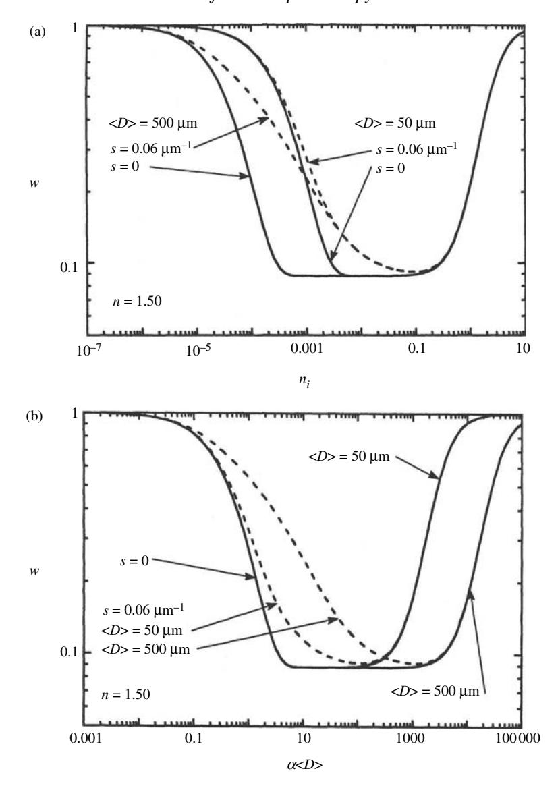

Figure 14.1 Single-scattering albedo  $w = Q_s$  for particles of sizes and internal scattering coefficients indicated. The real part of the refractive index is  $n_r = 1.50$ ; (a) w vs. k; (b) w vs.  $\alpha \langle D \rangle$ .

The volume-scattering region When  $\alpha \langle D \rangle \ll 1$ , Figures 14.1 and 14.2 show that w and  $r_0$  are both close to 1. Note, however, that even for  $n_i \sim 10^{-7}$ , which for the 500  $\mu$ m particles corresponds to  $\alpha \langle D \rangle \sim 10^{-3}$ , there is an easily measurable difference between  $r_0$  and 1.0, so that the magnitude of the reflectance is sensitive to  $n_i$  even for such small values of  $\alpha$ . When  $\alpha \langle D \rangle \lesssim 3$ , the reflectance is dominated

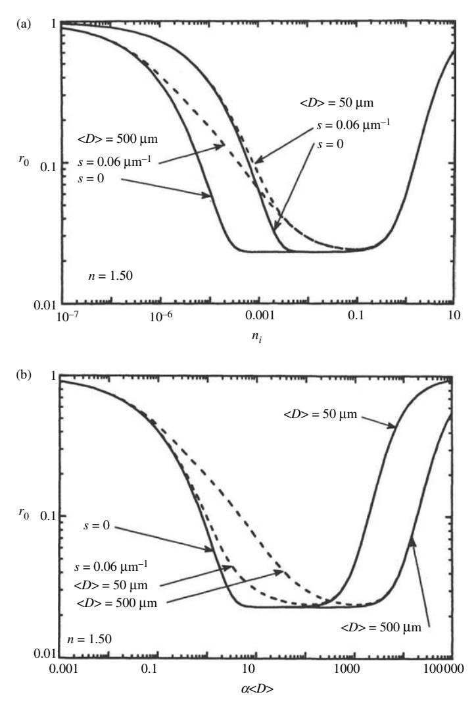

Figure 14.2 Diffusive reflectance  $r_0$  for media composed of the particles in Figure 14.1; (a)  $r_0$  vs.  $n_i$ ; (b)  $r_0$  vs.  $\alpha \langle D \rangle$ .

by light that has been refracted, transmitted, and scattered within the volume of the particle. Hence, this part of the curve is called the *volume-scattering region*. In the part of this region where  $\alpha \langle D \rangle \lesssim 0.1$ , w and  $r_0$  decrease slowly as  $n_i$  increases. The rate of decrease becomes more rapid when  $0.1 \lesssim \alpha \langle D \rangle \lesssim 3$ , so that the reflectance is highly sensitive to  $n_i$  there. The reflectance is equally sensitive to particle size: as  $\langle D \rangle$  increases, the part of the  $r_0$ -vs.- $n_i$  curve in the volume-scattering region shifts to the left, and the reflectance decreases. This dependence of reflectance on particle size has been noted by many authors (e.g., Adams and Felice, 1967).

The weak surface-scattering region When s=0 and  $\alpha\langle D\rangle\gtrsim 3$ , the particles are essentially opaque, and all of the scattering occurs by reflection from the surfaces of the particles, so that  $w\simeq S_e$ , independently of the sizes of the particles. From equation (5.37),  $S_e\propto [(n_r-1)^2+n_i^2]/[(n_r+1)^2+n_i^2]$ . Hence, when  $n_i\lesssim 0.1$ ,  $S_e$  is determined entirely by  $n_r$ . The weak surface-scattering region occurs between the place where  $\alpha\langle D\rangle\gtrsim 3$  and  $n_i\lesssim 0.1$ . Here the curves of w and v0 are flat, so that v1 cannot be determined by reflectance, but can only be placed between upper and lower limits. However, adding surface asperities or internal scatterers, parameterized by v3, increases the reflectance and extends the volume-scattering region to larger values of v3.

The strong surface-scattering region When  $n_i \gtrsim 0.1$ ,  $S_e$  is now sensitive to  $n_i$ , and both w and  $r_0$  increase with increasing  $n_i$  in this region. If  $X \gg 1$  and the particle surface is relatively smooth, the reflectance is independent of particle size. However, if the surfaces of the large particles are covered with scratches, edges, or asperities that can act like Rayleigh absorbers in the strong surface-scattering region, the reflectance will be smaller than it would if the surfaces were smooth. Unusual scattering and absorption can occur if  $n^2 \simeq -2$ , as discussed in Chapter 5.

#### 14.4.2 Band shape

The shape of an absorption band seen in reflectance in a medium of particles with  $X \gg 1$  may be understood qualitatively by examining one of the curves of reflectance versus imaginary refractive index in Figure 14.3. Starting in the wing of an isolated band,  $n_i = 1$  and  $r_0 \simeq 1$ . As the wavelength or frequency moves toward the band center,  $n_i$  increases, the corresponding point on the curve moves to the right, and  $r_0$  decreases. The point moves along the curve until it reaches the center of the band, where  $n_i$  is maximum. As the wavelength moves away from the center toward the other wing,  $n_i$  decreases, and the point retraces its path back along the reflectance curve to very small  $n_i$ .

The shape of a band, including the slope of the spectrum at any wavelength, is determined by the reflectance regime in which the center of the band occurs, which depends on both  $\alpha$  and  $\langle D \rangle$ . This is illustrated in Figure 14.3 for a Lorentz absorption band (Chapter 3) shown in Figure 14.3a.

If  $\alpha\langle D\rangle$  is small enough that all points of the band fall in the volume-scattering region, then the reflectance spectrum of the band is similar to a transmission spectrum in shape. This case is illustrated in Figure 14.3b. The reflectance decreases from wing to center and then increases back to wing again, and the band center is at the same wavelength as in transmission. If the reflectance of a monominerallic powder is transformed to an espat curve (Section 6.5.5), the espat  $W(\lambda)$  will be

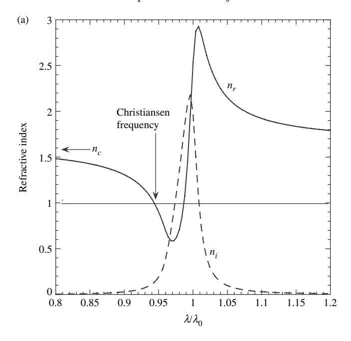

Figure 14.3 (a) Refractive index of an absorption band calculated from the Lorentz model (Chapter 3) with the following values of the parameters: continuum refractive index  $n_c = 1.6$ ; band width parameter  $\Xi/\nu_0 = 0.02$ ; band strength parameter  $\nu_p/\nu_0 = 0.02$ . The center of the band is at  $\lambda_0$ . (b) Bidirectional reflectance  $I/F = \pi r(i, e, g)$  spectrum at i = e = g = 0 of a particulate material with the absorption band of Figure 14.3a, except that the band is sufficiently weak that it is entirely within the volume-scattering region. The opposition effect has been ignored. The curve was calculated from the equivalent-slab model (Chapter 6) for w, and the two-stream expression for the reflectance (Chapter 8) of a medium of isotropic scatterers. The following values for the parameters were used: particle size  $D/\lambda_0 = 10$ ; band strength parameter  $v_p/v_0 = 1 \times 10^{-5}$ . (c) Reflectance spectrum of a particulate material with an absorption band whose center lies in the weak surface-scattering region. All parameters same as in Figures 14.3a and 14.3b, except  $v_p/v_0 = 0.01$ . (d) Reflectance spectrum of a particulate material with an absorption band whose center lies in the strong surface-scattering region. All parameters same as in Figure 14.3a and 14.3b, except  $v_p/v_0 = 0.2$ .

directly proportional to the absorption coefficient. Thus, if the band  $a(\lambda)$  has a Gaussian shape,  $W(\lambda)$  will also be Gaussian.

If the value of  $\alpha\langle D\rangle$  at the center of the band is strong enough to be in the weak surface-scattering region, then the reflectance saturates as the wavelength enters that region. This case is illustrated in Figure 14.3c. A further increase in  $n_i$  or  $\alpha$  does not cause a corresponding decrease in reflectance. Instead, the reflectance remains constant until  $\alpha\langle D\rangle$  moves out of the weak surface region back into the volume-scattering region, and the reflectance increases. In this case the bottom of

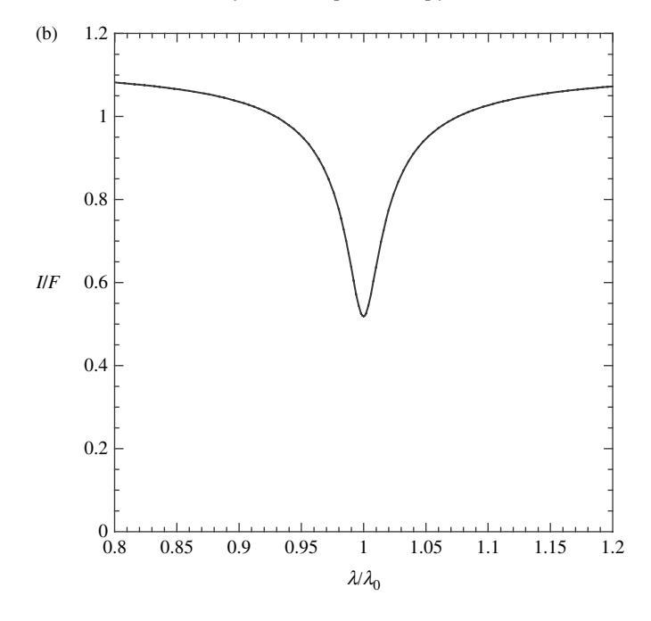

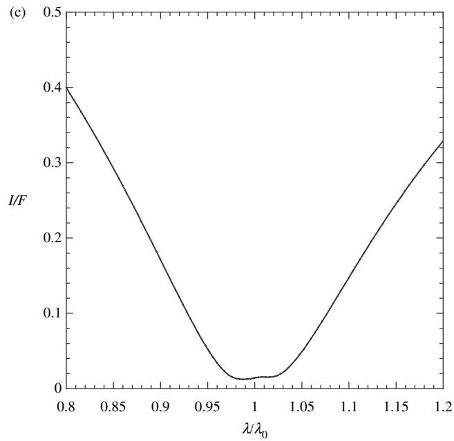

Figure 14.3 (*cont.*)

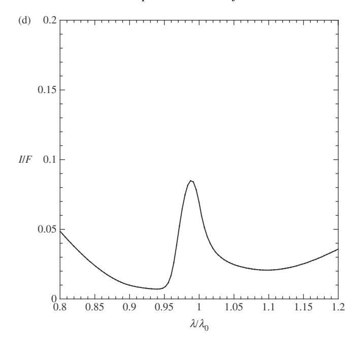

Figure 14.3 (*cont.*)

the band is cut off and replaced by a flat line. Also, the heights of the wings are increased by multiple scattering effects, relative to the wings seen in transmission. A naive observer might easily interpret the band as two unresolved, overlapping bands.

If *ni >* 0*.*1 at the band center then the reflectance there will lie in the strong surface-scattering regime. This case is illustrated in Figure [14.3d](#page-0-0). As *ni* increases, the reflectance first decreases through the volume-scattering region, but then increases as it enters the strong surface region. The reflectance goes through a maximum near the center of the band. However, as seen in Chapter [3,](#page-0-0) anomalous dispersion effects cause *nr* to be a function of frequency, so that the position of the maximum of the reflectance curve is displaced toward the higher-frequency (shorter-wavelength) side of the actual band center. As *ni* decreases again, the reflectance decreases through a second minimum and then increases into the wing.

Thus, a strong band has two minima on either side of the maximum corresponding to the band center. This type of minimum will be called a *transition minimum*, because it occurs in the weak surface-scattering transition region between the volume-scattering and strong surface-scattering regions. The anomalous dispersion behavior of *nr* causes the shorter-wavelength transition minimum to be deeper than the longer-wavelength one. A naive observer could easily mistake this band for two overlapping, partially resolved bands.

The unusual shapes of absorption bands when the band center is dominated by surface scattering means that automated methods for band identification, such as the one proposed by Huguenin and Jones[\(1986](#page-0-0)), must be used with great care when strong bands are present.

#### *14.4.3 Dependence of band depth on geometry*

Thus far, the shapes of the absorption bands have been discussed in terms of *r*0, which in its simplest interpretation is independent of angle. However, for physically real cases, the band depths and shapes depend on illumination and viewing geometry, as has been emphasized by Veverka and his co-workers (Veverka *et al.*, [1978a](#page-0-0),b,c). If the bidirectional reflectance of a material is measured with *i* and *e* close to normal, then multiple scattering will significantly increase the wings of the band, where *w* is high, but will be less important near the band center, where *w* is low and single scattering is the primary contributor to the brightness. However, if the reflectance is measured at large values of *i* and *e*, only single scattering contributes throughout the whole band. Similar effects can cause differences in band shapes between spectra of the same material measured bidirectionally and using an integrating sphere to measure the directional–hemispherical reflectance (Gradie and Veverka, [1982](#page-0-0)). The dependence of the relative band shape on angle and type of reflectance is illustrated in Figure [14.4.](#page-0-0)

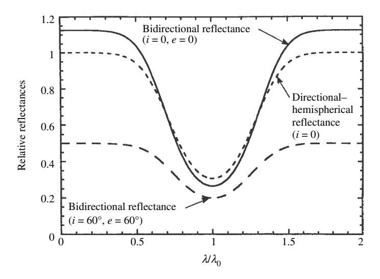

Figure 14.4 Reflectance spectra of a particulate medium of isotropic scatters with a Gaussian absorption band, illustrating the effects of illuminating and viewing geometry on the band depth.

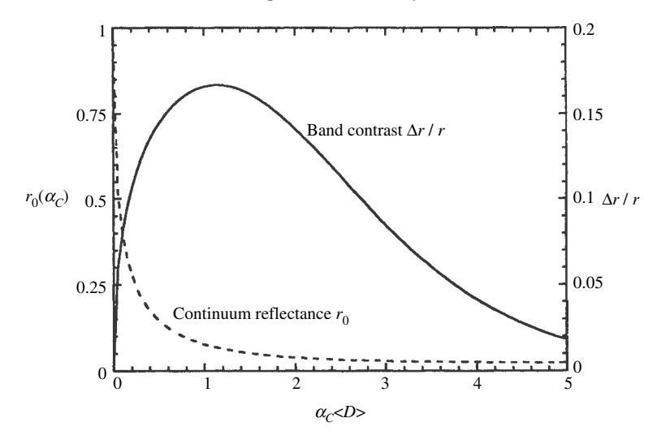

Figure 14.5 Relation between band contrast and particle size. Solid line, relative band contrast; dashed line, continuum reflectance. The relative contrast in absorbance is 20%.

#### 14.4.4 Dependence of band contrast on particle size

A question of interest is the relation between the depth of an absorption band seen in reflectance and the particle size of the scattering medium. It may be addressed by using equations (14.14) and (14.15) for w to calculate the diffusive reflectance  $r_0$ . This has been done in Figure 14.5, where for purposes of illustration we have taken  $n_r = 1.50$  and s = 0. It was assumed that the absorption coefficient at the center of the band was  $\alpha_B = 1.20\alpha_C$ , where  $\alpha_C$  is the value in the continuum. Figure 14.5 shows the relative band contrast in reflectance  $\Delta r/r = [r_0(\alpha_C) - r_0(\alpha_B)]/r_0(\alpha_C)$  as  $\alpha_C \langle D \rangle$  is varied. The continuum reflectance  $r_0(\alpha_C < D >)$  is also shown.

When  $\alpha_C\langle D\rangle$  is very small and the particles are optically thin, the band contrast is small also. As the particle size  $\langle D\rangle$  increases,  $\Delta r/r$  increases to a maximum value roughly equal to the relative band contrast in absorbance, 20% at  $\alpha_C\langle D\rangle\simeq 1$ . The reflectance then decreases monotonically. As the particle size continues to increase, the band contrast now decreases and becomes small as the particles become optically thick, and the reflectance saturates in the weak surface-scattering region. Note that the band contrast is not a monotonic function of the reflectance or of the particle size.

When the optical thickness of the particle is large the reflectance is dominated by surface scattering. Hence, the shape and depth of the bands are virtually independent of the particle size.

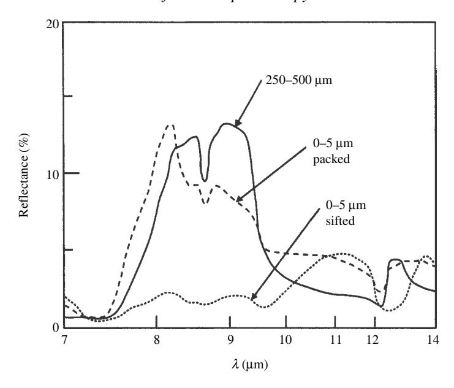

Figure 14.6 Reflectance spectra in the restrahlen region of two different size fractions of quartz particles showing the effect of packing on the spectrum of the smaller size particles. The spectrum of the coarser particles had little dependence on packing. (Reproduced from Salisbury and Eastes [\[1985](#page-0-0)], copyright 1985 with permission courtesy of Elsevier.)

#### *14.4.5 Effects of porosity*

Salisbury and Eastes [\(1985](#page-0-0)) measured the reflectance of quartz particles of sizes less than 5µm at wavelengths between 7 and 14µm (Figure [14.6\)](#page-0-0). The powder had a very low reflectance when sifted to form a medium of high porosity. However when the powder was packed, the reflectance increased by a factor that exceeded 5 in the quartz *restrahlen* band, where the single scattering albedo was low. However, the reflectance changed little outside the band, where the single-scattering albedo was higher. This behavior is qualitatively consistent with the predictions of the effects of porosity in Chapter [9,](#page-0-0) although the observed change is larger than expected inside the band.

#### **14.5 The reflectance spectra of intimate mixtures**

Because the reflectance is a nonlinear function of the single-scattering albedo, the dependence of reflectance of mixtures will, in general, not be a linear function of the spectra of the end members(Nash and Conel, [1974](#page-0-0); Clark, [1983](#page-0-0)). Thisis especially true if the albedos are high. However, the reflectance of an intimate mixture can be calculated from the reflectances of the pure end members by using the methods of Section 10.7. First,  $w_j$  and  $p_j(g)$  are found by inverting the appropriate equation for the reflectance  $r_j$  of the jth end member. Then w and p(g) for the mixture are calculated using the mixing formulas and are inserted into the reflectance equation to calculate the reflectance of the mixture.

Conversely, if the identities and spectra of the individual members of a mixture are known, the weights  $N_j \sigma_j Q_{Ej} \propto M_j Q_{Ej}/\rho_j D_j$  in the mixture can be found by trial and error by fitting calculated spectra to the measured spectrum of the mixture.

Deconvolutions of mixtures to find the fractions of the end members have been done in laboratory investigations by Smith *et al.* (1985) and Mustard and Pieters (1987,1989). Jenkins *et al.* (1985) applied these concepts to the analysis of lunar reflectance spectra.

Figure 14.7, from the paper by Mustard and Pieters (1989), compares the fractions of the end members in binary and ternary mixtures calculated by deconvolution of the reflectance spectra with the actual values. They deconvolved the data in two ways, one assuming that all particles scatter isotropically, and the other allowing for anisotropic scattering. As might be expected, the anisotropic fit gave smaller residuals. However, making the simplifying assumption that the scatterers are isotropic still allows the abundances to be estimated to better than 7%, except for opaque minerals, for which the errors are somewhat larger.

The following example illustrates the mixing equations. Suppose we have two powders consisting of isotropic scatterers larger than the wavelength. Suppose that the hemispherical reflectances of the two materials, measured at  $i=60^{\circ}$ , are  $r_{hl}=0.05$  and  $r_{h2}=0.90$ . What will the reflectances of various mixtures of the two powders be? Using equation (14.8), the single-scattering albedos corresponding to these reflectances are calculated to be  $w_1=0.181$  and  $w_2=0.997$ . For a binary mixture of particles, equation (10.46) is

$$w = \frac{w_1 + Cw_2}{1 + C},$$

where *C* is the weighting factor

$$C = \frac{\mathcal{M}_1}{\mathcal{M}_2} \frac{\rho_2}{\rho_1} \frac{D_2}{D_1}$$

 $\mathcal{M}_j$ , is the bulk density of material of type j,  $\rho_j$  is its solid density, and  $D_j$  is its size. Note that the weighting factor C depends on the ratio of particle sizes in addition to the relative amounts of the two materials.

Figure 14.8 illustrates the dependence of the reflectance of the mixture on the mass mixing ratio  $\mathcal{M}_2/(\mathcal{M}_1 + \mathcal{M}_2)$  for three different size ratios,  $D_2/D_1 = 0.01$ , 1.0, and 100. For simplicity the figure assumes that  $\rho_1 = \rho_2$ . Figure 14.8 makes the important point that when there is large disparity in the sizes of the components of

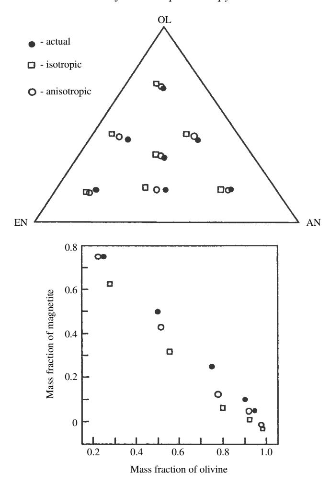

Figure 14.7 Determination of mass fractions in intimate mixtures by deconvolution of reflectance spectra. Top, ternary mixtures of olivine, enstatite, and anorthite; bottom, binary mixtures of olivine and magnetite. The filled circles are the actual mass fractions; the open squares are the results of deconvolution assuming isotropic scattering; the open circles are the results of deconvolution assuming nonisotropic scattering. (Reproduced from Mustard and Pieters [\[1989](#page-0-0)], copyright 1989 by the American Geophysical Union.)

an intimate mixture, the fine particles can have an effect all out of proportion to their mass fraction. For example, Clark and his co-workers (Clark and Lucey, [1984](#page-0-0); Clark and Roush, [1984](#page-0-0)) found that the addition of a small amount of finely divided carbon black to coarse particles of ice drastically reduced the reflectance and the contrast in the absorption bands of the ice. Note that if the bright material in the

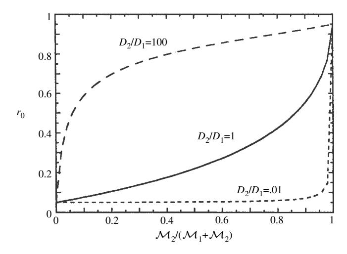

Figure 14.8 Diffusive reflectances of intimate mixtures of bright and dark particles as a function of the mass ratio for three different particle size ratios. Note that when the low-albedo particles are much smaller than the high-albedo particles, the reflectance of the mixture is almost independent of the amount or the reflectance of the bright material.

example in Figure [14.8](#page-0-0) possessed any absorption bands, they would be almost totally masked by only a small amount of the dark material.

The same effect also accounts for the low albedo of the Moon. Lunar regolith consists of pulverized rocks and glasses of the same composition as the rocks. If a lunar rock or a glass made by melting the rock in vacuum are finely ground, the resulting powders are found to have a much higher albedo than the soil (Wells and Hapke, [1977\)](#page-0-0). However, in the regolith many of the rock and glass fragments are welded together into particles called agglutinates, which are quite dark because they also contain submicroscopic particles of metallic iron. The soil particles are coated with deposits of vaporized rock that also contain metallic iron grains. About 0.5% of the soil consists of this submicroscopic metallic iron, an amount that is sufficient to lower the reflectance of the mixture to the observed value (Hapke *et al.*, [1975;](#page-0-0) Hapke, [2001\)](#page-0-0).

It is frequently stated in the literature that in a mixture of large and small particles, the small particles "coat" the large particles and prevent light from reaching them, so that the large particles cannot influence the reflectance. This is a physically incorrect explanation, because the effect would occur even if the particles were so far apart they never touch. Small particles have a large influence because of the combined effects of the nonlinear dependence of reflectance on single-scattering albedo plus the weighting of the properties of the components by cross-sectional area rather than volume.

# 14.6 Absorption bands in layered media 14.6.1 The effect of layers on band contrast

Often in the both the laboratory and the field we deal with layered media. Thus, an important question of practical interest is how layers affect our ability to detect and measure diagnostic absorption bands that may be present. A band may be displayed by the upper layer, in which case we wish to know how thick the layer must be for the band to be visible or well developed. Conversely, the band may be in the lower layer, in which case we wish to know how thin the upper layer must be in order not to hide the band. As might be expected, the answers to these questions depend on the scattering properties of both of the layers.

To be rigorous, these questions should be addressed using the two-layer bidirectional equations developed in Section 10.6. However, for a semiquantitative discussion, the two-layer diffusive model, equation (10.23), may be used. Define the band contrast of a layered medium as

$$C(\tau_0) = (r_w - r_c)/r_w,$$

where  $r_w$  is the reflectance in the wing of the band, and  $r_c$  is the reflectance at the center. This contrast will be a function of the optical thickness  $\tau_0$  of the upper layer. Define the relative band contrast  $\Delta C(\tau_0)$  as

$$\Delta C(\tau_0) = \frac{[(r_w(\tau_0) - r_c(\tau_0)]/r_w(\tau_0)}{[(r_w(\infty) - r_c(\infty)]/r_w(\infty)}.$$
(14.16)

That is,  $\Delta C$  is the ratio of the band contrast observed in a layered medium to the intrinsic contrast the band would have if the medium exhibiting it were infinitely thick and not covered by any other material.

To illustrate the effects of layering on band contrast, we will consider four examples, in which it is assumed that one of the layers has a band with an intrinsic contrast of 20%.

Example 1: band in top layer, top layer dark, bottom layer bright

Suppose the bottom layer has a reflectance  $r_L = 0.90$ , and that in the wings of the band the top layer has  $r_U = 0.090$ , with the corresponding  $\gamma = 0.83$ . In the center of the band,  $r_U = 0.072$ , with the corresponding  $\gamma = 0.87$ . Using equation (10.23), the reflectance  $r_0$  and relative band contrast  $\Delta C$  may be calculated as functions of the optical thickness  $\tau_0$  of the upper layer. The curve of reflectance is plotted in Figure 14.9a, and that of relative contrast in Figure 14.9b. As  $\tau_0$  increases,  $r_0$  decreases, while  $\Delta C$  increases rapidly. Both reach approximately their thick-layer

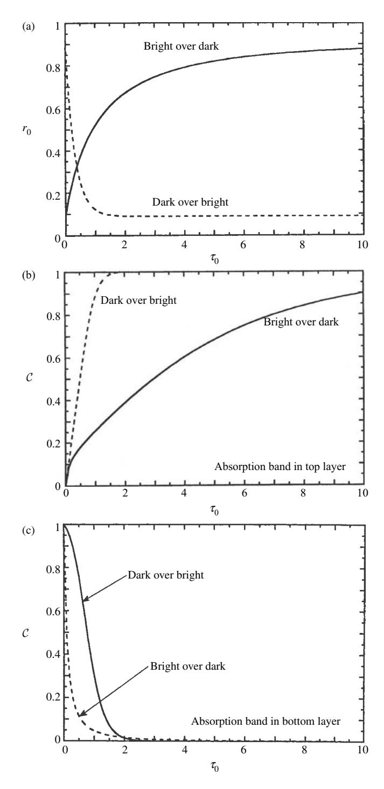

Figure 14.9 Reflectance and relative absorption-band contrast in two-layer media showing the effects of the reflectances of the top and bottom layers and the layer in which the band is located. See text for details. (a) Diffusive reflectance. (b) Band contrast, band in upper layer, *(*,*r/r)U* = 20%. (c) Band contrast, band in lower layer, *(*,*r/r)L* = 20%.

values by  $\tau_0 \simeq 2$ . Hence, a relatively thin layer is all that is required to develop both the reflectance and the band fully.

Example 2: band in top layer, top layer bright, bottom layer dark

Suppose the bottom layer has  $r_L = 0.09$ ; in the wings of the band the top layer has  $r_U = 0.90$ , with corresponding  $\gamma = 0.053$ ; in the band center,  $r_U = 0.72$  and  $\gamma = 0.16$ . The curves of reflectance and relative contrast for this case are plotted in Figures 14.9a and 14.9b, respectively. In this case both the reflectance and the relative contrast change much more slowly as  $\tau_0$  increases and have not reached their full values even for an optical thickness of  $\tau_0 > 11$ . The multiply scattered light penetrates deeply into the medium, so that the lower layer influences the reflectance even through an optically thick layer.

Example 3: band in bottom layer, bottom layer dark, top layer bright

In this case the band is in the bottom layer. Suppose that in the wings of the band the reflectance of the bottom layer is  $r_L=0.09$ , and in the band center it is  $r_L=0.72$ . Let the upper layer have  $r_U=0.90$ , with corresponding  $\gamma=0.83$ . The reflectance and relative contrast are shown in Figures 14.9a and 14.9c, respectively. Although the reflectance increases slowly with increasing  $\tau_0$ , the relative contrast decreases rapidly, and an optical thickness of not much more than  $\tau_0 \sim 1$  is sufficient to hide the band almost completely.

Example 4: band in bottom layer, bottom layer bright, top layer dark

In the wings of the band, let the reflectance of the bottom layer be  $r_L = 0.90$ , and at the band center  $r_L = 0.072$ . Suppose the upper layer has  $r_U = 0.09$  and  $\gamma = 0.053$ . The corresponding curves are plotted in Figures 14.9a and 14.9c. Both the reflectance and relative contrast decrease rapidly with increasing  $\tau_0$ , and the band is practically invisible when  $\tau_0 \gtrsim 2$ .

#### 14.6.2 The radialith, or how thick is "thick enough"?

A question of interest in many remote-sensing applications is: how thick is the layer that controls the amount of light reflected from a planetary regolith? Nash (1983) has termed this layer the *radialith*. This question may be answered using the expression for the two-layer diffusive reflectance, equation (10.23). In that expression the terms that contain the scattering properties of the lower layer are proportional to  $\exp(-4\gamma\tau_0)$ , where  $\gamma=\sqrt{1-w}$  is the albedo factor of the upper layer, and  $\tau_0$  is its optical thickness. Thus, the effects of the lower layer will be reduced to a small value if  $\exp(-4\gamma\tau_0) \ll 1$ . This suggests a convenient criterion for the thickness of the radialith as that necessary to make  $4\gamma\tau_0=6$ .

If the density of particles is uniform in the medium,  $\tau_0 = N\sigma Q_E z_R$ , where N is the number of particles per unit volume,  $\sigma$  is their mean cross-sectional area,  $Q_E$  is their extinction efficiency, and  $z_R$  is the thickness of the radialith. For large

particles,  $Q_E = 1$ , and we may write, approximately,

$$\tau_0 \simeq N \frac{1}{4} D^2 z_L = \frac{3}{2} \left( \frac{4}{3} N \frac{1}{8} D^3 \right) \frac{z_L}{D} = \frac{3}{2} \phi \frac{z_L}{D}$$
 (14.17)

where  $\phi$  is the filling factor, and D is the mean particle size. Hence, the criterion that  $4\gamma \tau_0 = 6$  is equivalent to

$$z_L/D = 1/\phi \gamma = 1/\phi \sqrt{1-w}$$
. (14.18)

If w is small, then  $\gamma$  is not too different from 1, and if the particles are close together, so that  $\phi \sim \frac{1}{2}$ , then  $z_R$  is only a few particle layers thick. However, if the material is only weakly absorbing so that  $w \sim 1$ , then the espat approximation may be used to calculate w, so that  $\gamma = \sqrt{1-w} \approx \sqrt{(1-w)/w} = \sqrt{W} \simeq \sqrt{\alpha D_e}$ , and expression (14.25) is

$$z_R \simeq \frac{D}{\phi \sqrt{\alpha D_e}} \simeq \frac{1}{\phi} \sqrt{\frac{D}{2\alpha}}.$$
 (14.19)

If the particles are very weakly absorbing, and if, in addition, the porosity of the layer is high, the radialith can be very thick indeed.

The same criterion may be used to estimate the thickness required for laboratory samples in order that the substrate does not influence the reflectance. If the particles are absorbing over the wavelength range of interest, then only a few monolayers are required. If the absorbance is very small, then equation (10.25) may be used to estimate the necessary thickness,

$$r_0 = [r_L + (1 - r_L)\tau_0]/[1 + (1 - r_L)\tau_0].$$

Suppose our criterion is that  $r_0$  change by less than 1% no matter what the reflectance of the lower substrate  $r_L$ . This requires  $\tau_0 > 99$ , which from (14.17) means that the layer must be more than  $66/\phi$  particles thick. If the filling factor is 50%, the sample must contain more than 130 monolayers. For example, if the grain size is of the order of  $80\,\mu$ m, the sample must be at least 1 cm thick.

## 14.7 Retrieving the absorption coefficient from the single-scattering albedo 14.7.1 Introduction

We are now in a position to solve for the absorption coefficient  $\alpha$ , or, equivalently, the imaginary part of the index of refraction  $n_i$ , from the reflectance, and to understand the regimes in which the various expressions that will be derived are valid. Recall that the single-scattering albedo w must first be found using one of the methods described previously. If the material is a mixture, its reflectance

must be deconvolved to determine the single-scattering albedos of the components. Next, a suitable model, such as those described in Chapters 5 and 6, must be chosen to relate the single-scattering albedo to the fundamental properties of the scatterers, which are the refractive index  $n = n_r + in_i$  and the particle size D and shape.

In laboratory studies it is often possible to determine, or at least estimate, all of the particle parameters except  $n_i$ , which may then be calculated. The size and shape can be estimated from microscopic examination of the particles, using either an optical or scanning electron microscope. The real part of the index of refraction may be available in handbooks if the identity of the material is known, or it can be determined by a number of standard methods, such as measurement of the Brewster angle (Chapter 4), or the Becke-line method (Bloss, 1961). Even in remote-sensing measurements there may be clues, such as the distinctive wavelengths of the absorption bands, to some of these parameters.

#### 14.7.2 Solving for $\alpha$ directly

Solving (14.14) for  $\Theta$  gives

$$\Theta = \frac{w - S_e}{1 - S_e - S_i + S_i w}. (14.20)$$

If s=0, then  $\Theta=\exp(-\alpha\langle D\rangle)$  and equation (14.27) contains three parameters:  $n_r$ ,  $n_i$  or  $\alpha$ , and  $\langle D\rangle$ . If the particle size distribution is known, then  $\langle D\rangle$  can be estimated by assuming that it is equal to the smallest particles in the distribution. If  $n_r$  is known and the reflectance is in the volume-scattering region, then  $S_e$  and  $S_i$  can be calculated from  $n_r$  using the equations given in Chapter 6. Then  $\alpha$  is given by

$$\alpha = -\frac{1}{\langle D \rangle} \ln \left( \frac{w - S_e}{1 - S_e - S_i + S_i w} \right). \tag{14.21}$$

If s is not small, then  $\alpha$  and s can be found by measuring the reflectances of powders of the same material but of different particle sizes such that the reflectances are in the volume-scattering region. From the measured values of w  $\Theta$  can be calculated for large and small particles. Then one has two different equations of the form of (14.15) for two unknowns, from which  $\alpha$  and s can be found by iteration.

Although the reflectance is sensitive to  $\alpha$  over the entire volume-scattering region, the part of the curve where  $\alpha\langle D\rangle\ll 1$  is especially subject to systematic errors. Special problems in this region include trace impurities and the fact that the reflectance of the standard must be known precisely. To minimize such

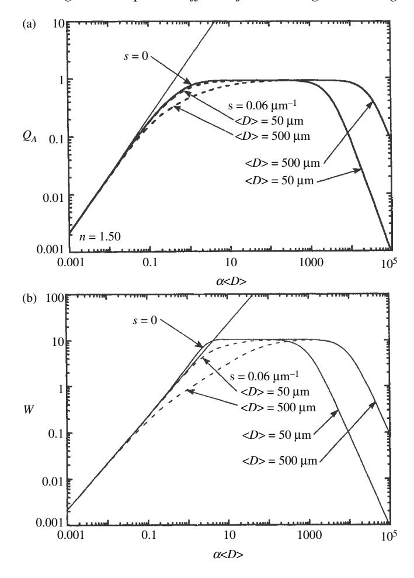

Figure 14.10 (a) Absorption efficiency  $Q_A$  vs.  $\alpha \langle D \rangle$  for the particles in Figure 14.1. The straight line has unit slope. (b) Espat function W vs.  $\alpha \langle D \rangle$  for the particles in Figure 14.1. The straight line has unit slope.

errors when measuring  $\alpha$  by reflectance, a particle size should be chosen to make  $0.1 \lesssim \alpha \langle D \rangle \lesssim 1$ , if possible.

#### 14.7.3 The espat function

In Figure 14.10a the absorption efficiency  $Q_A$  is plotted against  $\alpha \langle D \rangle$  for the same particles as in Figures 14.1 and 14.2, and it is seen to be proportional to  $\alpha$  only for  $\alpha \langle D \rangle \lesssim 0.07$ . The espat (effective single-particle absorption thickness) function is

$$W = Q_A/Q_S = (1 - w)/w (14.22)$$

was defined in Chapter 6. It was shown that this quantity is approximately proportional to  $\alpha$  over a larger range of  $\alpha \langle D \rangle$  than  $Q_A$ , so that in this linear region we may write

$$W \simeq \alpha D_e$$
, (14.23)

where  $D_e$  is an effective particle size of the order of twice the actual particle size. Combining (14.29) and (14.30) leads to an approximate expression for w that is valid in the linear region,

$$w = \frac{1}{1+W} \simeq \frac{1}{1+\alpha D_e}.$$
 (14.24)

W is plotted against  $\alpha \langle D \rangle$  in Figure 14.10b, which shows the linear region and also the departures from linearity for several values of s and  $\langle D \rangle$ .

The espat function has been used to analyze remotely sensed photometric data on Jupiter's satellite Europa by Johnson *et al.* (1988).

If the medium consists of a mixture of particles (either by composition or size or both), then the espat function that will be deduced from the measured volume single-scattering albedo is, from equation (10.56),

$$W = \frac{1 - w}{w} = \left(\sum_{j} \frac{\mathcal{M}_{j} w_{j}}{\rho_{j} D_{j}} W_{j}\right) / \left(\sum_{j} \frac{\mathcal{M}_{j} w_{j}}{\rho_{j} D_{j}}\right)$$

$$\simeq \left(\sum_{j} \frac{\mathcal{M}_{j} \alpha_{j} D_{ej}}{\rho_{j} D_{j} (1 + \alpha_{j} D_{ej})}\right) / \left(\sum_{j} \frac{\mathcal{M}_{j}}{\rho_{j} D_{j} (1 + \alpha_{j} D_{ej})}\right), \quad (14.25)$$

where the subscript *j* denotes the property of the *j*th type of particle.

For a monominerallic medium with a small particle size distribution the weighting functions in (14.25) are equal, and  $W \simeq \alpha D_e$ . If  $\alpha(\lambda)$  is known at some wavelength, then  $D_e$  of a powder can be found by measuring  $W(\lambda)$  of the powder at the same wavelengths. Once  $D_e$  is known  $\alpha(\lambda)$  can be found from the measured reflectance over the entire range of wavelengths in which the particles are volume scatterers.

Two important limitations of the espat function must be emphasized. First, Figure 14.10b shows that W is linearly proportional to  $\alpha$  only when neither  $\alpha \langle D \rangle$  nor  $s \langle D \rangle$  is large; that is, the particles must not be optically thick. Second, if a medium is not monominerallic or if it has a wide particle size distribution, then equation (14.25) shows that the volume-average espat function is proportional to

the weighted sum of the absorption coefficients of the individual components of a mixture *only* if  $\alpha D_e \ll 1$  for *each* component.

#### 14.7.4 An example of retrieving $n_i$ from the reflectance

To illustrate these concepts, let us turn to a material whose properties are well known and which is of practical interest in remote sensing: water ice. The measured complex refractive index of  $H_2O$  ice as a function of wavelength is shown as the solid and dashed lines in Figure 14.11a. The reflectance spectrum of an  $H_2O$  frost, measured over the same wavelength range, is shown as the solid line in Figure 14.11b. The reflectance and refractive index spectra were measured independently of each other. The absorption spectrum shows a strong fundamental vibrational band at  $3.08\,\mu\text{m}$ , plus a number of overtone bands whose strength decreases with decreasing wavelength in the near infrared. It also shows part of a strong electron-excitation band in the vacuum ultraviolet. In reflectance, the infrared fundamental band is expressed as a maximum at  $3.15\,\mu\text{m}$ , with two associated transition minima at 2.85 and  $3.45\,\mu\text{m}$ . The 2.85 minimum is lower than the 3.45 minimum. The weaker remaining bands are all in the volume-scattering regime and are expressed as minima.

As a test of the ability of the models to correctly predict the reflectance of a material, the refractive index of  $H_2O$  ice was inserted into equations (14.14) and (14.15) for w, assuming s=0, and the diffusive-reflectance spectrum  $r_0(\lambda)=(1-\gamma)/(1+\gamma)$  was calculated. The diffusive reflectance was used because angular information on portions of the reflectance was not available. The particle size of the sample in Figure 14.11b was not known, hence  $D_e$  was taken to be an unknown parameter. The value that gave the best fit was  $D_e=125\,\mu\text{m}$ . The calculated reflectance spectrum is shown as the points in Figure 14.11b.

As a test of the ability of the method to retrieve the imaginary refractive index, the measured reflectance spectrum of ice in Figure 14.11b was inverted. The reflectance was assumed to be given to sufficient accuracy by  $r_0(\lambda)$  and equation (14.4) used to calculate  $(w\lambda)$  from the reflectance. The real part of the index of refraction was approximated as constant at  $n_r = 1.3$ , independent of wavelength;  $D_e$  was assumed to be  $125 \,\mu\text{m}$ , and equation (14.21) was used to calculate  $\alpha$ . From the dispersion relation,  $n_i$  was then found. The result is shown as the points in Figure 14.11a. The agreement is again seen to be excellent, except at two wavelengths: the strong fundamental band, and in the visible. The reason for the less satisfactory agreement at  $3 \,\mu\text{m}$  is because  $n_r$  was assumed to be constant, so that the anomalous dispersion of  $n_r$  was neglected. The recovery of  $n_i$  in this region could be improved by using the Kramers–Kronig relations (Section 4.4). The reasons for poor agreement in the visible are the large systematic measurement errors when the reflectance is close to 1, as discussed in Section 14.7.2.

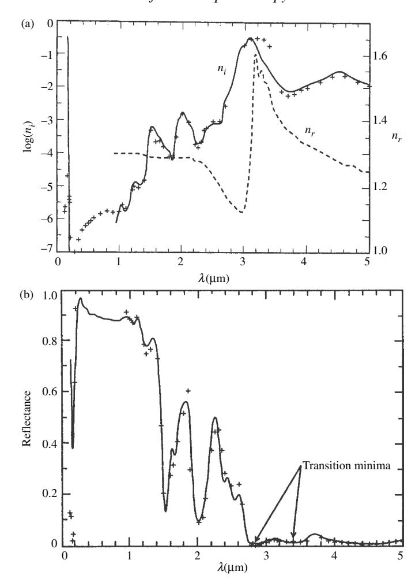

Figure 14.11 (a) Complex refractive index of water ice. Dashed line, measured  $n_r$ ; solid line, measured  $n_i$ ; crosses,  $n_i$  calculated from the reflectance of frost assuming  $n_r$  is constant. Data from Irvine and Pollack (1968) and Browell and Anderson (1975). (b) Spectral reflectance of water frost. Solid line, measured reflectance; crosses, diffusive reflectance calculated from the measured refractive index shown in Figure 11.10a, assuming  $\langle D \rangle = 125 \,\mu\text{m}$ . The arrows show the two transition minima on either side of the band center. Data from Smythe (1975) and Hapke *et al.* (1981).

# 14.8 Other methodologies 14.8.1 Kubelka–Munk theory

Several other methodologies have been suggested for retrieving the absorption coefficient from the reflectance. The oldest and most widely used is the pioneering

model by Kubelka and Munk (1931); see also Wendtland and Hecht (1966) and Kortum (1969). The KM model of is actually a form of the diffusive reflectance and is subject to the same inherent limitations.

The KM model is a form of the two-stream solution to the radiative-transfer equation. The radiances traveling into the upward and downward directions are denoted by  $I_1$  and  $I_2$ , respectively. Then their divergences are  $\frac{1}{2}(dI_1/dz)$  and  $-\frac{1}{2}(dI_2/dz)$ , respectively. The factors  $\frac{1}{2}$  and  $-\frac{1}{2}$  arise from averaging the cosine of the direction of propagation over the upward and downward hemispheres (see Section 8.7). The model contains two parameters, the volume absorption coefficient  $A_{\rm KM}$ , and the volume scattering coefficient  $S_{\rm KM}$ . Then the extinction coefficient is  $(S_{\rm KM} + A_{\rm KM})$ . In KM theory,  $A_{\rm KM}$  is assumed to be equal to  $\langle \alpha \rangle$ , the true absorption coefficient  $\alpha$  inside the particles of the medium reduced by averaging over a volume large compared with that of a single particle, and  $S_{\rm KM}$  is assumed to be caused by undefined, uniformly distributed scattering centers that are entirely independent of the absorption. The radiance is assumed to be scattered only if its direction of propagation has been changed from the hemisphere into which it was moving to the oppositely-going hemisphere. Light that is scattered into the same hemisphere is interpreted as unscattered. As in the diffusive reflectance, the volume source term  $\mathcal{F}$ is zero. The only source is the incident irradiance converted as it passes through the upper surface into a uniform diffuse radiance emerging into the downward-going hemisphere, which constitutes the boundary condition at the surface.

With these assumptions, the equations governing the radiance consist of two coupled differential equations,

$$\frac{1}{2}\frac{dI_1}{dz} = -(A_{KM} + S_{KM})I_1 + S_{KM}I_2,$$
 (14.26a)

$$-\frac{1}{2}\frac{dI_1}{dz} = -(A_{KM} + S_{KM})I_2 + S_{KM}I_1.$$
 (14.26b)

Let

$$d\tau_{\text{KM}} = -(A_{\text{KM}} + 2S_{\text{KM}})dz,$$
 (14.27a)

$$w_{\rm KM} = \frac{2S_{\rm KM}}{A_{\rm KM} + 2S_{\rm KM}},$$
 (14.27b)

and

$$\gamma_{\text{KM}} = \sqrt{1 - w_{\text{KM}}}.\tag{14.27c}$$

Then (14.26) can be put into the form

$$-\frac{1}{2}\frac{dI_1}{d\tau_{\text{KM}}} = -I_1 + \frac{w_{\text{KM}}}{2}(I_1 + I_2),\tag{14.28a}$$

$$\frac{1}{2}\frac{dI_1}{d\tau_{\rm KM}} = -I_2 + \frac{w_{\rm KM}}{2}(I_2 + I_1). \tag{14.28b}$$

Comparing equations (14.28) with equations (8.18) for the diffusive reflectance we see that they have exactly the same form. Because the boundary conditions are also the same, we may write down the expression for the *Kubelka–Munk reflectance* by comparison with (8.25),

$$r_{\rm KM} = \frac{1 - \gamma_{\rm KM}}{1 + \gamma_{\rm KM}} = \frac{1 - \sqrt{1 - 2S_{\rm KM}/(A_{\rm KM} + 2S_{\rm KM})}}{1 + \sqrt{1 - 2S_{\rm KM}/(A_{\rm KM} + 2S_{\rm KM})}} = \frac{1 - \sqrt{A_{\rm KM}/(A_{\rm KM} + 2S_{\rm KM})}}{1 + \sqrt{A_{\rm KM}/(A_{\rm KM} + 2S_{\rm KM})}}.$$
(14.29)

Solving  $r_{\text{KM}}$  for  $A_{\text{KM}}/S_{\text{KM}}$  gives the so-called *Kubelka–Munk remission function*,  $f(r_{\text{KM}})$ ,

$$f(r_{\rm KM}) = \frac{A_{\rm KM}}{S_{\rm KM}} = \frac{(1 - r_{\rm KM})^2}{2r_{\rm KM}}.$$
 (14.30)

By assumption,  $A_{\rm KM}$  is identified with the volume-averaged absorption coefficient  $\langle \alpha \rangle$ , and  $S_{\rm KM}$  is independent of  $\langle \alpha \rangle$ ; thus,  $f(r_{\rm KM})$  should be proportional to  $\langle \alpha \rangle$ , with the constant of proportionality equal to  $1/S_{\rm KM}$ . In particular, the true absorption coefficient  $\alpha$  of a monominerallic medium should be proportional to  $f(r_{\rm KM})$ . Experimentally, it is found that if  $f(r_{\rm KM})$  is calculated from the measured directional–hemispherical reflectance, while  $\alpha$  is independently measured by transmission, the two quantities are indeed proportional to each other for small values of  $f(r_{\rm KM})$ .

However, with increasing absorption, the slope of the remission function decreases, and the curve saturates. There has been a great deal of discussion in the literature as to the reason for this failure at larger absorptions. The usual explanation is that the scattering coefficient  $S_{\rm KM}$  is somehow "wavelength-dependent."

Because the proportionality between  $\alpha$  and  $f(r_{\rm KM})$  was found experimentally to be valid only for small values of the remission function, a technique called the *dilution method* that attempts to measure larger values of  $\alpha$  by reflectance was developed. A small number of the strongly absorbing particles are mixed with a sufficient quantity of weakly absorbing particles of some other material to bring the mixture into the linear region. However, although this somewhat extends the accuracy, in practice the amount of improvement is found to be minor.

The principal difficulty with KM theory is that the parameters  $A_{\rm KM}$  and  $S_{\rm KM}$  are completely misinterpreted. This is the source of the linearity failure in the remission function and lack of improvement provided by the dilution method. The problem is that the absorption and scattering are not distributed evenly throughout the medium, as assumed by the theory, but are localized into particles. If the KM differential equations are compared with the diffusive reflectance equations in Chapter 8 for a particulate medium, then  $A_{\rm KM}$  is seen to be equivalent to A, and  $S_{\rm KM}$  to S/2.

Thus,  $A_{KM}$  is *not* equal to the average internal absorption coefficient of the particles, but is the volume absorption coefficient  $A = \sum_{j} N_{j} \sigma_{j} Q_{Aj}$ , which is an entirely

different quantity. Similarly,  $S_{\text{KM}} = S/2 = \sum_{j} N_{j} \sigma_{j} Q_{Sj}/2$ . Furthermore, because for large particles  $Q_{Sj} + Q_{Aj} = Q_{Ej} = 1$ ,  $S_{\text{KM}}$  is *not* independent of  $A_{\text{KM}}$ , but is coupled to it,  $S_{\text{KM}} = \sum_{j} N_{j} \sigma_{j} (1 - Q_{Aj})/2 = (\sum_{j} N_{j} \sigma_{j} - A_{\text{KM}})/2$ . For large particles, the reason that  $S_{\text{KM}}$  is not constant has nothing to do with wavelength-dependent scattering, but occurs because  $S_{\text{KM}}$  and  $A_{\text{KM}}$  both depend on the absorption.

From equation (14.4b), the single-scattering albedo is seen to be related to the diffusive reflectance by  $w = 4r_0/(1+r_0)^2$ . Hence, for the diffusive reflectance the espat function is given by

$$W = \frac{1 - w}{w} = \frac{(1 - r_0)^2}{4r_0}. (14.31)$$

Comparing (14.31) with (14.30) shows that the remission function is equal to twice the espat function, the factor of 2 arising from the differing definitions of S and  $S_{\rm KM}$ . We can now understand why the remission function behaves as it does. It is equal to twice the espat function and hence is subject to the same limitations. It is proportional to the internal absorption coefficient of a monominerallic material if the reflectance is in the volume-scattering region, but it saturates as the reflectance enters the weak surface-scattering region. Even though Kubelka–Munk theory misinterprets the physical nature of the remission function,  $f(r_{\rm KM})$  turns out to be proportional to the true particle absorption coefficient in the volume-scattering region because of the fortuitous mathematical behaviors of  $Q_A$  and  $Q_S$ . This is why the theory is useful.

We can also understand why the dilution method does not appreciably improve the linearity. It was shown in Section 14.4 that the weighting factors of  $\alpha_j$  in the espat of a mixture are independent of  $\alpha_j$  only if  $\alpha_j D_{ej} = 1$  for all components. Suppose a small amount of strongly absorbing material, with properties denoted by subscript 2, is mixed with a large amount of material with properties denoted by subscript 1. Material 1 has a high albedo with no aborption bands in the wavelength range of interest. Then the espat function of the mixture is, from equation (14.25),

$$W = \frac{N_1 \sigma_1 (1 - w_1) + N_2 \sigma_2 (1 - w_2)}{N_1 \sigma_1 w_1 + N_2 \sigma_2 w_2} = \frac{W_1 + CW_2}{1 + C} \approx (1 - C)W_1 + CW_2 \quad (14.32)$$

to first order in C, where  $C = N_2 \sigma_2 w_2 / N_1 \sigma_1 w_1 << 1$ . Thus, W is proportional to  $W_2$ , which is proportional to  $W_2$  is small enough to be in the volume-scattering region. However,  $W_2$  and  $W_2$  saturate if the absorbance of material 2 is in the weak surface-scattering region, irrespective of the presence of the dilutant. The only way to prevent saturation is to grind both materials so finely that they fall in the volume-scattering region. But a dilutant is not required to accomplish this, so the whole dilution method appears to be superfluous.

Thus, the dilution method offers no substantial advantage in extending the linear region of the remission function. Instead, the particles should be ground to a small enough size that the espat function will be in the volume-scattering region; that is, α*D* ! 3 for the largest anticipated value of α. If *ni* ≥ 0*.*1, this means that *D* ! 2*.*5ζ. Larger values of *ni* will place the reflectance in the strong surface-scattering region and allow the retrieval of *ni* by Kramers–Kronig analysis (Section [4.4\)](#page-0-0).

#### *14.8.2 The Shkuratov albedo model*

The Shkuratov albedo model (Shkuratov *et al.*, [1999b](#page-0-0)) is an analytical model for the reflectance of a particulate material. Angular properties are unspecified. The medium is assumed to consist of parallel layers consisting of discrete particles and the spaces between them. Light transmitted and absorbed by individual layers are summed to give the reflectance.

Let *Rb* and *Rf* be the fraction of externally incident light specularly reflected from the particle surfaces in the backward and forward directions, respectively, and *Ri* is the fraction of internally incident light reflected. Shkuratov gives the following empirical approximations:

$$R_b = (0.28n_r - 0.20)R_e,$$
  
 $R_e = R_0 + 0.05,$   
 $R_f = R_e - R_b,$   
 $R_i = 1.04 - 1/n_r^2,$ 

where *R*0 = *(nr*–1*)*2*/(nr* +1*)*2. Let

$$T_e = 1 - R_e,$$
  
$$T_i = 1 - R_i.$$

Let *rb* and *rf* be the fractions of light scattered by an average particle into the backward and forward directions, respectively. Shkuratov shows that

$$\begin{split} r_b &= R_b + \frac{1}{2} T_e T_i \, R_i \exp(-2\tau) / (1 - R_i \exp(-\tau), \\ r_f &= R_f + T_e T_i \exp(-\tau) + \frac{1}{2} T_e T_i \, R_i \exp(-2\tau) / (1 - R_i \exp(-\tau), \\ \end{split}$$

where . = α\$*D*%, and \$*D*% is the average path length through the particle. Next, let ρ*b* and ρ*f* be the fraction of light scattered into the backward and forward directions by a layer. Shkuratov gives

$$\rho_b = \phi r_b,$$
  
$$\rho_f = \phi r_f + 1 - \phi.$$

where  $\phi$  is the filling factor. Then the albedo is

$$A = \frac{1 - \rho_b^2 - \rho_f^2}{2\rho_b} - \sqrt{\frac{1 - \rho_b^2 - \rho_f^2}{2\rho_b} - 1}.$$

The albedo may be inverted to find the absorption coefficient,

$$\alpha = -\frac{1}{\langle D \rangle} \ln \left[ \frac{b}{a} + \sqrt{\left(\frac{b}{a}\right)^2 - \frac{c}{a}} \right],$$

where

$$a = T_e T_i (yR_i + \phi T_e),$$

$$b = yR_b R_i + \frac{\phi}{2} T_e^2 (1 + T_i) - T_e (1 - \phi R_b),$$

$$c = 2yR_b - 2T_e (1 - \phi R_b) + \phi T_e^2,$$

$$y = (1 - A)^2 / 2A.$$

A difficulty with the Shkuratov albedo model is that the reflectance is predicted to be relatively insensitive to porosity (Shkuratov *et al.*, 1999b), in contrast with the experimental data which exhibit strong porosity-dependence. Also, the equations are considerably more algebraically complex than the comparably accurate diffusive reflectance model.

#### 14.8.3 The mean optical path length (MOPL)

Many authors have noted the similarity between reflectance in the volume-scattering region and transmittance. In both cases, absorption affects the intensity by transmission through the transparent material. The amount of light that penetrates through a thickness x of material is given by the transmittance  $t = \exp(-\alpha x)$ , so that  $-\ln t \propto \alpha$ . The quantity  $\alpha x = -\ln t$  in a transmission measurement is called the absorbance, and  $x = -(1/\alpha) \ln t$  is the optical path. For reflectance, Kortum (1969) defines a quantity analogous to the absorbance, which he calls the effective absorbance  $A_e = -\ln r$ , where r is a reflectance. Similarly, Clark and Roush (1984) define the mean optical path length as

$$MOPL = \frac{A_e}{\alpha} = -\frac{1}{\alpha} \ln r.$$
 (14.33)

If  $\alpha \propto -\ln r$ , then the MOPL should be a constant for a given material as  $\alpha$  changes. Let us see if the MOPL is approximately constant anywhere in the volume-scattering region. If so, then  $-\ln r$  should be approximately proportional to  $\alpha$ , which would indeed be a useful relation. We shall again use the diffusive reflectance  $r_0$  because

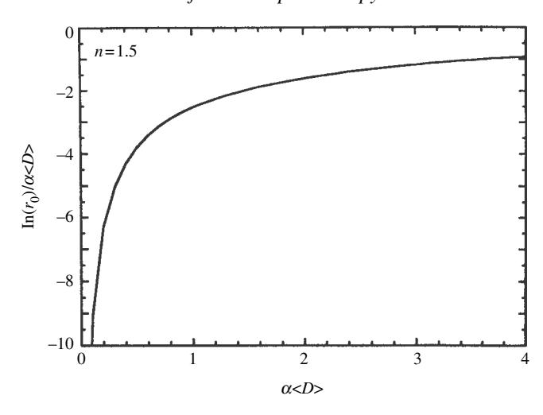

Figure 14.12 Mean optical path length  $\ln r_0$  divided by  $\alpha \langle D \rangle$  plotted against  $\alpha \langle D \rangle$ .

its behavior is representative of most types of reflectances, and it is mathematically simple.

In the volume-scattering region,  $w \simeq 1/(1+\alpha D_e)$ . If  $\alpha D_e \ll 1$ ,  $\gamma = \sqrt{1-w} \simeq \sqrt{\alpha D_e}$ . Hence,  $r_0 \simeq (1-\gamma)(1+\gamma)$ ;  $1-2\gamma \simeq e^{-2r}$ , and MOPL  $\simeq 2(D_e/\alpha)^{1/2}$ . At the opposite extreme, if  $\alpha D_e$  is large enough that only single scattering contributes appreciably, then  $r_0 \simeq w/4$ , and MOPL  $\simeq [\ln 4 + \ln(1+\alpha D_e)]/\alpha$ . In neither case is the MOPL even approximately constant. However, it does have one virtue, as pointed out by Clark and Roush (1984): if an absorption band has a Gaussian shape, the effective absorbance of that band will also be approximately Gaussian.

Figure 14.12 shows a plot of  $(\ln r_0)/\alpha \langle D \rangle$  vs.  $\alpha \langle D \rangle$  for a powder in which s=0. There does not seem to be any region in which the MOPL is even roughly constant. Hence, neither the effective absorbance nor the MOPL seems to be a particularly useful quantity especially when contrasted with the espat function.

#### 14.9 Particulate media with $X \ll 1$

The case of a medium of closely packed solid particles for which the mean  $X \ll 1$  is not well understood. Many workers have attempted to apply effective-medium theories to this type of material. However, it was emphasized in Section 7.1 that effective-medium theories are inadequate because they do not take scattering into account. The limited experimental evidence discussed in Section 7.5.1 suggests that the effective sizes of the scatterers in media of very small particles are agglomerates of the order of the wavelength. It was also suggested, although this needs to be verified experimentally, that an effective-medium theory be used to calculate the

refractive index *n*, which may then be inserted into Mie theory to calculate the *w* and *p(g)* of the agglomerates. The latter quantities may then be used in the appropriate expression for the reflectance.

This discussion suggests that if *ni* ( 1, then the espat function *W* should be proportional to α, even for small particles. However, the value of the constant of proportionality *De* is not clear; it may be of the order of ζ.

The situation is even more confusing when *ni* is not small. Under certain conditions, *w* (1, as evidenced by the fact that fine metallic powders, such as gold black, are among the darkest materials known. This is consistant with predictions of Mie theory and suggests that each particle scatters and absorbs quasi-independently.

### **14.10 Planetary applications** *14.10.1 The near-IR* **Fe2**+ *bands in silicates*

The absorption band in the vicinity of 1000 nm in silicates is one of the most important spectral features for the compositional remote sensing of bodies of the solar system whose surfaces can be seen from space. It is a weak, forbidden band caused by the excitation of electrons in the Fe2+ ion coordinated by six O!2 ions in pyroxene, olivine, and feldspar (Burns, [1993\)](#page-0-0). In pyroxenes the minimum of the band is sensitive to the amount of Ca2+, being at 900 nm in low-Ca orthopyroxene and at 950 nm in high-Ca clinopyroxene. Pyroxene has a second band near 2000 nm. The 950-nm band was first detected in the reflectance spectrum of the Moon by McCord and Adams (Adams, [1968\)](#page-0-0) and was one of the early indications that the crust of the Moon was mafic in composition. The band in olivine is a composite of three closely spaced bands with the minimum lying slightly longward of 1000 nm. The band in anorthositic feldspar is at 1250 nm, where it is caused by ferrous impurities, and so is extremely weak and difficult to detect remotely.

Anorthite, clinopyroxene, and olivine are three of the major minerals in the regolith of the Moon, the other important constituents being ilmenite and impactmelted glass. Also present in the regolith at the 0.5% level are tiny grains of submicroscopic metallic Fe (SMFe).which range in size from a few nanometers to about a micrometer. (The SMFe is sometimes also denoted by npFe0, standing for nano-phase metallic iron. This notation is rather curious, since "phase" usually refers to the structure of a material – e.g., solid, liquid, or gas, not size.) Although the SMFe is only a minor component by mass, it has a major effect on the spectrum.

#### *14.10.2 The modified Gaussian method*

We have seen that the theoretical form of the absorption coefficient, expressed in frequency, of a pure absorption band is Lorentzian. However, in practice, the bands often have a Gaussian-like shape. Although each individual oscillator has a Lorentzian shape, their band centers and widths are shifted randomly by lattice distortions, thermal vibrations, and impurities, so that the aggregate of them resembles a Gaussian. Other distortions of shape occur during the translation of the bands from absorption coefficient of individual grains to reflectance of a powder.

Sunshine and her colleagues (Sunshine *et al.*, [1990](#page-0-0); Sunshine and Pieters, [1993\)](#page-0-0) studied the systematics of the 1000-nm band in mixtures of pulverized pyroxene and olivine. They found that Gaussians describe the bands poorly in frequency, but were a good fit when the spectra were expressed as functions of wavelength. In the modified Gaussian method the measured spectrum is fitted in wavelength space by a series of Gaussian bands superposed on a continuum consisting of a series of straight lines. This is facilitated by a computer program that finds the band centers and widths, as well as the intercepts and slopes of the continuum lines, that give the best fit. The bands of an observed spectrum of a planetary regolith resolved in this way can then be compared to those of pure candidate materials to find the composition.

#### *14.10.3 Space weathering*

The space environment is often thought to be inert. In fact, the surface of a body without an atmosphere is subject to a variety of processes that alter its physical state and reflectance spectrum. These processes are known collectively as *space weathering,* and consist of meteoritic impact comminution, vitrification and vaporization, sputtering by the solar wind, deposition of the vapors generated by impact and sputtering, and irradiation by energetic nuclei of solar and cosmic origin (see review by Hapke, [2001](#page-0-0)).

Hypervelocity meteorite impacts grind up a pristine solid rock surface, which increases the albedo and alters the depths of absorption bands as described in this chapter. Impact-melted rocks have a higher albedo and bands that are wider and deeper than those of the parent rocks. Many of the regolith particles are agglutinates, which are agglomerates of smaller particles held together by melt glass. Most of the vapor generated by impacts and sputtering does not leave the Moon, but coats the particles of the regolith. The vapor deposition process reduces some of the Fe2+ to Fe0 and produces the SMFe particles (Hapke *et al.*, [1975](#page-0-0); Hapke, [2001\)](#page-0-0). According to the results of Chapter [5,](#page-0-0) the absorption efficiency of particles smaller than the wavelength is proportional to 1*/*ζ. Hence, the coatings absorb more strongly at shorter wavelengths and cause the reflectance spectrum of the Moon to be redder than the incident sunlight. They also obscure the absorption bands of the mineral and glass particles they coat.

Over time the optical effects of space weathering have caused the regoliths of the Moon and Mercury to become dark and slightly reddish and are slowly darkening bright craters and their rays. The weathering is countered by the addition of fresh unaltered material brought up from below the surface by impacts. When the two processes are in equilibrium the regolith is said to be *mature*. In the asteroid belt the velocities of most of the impacts are thought to be too low to cause appreciable melting or vaporization. However, the solar wind still causes sputter vaporization and deposition, although at a smaller rate than on the Moon. Thus, it takes much longer for the regoliths of asteroids to mature. Space weathering by comminution and sputter deposition can alter the spectrum of a material with the composition of chondritic meteorites, the most common type of meteorite, so that it is similar to that of S-asteroids, the most common type of asteroid (Hapke, 2001; Chapman, 2004).

Now, the scattering efficiency of the SMFe particles is proportional to  $(D/\lambda)^4$ , so that they have a negligible effect on the scattering coefficient of the medium. Their effect on the absorption coefficient can be calculated (Hapke, 2001) using the Maxwell-Garnet effective-medium model (equation 7.5) for the dielectric constant  $K_e$  of a material containing SMFe,

$$K_e = K_{eh} + \frac{3\phi_{Fe}K_{eh}[(K_{eFe} - K_{eh})/(K_{eFe} + 2K_{eh})]}{1 - \phi_{Fe}[(K_{eFe} - K_{eh})/(K_{eFe} + 2K_{eh})]},$$

where  $\phi_{Fe}$  is the fraction of SMFe by volume, subscript h refers to the host material and subscript Fe to the SMFe. The complex refractive index is  $n = n_r + in_i = \sqrt{K_e}$ , and the absorption coefficient is  $\alpha = 4\pi n_i/\lambda$ . Since  $\phi_{Fe} \ll 1$ , it is sufficiently accurate to keep only terms to first order in this quantity. Then the calculation of the absorption coefficient is straightforward and gives

$$\alpha = \alpha_h + \frac{36\pi}{\lambda} \phi_{Fe} \frac{n_{rh}^3 n_{rFe} n_{iFe}}{(n_{rFe}^2 - n_{iFe}^2 + 2n_{rh}^2)^2 + (2n_{rFe} n_{iFe})^2}.$$

This quantity turns out to be independent of the size distribution of the SMFe particles so long as they are  $< \lambda$ .

#### 14.10.4 The spectral-ratio-albedo diagram

The spectral-ratio—albedo diagram was developed by P. Lucey and his colleagues (Lucey *et al.*, 1995, 1998, 2000), and is a convenient and powerful, empirical method for estimating the amount of FeO and degree of maturity of a regolith from its visible and near-IR spectrum. An example of the diagram is shown in Figure 14.13. It plots the ratio r(IR))/r(V) against r(V), where r(V) is the reflectance in visible light at the wavelength ( $\sim 750 \, \mathrm{nm}$ ) where the reflectance is

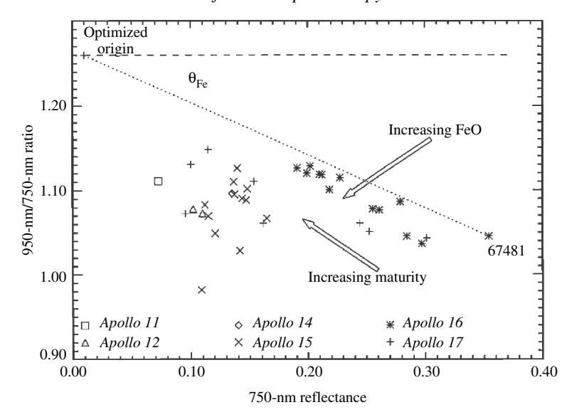

Figure 14.13 The spectral-ratio–albedo diagram for *Apollo* lunar samples. (Reproduced from Blewett *et al.* [\[1997](#page-0-0)], copyright 1997 by the American Geophysical Union.)

maximum just before it begins to decrease into the 1000-nm ferrous band, and *r(*IR*)* is the reflectance at the center of the band *(*∼ 950nm*)*.

Lucey *et al.* analyzed the spectra of a large number of terrestrial, lunar, and meteoritic minerals and rocks and discovered that materials with the same FeO content all fall approximately on a line radial to a certain point, called the "optimized origin," on the diagram. Increasing the FeO increases the band depth, which decreases the spectral ratio, and decreases the albedo. This moves the line downward and to the left in such a manner that the points on it remain radial to the apparent origin point. That is, the line rotates clockwise as the FeO increases. On the other hand, adding SMFe by space weathering reduces the visible reflectance on the short-wavelength wing of the band more than at the band center, so that so that the band depth decreases, causing the point corresponding to a material of given composition to move upward and to the left. The material remains approximately on its original, constant-FeO line as the weathering increases. The advantage of the spectral-ratio–albedo diagram is that spectral differences due to FeO composition are approximately orthogonal to changes caused by space weathering, so that the two effects may be separated.

Lucey *et al.* define two parameters on the diagram: the spectral Fe parameter θ*Fe*, which is the angle between a horizontal line through the apparent origin and a constant FeO line, and the optical maturity parameter OMAT, which is the distance along a constant FeO line and the apparent origin,

OMAT = 
$$\left\{ [r(IR)/r(V) - y_0]^2 + [r(V) - x_0]^2 \right\}^{1/2}$$
,

where *x*0 and *y*0 are the coordinates of the apparent origin. The θ*Fe* and OMAT parameters are found to be linearly correlated with FeO content and maturity, respectively. The correlation coefficients and the location of the apparent origin must be calibrated empirically and are specific to each data set. For the *Clementine* observations of the Moon the calibration was done by comparing the spacecraft observations of *Apollo* landing sites with laboratory measurements of samples from those same sites.