# Thermal emission and emittance spectroscopy

### **15.1 Introduction**

The region of the electromagnetic spectrum in the vicinity of 10-µm wavelength is referred to as the *mid-infrared*, but is also called the *thermal infrared* because objects at the temperature of the Earth's surface emit radiation strongly there. It is important because many materials have strong vibrational absorption bands at these wavelengths (Chapter [3\)](#page--1-0). In most remote-sensing measurements these bands can be detected only through their effects on the radiation that is thermally emitted by the planetary surface being studied. Many substances have overtone or combinations of these bands at shorter wavelengths; although they can be observed in reflected light, their depths and shapes may be affected by emitted thermal radiation. It will be seen that there are complementary relations, known as Kirchhoff's laws, between reflectance and emissivity at the same wavelength. Hence, much of the preceding discussions of reflectance can also be applied to emissivity.

Figure [15.1](#page--1-0) shows the spectrum of sunlight reflected from a surface with a diffusive reflectance of 10%, compared with the spectrum of thermal emission from a black body in radiative equilibrium with the sunlight, at various distances from the Sun. Clearly, thermal emission can be ignored at short wavelengths, and reflected sunlight at long, but at intermediate wavelengths the radiance received by a detector viewing the surface includes both sources.

In this chapter, expressions will be derived for the radiant power received by a detector viewing a particulate medium, such as a powder in the laboratory or a planetary regolith, when either or both reflected sunlight and thermally emitted radiation are present. The reflectance models developed in previous chapters will be extended to include the effects of thermal radiation. One of the effects of large-scale surface roughness is its ability to cause a thermal shadow-hiding opposition effect, which will be discussed near the end of the chapter. However, a general treatment of macroscopic surface roughness is beyond the scope of this book.

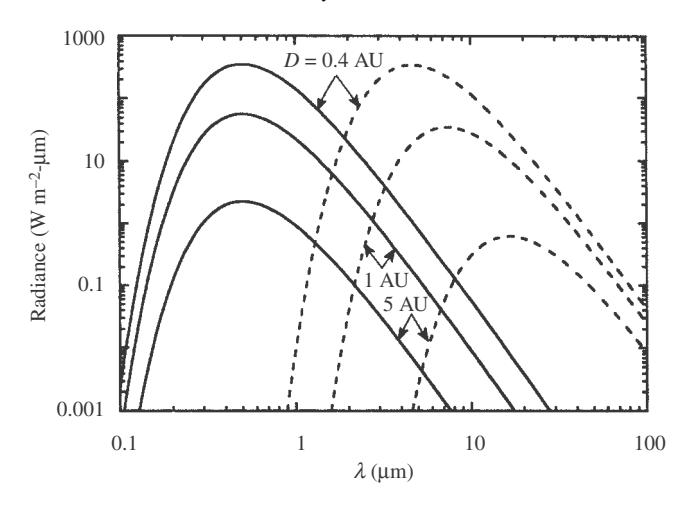

Figure 15.1 Comparison of sunlight reflected (solid lines) from a surface with a visual albedo of 0.1 with the radiation thermally emitted (dashed lines) from the surface with an IR emissivity of 1.00, for three different distances from the Sun.

There is a large body of literature that treats thermal emission and radiation transfer in planetary and stellar atmospheres (e.g., Chandrasekhar, 1960; Goody, 1964; Sobolev, 1975; Van de Hulst, 1980). Theoretical treatments of emittance from a particulate medium have been published by several authors, including Vincent and Hunt (1968), Conel (1969), Emslie and Aronson (1973), and Aronson *et al.* (1979). However, virtually all of the published theories of emittance by powders derive only the hemispherically integrated radiance, whereas it is the directional emittance that is measured remotely. The situation in which both reflectance and emittance contribute to the radiance has hardly been discussed at all.

### 15.2 Black-body thermal radiation

Suppose a hollow cavity is surrounded by material that is optically thick at all wavelengths and is heated to a uniform absolute temperature T (Figure 15.2). Then it is found that the spectral radiance in the cavity is given by

$$I(\lambda, T) = \frac{1}{\pi} U(\lambda, T), \tag{15.1a}$$

where  $U(\lambda, T)$  is the Planck function,

$$U(\lambda, T) = \frac{2\pi h_0 c_0^2}{\lambda^5} \frac{1}{e^{hc_0/\lambda k_0 T} - 1},$$
 (15.1b)

 $h_0$  is Planck's constant ( $h_0=6.626\times 10^{-34}\,\mathrm{J\,sec}$ ),  $c_0$  is the speed of light, and  $k_0$  is Boltzmann's constant ( $k_0=1.381\times 10^{-23}\,\mathrm{J\,K^{-1}}$ ). The quantities  $c_1=2\pi\,h_0c_0^2=$ 

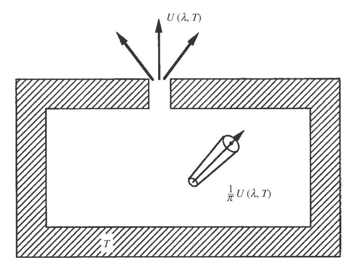

Figure 15.2 Thermal radiance inside a black-body enclosure whose walls are at temperature T and the power per unit area emerging from a small hole in the wall.

 $3.742 \times 10^{-16} \,\mathrm{W\,m^2}$  and  $c_2 = h_0 c_0/k_0 = 0.01439 \,\mathrm{m\,K}$  are called, respectively, the *first* and *second radiation constants*. The unit of  $U(\lambda, T)$  is power per unit area per unit wavelength interval. The radiance in the cavity is found to be independent of direction, position, shape of the cavity, and composition of its walls.

If a small hole is drilled through one of the walls of the cavity (Figure 15.2), the radiant power per unit area emerging into the hemisphere above the hole is

$$P_{\rm em}(\lambda, T) = \int_0^{\pi/2} I(\lambda, T) \cos 2\pi \sin e \, de = U(\lambda, T). \tag{15.2}$$

Such a hole approximates an ideal surface that does not reflect any light incident on it and that emits thermal radiation with 100% efficiency, and so is called a *black body*. The radiation described by  $U(\lambda, T)$  is *black-body thermal radiation*, and the cavity plus its walls is a *black-body enclosure* or *isothermal enclosure*.

At short wavelengths the exponential in the denominator of (15.1b) becomes large, and

$$U(\lambda, T) \simeq \frac{2\pi h_0 c_0^2}{\lambda^5} e^{-h_0 c_0/\lambda k_0 T}.$$
 (15.3a)

At long wavelengths this exponential may be expanded as  $e^x \simeq 1 + x$ , to give

$$U(\lambda, T) \simeq \frac{2\pi c_0 k_0 T}{\lambda^4},$$
 (15.3b)

which is known as the Rayleigh–Jeans law.

Setting the derivative  $\partial U(\lambda, T)/\partial \lambda = 0$ , shows that the Planck function has a maximum at

$$\lambda = 2898/T \,\mu\text{m},\tag{15.3c}$$

where T is degrees Kelvin. This relation, which is known as the *Wien displacement law*, shows that the wavelength of the maximum shifts toward shorter values as the temperature increases.

The total power per unit area V(T) emitted from the surface of a black body can be found by integrating  $U(\lambda, T)$  over all wavelengths:

$$V(T) = \int_0^\infty U(\lambda, T) d\lambda.$$

This integral may be evaluated by making the substitution  $x = h_0 c_0 / \lambda k_0 T$ , giving

$$V(T) = \frac{2\pi k_0^4 T^4}{h_0^3 c_0^2} \int_0^\infty x^3 (e^x - 1)^{-1} dx.$$

But

$$x^{3}(e^{x} - 1)^{-1} = x^{3}e^{-x}(1 - e^{-x})^{-1}$$
$$= x^{3}e^{-x}(1 + e^{-x} + e^{-2x} + \cdots)$$
$$= x^{3}(e^{-x} + e^{-2x} + e^{-3x} + \cdots).$$

Hence,

$$\int_0^\infty x^3 (e^x - 1)^{-1} dx = \sum_{i=1}^\infty \int_0^\infty x^3 e^{-jx} dx = \sum_{i=1}^\infty \frac{3!}{j^4} = \frac{\pi^4}{15},$$

which gives

$$V(T) = \sigma_0 T^4, \tag{15.4}$$

where  $\sigma_0 = 2\pi^5 k_0^4/15 h_0^3 c_0^2 = 5.671 \times 10^{-8} \, \mathrm{W \, m^{-2} \, K^{-4}}$  is the *Stefan–Boltzmann constant*. Equation (15.4) is the *Stefan–Boltzmann law*. The unit of V(T) is power per unit area. The corresponding integrated radiance inside an isothermal enclosure is

$$I(T) = V(T)/\pi$$
.

### 15.3 Emissivity

### 15.3.1 Emissivity and emittance

The power thermally emitted by a surface is called the *emittance*. If the emittance of the surface of an optically thick sample of real material is measured, it is found that the spectrum generally is similar to the Planck function, but usually is smaller

by an amount that may vary with wavelength. The ratio of the actual power  $U_a(\lambda, T)$  to that emitted by an ideal black surface is the *spectral emissivity*:

$$\varepsilon(\lambda) = \frac{U_a(\lambda, T)}{U(\lambda, T)}.$$
(15.5)

If  $\varepsilon$  is independent of wavelength, the surface is called a *gray body*.

The *integrated emissivity*  $\bar{\varepsilon}$  is the average emissivity weighted by the thermal spectrum:

$$\bar{\varepsilon} = \frac{1}{V(T)} \int_0^\infty \varepsilon(\lambda) U(\lambda, T) d\lambda. \tag{15.6}$$

Just as there are several kinds of reflectances that are distinguished by the degree of collimation of the source and detector, several kinds of emissivities may be defined, depending on the degree of collimation of the detector. These are the directional, conical, and hemispherical emissivities, denoted, respectively, by  $\varepsilon_d$ ,  $\varepsilon_c$ , and  $\varepsilon_h$ . Yet another kind of emissivity refers to the radiation emitted by a particle. In this book,  $\varepsilon$  with no subscript will denote the emissivity of a single particle.

#### 15.3.2 The emissivity of a solid, smooth surface

It is found experimentally that the radiance inside an isothermal enclosure is independent of the nature of composition of the walls. Suppose the walls are smooth and polished. Then the radiant power incident per unit area on a wall inside such an enclosure per unit wavelength is  $U(\lambda,T)$ . A fraction  $S_e(\lambda)$  per unit wavelength of this power is reflected, where  $S_e(\lambda)$  is the hemispherically integrated Fresnel reflection coefficient of the wall (Chapter 5), and a fraction  $1-S_e(\lambda)$  is absorbed. Thus, if the radiance inside the cavity is to be independent of the composition of the wall, the power absorbed must be exactly balanced by the power emitted by the wall. That is, for a specularly reflecting surface,  $\varepsilon_h(\lambda)U(\lambda,T)=[1-S_e(\lambda)]U(\lambda,T)$ , so that

$$\varepsilon_h(\lambda) = 1 - S_e(\lambda). \tag{15.7}$$

Equation (15.7) is one form of a relationship known as *Kirchhoff's law*. This law will be discussed in more detail in Section 15.4. Although there are many kinds of emissivities, the one defined by equation (15.7) is usually the quantity that is discussed in most physics textbooks.

### 15.3.3 Emissivity and emissivity factor of a particle

Because we are interested in the thermal emission from particulate media, it is necessary to know the emissivity of a particle. This quantity can be found by considering the energy balance of a particle located inside an isothermal enclosure. As usual throughout this book, except where explicitly stated otherwise, it is assumed that we are dealing with ensembles of randomly oriented particles. As discussed in Chapter [6,](#page-0-0) the geometric cross sections and efficiencies of particles are taken to be equivalent to their rotationally averaged values, and so are independent of the direction of the incident radiance.

Suppose an enclosure contains a particle with a rotationally averaged geometric cross-sectional area σ, extinction, scattering, and absorption efficiencies *QE(*λ*)*, *QS(*λ*)*, and *QA(*λ*)*, respectively, and emissivity Ψ*(*λ*)*. Then the total power per unit wavelength that is intercepted by the particle is

$$\int_{4\pi} \sigma Q_E(\lambda) (1/\pi) U(\lambda, T) d\Omega = 4\sigma Q_E(\lambda) U(\lambda, T),$$

of which a fraction *QA(*λ*)/QE(*λ*)* is absorbed. The power thermally emitted by the particle is

$$\int_{4\pi} \varepsilon(\lambda) \sigma(1/\pi) U(\lambda, T) d\Omega = 4\varepsilon(\lambda) \sigma U(\lambda, T).$$

Hence, if the radiance inside the enclosure is not to be altered by the particle, we must have

$$\varepsilon(\lambda) = Q_A(\lambda). \tag{15.8}$$

An alternate proof of this equality for homogeneous spheres has been given by Kattawar and Eisner [\(1970\)](#page-0-0).

Define the *particle emissivity factor E*(λ) as

$$\mathcal{E}(\lambda) = \frac{\varepsilon(\lambda)}{Q_E(\lambda)}.$$
 (15.9a)

Then

$$\mathcal{E}(\lambda) = \frac{\varepsilon(\lambda)}{Q_E(\lambda)} = \frac{Q_A(\lambda)}{Q_E(\lambda)} = \frac{Q_E(\lambda) - Q_S(\lambda)}{Q_E(\lambda)} = 1 - \varpi(\lambda), \tag{15.9b}$$

where '*(*λ*)* is the particle single-scattering albedo. For large particles close together, *QE* = 1 and *E* = Ψ. Equation [\(15.9b\)](#page-0-0) is Kirchhoff's law for single particles.

### *15.3.4 The thermal source function*

Suppose a small volume element () contains a number of different types of particles. Then the power emitted per unit wavelength per unit solid angle from the volume is

$$\Delta P_e = \sum_j N_j \Delta \upsilon \sigma_j \varepsilon_j(\lambda) (1/\pi) U(\lambda, T),$$

where N is the number of particles per unit volume, and the subscript j denotes the type of particle. It was shown in Chapter 7 that one of the quantities appearing in the radiative-transfer equation is the power thermally emitted per unit volume into unit solid angle. This quantity is known as the *thermal volume emission coefficient* and is denoted by  $\mathcal{F}_T$ . Hence,

$$\mathcal{F}_{T} = \frac{\Delta P_{e}}{\Delta v} = \sum_{j} N_{j} \sigma_{j} \varepsilon_{j}(\lambda) \frac{1}{\pi} U(\lambda, T)$$

$$= \sum_{j} N_{j} \sigma_{j} Q_{Aj}(\lambda) \frac{1}{\pi} U(\lambda, T) = \frac{A(\lambda)}{\pi} U(\lambda, T), \qquad (15.10a)$$

where  $A(\lambda)$  is the volume absorption coefficient of a particulate medium (equation [7.37]). Because of the assumption of random particle orientation,  $\mathcal{F}_T$  is independent of direction, although it may depend on position.

Similarly, the *volume thermal source function*  $F_T = \mathcal{F}_T/E$  was defined in Chapter 7, where E is the volume extinction coefficient. Equation (15.10a) shows that for a collection of particles the volume thermal source function is

$$F_T = \frac{A(\lambda)}{E} \frac{U(\lambda, T)}{\pi}.$$
 (15.10b)

Define the volume emissivity factor of a particulate medium as

$$\mathcal{E}_{V}(\lambda) = \frac{\pi}{U(\lambda, T)} F_{T} = \frac{1}{E(\lambda)} \sum_{j} N_{j} \sigma_{j} \varepsilon_{j}(\lambda) = \frac{A(\lambda)}{E(\lambda)} = \frac{E(\lambda) - S(\lambda)}{E(\lambda)}$$
$$= 1 - w(\lambda) = \gamma^{2}(\lambda), \tag{15.11}$$

where S is the volume scattering coefficient (equation [7.36]), w is the volume single-scattering albedo (equation [7.21a]), and  $\gamma$  is the volume albedo factor.

Thus, the thermal source function in a particulate medium can be written

$$F_T = \frac{\mathcal{E}_V(\lambda)}{\pi} U(\lambda, T) = \frac{\gamma^2(\lambda)}{\pi} U(\lambda, T). \tag{15.12}$$

### 15.3.5 The directional emissivity of a particulate medium

The directional emissivity  $\varepsilon_d(e,\lambda)$  is the ratio of the thermal radiance  $I(e,\lambda,T)$  emerging from the surface of a particulate medium at a uniform temperature T into a given direction making an angle e with the zenith to the thermal radiance  $U(\lambda,T)/\pi$  emerging from a black body at the same temperature:

$$\varepsilon_d(e,\lambda) = \pi \frac{I(e,\lambda,T)}{U(\lambda,T)}.$$
(15.13)

In this section, the directional emissivity of an infinitely thick particulate medium of isotropic scatterers will be calculated using the method of invariance. This method, which was used previously in Chapter 8 to calculate the bidirectional reflectance, is based on the principle that if an optically thin layer of particles is added to the top of an infinitely thick medium consisting of the same type of particles, neither the emittance nor the reflectance will be changed. We will calculate the first-order changes caused by the addition of such a layer and then require that the sum of all these changes must equal zero. For convenience and economy of notation, the explicit dependences of the various quantities on  $\lambda$  and T will be dropped. For simplicity we will also assume that the particles are all of one type; the extension to media of mixtures is straightforward.

Consider a semi-infinite medium consisting of N particles per unit volume, with bidirectional reflectance r(i,e,g). Because the particles emit and scatter isotropically, r(i,e,g) and  $\varepsilon_d(e)$  are independent of azimuth or phase angle and may be written  $r(\mu_0,\mu)$  and  $\varepsilon_d(\mu)$ , respectively. Let a layer of thickness  $\Delta z$  and optical thickness  $\Delta \tau = N\sigma Q_E \Delta z = E\Delta z \ll 1$  be added to the top of the medium. Assume that  $\Delta \tau$  is so small that interactions of light with the layer involving powers of  $\Delta \tau$  greater than 1 can be ignored. Then the layer will cause five separate changes proportional to  $\Delta \tau$  in the emitted radiation. These changes are shown schematically in Figure 15.3.

(1) Radiance  $\varepsilon_d(e)(U/\pi)$  emitted by the lower medium into a direction  $\Omega_e$  making an angle e with the vertical is attenuated by extinction in the added layer (Figure 15.3a). The radiance emerging from the upper layer is  $I = \varepsilon_d(e)(U/\pi) \exp(-\Delta \tau/\mu) \simeq \varepsilon_d(e)(U/\pi)(1-\Delta \tau/\mu)$ , to first order in  $\Delta \tau$ . Hence, the change due to this effect is

$$\Delta I_1 = -\varepsilon_d(e) \frac{U}{\pi} \frac{\Delta \tau}{\mu}.$$
 (15.14a)

(2) The added layer emits an additional amount of light into the direction  $\Omega_e$  (Figure 15.3b). Consider a cylindrical volume coaxial with the emitted ray with cross-sectional area  $\sigma$  and length  $\Delta z/\mu$ , where  $\mu = \cos e$ . Then the radiance emitted toward  $\Omega_e$  by the particles in this volume is

$$\Delta I_2 = N\sigma\varepsilon \frac{\Delta z}{\mu} \frac{U}{\pi} = \frac{\mathcal{E}}{\pi} U \frac{\Delta \tau}{\mu} = \frac{\mathcal{E}_{V}}{\pi} U \frac{\Delta \tau}{\mu}, \quad (15.14b)$$

since for media of a single type of particle  $\mathcal{E} = \mathcal{E}_V$ .

(3) The added layer emits an amount of light in the downward direction. This light is scattered by the lower medium into the direction  $\Omega_e$  (Figure 15.3c). Consider a cylinder of area  $\sigma$  and length  $\Delta z/\mu_0$  coaxial with a direction  $\Omega_i$  making an

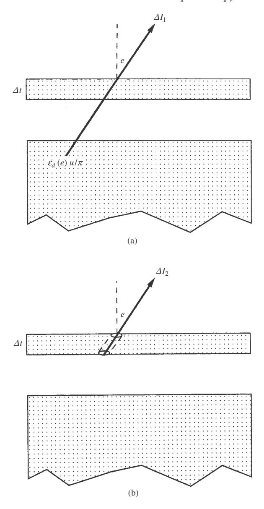

Figure 15.3 Schematic diagram of the five first-order changes in the thermally emitted radiance caused by adding a thin layer of optical thickness  $\Delta \tau$  to the top of an infinitely thick medium.

angle i with the normal to the layer, where  $\mu_0 = \cos i$ . This cylinder emits a radiance  $(\mathcal{E}_V/\pi)U(\Delta\tau/\mu_0)$  into this direction toward the lower medium. The medium scatters a fraction  $r(\mu_0,\mu)$  of this radiance into the direction  $\Omega_e$ . The

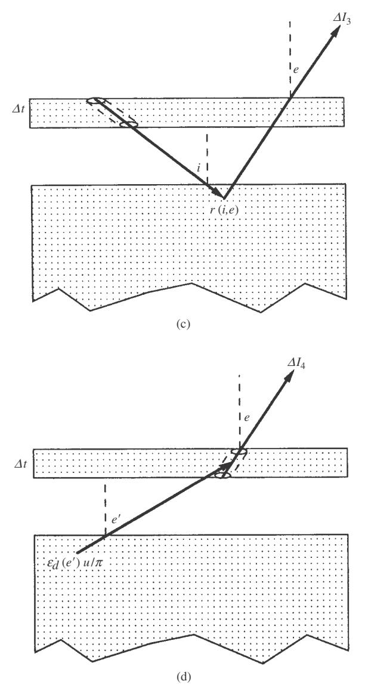

Figure 15.3 (cont.)

total contribution of this effect is the integral over all angles i:

$$\Delta I_3 = \int_{2\pi} \frac{\mathcal{E}_V}{\pi} U \frac{\Delta \tau}{\mu_0} r(\mu_0, \mu) d\Omega_i, \qquad (15.14c)$$

where  $d\Omega_i = 2\pi \sin i di = -2\pi d\mu_0$ .

(4) Radiance  $\varepsilon_d(e')(U/\pi)$  emitted by the lower layer into a direction  $\Omega_{e'}$  making an angle e' with the vertical illuminates a cylinder of area  $\sigma$  and length  $\Delta z/\mu$ 

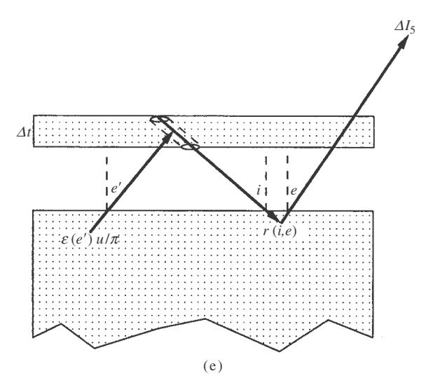

Figure 15.3 (cont.)

in the added layer coaxial with the direction  $\Omega_e$  (Figure 15.3d). A fraction  $(w/4\pi)(\Delta\tau/\mu)$  of this light is scattered by the particles in this cylinder toward  $\Omega_e$ . The total contribution of this effect is the integral over all angles e':

$$\Delta I_4 = \int_{2\pi} \varepsilon_d(e') \frac{U}{\pi} \frac{w}{4\pi} \frac{\Delta \tau}{\mu} d\Omega_{e'}, \qquad (15.14d)$$

where  $d\Omega_{e'} = 2\pi \sin e' de' = -2\pi d\mu'$  and  $\mu' = \cos e'$ .

(5) Radiance  $\varepsilon_d(e')(U/\pi)$  emitted by the lower layer into a direction  $\Omega_{e'}$  making an angle e' with the vertical illuminates a cylinder of area  $\sigma$  and length  $\Delta z/\mu_0$  in the added layer coaxial with the direction  $\Omega_i$  (Figure 15.3e). A fraction  $(w/4\pi)(\Delta\tau/\mu_0)$  of this light is scattered by the particles in this cylinder parallel to  $\Omega_i$  toward the lower layer. A fraction  $r(\mu_0, \mu)$  is scattered by the lower medium into the direction  $\Omega_e$ . The total contribution of this effect is the double integral over all angles e' and i:

$$\Delta I_5 = \int_{2\pi} \int_{2\pi} \varepsilon_d(e') \frac{U}{\pi} \frac{w}{4\pi} \frac{\Delta \tau}{\mu_0} r(\mu_0, \mu) d\Omega_i d\Omega_{e'}.$$
 (15.14e)

The sum of all the changes  $\Delta I_1$  through  $\Delta I_5$  must be zero. Hence, after dividing through by  $U \Delta \tau / \pi \mu$ , we obtain

$$\varepsilon_d(e) = \mathcal{E}_V + \mathcal{E}_V \mu \int_{2\pi} \frac{r(\mu_0, \mu)}{\mu_0} d\Omega_i + \frac{w}{4\pi} \int_{2\pi} \varepsilon_d(e') d\Omega_{e'}$$

423

$$+\frac{w}{4\pi} \left[ \int_{2\pi} \frac{r(\mu_0, \mu)}{\mu_0} d\Omega_i \right] \left[ \int_{2\pi} \varepsilon_d(e') d\Omega_{e'} \right]. \tag{15.15}$$

Now, it was shown in Section 8.7.3.2 that a medium of isotropically scattering particles has a bidirectional reflectance

$$r(\mu_0, \mu) = \frac{w}{4\pi} \frac{\mu_0}{\mu_0 + \mu} H(\mu_0) H(\mu),$$

where  $H(\mu)$  satisfies the integral equation

$$H(\mu) = 1 + \frac{w}{2}\mu H(\mu) \int_0^1 \frac{H(\mu_0)}{\mu_0 + \mu} d\mu_0.$$

Hence,

$$\mu \int_{2\pi} \frac{r(\mu_o, \mu)}{\mu_0} d\Omega_i = \frac{w}{4\pi} \mu H(\mu) \int_0^1 \frac{H(\mu_0)}{\mu_0 + \mu} 2\pi d\mu_0 = H(\mu) - 1,$$

and (15.14) becomes

$$\varepsilon_{d}(e) = \mathcal{E}_{V} + \mathcal{E}_{V}[H(\mu) - 1] + \frac{w}{2} \int_{0}^{1} \varepsilon_{d}(\mu') d\mu'$$

$$+ \frac{w}{2} [H(\mu) - 1] \int_{0}^{1} \varepsilon_{d}(\mu') d\mu'$$

$$= H(\mu) \left[ \mathcal{E}_{v} + \frac{w}{2} \int_{0}^{1} \varepsilon_{d}(\mu') d\mu' \right].$$
(15.16)

Integrating (15.16) with respect to  $\mu$ ,

$$\int_0^1 \varepsilon_d(\mu) d\mu = \left[ \int_0^1 H(\mu) d\mu \right] \left[ \mathcal{E}_V + \frac{w}{2} \int_0^1 \varepsilon_d(\mu) d\mu \right],$$

and solving for the integral of the emissivity gives

$$\int_{0}^{1} \varepsilon_{d}(\mu) d\mu = \mathcal{E}_{V} \left[ \int_{0}^{1} H(\mu) d\mu \right] \left[ 1 - \frac{w}{2} \int_{0}^{1} H(\mu) d\mu \right]^{-1}.$$
 (15.17)

But according to (8.51),

$$\int_0^1 H(\mu) d\mu = H_0 = \frac{2}{1+\gamma}.$$

Inserting this into (15.17) gives

$$\int_0^1 \varepsilon_d(\mu) d\mu = \frac{\mathcal{E}_V}{\gamma} \frac{2}{1+\gamma}.$$
 (15.18)

Substituting this result into [\(15.16\)](#page-0-0) gives

$$\varepsilon_d(e) = \frac{\mathcal{E}_v}{\gamma} H(\mu) = \gamma H(\mu). \tag{15.19}$$

Note that, like the equation for the reflectance, which was derived in the same manner, [\(15.19\)](#page-0-0) is an exact, general solution for Ψ*d* and makes no assumptions about the medium, other than that it is composed of particles that emit and scatter isotropically and that the added layer can be made optically thin. If approximation [\(8.53\)](#page-0-0) is used for *H (µ)*, [\(15.19\)](#page-0-0) becomes

$$\varepsilon_d(e) \simeq \gamma \frac{1 + 2\mu}{1 + 2\gamma \mu}.$$
 (15.20)

Thus, the radiance emerging from the surface of an optically thick particulate medium at uniform temperature *T* is

$$I(e) = \frac{\gamma(\lambda)}{\pi} H(\lambda, \mu) U(\lambda, T). \tag{15.21}$$

The directional emissivity Ψ*d* is plotted versus *e* for several values of *w* in Figure [15.4.](#page-0-0)

When *w* is small, Ψ*d* # 1 at all angles, and the surface emits like a black body. Hence, for low-albedo materials, the assumption that the emissivity is independent of angle is a good approximation.

As *w* increases, Ψ*d* decreases, and also Ψ*d* decreases as *e* increases. The reason for the dependence on *e* is that the multiply scattered flux is important when the

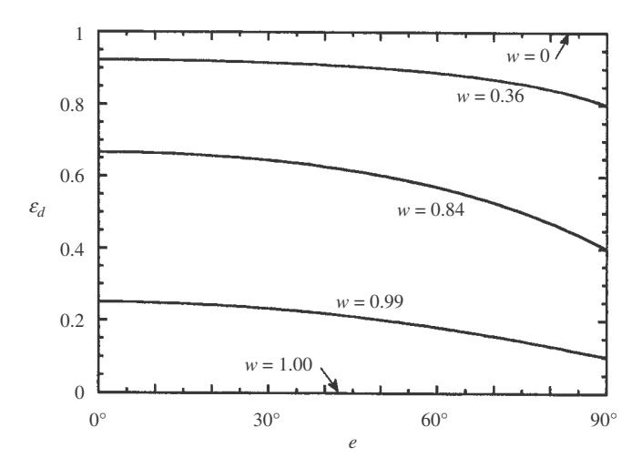

Figure 15.4 Directional emissivity of a particulate medium as a function of the angle of emergence for several values of the single-scattering albedo.

albedo is large. This flux decreases toward the surface because of leakage from the surface. As *e* increases, the field of view includes a greater contribution from the smaller flux closer to the surface. Only a few measurements of the directional (as opposed to hemispherical) emissivity have been published. However, Jakowsky *et al.* (1990) have measured the directional emissivities of natural sand and playa surfaces, and they seem to be in qualitative agreement with the theoretical model of this chapter.

### 15.3.6 The hemispherical emissivity of a particulate medium

The hemispherical emissivity  $\varepsilon_h(\lambda)$  of a particulate medium can be found by integrating the upward component of the emitted radiance, equation (15.21), over the upward hemisphere. The power emitted per unit area is

$$P_{em} = \varepsilon_h U = \int_{2\pi} I(\mu) \mu d\Omega_e = \int_0^1 \frac{\gamma}{\pi} H(\mu) U \mu 2\pi d\mu = 2\gamma H_1(\gamma) U, \quad (15.22)$$

where  $H_1 = \int_0^1 H(\mu)\mu d\mu$  is the first moment of the H function. Hence, the hemispherical emissivity is

$$\varepsilon_h = 2\gamma H_1. \tag{15.23}$$

Using approximation (8.58b),  $H_1 \simeq [1/(1+\gamma)](1+\frac{1}{6}r_0)$ , where  $r_0 = (1-\gamma)/(1+\gamma)$  is the diffusive reflectance, gives

$$\varepsilon_h \simeq \frac{2\gamma}{1+\gamma} \left( 1 + \frac{1}{6} r_0 \right).$$
(15.24a)

The hemispherical emissivity  $\varepsilon_h$  is plotted versus w in Figure 15.5. Note that when w and  $r_0$  are small,

$$\varepsilon_h \simeq \frac{2\gamma}{1+\gamma}.$$
(15.24b)

#### 15.4 Kirchhoff's law

Kirchhoff's law is an extremely powerful and useful rule which states that there is a complementary relationship between emissivity and reflectance. Kirchhoff's law allows the emissivity to be calculated from the reflectance, which often is more convenient to measure in the laboratory. However, as we have seen, there are several different kinds of reflectances and emissivities, and it is not always obvious which ones form the complementary pairs. From the derivations of this chapter, the following quantities obey Kirchhoff's law.

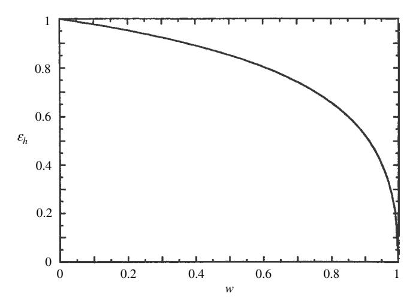

Figure 15.5 Hemispherical emissivity of a particulate medium vs. the singlescattering albedo.

In Section [15.3.1](#page-0-0) it was seen that the hemispherical emissivity of a smooth surface is

$$\varepsilon_h = 1 - S_e, \tag{15.25a}$$

where *Se* is the integral of the Fresnel reflection coefficients over a hemisphere. From Kirchhoff's law it follows immediately that the directional emissivity of a smooth surface is

$$\varepsilon_d(e) = 1 - R(e), \tag{15.25b}$$

where *R(e)* is the average of the Fresnel reflection coefficients over the two directions of polarization.

From equations [\(15.8\)](#page-0-0) and [\(5.6\)](#page-0-0), the emissivity of a single particle is

$$\varepsilon = Q_A = Q_E - Q_S, \tag{15.26}$$

where *QE* and *QS* are the volume-average particle extinction and scattering efficiencies, respectively.

From equations [\(15.11\)](#page-0-0) and [\(7.17\)](#page-0-0), the volume emissivity factor of a particulate medium is

$$\mathcal{E}_V = 1 - w,\tag{15.27}$$

where *w* is the volume single-scattering albedo in the medium.

From equations [\(15.19\)](#page-0-0) and [\(11.16\)](#page-0-0), the directional emissivity of a particulate medium of isotropic scatterers is

$$\varepsilon_d(e) = 1 - r_{hd}(e), \tag{15.28}$$

where  $r_{hd}(e)$  is the hemispherical–directional reflectance of the medium. Hence, the directional emissivity may be calculated from a measurement of the hemispherical–directional reflectance. However, because  $r_{hd}(e)$  has the same functional dependence on e as the directional–hemispherical reflectance  $r_h(i)$  has on i, the latter quantity may also be used to calculate  $\varepsilon_d(e)$ .

From (15.23) and (11.18), the hemispherical emissivity of a particulate medium of isotropic scatterers is

$$\varepsilon_h = 1 - r_s, \tag{15.29}$$

where  $r_s$  is the spherical or bihemispherical reflectance. Hence, if it is desired to calculate the hemispherical emissivity from reflectance, the spherical or Bond albedo is the quantity that must be measured. As discussed in Chapter 11, this is inconvenient to do in the laboratory. However, according to (11.19), an approximate expression for the spherical reflectance is  $r_s \simeq r_0\{1-\frac{1}{3}[\gamma/(1+\gamma)]\}$ . Substituting this into (15.29) gives the following approximate expression for the hemispherical emissivity:

$$\varepsilon_h \simeq (1 - r_0) \left( 1 + \frac{r_0}{6} \right). \tag{15.30}$$

If w and  $r_0$  are small,

$$\varepsilon_h \simeq 1 - r_0$$
.

For media in which the scatterers are approximately isotropic, several different kinds of reflectances reduce to the diffusive reflectance at certain angles. Hence, the spherical reflectance and hemispherical emissivity may also be calculated from a measurement of one of those reflectances at the appropriate angle.

#### 15.5 Combined reflectance and emittance

In between the near and thermal infrared regions the radiance from a body may consist of a mixture of reflected sunlight and thermally emitted radiance. This topic will be treated in more detail in Chapter 16. However, if the temperature near the surface of a medium is constant the combined radiance emitted in a given direction is

$$I(i, e, g) = Jr(i, e, g) + \varepsilon_d(e)U_0(T),$$
 (15.31)

where r(i, e, g) is the bidirectional reflectance, and the hemispherically integrated power emitted by the surface is

$$P_{em}(i) = J\mu_0 r_h(i) + \varepsilon_h U_0(T),$$
 (15.32)

where  $r_h(i)$  is the hemispherical reflectance.

## **15.6 Emittance spectroscopy** *15.6.1 Brightness temperature*

In applications of emittance spectroscopy to remote sensing, the radiance in the thermal infrared part of the spectrum emitted from the surface of a planet into a given direction is measured. The usual procedure is to fit a Planck function, which is assumed to be representative of the temperature of the surface, to the overall data, with the constraint that the Planck function can nowhere exceed the measured radiance. Dividing the measured spectrum by the fitted Planck function gives the directional emissivity spectrum.

An alternative procedure is to use the measured radiance to calculate a quantity called the *brightness temperature*. The brightness temperature is a useful concept for characterizing the radiance coming from an object. It is defined as the temperature that a perfect black body of the same size and distance would have to have in order to emit the measured radiance at a given wavelength. It is not necessarily related to the actual temperature of the surface, especially if the radiance is emitted by a nonthermal process. Thus, if *I (*λ*)* is the radiance emerging from a surface, then the brightness temperature *Tb* is given by

$$I(\lambda) = \frac{1}{\pi} U(\lambda, T_b),$$

which can be solved for *Tb* to give

$$T_b(\lambda) = \frac{h_0 c_0}{\lambda k_0} \left[ \ln \left( 1 + \frac{2h_0 c_0^2}{\lambda^5 I(\lambda)} \right) \right]^{-1}.$$
 (15.33)

If *I (*λ*)* = Ψ*dU (*λ*, T )/*ζ, the spectrum of *Tb(*λ*)* is similar to that of Ψ*d (*λ*)*, although the relationship obviously is not linear. The advantage of using the brightness temperature is that this procedure avoids possible errors caused by the subjective judgments involved in fitting the Planck function to the observed radiance.

### *15.6.2 Absorption bands in emissivity*

After the spectrum of either Ψ*d (*λ*)* or *Tb(*λ*)* is obtained, it is then inspected for absorption bands that may be diagnostic of composition. An excellent discussion of the interpretation of emissivity spectra may be found in the work of Salisbury [\(1993](#page-0-0)). Christensen and his colleagues have made extensive spectral measurements of the surface of Mars in the thermal IR (e.g., Christensen *et al.*, [2008a](#page-0-0), b).

Because of the complementary relation between the emissivity and reflectance, exactly the same principles as discussed in Chapter [14](#page-0-0) apply to the emissivity. In particular, both the reflectance and the emissivity of a particulate medium are primarily controlled by the single-scattering albedo w (or, equivalently, the albedo factor  $\gamma$ ), which in turn depends on the complex refractive index  $n=n_r+in_i$ , the effective particle size  $\langle D \rangle$ , and the near-surface internal scattering coefficient s of the particles.

As with reflectance, the relation between emissivity and absorption coefficient or imaginary refractive index may be divided up into three regions: volume scattering, weak surface scattering, and strong surface scattering. The behavior of absorption bands seen in emissivity is the inverse of those seen in reflectance. Illustrations of a weak, intermediate, and strong band seen as features in the bidirectional reflectance of a particulate medium were given in Figure 14.7. The same bands seen as directional emissivity features are shown in Figure 15.6.

In the volume-scattering region an absorption band sufficiently weak that it is entirely in the volume-scattering region is expressed as a peak in the emissivity spectrum (Figure 15.6a), located at the band center. A band whose center extends into the weak surface-scattering region is a positive emissivity feature with a flattened peak (Figure 15.6b). A strong band whose center extends into the strong surface-scattering region is expressed as two peaks on either side of a dip (Figure 15.6c). The depth of the minimum relative to the peaks increases as the band strength increases. The minimum is not at the band center, but is displaced toward shorter wavelengths.

### 15.6.3 The Christiansen and transparency features

The peak on the short-wavelength side of the band in the spectrum of a particulate medium is called the *Christiansen feature* because it is fortuitously located close to the Christiansen wavelength where the real part of the refractive index is equal to 1.00. However, in general, the maximum is not exactly at  $\lambda_C$ . It was originally thought that the peak occurred at  $\lambda_C$  because reduced particle surface scattering would make the powder transparent there, allowing radiation from the hotter interior to more readily escape. However, even though the surface scattering is small the particles are not transparent at  $\lambda_C$ . (In the example of Figure 15.6c,  $\alpha(\lambda_C)D \sim 14$ .) The Christiansen feature is identical with the transition minimum where the reflectance of a strong band is changing from being dominated by volume scattering to surface scattering as  $n_i$  increases. Similarly, the maximum on the long-wavelength side of the emissivity band is identical with the second transition minimum in a strong band, where the reflectance is changing from strong-surface to volume scattering as  $n_i$  decreases.

Silicates have very strong restrahlen bands between 8.5 and 12.0 µm, depending on composition, caused by the stretching of Si—O bonds. They also have slightly

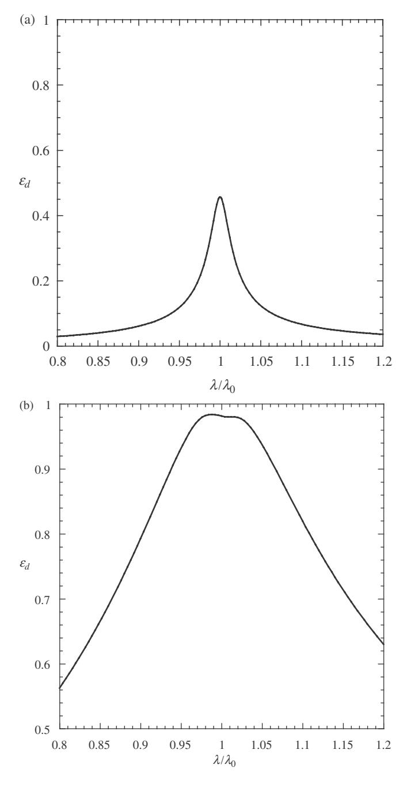

Figure 15.6 (a) Emittance spectrum of a particulate material with an absorption band of Lorentzian shape that is sufficiently weak that it is entirely within the volume scattering region. The center of the band is located at λ0. (b) Same as for Figure [15.6a](#page-0-0) except that the band center is in the weak surface-scattering region. (c) Same as for Figure [15.6a](#page-0-0) except that the band center is in the strong surfacescattering region.

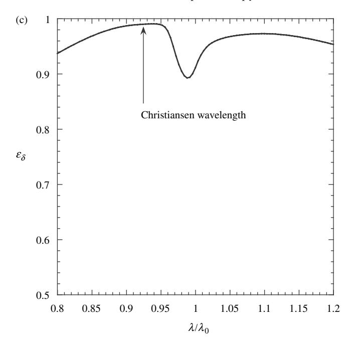

Figure 15.6 (*cont.*)

less intense bands between 16.5 and 25µm associated with Si—O—Si bending vibrations. In between the two bands the particles are in the volume-scattering region, which produces a maximum in reflectance and a minimum in emissivity. This emissivity minimum is called the *transparency feature.* The Christiansen and transparency features in quartz are illustrated in Figure [15.7.](#page-0-0)

Logan *et al.*[\(1973\)](#page-0-0), Salisbury and Walter[\(1989\)](#page-0-0), andWalter and Salisbury [\(1989\)](#page-0-0) have shown that the wavelengths of the Christiansen and transparency features of a substance are diagnostic of composition, and they have emphasized the potential of this technique for remote sensing in the thermal infrared. Thus, the Christiansen and transparency features are correlated with each other and are diagnostic of composition. Figure [15.8](#page-0-0) shows this correlation.

### *15.6.4 Deconvolution of emissivity spectra of mixtures*

It was emphasized in Chapters [10](#page-0-0) and [14](#page-0-0) that the reflectance of a mixture is a nonlinear function of the abundances of the end members because of the nonlinear dependence of the reflectance on single-scattering albedo. However, this nonlinearity is caused by the multiply scattered component, so that for low-albedo materials the reflectance is almost linear. In spectral regions where a strong absorption band

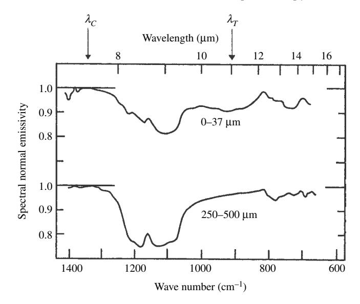

Figure 15.7 Spectral emissivities of quartz powders of different sizes and packings. The arrows show the locations of the Christiansen wavelength and the transparency feature (denoted by λ*C* and λ*T* , respectively). (Reproduced from Conel [\[1969](#page-0-0)], copyright [1969](#page-0-0) by the American Geophysical Union.)

is displayed as an emissivity minimum the single-scattering albedo is inherently small. Thus, to a good approximation the emissivity of a mixture is a linear function of its end members in those regions. This allows the identification of the individual minerals in planetary regoliths from measurements of thermal IR emissivity using linear deconvolution and comparison with spectra of candidate minerals (Ramsey and Christensen, [1998](#page-0-0)). Many commercial software packages contain linear deconvolution algorithms.

### *15.6.5 Contrast in emissivity bands*

In general, the contrasts in absorption bands observed in emissivity spectra are much smaller than the contrasts observed in reflectance, particularly in specular reflection from a polished surface. This point has been strongly emphasized by Conel [\(1969](#page-0-0)). Thus, there is an unfortunate paradox that often limits the usefulness of emittance spectroscopy for compositional remote sensing. In spite of the fact that the compositionally diagnostic restrahlen absorption bands are strong in the thermal infrared, the emissivity contrast that can be observed in a particulate medium may be very small. There are several reasons for the loss of contrast.

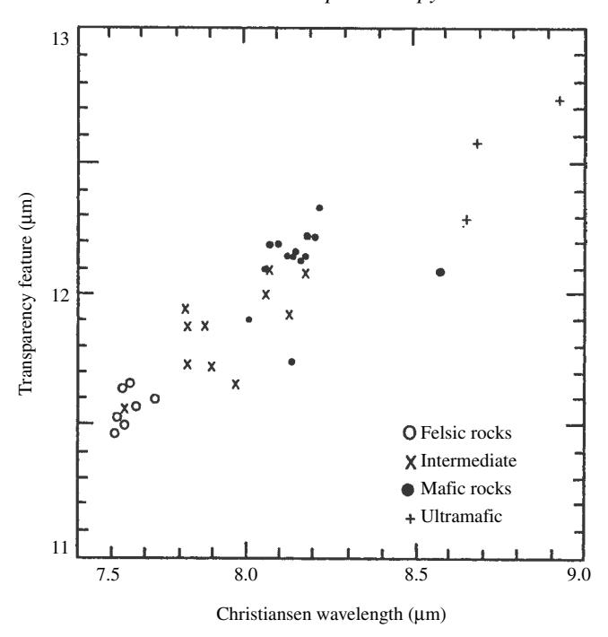

Figure 15.8 Correlation between the Christiansen wavelength and the transparency feature for silicates of different compositions. (Reproduced fom Salisbury and Walter [\[1989\]](#page-0-0), copyright [1989](#page-0-0) by the American Geophysical Union.)

First, as the particle size in a medium decreases, the contrast in the vicinity of the very strong *Reststrahlen* bands may decrease also (Hunt and Vincent, [1968;](#page-0-0) Salisbury, [1993\)](#page-0-0) asthe bands move from the strong into the weak surface-scattering region. If grinding moves the band all the way into the volume-scattering region, a restrahlen band may be expressed as a dip in large particles and as a peak in fine ones (Arnold and Wagner, [1988\)](#page-0-0). If the medium consists of a mixture of coarse and fine particles, such effects may cause the bands to be almost unobservable.

Further complicating this discussion is the fact that many media have particles that are smaller than the wavelength in the thermal IR. The particle efficiencies and single-scattering albedos are reasonably well understood when their sizes are large compared with λ. As was discussed in Chapter [7,](#page-0-0) when '*D*( % λ, it is not clear what effective particle size and refractive index should be used for the calculation of *w* in the radiative-transfer equation. However, the spectra seem to behave qualitatively as predicted from the assumption that the scattering from each particle is incoherent and quasi-independent of that from other particles. As seen in Chapter [5,](#page-0-0) absorbing particles smaller than the wavelength are almost perfect absorbers, which is equivalent to being almost perfect emitters, independent of wavelength.

Second, as the particle emissivity decreases, the particle albedo increases, thus increasing the multiple scattering within the medium. It is sometimes stated in the literature that the loss of contrast is caused by void spaces in the medium acting like thermodynamic enclosures. However, this is a misleading physical picture. The loss of contrast occurs because the increased multiple scattering partly cancels the decreased emissivity.

Third, the loss of contrast in the *Reststrahlen*-band region can be seen from the mathematical form of the dependence of emissivity on single-scattering albedo. For example, consider  $\varepsilon_h$ . Figure 15.5 shows that  $\varepsilon_h$  is a monotonic, nonlinear function of w. When w is small,  $\varepsilon_h$  is large, and vice versa. The slope of the curve is small when w is small, and large when w is close to 1. Thus, a high spectral contrast is observed when  $w \sim 1$ , but the contrast is much smaller when  $w \ll 1$ .

Let us compare the contrast when an absorption band is observed in reflectance with that when it is observed in emittance. For a low-albedo material the bidirectional reflectance of a particulate medium is directly proportional to w, so that a change  $\Delta w$  will cause a relative change in reflectance  $\Delta r/r \simeq \Delta w/w$ . This contrast can be quite large since w is smaller than 1. However, differentiating (15.20) with respect to w gives

$$\frac{1}{\varepsilon_d} \frac{d\varepsilon_d}{dw} = -\frac{1}{2\gamma^2 (1 + 2\gamma \mu)}.$$

Thus.

$$\frac{\Delta \varepsilon_d}{\varepsilon_d} = -\frac{\Delta w}{2[1-w][1+2\sqrt{1-w}\mu]}.$$

If  $w \ll 1$  and  $\mu \simeq 1$ ,  $\Delta \varepsilon_d / \varepsilon_d \simeq \Delta w / 6$ , which can be quite small.

If both reflectance and emittance are important, thermal emission will partially fill in an absorption band being observed in reflectance. The following is an example of the magnitude of this effect, calculated from equation (15.32) for a medium of isotropic scatterers. Suppose an asteroid at 3 AU from the Sun has a surface temperature of 200 K. The asteroid is illuminated by sunlight, which has the spectrum of a black body at a temperature of 5770 K. Suppose that the regolith has a single-scattering albedo w=0.50, except in an absorption band, where w=0.40 at the center of the band.

Figure 15.9 plots the band contrast [I(continuum) - I(band center)]/[I(continuum)] of the radiance emerging from the surface versus the wavelength of the band. If the band is shorter than about  $4\mu\text{m}$ , thermal emission is negligible compared with scattered sunlight, and the band is seen with its full contrast. As the wavelength of the band increases, thermal emission fills in the band and decreases the contrast, until the band becomes unobservable at  $5.8\,\mu\text{m}$ . For wavelengths longer than about  $6\,\mu\text{m}$  the contrast is negative; that is, the radiance is dominated by thermal emission, and the band manifests itself as a weak maximum rather than a strong minimum.

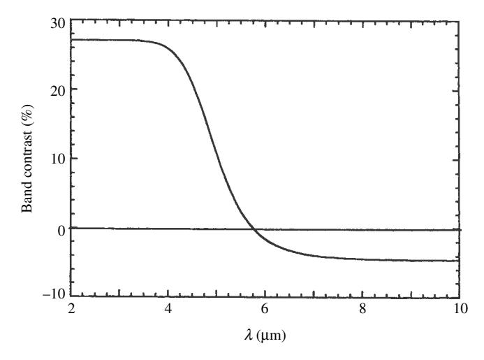

Figure 15.9 Change in the contrast of an absorption band as the band center moves from a wavelength where the emitted radiance is dominated by reflectance to domination by thermal emission.

# **15.7 The thermal shadow-hiding opposition effect: thermal beaming** *15.7.1 The thermal SHOE*

Both the shadow-hiding and coherent-backscatter mechanisms for an opposition effect require a preferred direction. For radiation produced by reflectance the incident irradiance provides that direction. However, there is no preferred direction for thermally emited radiance so that pure thermal radiation cannot have an opposition effect. However, a type of SHOE can occur if the temperature of a medium is maintained by the incident irradiance, usually sunlight, and one part of the medium can cast a shadow on another part. Then at any phase angle except zero a thermal radiation detector sees a mixture of hot illuminated surfaces and cold shadows, but at zero phase angle it sees no shadows.

In order for a medium to have an appreciable thermal opposition effect two conditions must be met. First, the portions of the medium that radiate to space must be able to change temperature sufficiently rapidly that they can stay approximately in phase with the illumination. That is, the medium must have a small thermal inertia (see Chapter [16\)](#page-0-0). Second, the shadows must be so cold that thermal radiation from them is small compared with the illuminated regions.

The second condition implies that the illuminated and shadowed regions of the medium must be sufficiently well insulated from one another that large temperature differences can be maintained. For bodies with fine-grained regoliths, like the Moon, thermal conduction prevents appreciable temperature differences from existing between different parts of one particle or between adjacent particles of the soil. Hence, for these bodies a thermal opposition effect can only be produced by shadows cast by large-scale surface irregularities, not interparticle shadowing.

The power of the incident sunlight reflected by a unit area of a surface in all directions is  $J\mu_0 r(\mu_0)$  and the power absorbed is  $J\mu_0[1-r(\mu_0)]$ . The power thermally radiated in all directions is  $\varepsilon_h V(T)$ . If the surface is in radiative equilibrium, the absorbed and radiated powers are equal so that

$$V(T) = J \frac{\mu_0}{\varepsilon_h} [1 - r_h(\mu_0)]. \tag{15.34}$$

The power emitted by the unit area into a given direction is

$$\frac{dP_{em}}{dA} = \frac{\mu}{\pi} \varepsilon_d(\mu) V(T) = \frac{J}{\pi} \mu \mu_0 \frac{\varepsilon_d(\mu)}{\varepsilon_h} [1 - r_h(\mu_0)], \tag{15.35}$$

so that the emitted radiance is

$$I(i, e, g) = \frac{dP_{em}}{d\Omega} = \frac{J}{\pi} \mu_0 \frac{\varepsilon_d(\mu)}{\varepsilon_h} [1 - r_h(\mu_0)]. \tag{15.36}$$

This constitutes a kind of visual-thermal bidirectional "reflectance"

$$r_{vis-th}(i,e,g) = \frac{1}{J} \frac{dP_{em}}{d\Omega} = \frac{\mu_0}{\pi} \frac{\varepsilon_d(\mu)}{\varepsilon_h} [1 - r_h(\mu_0)]. \tag{15.37}$$

For a medium of isotropic scatterers,  $\varepsilon_d = \gamma H(\mu)$ ,  $\varepsilon_h = 2\gamma H_1$ , and  $r_h = 1 - \gamma H(\mu_0)$ , so

$$r_{vis-th}(i, e, g) = \frac{\gamma}{2\pi} \mu_0 H(\mu_0) H(\mu) / H_1.$$
 (15.38)

It was shown in Chapter 12 that the reflectance of a medium with a macroscopically smooth surface can be corrected for large-scale roughness by replacing the cosines by effective cosines (indicated by subscript e) and multiplying the smooth-surface reflectance by the shadowing function  $\mathcal{S}(\mu_0, \mu, \psi)$  where these quantities are derived in Chapter 12. Thus,

$$r_{vis-th}(i,e,g) = \frac{\mu_{0e}}{\pi} \frac{\varepsilon_d(\mu_e)}{\varepsilon_h} [1 - r_h(\mu_{0e})] \mathcal{S}(\mu_0,\mu,\psi). \tag{15.39}$$

This equation describes the thermal SHOE of a rough surface.

Expressions for the visual–thermal "physical albedo" and "phase integral" of a spherical body can be developed in a similar manner. If the surface is rough the phase integral will include the factor  $\mathcal{K}(g,\overline{\theta})$  (Chapter 12), which thus describes the thermal SHOE of the integrated IR radiance from the body.

An interesting example of a thermal SHOE peak was observed in the rings of Saturn by a detector aboard the *Cassini* spacecraft (Altobelli *et al.*, 2009). This peak is about 40° wide (Figure 15.10) and is believed to be caused by shadows cast by

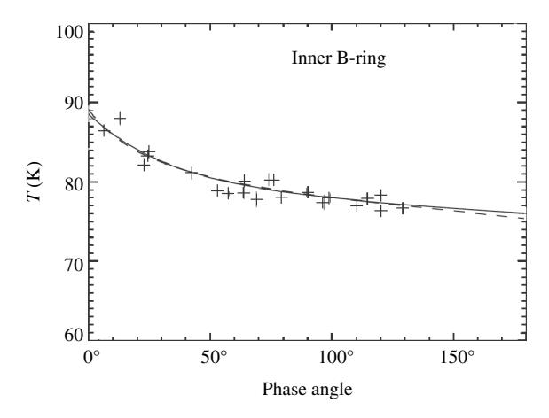

Figure 15.10 The thermal opposition effect in Saturn's B-ring observed by*Cassini*. The crosses are the observations; the solid line is a simple linear plus exponential function; the dashed line is from the SHOE model of Chapter [9.](#page-0-0) (Reproduced from Altobelli *et al.* [\[2009\]](#page-0-0), copyright [2009](#page-0-0) by the American Geophysical Union.)

one ring particle falling on another. It is different from the narrow visual opposition effect of Figures [9.3](#page-0-0) and [9.15,](#page-0-0) which is believed to be due to CBOEs in the surface structures of the individual ring particles. Thus, this thermal opposition surge is an example of a medium in which the particles are not in contact, and so are well insulated from one another. In this case the thermal SHOE can be described by the expressions for the SHOE in the reflectance of a layer of particles, equations [\(9.19\)](#page-0-0) and [\(9.20\)](#page-0-0).

### *15.7.2 Thermal beaming*

The radiometric technique (Morrison and Lebofsky, [1979\)](#page-0-0) is a major method for determining the diameters and physical albedos of objects that are too small to be resolved. It is especially important in the study of asteroids and the smaller moons of the outer planets. This method involves comparing measured radiances in the visible and thermal IR from the object at small phase angle.

Assume that a body of radius *R* rotates sufficiently slowly that the surface is in radiative equilibrium with incident sunlight. The power of the sunlight scattered into zero phase is, by definition of the physical albedo,

$$P_V = J\pi R^2 \frac{1}{\pi} A_p = JR^2 A_p = JR^2 \frac{A_S}{q}$$
 (15.40)

where *Ap* is the visual physical albedo, *q* = *Ap/AS* is the visual phase integral, and *AS* is the visual spherical or Bond albedo.

The thermal power radiated by the body into zero phase angle is from equation [\(15.35\)](#page-0-0)

$$P_T = \int_A \frac{dP_{em}}{dA} (i = e, e, g = 0) dA = \int_0^{\pi/2} \frac{J}{\pi} \mu^2 \frac{\varepsilon_d(\mu)}{\varepsilon_h} [1 - r_h(\mu)] 2\pi R^2 \sin e de$$

$$= 2JR^2 \int_0^1 \frac{\varepsilon_d(\mu)}{\varepsilon_h} [1 - r_h(\mu)] \mu^2 d\mu.$$
(15.41)

Taking the ratio of equations [\(15.41\)](#page-0-0) to [\(15.40\)](#page-0-0) gives

$$\frac{P_T}{P_V} = 2\frac{q}{A_S} \int_0^1 \frac{\varepsilon_d(\mu)}{\varepsilon_h} [1 - A_h(\mu)] \mu^2 d\mu.$$
 (15.42)

The so-called *standard model* assumes that Ψ*d (µ)* is constant and equal to Ψ*h*, and *Ah(µ*0*)* is constant and equal to *AS*. In that case the integral in equations [\(15.41\)](#page-0-0) and [\(15.42\)](#page-0-0) can be evaluated to give

$$P_T = \frac{2}{3}R^2J(1 - A_S), \tag{15.43}$$

and

$$\frac{P_T}{P_V} = \frac{2}{3}q \frac{1 - A_S}{A_S}. (15.44)$$

A value for *q* is assumed (usually the lunar value) and *AS* found from the measured values of *PT* and *PV* using equation [\(15.44\)](#page-0-0). Then *R* is found from equation [\(15.43\)](#page-0-0) and *Ap* from *AS*/*q*.

However, when applied to bodies whose properties are known the standard model yields radii that are systematically too large and albedos that are too small. To correct for departures from the assumptions of the standard model a concept called *thermal beaming* is introduced. This assumes that a body possesses an opposition effect in the infrared similar to that in the visible. The directional emissivity at zero phase in equation [\(15.42\)](#page-0-0) is multiplied by an empirical parameter, the *thermal beaming factor* /, while keeping Ψ*d* = Ψ*h* and *rh* = *AS*. Then equations [\(15.43\)](#page-0-0) and [\(15.44\)](#page-0-0) become

$$P_T = \frac{2}{3\eta} R^2 J (1 - A_S) \tag{15.45}$$

and

$$\frac{P_T}{P_V} = \frac{2}{3} q \frac{1 - A_S}{\eta A_S}. (15.46)$$

The factors / and *q* are found by fitting these equations to observations of the Moon, the Galilean satellites, and asteroids whose sizes and albedos are known (Lebofsky *et al.*, [1986\)](#page-0-0) and assuming that they are similar for other bodies. Then the values of *R*, *AS*, and *Ap* can be found from measurements of *PV* and *PT* as before.

Spencer [\(1990\)](#page-0-0) has shown that the thermal beaming factor can readily be accounted for by a thermal SHOE due to unresolved surface roughness (see equation [\[15.39\]](#page-0-0)).