# The bidirectional reflectance of a semi-infinite medium

## **8.1 Introduction**

In the following chapters a variety of expressions for several different types of reflectances and related quantities frequently encountered in remote sensing and diffuse reflectance spectroscopy will be given, including empirical formulae, and solutions to the equation of radiative transfer. Approximate analytic solutions to the radiative-transfer equation will be developed. As was discussed in Chapter [1,](#page-15-0) even though such analytic solutions are not exact, they are useful because there is little point in doing a detailed, exact calculation of the reflectance from a medium when the scattering properties of the particles that make up the medium are unknown and the absolute accuracy of the measurement is not high. In most of the cases encountered in remote sensing an approximate analytic solution is much more convenient and not necessarily less accurate than a numerical computer calculation.

In keeping with this discussion, polarization will be ignored in the derivations. This neglect is justified because most of the applications of interest involve the interpretation of remote-sensing or laboratory measurements in which the polarization of the incident irradiance is usually small. Although certain particles, such as Rayleigh scatterers or perfect spheres, may polarize the light strongly at some angles, the particles encountered in most applications are large, rough, and irregular, and the polarization of the light scattered by them is relatively small (Liou and Schotland, [1971](#page--1-0); see also Chapter [6\)](#page--1-0). Hence, to first order, both the incident radiation and scattered radiation may be assumed to be unpolarized.

## **8.2 Reflectances**

In this book we wish to develop formalisms that will allow the estimation of properties of a medium from the way it scatters or emits electromagnetic radiation from its upper surface. The terms *reflectance* and *reflectivity* both refer to the fraction of incident light scattered or reflected by a material. Although they are sometimes

Table 8.1. *Types of reflectances and their symbols*

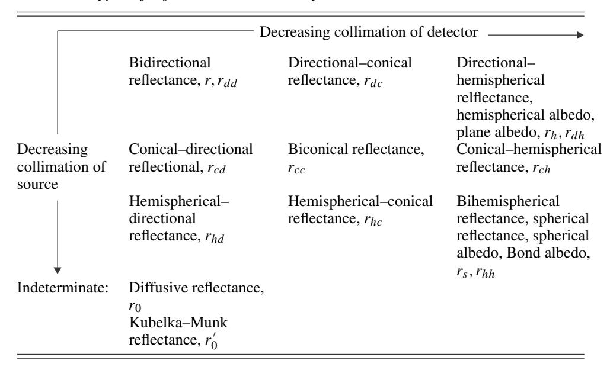

used interchangeably, *reflectance* has the connotation of the diffuse scattering of light into many directions by a geometrically complex medium, whereas*reflectivity* refers to the specular reflection of radiation by a smooth surface. Reflectivity was discussed in detail in Chapter [4,](#page--1-0) and reflectance will be the topic of the next several chapters.

There are many kinds reflectance, depending on the geometry, so that the term must be appropriately qualified to be unambiguous. In modern usage (Nicodemus, [1970;](#page--1-0) Nicodemus *et al.*, [1977\)](#page--1-0) the word is preceded by two adjectives, the first describing the degree of collimation of the source, and the second that of the detector. The usual adjectives are *directional*, *conical*, or *hemispherical*. For example, the directional–hemispherical reflectance is the total fraction of light scattered into all directions in the upward-going hemisphere by a surface illuminated from above by a highly collimated source. If the two adjectives are identical, the prefix *bi-* is used. Thus, the bidirectional reflectance is the same as the directional–directional reflectance. The various reflectances and the symbols that will be used to represent them in this book are summarized in Tabl[e 8.1.](#page--1-0)

In reality, all measured reflectances are biconical, because neither perfect collimation nor perfect diffuseness can be achieved in practice. However, many situations in nature approach the ideal sufficiently that the other quantities are useful approximations. To give several examples: because the Sun subtends only 0*.*5! as seen from Earth, sunlight can be treated as collimated in most applications, whereas light scattered by clouds on an overcast day is nearly diffuse; thus, on a clear, sunny day, the eye looking at the ground perceives bidirectional reflectance, whereas on an overcast day it perceives hemispherical–directional reflectance. A photosensitive device on a high-altitude aircraft or spacecraft measures the bidirectional reflectance of the ground or clouds. The temperature of the surface of a planet is determined by a balance between the thermally emitted infrared radiation and the sunlight absorbed by the surface; the latter quantity is the difference between the incident sunlight and the product of the sunlight and directional–hemispherical reflectance. The reader is invited to think of other examples of different types of reflectance.

Even within the general framework of definitions given earlier there is still a certain amount of arbitrariness in the way the various reflectances can be defined. For instance, a given type of reflectance may be defined either in terms of power per unit surface area of the medium or in terms of radiances, which are power per unit area perpendicular to the direction to the source or detector.

In general, I have tried to use definitions that are the most intuitively obvious or those that result in the simplest mathematical expressions for the reflectances. Nicodemus *et al.* [\(1977](#page--1-0)) have suggested a system of definitions and notation that is in wide use. Although I have tried to follow that system where convenient, some of the definitions used here differ from those of Nicodemus and associates. Sometimes a symbol proposed by those authors is already being widely used to represent a different quantity. For instance, Nicodemus and associates propose using ρ as the symbol for reflectance. However, ρ is already commonly use to denote mass density; thus, I use *r* for reflectance.

In general, two subscripts are added to *r* to indicate the degrees of collimation of the source and detector (e.g., *rdh* = directional–hemispherical reflectance). However, although this terminology is precise, it is unwieldy. Hence, whenever the meaning is unambiguous, the following contractions will be used. (1) The bidirectional reflectance, denoted by *rdd* , occurs so often in this book that the simple symbol *r* with no subscript will be used for it most of the time. (2) Most commercial reflectance spectrometers measure the directional–hemispherical reflectance, denoted by *rdh*, but this quantity is also widely used in astrophysics, where it is called the hemispherical albedo and the plane albedo. Thus, for convenience, it will frequently be referred to simply as the *hemispherical reflectance* and denoted by *rh*. (3) In Chapter [10](#page--1-0) it will be shown that the bihemispherical reflectance, denoted by *rhh*, is equivalent to a quantity known in astrophysics as the spherical reflectance, spherical albedo, and Bond albedo. Hence, the bihemispherical reflectance will be called the *spherical reflectance* and denoted by *rs*.

An approximate analytic expression for the bidirectional reflectance of a particulate medium of infinite thickness will be derived and discussed in detail in this chapter. The opposition effect will be deferred until Chapter [9.](#page-0-0) The effect of large-scale surface roughness is treated in Chapter [10.](#page-0-0) The reflectances that involve integration over hemispheres are discussed in Chapter [11.](#page-0-0) In the remote sensing of bodies of the solar system, several additional types of reflectances are in use and are referred to as albedos and phase functions. These will be defined and considered in detail in Chapter [11](#page-0-0) also.

## **8.3 Geometry and notation**

The geometry and nomenclature that will be used in the remainder of the book are defined in this section. The geometry is illustrated schematically in Figure [8.1.](#page-0-0) Collimated light (irradiance) *J* from a source of radiation is incident on the upper surface of a scattering medium. The normal **N** to the surface is parallel to the *z*-axis, and the direction to the source makes an angle *i* with **N**. The light interacts with the medium, and some of the rays emerge from an element ζ*A* of the surface traveling toward a detector in a direction that makes an angle *e* with **N**. The plane containing the incident ray and **N** is the *plane of incidence*, and that containing the emerging ray and **N** is the *plane of emergence*. The azimuthal angle between the planes of incidence and emergence is ψ. The angle between the directions to the source and detector as seen from the surface is the phase angle *g*. The plane containing the incident and emergent rays is the *scattering plane*. If the planes of emergence and

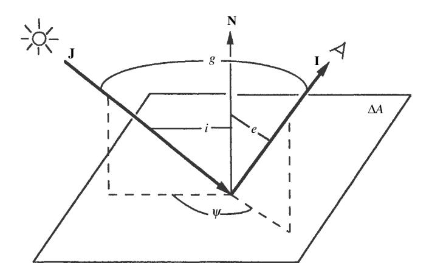

Figure 8.1 Schematic diagram of bidirectional reflectance from a surface element ζ*A*, showing the various angles. The plane containing **J** and **I** is the scattering plane. If the scattering plane also contains **N**, it is called the principal plane.

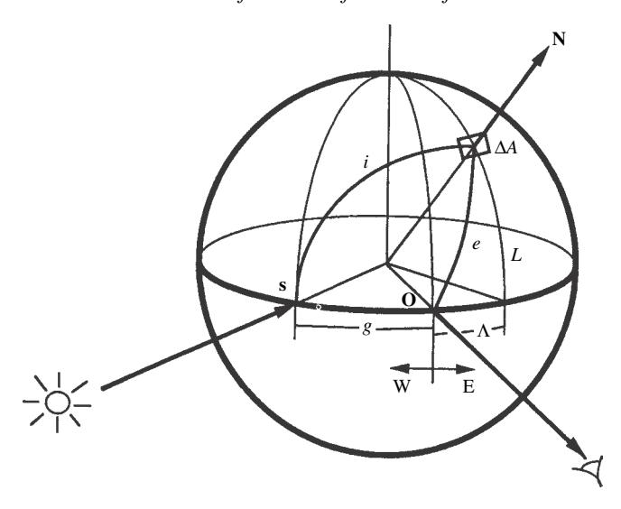

Figure 8.2 Schematic diagram of luminance coordinates on a spherical planet.

incidence coincide *(*ψ = 0 or 180!*)*, their common plane is called the *principal plane*.

As in Chapter [7,](#page-0-0) a commonly used notation, which will be followed in this book, is to let

$$\mu = \cos e, \ \mu_0 = \cos i. \tag{8.1}$$

In general, three angles are needed to specify the geometry. The angles usually used in terrestrial remote-sensing or laboratory applications are *i*, *e*, and ψ. However, most planetary applications specify *i*, *e*, and *g*, the reason being that in a spacecraft or telescopic image of a planet, often *g* is nearly constant over the entire image. The scattering angle θ may be used instead of *g*.

When ζ*A* is located on the surface of a spherical body, it is sometimes convenient to specify the angles by *luminance* or *photometric coordinates*, which consist of the luminance longitudeΨ, luminance latitude *L*, and phase angle *g*. This spherical coordinate system, which has nothing to do with the geographic coordinates on the planet, is illustrated in Figure [8.2.](#page-0-0) The luminance equator is the great circle on the surface of the planet containing the sub-source point **S** and sub-observer point **O**. The luminance axis is the diameter perpendicular to the luminance equator. The phase is positive if **S** is to the left of **O**, and negative if to the right, as seen by the observer. The prime luminance meridian passes through **O**. Luminance east and positive longitudes are to the right of **O**; luminance west and negative longitudes are to the left of **O**.

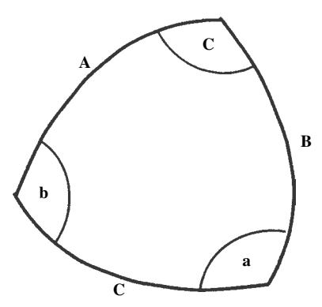

Figure 8.3 Spherical triangle.

The relationships among the various coordinate systems may be found using the law of cosines for spherical triangles. Suppose a triangle whose sides are great circles on the surface of a sphere has sides **A**, **B**, and **C**, which are separated by interior angles **a**, **b**, and **c** (Figure 8.3).

The law of cosines states that

$$\cos \mathbf{C} = \cos \mathbf{A} \cos \mathbf{B} + \sin \mathbf{A} \sin \mathbf{B} \cos \mathbf{c}. \tag{8.3}$$

Identical relations hold between the other sides and angles. Applying the law of cosines to the triangle  $SO\Delta A$  in Figure 8.2 gives

$$\cos g = \cos i \cos e + \sin i \sin e \cos \psi. \tag{8.4}$$

Applying the law to the triangle  $SE \triangle A$  gives

$$\cos i = \cos(\Lambda + g)\cos L, \tag{8.5}$$

and to the triangle  $OE\Delta A$ ,

$$\cos e = \cos \Lambda \cos L. \tag{8.6}$$

When  $g \ge 0$ , the *terminator*, the boundary between day and night, is located along the meridian of luminance longitude where  $i = \pi/2$ , corresponding to  $\Lambda = \pi/2 - g$ , and the bright limb occurs at  $e = \Lambda = -\pi/2$ .

#### 8.4 The radiance at a detector viewing a horizontally stratified medium

In most laboratory and remote-sensing applications the quantity of interest is the radiance received by a detector viewing a horizontally stratified, optically thick medium of particles that may scatter, absorb, and emit. The geometry is indicated schematically in Figure 8.4. Let *z* be the vertical distance on the axis perpendicular

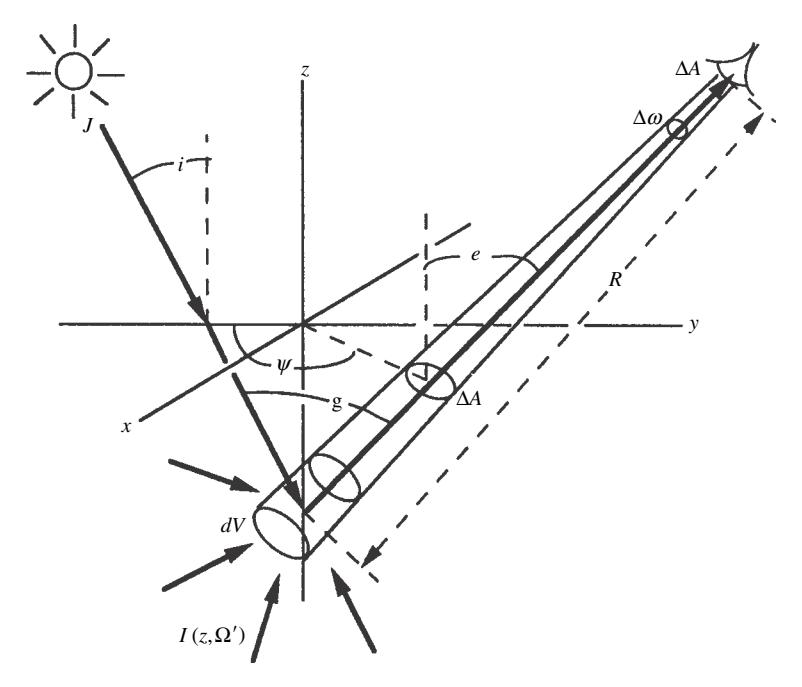

Figure 8.4 Geometry of scattering from within a particulate medium. The nominal surface of the medium is the x-y plane. Add distance Q.

to the planes of stratification. The distribution of particles with altitude z is arbitrary, except that the particle density  $N \to 0$  as  $z \to \infty$ , corresponding to  $\tau \to 0$ . The space above the  $\tau = 0$  level is empty except for a distant source of collimated irradiance J that illuminates the medium and a detector that views the medium. The sensitive area of the detector is  $\Delta a$ , and it responds to light that is incident only within a small solid angle  $\Delta \omega$  from a direction making an angle e with the vertical. The detector views an area  $\Delta A$  on the  $\tau = 0$  level of the medium a distance  $R_0$  away. (To avoid clutter  $R_0$  is not shown on the figure.)

Let the power emerging from  $\Delta A$  in a direction  $\Omega$  toward the detector be  $\Delta P$ . The projected area perpendicular to  $\Omega$  is  $\Delta A \mu$ , and the solid angle subtended at  $\Delta A$  by the detector is  $\Delta \Omega = \Delta a/R_0^2$ . Then the radiance emerging from the surface is

$$I(0,\Omega) = \frac{\Delta P}{(\Delta A \mu) \Delta \Omega} = \frac{\Delta P}{(\Delta A \mu) (\Delta a / R_0^2)}.$$
 (8.7)

Now, the solid angle subtended by  $\Delta A$  at the detector is  $\Delta \omega = \Delta A \mu / R_0^2$ , so that the radiance at the detector is

$$I_D = \frac{\Delta P}{\Delta a \Delta \omega} = \frac{\Delta P}{\Delta a (\Delta A \mu / R_0^2)} = I(0, \Omega). \tag{8.8}$$

Thus the radiance at the detector is equal to the radiance emerging from the surface of the medium in the direction of the detector. Now, *ID* =*I (*0*,*)*)* is the power emitted by the medium into unit solid angle about a direction making an angle *e* with the vertical per unit area perpendicular to this direction. The projection of this unit area onto the apparent surface has area sec *e*. Hence, the power emitted into unit solid angle from unit area of the apparent surface of the medium is

$$Y(0,\Omega) = I(0,\Omega)/\sec e = I(0,\Omega)\mu. \tag{8.9}$$

## **8.5 Empirical reflectance expressions**

## *8.5.1 Lambert's law (the diffuse-reflectance function)*

Before deriving more rigorous solutions for the reflectances several empirical expressions that are widely used because of their mathematical simplicity will be presented. The first of these is known as Lambert's law and is the simplest and one of the most useful analytic bidirectional reflectance functions. Although no natural surface obeys Lambert's law exactly, many surfaces, especially those covered by bright, flat paints, approximate the scattering behavior described by this expression.

Lambert's law is based on the empirical observation that the brightnesses of many surfaces are nearly independent of the direction from which the surface is viewed, that is, they are independent of *e* and ψ, and also on the fact that the brightness of any surface must be proportional to the amount of light incident on each unit area and, hence, proportional to cos *i*. Because light scattering is a linear process, the scattered radiance *I (i, e,*ψ*)* must be proportional to the incident irradiance *J* . Thus, the bidirectional reflectance of a surface that obeys Lambert's law is defined to be

$$r_{\rm L}(i, e, \psi) = I(i, e, \psi)/J = K_{\rm L} \cos i,$$
 (8.10)

where *K*L is a constant.

From equation [\(8.9\)](#page-0-0) the total power scattered by unit area of a Lambert surface into all directions of the upper hemisphere is

$$P_{L} = \int_{2\pi} I(i, e, \psi) \mu d\Omega = \int_{e=0}^{\pi/2} \int_{\psi=0}^{2\pi} JK_{L} \cos i \cos e \sin e \, de \, d\psi = \pi JK_{L} \mu_{0}.$$
(8.11)

Since the incident power per unit surface area is *J µ*0, the fraction of the incident irradiance scattered by unit area of the surface back into the entire upper hemisphere is the *Lambert albedo A*L = *P*L*/J µ*0 = *K*Lς, so that *K*L = *A*L*/*ς. Thus, Lambert's law is *I (i, e,*ψ*)* = *(J/*ς*)A*L*µ*0*,*, and the Lambert reflectance is

$$r_{\rm L}(i, e, \psi) = \frac{1}{\pi} A_{\rm L} \mu_0,$$
 (8.12)

where  $A_{\rm L}$  is the directional-hemispherical reflectance of a Lambert surface. A surface whose scattering properties can be described by Lambert's law is called a *diffuse surface* or *Lambert surface*. If  $A_{\rm L}=1$ , the surface is a *perfectly diffuse surface*.

Lambert's law is widely used as a mathematically convenient expression for the bidirectional reflectance when modeling diffuse scattering. In fact, it does provide a reasonably good description of the reflectances of high-albedo surfaces, like snow or flat, light-colored paint, but the approximation is poor for dark surfaces, such as soils or vegetation.

#### 8.5.2 Minnaert's law

The power emitted per unit surface area per unit solid angle by a medium obeying Lambert's law is  $Y = Jr_{\rm L}\mu_0 = (J/\pi)A_{\rm L}\mu_0\mu$ . In this expression the reflected power per unit area is proportional to  $(\mu_0\mu)^1$ . Minnaert (1941) suggested generalizing Lambert's law so that the power emitted per unit solid angle per unit area of the surface be proportional to  $(\mu_0\mu)^{\upsilon}$ . This leads to a bidirectional reflectance function of the form

$$r_{\rm M}(i, e, \psi) = A_{\rm M} \mu_0^{\upsilon} \mu^{\upsilon - 1},$$
 (8.13)

where  $A_{\rm M}$  and  $\upsilon$  are empirical constants. Equation (8.13) is known as Minnaert's law,  $\upsilon$  is the Minnaert index, and  $A_{\rm M}$  is the Minnaert albedo. If  $\upsilon=1$ , Minnaert's law reduces to Lambert's law, and  $A_{\rm M}=A_{\rm L}/\pi$ .

It is found empirically that Minnaert's law approximately describes the variation of brightness of many surfaces over a limited range of angles (cf. Thorpe, 1973; Veverka *et al.*, 1978c; McEwan, 1991), provided that  $A_{\rm M}$  and  $\upsilon$  are both allowed to be functions of phase and azimuth angles. However, the general law breaks down completely at the limb of a planet where  $e=90^\circ$ : If  $\upsilon<1$  the calculated brightness becomes infinite, and if  $\upsilon>1$  the limb brightness is zero, neither of which agrees with observations of any real body of the solar system.

#### 8.5.3 The general Lommel–Seeliger law

We have already encountered the Lommel–Seeliger law in Chapter 6. It will be derived later in this chapter, but is included here for completeness and because it approximately describes dark particulate surfaces, like the Moon (Hapke, 1963). The general Lommel–Seeliger law is

$$r_{\rm LS} = K_{\rm LS} \frac{\mu_0}{\mu_0 + \mu} f(g),$$
 (8.14)

where  $K_{LS}$  is a constant and f(g) is a function of phase angle.

#### 8.5.4 Combined Lambert-Lommel-Seeliger law

Since Lambert's law provides a rough description of surfaces of high albedo and the Lommel–Seeliger law of low-albedo surfaces, several persons (e.g., Buratti and Veverka, 1985; McEwan, 1991) have suggested combining them into a relation of the form

$$r_{\text{LLS}} = K_{\text{LLS}} \frac{\mu_0}{\mu_0 + \mu} f(g) + (1 - K_{\text{LLS}}) \mu_0.$$
 (8.15)

# 8.6 The diffusive reflectance 8.6.1 Equations

To introduce the two-stream method of solution of the equation of radiative transfer, we will now derive one of the simplest and most useful expressions in reflectance theory, the *diffusive reflectance*. In spite of the fact that this expression is an approximation, its mathematical simplicity allows analytic expressions to be obtained for a variety of scattering problems. These expressions provide surprisingly good first-order estimates in many applications.

In a very large number of papers in the literature involving the scattering of light within and from planetary surfaces and atmospheres, high-precision numerical techniques have been used to obtain answers that could have been calculated to a satisfactory degree of accuracy much more conveniently using the diffusive reflectance. In addition, it will be seen that the diffusive reflectance appears in the mathematical expressions for several other types of reflectances, or that other reflectances reduce to it at special angles. Thus, the diffusive reflectance is representative of solutions of the radiative-transfer equation. An expression known as the Kubelka–Munk equation, which is widely used to interpret reflectance data, will be seen in Chapter 11 to be a form of the diffusive reflectance.

The problem to be solved is the following. Radiant powder  $P_{inc} = \pi I_0$  is incident on each unit area of a plane corresponding to  $\tau=0$  that separates an empty upper half-space from an infinitely thick lower half-space filled with a medium that scatters and absorbs light. The collimation of the incident light is unspecified. The simplifying assumption that characterizes the diffusive-reflectance formalism is that the incident radiance does not penetrate directly into the medium, but rather that as soon as the incident radiance crosses the  $\tau=0$  level it is converted into one with an angular distribution that is uniform in all directions in the downward-going hemisphere. Because it is assumed that there are no incident or thermal sources of radiance within the medium, the source function in the radiative-transfer equation  $F(\tau,\Omega)=0$ . The problem is to find the radiance inside the medium and the scattered radiance emerging from the  $\tau=0$  plane in the upward direction into the upper half-space.

With these conditions the multistream approximation for the *j* th region, equation [\(7.49\)](#page-0-0), becomes

$$-\mu_{j}dI_{j}(\tau)/d\tau = -I_{j}(\tau) + (w/4\pi)\sum_{k=1}^{N} \Delta\Omega_{k} P_{kj}I_{k}(\tau).$$
 (8.16)

We will use the two-stream approximation, so that *N* = 2. The two regions in the directional solid angle are chosen to be the upward-going hemisphere, denoted by *j* = 1, and the downward-going hemisphere, denoted by *j* = 2. Then ζ)1 = ζ)2 = 2ς*,* and equation [\(7.51\)](#page-0-0) becomes

$$\begin{split} \mu_1 &= \frac{1}{2\pi} \int_0^{\pi/2} \cos\vartheta \, 2\pi \sin\vartheta \, d\vartheta = \frac{1}{2}, \\ \mu_2 &= \frac{1}{2\pi} \int_{\pi/2}^{\pi} \cos\vartheta \, 2\pi \sin\vartheta \, d\vartheta = -\frac{1}{2}. \end{split}$$

The angular-scattering properties of the medium will be characterized by the hemispherical asymmetry factor, ,, defined such that the amount of light forwardscattered by a scattering center of the medium is *p*11 = *p*22 = 1 + ,, and that backscattered is *p*12 = *p*21 = 1−,. Then equations [\(8.16\)](#page-0-0) become

$$-\frac{1}{2}\frac{dI_1}{d\tau} = -I_1 + \frac{w}{2}[(1+\beta)I_1 + (1-\beta)I_2],$$
 (8.17a)

$$\frac{1}{2}\frac{dI_2}{d\tau} = -I_2 + \frac{w}{2}[(1-\beta)I_1 + (1+\beta)I_2],\tag{8.17b}$$

The parameters *w* and , are assumed to be independent of τ . The total downwardgoing power per unit area emerging from the interface at the τ = 0 level is

$$P_{\text{in}} = \pi I_0 = \int_0^{\pi/2} I_2(0) \cos \vartheta 2\pi \sin \vartheta d\vartheta = \pi I_2(0)$$

Thus the boundary condition at τ = 0 is *I*2*(*0*)* = *I*0. The other boundary condition is that *I*1*(*τ *)* and *I*2*(*τ *)* remain finite as τ → ∞.

## *8.6.2 Solution for isotropic scatterers*

If the scattering centers of the medium scatter light isotropically, then , = 0, and equations [\(8.17\)](#page-0-0) are

$$-\frac{1}{2}\frac{dI_1}{d\tau} = -I_1 + \frac{w}{2}(I_1 + I_2),\tag{8.18a}$$

$$\frac{1}{2}\frac{dI_2}{d\tau} = -I_2 + \frac{w}{2}(I_2 + I_1). \tag{8.18b}$$

These are two simultaneous equations that can be solved for the upward and downward radiances. The easiest way of solving them is to let

$$\varphi = \frac{1}{2}(I_1 + I_2),\tag{8.19a}$$

and

$$\Delta \varphi = \frac{1}{2}(I_1 - I_2),$$
 (8.19b)

so that

$$I_1 = \varphi + \Delta \varphi \tag{8.19c}$$

and

$$I_2 = \varphi - \Delta \varphi. \tag{8.19d}$$

Physically, ϕ*(*τ *)* is the radiance averaged over all directions within the medium.

By alternately adding and subtracting [\(8.18a\)](#page-0-0) and [\(8.18b\)](#page-0-0) and making these substitutions, the two-stream equations can be put into the form

$$\frac{1}{2}\frac{d\Delta\varphi}{d\tau} = (1 - w)\varphi, \tag{8.20a}$$

$$\frac{1}{2}\frac{d\varphi}{d\tau} = \Delta\varphi. \tag{8.20b}$$

Differentiating [\(8.20b\)](#page-0-0) and substituting the result into [\(8.20a\)](#page-0-0) gives

$$\frac{d^2\varphi}{d\tau^2} = 4(1-w)\varphi. \tag{8.21}$$

It may be readily verified by direct substitution that the general solution of [\(8.21\)](#page-0-0) is

$$\varphi(\tau) = Ae^{-2\gamma\tau} + Be^{2\gamma\tau}, \tag{8.22a}$$

where

$$\gamma = (1 - w)^{1/2} \tag{8.22b}$$

is the *albedo factor*, and *A* and *B* are constants to be determined by the boundary conditions. Then, from [\(8.20b\)](#page-0-0),

$$\Delta \varphi = \frac{1}{2} \frac{d\varphi}{d\tau} = -\gamma A e^{-2\gamma \tau} + \gamma B e^{2\gamma \tau}.$$
 (8.22c)

Converting back to *I*1 and *I*2,

$$I_1(\tau) = \varphi + \Delta \varphi = A(1 - \gamma)e^{-2\gamma\tau} + B(1 + \gamma)e^{2\gamma\tau}, \tag{8.23a}$$

$$I_2(\tau) = \varphi - \Delta \vartheta = A(1+\gamma)e^{-2\gamma\tau} + B(1-\gamma)e^{2\gamma\tau},$$
 (8.23b)

In an infinitely thick medium,  $\varphi$  must remain finite as  $\tau \to \infty$ ; hence B = 0. Applying the boundary condition at  $\tau = 0$  gives

$$I_2(0) = A(1+\gamma) = I_0.$$

Hence

$$A = I_0/(1+\gamma),$$

and the radiance in the medium is

$$I_1(\tau) = I_0 \frac{1 - \gamma}{1 + \gamma} e^{-2\gamma \tau},$$
 (8.24a)

$$I_2(\tau) = I_0 e^{-2\gamma \tau}. (8.24b)$$

Now, the total scattered power emerging in all upward directions from the unit area of the surface at  $\tau = 0$  is

$$P_{\rm em} = \int_0^{\pi/2} I_1(0) \cos \vartheta \, 2\pi \sin \vartheta \, d\vartheta = \pi \, I_1(0) = \pi \, I_0 \frac{1 - \gamma}{1 + \gamma}.$$

The diffusive reflectance, which will be denoted by  $r_0$ , is  $P_{\rm em}/P_{\rm in}$ . Thus,

$$r_0(w) = \frac{1 - \gamma}{1 + \gamma}. (8.25)$$

Let us explore some of the properties of  $r_0(w)$ . The diffusive reflectance is plotted against w in Figure 8.5. Note that  $r_0(0) = 0$  and  $r_0(1) = 1$ . Using Taylor's theorem, equation (8.25) may be expanded into a power series in w,

$$r_0(w) = \frac{1}{4}w + \frac{1}{8}w^2 + \frac{5}{64}w^3 + \cdots$$
 (8.26)

In this series the term proportional to  $w^j$  is the contribution of the jth order of multiple scattering to  $r_0$ . Thus, the contribution of single scattering is w/4, and that of double-scattered light is  $w^2/8$ , and so on. The total contribution of multiple scattering is  $r_0 - w/4 = r_0[1 - (1 + r_0)^{-2}]$ . For surfaces of very high albedo, multiple scattering is seen to contribute about 75% of the scattered light.

For small values of w, only single scattering is important, and the curve is the straight line  $r_0(w) \simeq w/4$ . As w increases, the contribution of higher-order scattering becomes significant, and  $r_0$  increases nonlinearly, until at the point  $r_0(1) = 1$  the slope is infinite.

Equation (8.25) is readily solved for  $\gamma$  and w in terms of  $r_0$ :

$$\gamma = (1 - r_0)/(1 + r_0),$$
 (8.27)

$$w = 4r_0/(1+r_0)^2. (8.28)$$

These expressions are useful for rapid estimates of w or  $\gamma$  from measured values of reflectance.

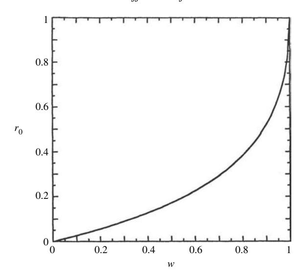

Figure 8.5 Diffusive reflectance as a function of single-scattering albedo.

The answers to a number of interesting questions may be estimated using the diffusive-reflectance model. For example, how many scatterings, on the average, does a photon undergo before being scattered out of a medium? This quantity can be calculated by noting that the total fraction of light absorbed by the medium is  $1-r_0$  and that the fraction absorbed at each scattering is 1-w. Therefore, the average number of scatterings,  $\mathcal{N}$ , is

$$\mathcal{N} = (1 - r_0)/(1 - w) = (1 + r_0)^2/(1 - r_0).$$

Thus, in a powder with particles having, w = 0.5,  $r_0 = 0.18$ , and the average photon emerging from the surface has undergone  $\mathcal{N} = 1.7$  scatterings. If w = 0.9,  $r_0 = 0.5$  and approximately  $\mathcal{N} \approx 5$ ; if w = 0.99,  $r_0 = 0.8$  and  $\mathcal{N} \approx 18$ .

#### 8.6.3 The Lambert-diffusive-scattering law

The diffusive reflectance may be combined with Lambert's law by setting the total incident power per unit area  $\pi I_0 = J \mu_0$  and assuming that the emergent radiance is independent of e. Then the Lambert-diffusive expressions for the bidirectional and hemispherical reflectances are, respectively,

$$r_{\rm L} = \frac{1}{\pi} r_0 \mu_0$$

and

$$r_{hL} = r_0$$
.

If the surface is Lambertian, but the incident radiance is diffuse and the same in all directions, then the Lambert–diffusive spherical reflectance is

$$r_{sL}=r_0.$$

## *8.6.4 Diffusive solution for anisotropic scatterers: similarity relations*

If , (= 0, then equations [\(8.17\)](#page-0-0) may readily be solved using the same procedure as for isotropic scatterers. However, it is instructive to ask if it is possible to transform equations [\(8.17\)](#page-0-0) into the same form as [\(8.18\)](#page-0-0). That is, we seek quantities τ ∗ and *w*∗ such that [\(8.17\)](#page-0-0) can be written

$$-\frac{1}{2}\frac{dI_1}{d\tau^*} = -I_1 + \frac{w^*}{2}(I_1 + I_2), \tag{8.29a}$$

$$\frac{1}{2}\frac{dI_2}{d\tau^*} = -I_2 + \frac{w^*}{2}(I_2 + I_1)$$
 (8.29b)

Equating the coefficients of *I*1 and *I*2 in [\(8.29\)](#page-0-0) to those in [\(8.17\)](#page-0-0) gives the following simultaneous equations:

$$w^*\tau^* = (1 - \beta)w\tau,$$
  
$$\tau^* - \frac{1}{2}w^*\tau^* = \tau - \frac{1}{2}(1 + \beta)w\tau.$$

Solving these yields

$$\tau^* = (1 - \beta w)\tau, \tag{8.30a}$$

$$w^* = \frac{1 - \beta}{1 - \beta w} w. {(8.30b)}$$

Equations [\(8.30\)](#page-0-0) are known as *similarity relations*.

Because equations [\(8.29\)](#page-0-0) are of the same form as [\(8.18\)](#page-0-0), solutions for media of anisotropic scatterers are the same as for isotropic scatterers, except that the quantities τ and *w* are replaced by τ ∗ and *w*∗, respectively. Thus,

$$I_1 = \frac{1}{2} [A(1 - \gamma^*)e^{-2\gamma * \tau *} + B(1 + \gamma^*)e^{2\gamma * \tau *}], \tag{8.31a}$$

$$I_2 = \frac{1}{2} [A(1+\gamma^*)e^{2\gamma*\tau*} + B(1-\gamma^*)e^{2\gamma*\tau*}], \tag{8.31b}$$

where, for a semi-infinite medium, *B* = 0*, A* = 2*I*0*/(*1+. ∗*)*, and

$$\gamma^* = [1 - w^*]^{1/2} = [(1 - w)/(1 - \beta w)]^{1/2},$$
 (8.32a)

so that

$$\gamma^* \tau^* = [(1 - w)(1 - \beta w)]^{1/2} \tau. \tag{8.32b}$$

The diffusive reflectance becomes

$$r_0(w) = \frac{1 - \gamma^*}{1 + \gamma^*}. (8.33)$$

When the particles are fully backscattering,  $\beta = -1$  and  $r_0 = \left(\sqrt{1+w} - \sqrt{1-w}\right)/\left(\sqrt{1+w} + \sqrt{1-w}\right)$ . As in the case in which  $\beta = 0$ ,  $r_0(0) = 0$  and  $r_0(1) = 1$ , but when  $w \ll 1$ ,  $r_0 \simeq w/2$ , rather than w/4. When the particles are fully forward-scattering,  $\beta \to 1$ , then  $\gamma^* \to 1$ , and  $r_0 \to 0$ , except when w = 1, in which case  $r_0 = 1$ . That is, theoretically, if  $\beta = 1$ , then all of the radiance is scattered deeper into the medium and escapes only if the particles are perfectly nonabsorbing. This, of course, is not a situation that is realizable in practice, and it shows that this formalism breaks down if  $|\beta|$  is too close to 1. In general, when  $\beta > 0$ ,  $r_0$  is smaller than its value for  $\beta = 0$ , and larger when  $\beta < 0$ .

# 8.7 The bidirectional reflectance 8.7.1 Introduction

The bidirectional reflectance of a medium is defined as the ratio of the scattered radiance at the detector to the collimated incident irradiance. We will begin by considering the simple case of scattering by a particulate medium in which the single-scattering albedos of the particles are so small that multiply scattered light can be neglected. This will give a well-known expression, the Lommel–Seeliger law, which has already been mentioned. Following that derivation, more general relations that include the effects of multiple scattering will be discussed in detail, and useful approximations given. Initially, it will be assumed that the particles are sufficiently far apart that equation (7.38) is valid. The case when the particles are so close together that this equation is no longer correct will be considered later. Only the bidirectional reflectance of a medium of infinite optical thickness will be derived in this chapter. Layered media will be discussed in Chapter 10.

In most laboratory and remote-sensing applications the quantity of interest is the radiance received by a detector viewing a horizontally stratified, optically thick medium of particles that may scatter, absorb, and emit, illuminated by a collimated irradiance. From the result of Section 8.4, this is equivalent to the radiance emerging in a given direction from a surface. The geometry is indicated schematically in Figure 8.4. Let z be the vertical distance on the axis perpendicular to the planes of stratification. The distribution of particles with altitude z is arbitrary, except that the particle density  $N \to 0$  at a finite value of z corresponding to  $\tau = 0$ . The particles in the space below the  $\tau = 0$  level are characterized by the volume-average radiative-transfer parameters E(z), S(z), A(z),  $G(z, \Omega', \Omega)$ , and  $F(z, \Omega)$ , as defined in Section 7.3.1. The space above the  $\tau = 0$  level is empty, except for

a distant point source of collimated irradiance J that illuminates a large area on the surface of the medium and a detector that views a smaller region within the illuminated area. The sensitive area of the detector is  $\Delta a$ , and it responds to light that is incident only within a small solid angle  $\Delta \omega$ .

The light incident on the detector from the medium emerges from an area  $\Delta A$  formed by the intersection of  $\Delta \omega$  with some surface, which is interpreted by a distant observer as the apparent surface of the medium. However, the radiance at the detector actually comes from light scattered or emitted by all the particles in the medium within the detector field of view  $\Delta \omega$ . If the distribution of scatterers with altitude is a step function, the apparent surface is the actual upper surface of the medium. If the altitude distribution is nonuniform, the apparent surface is often taken to be at the level corresponding to  $\tau = 1$ .

Consider a volume element  $dV = R^2 \Delta \omega dR$  located within  $\Delta \omega$  at an altitude z in the medium and a distance R from the detector. This volume element is bathed in radiance  $I(z,\Omega')d\Omega'$  traveling within solid angle  $d\Omega'$  about direction  $\Omega'$ . Thus, an amount of power  $(dV/4\pi)\int_{4\pi}G(z,\Omega',\Omega)I(z,\Omega')d\Omega'$  is scattered by the particles in dV into unit solid angle about the direction  $\Omega$  between dV and the detector. In addition, an amount of power  $F(z,\Omega)dV$  is emitted from dV per unit solid angle toward the detector.

Now, the solid angle of the detector as seen from dV is  $\Delta a/R^2$ . The radiance scattered and emitted from dV toward the detector is attenuated by extinction by the particles between dV and the detector by a factor  $e^{-\tau/\mu}$  before emerging from the medium. Hence, the power from dV reaching the detector is

$$\begin{split} dP_D &= \left[\frac{1}{4\pi} \int_{4\pi} G(z,\Omega',\Omega) I(z,\Omega') d\Omega' + F(z,\Omega)\right] dV \frac{\Delta a}{R^2} e^{-\tau/\mu} \\ &= \left[\frac{1}{4\pi} \frac{S(z)}{E(z)} \int_{4\pi} \frac{G(z,\Omega',\Omega)}{S(z)} I(z,\Omega',) d\Omega' + \frac{F(z,\Omega)}{E(z)}\right] R^2 \Delta \omega \frac{E(z) dz}{\mu} \frac{\Delta a}{R^2} e^{-\tau/\mu} \\ &= -\Delta \omega \Delta a \left[\frac{w(\tau)}{4\pi} \int_{4\pi} p(\tau,\Omega',\Omega) I(\tau,\Omega') d\Omega' + F(\tau,\Omega)\right] e^{-\tau/\mu} \frac{d\tau}{\mu}, \end{split}$$

where we have put  $dz = \mu dR = -d\tau/E$ .

The total power reaching the detector is the integral of  $dP_D$  over all volume elements within  $\Delta\omega$  between  $z=-\infty$  and  $+\infty$ , or, equivalently, between  $\tau=\infty$  and 0. The radiance  $I_D$  at the detector is the power per unit area per unit solid angle. Thus,

$$I_{D} = \frac{1}{\Delta\omega\Delta a} \int_{z=-\infty}^{\infty} dP_{D}$$

$$= \int_{0}^{\infty} \left[ \frac{w(\tau)}{4\pi} \int_{4\pi} p(\tau, \Omega', \Omega) I(\tau, \Omega') d\Omega' + F(\tau, \Omega) \right] e^{-\tau/\mu} \frac{d\tau}{\mu}. \quad (8.34)$$

#### 8.7.2 Single scattering: the Lommel-Seeliger law

The contribution to the bidirectional reflectance of a semi-infinite, particulate medium by light that has been scattered only once can be calculated exactly from equation (8.34). It is assumed that there are no thermal sources. Then the source function is  $F(\tau, \Omega) = J e^{-\tau/\mu_0} w(\tau) p(\tau, g)$ . Because we are ignoring multiple scattering, the integral in equation (8.34)  $\int_{4\pi} p(\tau, \Omega', \Omega) I(\tau, \Omega') d\Omega = 0$ . The total radiance  $I_{SS}$  reaching the detector due to single scattering is thus

$$I_{SS} = J \frac{1}{4\pi} \frac{1}{\mu} \int_0^\infty w(\tau) p(\tau, g) e^{-(1/\mu_0 + 1/\mu)\tau} d\tau.$$

If w and p are independent of z or  $\tau$ , as is often the case, then the evaluation of this integral is trivial, and gives

$$I_{SS} = J \frac{w}{4\pi} \frac{\mu_0}{\mu_0 + \mu} p(g). \tag{8.35a}$$

When the scatterers are isotropic, p(g) = 1, and equation (8.35a) is the *Lommel-Seeliger law*. This law has been generalized in (8.35a) to include nonisotropic scatterers. Except close to zero phase, this expression is a fair description of the light scattered by low-albedo bodies of the solar system, such as the Moon and Mercury (Hapke, 1963, 1971), for which only light that has been scattered once contributes significantly to the brightness.

Using equations (8.5) and (8.6) to transform to luminance coordinates (8.35a) becomes

$$I_{SS} = J \frac{w}{4\pi} \frac{\cos(\Lambda + g)}{\cos(\Lambda + g) + \cos\Lambda} p(g). \tag{8.35b}$$

Note that this expression is independent of luminance latitude L. To a fair approximation, the brightness of the Moon at small phase angles is, in fact, independent of latitude (Minnaert, 1961; Hapke, 1971). The Lommel–Seeliger function  $\cos(\Lambda + g)/[\cos(\Lambda + g) + \cos\Lambda]$  is plotted as a function of longitude for three phase angles in Figure 8.6. The surge in brightness near the limb is not observed on the Moon because of the roughness of the lunar surface; effects of macroscopic surface roughness are discussed in Chapter 12.

# 8.7.3 The bidirectional reflectance of a sparse medium of isotropic scatterers

8.7.3.1 The two-stream solution with collimated source

In this section we will show how multiple scattering may be included in the calculation of the bidirectional reflectance. In order to illustrate both the power and the limitations of the two-stream method, this technique will be used to obtain an approximate solution to the radiative transfer equation for a horizontally stratified,

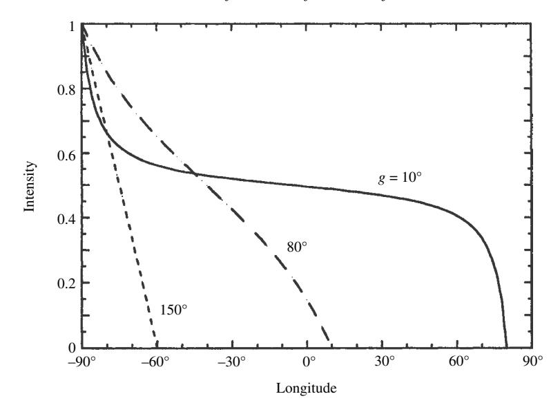

Figure 8.6 Lommel–Seeliger law vs. luminance longitude for several values of the phase angle.

semi-infinite medium of widely spaced isotropic scatterers. The exact solution for the bidirectional reflectance of such a medium will be found in the next section using the method of invariance, and the two solutions will be compared. The reflectance of a medium of closely spaced scatterers will be found later.

The geometry is the same as in Figure 8.1. Collimated irradiance J is incident on a particulate medium. The space above the plane corresponding to  $\tau=0$  is empty, except for the source and detector, and the volume below this plane contains particles that both scatter and absorb. Thermal emission is assumed to be negligible. The properties of the medium are described by the nomenclature of Chapter 7, and w and p(g) are assumed to be independent of  $\tau$ .

The two-stream method will be used to find an approximate solution to the radiative-transfer equation (7.38) with p(g)=1,  $F_T=0$ , and  $F(\tau,g)=(J/4\pi)$   $we^{-\tau/\mu_0}$ . This will give the total radiant flux at any optical depth  $\tau$  of photons that have been scattered one or more times. This flux, together with the incident irradiance, illuminates a layer at some depth within the medium. Finally, the amout of light scattered by the particles in that layer in a direction toward the detector that escapes from the surface will be found.

As in the derivation of the diffusive reflectance, the two-stream form of the equation of radiative transfer is obtained by putting N=2 in equations (7.49)–(7.53). The upward-going hemisphere is denoted by subscript j=1, and the downward-going hemisphere by j=2. Then  $\Delta\Omega_1 = \Delta\Omega_2 = 2\pi$ ,  $\mu_1 = \frac{1}{2}$ ,

 $\mu_2 = -\frac{1}{2}$ ,  $P_{kj} = 1$ , and equation (7.49) becomes the set of two equations

$$-\frac{1}{2}\frac{dI_1}{d\tau} = -I_1 + \frac{w}{2}(I_1 + I_2) + J\frac{w}{4\pi}e^{-\tau/\mu_0},$$
 (8.36a)

$$\frac{1}{2}\frac{dI_2}{d\tau} = -I_2 + \frac{w}{2}(I_1 + I_2) + J\frac{w}{4\pi}e^{-\tau/\mu_0}.$$
 (8.36b)

The boundary conditions are that the radiance must remain finite everywhere and that there be no sources of diffuse radiation above the upper surface, so that at  $\tau = 0$  the downward-going diffuse radiance  $I_2(0) = 0$ .

As in Section 8.6, put  $\varphi = (I_1 + I_2)/2$  and  $\Delta \varphi = (I_1 - I_2)/2$ , and alternately add and subtract equations (8.36) to obtain

$$-\frac{1}{2}\frac{d\Delta\varphi}{d\tau} = -\gamma^2\varphi + J\frac{w}{4\pi}e^{-\tau/\mu_0},\tag{8.37a}$$

$$\frac{1}{2}\frac{d\varphi}{d\tau} = \Delta\varphi,\tag{8.37b}$$

where  $\gamma = \sqrt{1-w}$  is the albedo factor. Differentiating (8.37b) and inserting into (8.37a) gives

$$-\frac{1}{4}\frac{d^2\varphi}{d\tau^2} = -\gamma^2\varphi + J\frac{w}{4\pi}e^{-\tau/\mu_0}.$$
 (8.38)

This equation has the solution

$$\varphi(\tau) = Ae^{-2\gamma\tau} + Be^{2\gamma\tau} + Ce^{-\tau/\mu_0}, \tag{8.39}$$

where A, B, and C are constants to be determined from the boundary conditions. Then, from (8.37b),

$$\Delta\varphi = \frac{1}{2}\frac{d\varphi}{d\tau} = -\gamma A e^{-2\gamma\tau} + \gamma B e^{2\gamma\tau} - \frac{C}{2\mu_0}e^{-\tau/\mu_0}. \tag{8.40}$$

Because  $I_1$  and  $I_2$  must remain finite as  $\tau \to \infty$ , B=0. Substituting (8.39) with B=0 into (8.38) gives

$$-\frac{1}{4}\left(4\gamma^{2}Ae^{-2\gamma\tau} + \frac{C}{\mu_{0}^{2}}e^{-\tau/\mu_{0}}\right) = -\gamma^{2}(Ae^{-2\gamma\tau} + Ce^{-\tau/\mu_{0}}) + J\frac{w}{4\pi}e^{-\tau/\mu_{0}}.$$
(8.41)

Now,  $e^{-2\gamma\tau}$  and  $e^{-\tau/\mu_0}$  are independent functions of  $\tau$ . Hence, the only way (8.41) can be true for all values of  $\tau$  is if the coefficients of these functions are separately equal. Equating the coefficients of  $e^{-\tau/\mu_0}$  on the left and right sides of (8.41) gives

$$C = \frac{J}{4\pi} \frac{4w\mu_0^2}{4\gamma^2\mu_0^2 - 1}. (8.42)$$

Equating the coefficients of  $e^{-2\gamma\tau}$  gives an identity, which confirms that (8.39) is the solution of (8.38). Converting back to  $I_1$  and  $I_2$  gives

$$I_{1} = \left[ A(1 - \gamma)e^{-2\gamma\tau} + C\left(1 - \frac{1}{2\mu_{0}}\right)e^{-\tau/\mu_{0}} \right], \tag{8.43a}$$

$$I_2 = \left[ A(1+\gamma) e^{-2\gamma\tau} + C\left(1 + \frac{1}{2\mu_0}\right) e^{-\tau/\mu_0} \right].$$
 (8.43b)

From equation (8.37b), the boundary condition that  $I_2(0) = 0$  is equivalent to

$$\varphi(0) = \frac{1}{2} \frac{d\varphi(0)}{d\tau}.\tag{8.44}$$

Using either form of the boundary condition at  $\tau = 0$  gives

$$A = -\frac{1+2\mu_0}{2\mu_0(1+\gamma)}C = -\frac{J}{4\pi}\frac{w2\mu_0(1+2\mu_0)}{(1+\gamma)(4\gamma^2\mu_0^2 - 1)} = -\frac{J}{4\pi}\frac{(1-\gamma)2\mu_0(1+2\mu_0)}{4\gamma^2\mu_0^2 - 1}.$$
(8.45)

Now  $\varphi(\tau) = I_1 + I_2$  is the directionally averaged radiance of photons that have been scattered one or more times. Both  $I_1$  and  $I_2$  contain two terms. The second term is proportional to the source term and is important only within a distance from the surface of a few times the extinction length 1/E, which is of the order of the particle separation. The first term depends on  $\gamma/E$ , which can be much longer than 1/E if the particles have high albedos. Also, note that the radiance is independent of azimuth.

The total amount of light incident on a volume element at an optical depth  $\tau$  is  $I(\tau) = 4\pi \varphi(\tau) + J \exp(-\tau/\mu_0)$ . Since the particles scatter isotropically a fraction  $1/4\pi$  of this is scattered per unit solid angle toward the detector, and a fraction  $\exp(-\tau/\mu)$  of this escapes from the surface. Hence, adding up the contribution from all layers, the radiance at the detector is

$$I_D = \int_0^\infty \left[ w \varphi(\tau) + J \frac{w}{4\pi} e^{-\tau/\mu_0} \right] e^{-\tau/\mu} \frac{d\tau}{\mu}.$$

Substituting for  $\varphi(\tau)$  The integration is straightforward and after a little algebra gives

$$I_D(i, e, g) = J \frac{w}{4\pi} \frac{\mu_0}{\mu_0 + \mu} \frac{1 + 2\mu_0}{1 + 2\gamma\mu_0} \frac{1 + 2\mu}{1 + 2\gamma\mu}.$$
 (8.46)

Dividing the result by J gives the bidirectional reflectance

$$r(i, e, g) = \frac{w}{4\pi} \frac{\mu_0}{\mu_0 + \mu} \frac{1 + 2\mu_0}{1 + 2\gamma\mu_0} \frac{1 + 2\mu}{1 + 2\gamma\mu}.$$
 (8.47)

#### 8.7.3.2 Solution using the method of invariance

In this section we will find the exact solution to the reflectance of a horizontally stratified medium of isotropically scattering particles using the method of invariance, equations (7.57), with  $p(\Omega_0, \Omega) = I$ . This equation can be simplified by realizing that all of the radiance scattered within the medium is independent of azimuth. Thus the integration over azimuth in the last three terms on the right can be performed directly, giving factors of  $2\pi$ . Then r and L are functions only of i and e, or equivalently,  $\mu_0$  and  $\mu$ , and equation (7.57b) can be put into the form

$$L(\mu_0, \mu) = 1 + \frac{w}{2}\mu \int_0^1 \frac{L(\mu'_0, \mu)}{\mu'_0 + \mu} d\mu'_0 + \frac{w}{2}\mu_0 \int_0^1 \frac{L(\mu_0, \mu')}{\mu_0 + \mu'} d\mu'$$
$$+ \frac{w^2}{4}\mu_0 \mu \int_{\mu''_0 = 0}^1 \int_{\mu''=0}^1 \frac{L(\mu''_0, \mu)}{\mu''_0 + \mu} \frac{L(\mu_0, \mu'')}{\mu_0 + \mu''} d\mu''_0 d\mu''.$$

The last term on the right can be factored into two independent integrals, one over  $\mu_0''$  and one over  $\mu''$ . Furthermore, in this term,  $\mu_0''$  and  $\mu''$  are simply dummy variables of integration and may be replaced by  $\mu_0'$  and  $\mu'$ , respectively. If this is done the equation can be factored into

$$L(\mu_0,\mu) = \left[1 + \frac{w}{2}\mu \int_0^1 \frac{L(\mu_0',\mu)}{\mu_0' + \mu} d\mu_0'\right] \left[1 + \frac{w}{2}\mu_0 \int_0^1 \frac{L(\mu_0,\mu')}{\mu_0 + \mu'} d\mu'\right].$$

Written in this form it is seen that the function L is symmetric with respect to  $\mu_0$  and  $\mu$ . Furthermore, the first term in brackets is a function only of  $\mu$ , and the second term is the identical function of  $\mu_0$  only. Denote this function by H(x), where x represents either  $\mu$  or  $\mu_0$ . Then L may be written  $L(\mu_0, \mu) = H(\mu_0)H(\mu)$ , where H(x) is the *Ambartsumian–Chandrasekhar H function*, and is the solution of the integral equation

$$H(x) = 1 + \frac{w}{2}xH(x)\int_0^1 \frac{H(x')}{x+x'}dx',$$
(8.48)

and x' is a dummy variable of integration.

Using these results in (7.57a) gives

$$r(i, e, g) = \frac{w}{4\pi} \frac{\mu_0}{\mu_0 + \mu} H(\mu_0) H(\mu), \tag{8.49}$$

where H(x) is a function that satisfies (8.48). Comparing (8.49) with (8.47), we see that the two solutions are of identical form, except that in (8.47) H(x) is approximated by  $(1+2x)/(1+2\gamma x)$ . Note that (8.49) is an exact, general solution for the reflectance. It makes two assumptions about the medium: that the components scatter light isotropically and independently of each other, and that the optical thickness

of the added layer can be made so small that its square and higher powers can be ignored.

# *8.7.3.3 Properties, analytic approximations, and moments of the H functions*

Equation [\(8.49\)](#page-0-0) is the exact solution for the bidirectional reflectance of a semiinfinite medium of isotropic scatterers. However, the solution is in terms of the nonlinear integral equation [\(8.48\)](#page-0-0). Values of the *H* functions for isotropic scatterers have been tabulated in several places (see Chandrasekhar, [1960\)](#page-0-0). They are plotted for several values of *w* in Figure [8.7](#page-0-0) along with the equivalent two-stream approximation.

In this section, some of the properties of the *H* functions will be described and some useful analytic approximations derived. Note that *H (x)* ≈ 1 for all values of *x* when *w <<* 1. In that case, [\(8.49\)](#page-0-0) reduces to the Lommel–Seeliger law, equations [\(8.14\)](#page-0-0) and [\(8.35a\)](#page-0-0) with *f (g)* = *p(g)* = 1 and *K*LS = *Jw/*4ς. This describes the reflectance of a medium in which only single isotropic scattering is important. When *x* →0*,H (x)*→1, showing that at glancing angles of incidence and emergence only single scattering is important in the reflectance, no matter what the value of *w*. For *w >* 0, the *H* functions have a logarithmically infinite slope at *x* = 0, but as *x* increases, the curve rapidly flattens and becomes almost a straight line whose slope increases monotonically with *w*.

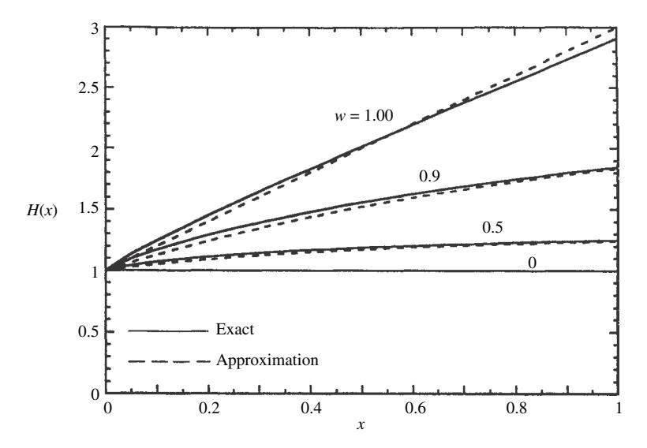

Figure 8.7 The function *H (x)* vs. *x* for several values of *w*. Solid lines, exact solution; dashed lines, approximation (equation [\[8.53\]](#page-0-0)). The more accurate approximation, equation [\(8.56\)](#page-0-0), is indistinguishable from the exact solution at the resolution of this figure.

The *j*th moment of the *H* function is defined by

$$H_j = \int_0^1 H(x) x^j dx. (8.50)$$

The 0th moment, which is simply the integral of the H function, and also its average value over the interval between 0 and 1, may be found from equation (8.48) as follows:

$$H_{0} = \int_{0}^{1} H(x)dx = \int_{x=0}^{1} \left[ 1 + \frac{w}{2} \int_{x'=0}^{1} H(x)H(x') \frac{x}{x+x'} dx' \right] dx$$

$$= 1 + \frac{w}{2} \int_{x=0}^{1} \int_{x'=0}^{1} H(x)H(x') \left( 1 - \frac{x'}{x+x'} \right) dx dx'$$

$$= 1 + \frac{w}{2} \left[ \int_{x=0}^{1} H(x) dx \right] \cdot \left[ \int_{x'=0}^{1} H(x') dx' \right]$$

$$- \int_{x'=0}^{1} \left[ \frac{w}{2} x' H(x') \int_{x=0}^{1} \frac{H(x)}{x'+x} dx \right] dx'$$

$$= 1 + \frac{w}{2} [H_{0}] \cdot [H_{0}] - [H_{0} - 1] \cdot$$

Rearranging gives

$$\frac{w}{2}H_0^2 - 2H_0 + 2 = 0.$$

This quadratic equation has the roots  $H_0 = 2(1 \pm \sqrt{1 - w})/w$ . The minus sign must be chosen because  $H_0$  is finite as  $w \to 0$ . Thus, putting  $\gamma = \sqrt{1 - w}$  gives

$$H_0 = \frac{2}{1+\gamma}. (8.51)$$

Expressing  $H_0$  in terms of the diffusive reflectance  $r_0 = (1 - \gamma)/(1 + \gamma)$  gives

$$H_0 = 1 + r_0. (8.52)$$

The first moment  $H_1$  has been calculated by numerical integration by Chamberlain and Smith (1970).

We will now describe a few useful analytic approximations to the H functions. The first is the two-stream approximation from equation (8.47),

$$H(x) \simeq \frac{1+2x}{1+2\gamma x}.$$
 (8.53)

This approximation is plotted as the dashed line in Figure 8.7. It differs by less than 4% from the exact values everywhere, and it is better than that in most places.

It can be seen from Figure 8.7 that H(x) is almost linear over most of its range. This suggests that for certain purposes it may be approximated by a linear function of the form  $H(x) \simeq A + Bx$ , in which the integral over x is required to equal  $H_0$  exactly. This gives the condition  $A + B/2 = H_0$ . Because H(0) = 1, a possible choice might be to take A = 1, giving

$$H(x) \simeq 1 + 2r_0 x$$
. (8.54)

Because the slope of H(x) is infinite at x = 0, another choice is to set the slope dH/dx at x = 0.5 to be equal to the slope of the approximation (8.53) at the same x. This gives

$$H(x) \simeq H_0 \left[ 1 + r_0 \left( x - \frac{1}{2} \right) \right].$$
 (8.55)

By themselves, neither (8.54) nor (8.55) are very useful, because (8.53) is nearly as simple and has smaller errors. Its strength lies in the evaluation of certain integrals that involve H(x). For example, an excellent approximation to H(x) can be obtained by writing (8.48) in the form,  $H(x) = \{1 - \frac{w}{2}x \int_0^1 \frac{H(x')}{x+x'} dx'\}^{-1}$ , and substituting (8.54) for H(x') in the integral. This gives

$$H(x) \simeq \left\{ 1 - \frac{w}{2} x \int_0^1 \frac{(1 + 2r_0 x')}{x + x'} dx' \right\}^{-1}$$

$$= \left\{ 1 - wx \left[ r_0 + \frac{1 - 2r_0 x}{2} \ln \left( \frac{1 + x}{x} \right) \right] \right\}^{-1}.$$
 (8.56)

This approximation has relative errors smaller than 1% everywhere, which is adequate for most applications.

Equation (8.54) or (8.55) also gives useful approximations for the moments of the H functions. Inserting (8.55) into (8.50) gives

$$H_j \approx \frac{1}{j+1} \frac{2}{1+\nu} \left[ 1 + \frac{j}{2(2+j)} r_0 \right].$$
 (8.57)

In particular,

$$H_1 \approx \frac{1}{1+\gamma} \left[ 1 + \frac{1}{6} r_0 \right].$$
 (8.58)

#### 8.7.4 Anisotropic scatterers

8.7.4.1 Exact solutions

Chandrasekhar (1960) has detailed the procedure for finding the exact solution for the bidirectional reflectance of a semi-infinite medium of nonisotropic scatterers and has carried it out for the cases of Rayleigh  $[p(g) \propto 1 + \cos^2 g]$  and first-order Legendre polynomial  $[p(g) \propto 1 + b_1 \cos g]$  scattering functions. The solutions are

expressed in terms of several functions that satisfy nonlinear integral equations analogous to (8.50). These functions have been tabulated for certain values of  $b_1$  and w by Chandrasekhar (1960) and Harris (1957). Other methods are discussed in many references, e.g., Sobolev (1975), Van de Hulst (1980), and Lenoble (1985). Unfortunately these solutions are complicated and inconvenient and must ultimately be evaluated numerically by computer. Thus we seek other methods that are more convenient, but sufficiently accurate for many purposes.

#### 8.7.4.2 Similarity relations

In the two-stream solution for the diffusive reflectance it was possible to reduce the problem for nonisotropic scatterers to an equivalent problem of isotropic scatterers using the similarity relations. Unfortunately, this is not possible in the solution for the bidirectional reflectance, as was emphasized by Sobolev (1975). Although equation (8.37a) with a nonisotropic scattering function can be reduced to an equivalent isotropic form, it is found that an additional term is added to (8.37b) that cannot be removed except by making the asymmetry factor  $\beta = 0$ .

A common approximation in diffusion theory is to use solutions of the radiative-transfer equation for isotropic scatterers, but replace the scattering coefficient  $S = N\sigma Q_S$  by the transport coefficient  $S_T = S(1 - \xi)$ . This is equivalent to treating those photons scattered by an average particle of the medium at scattering angles  $\theta <$  invcos  $\xi$  as unscattered. Then in the solutions for the reflectance the single-scattering albedo w = S/(S + A) is replaced by

$$w^* = \frac{S(1-\xi)}{S(1-\xi)+A} = \frac{\frac{S}{S+A}(1-\xi)}{\frac{S+A}{S+A} - \frac{S}{S+A}\xi} = \frac{1-\xi}{1-\xi w}w,$$
 (8.59a)

and the optical depth by

$$d\tau * = -[A + S(1 - \xi)]d\tau = -[A + S] \left[1 - \frac{S}{A + S}\xi\right]d\tau = -E(1 - \xi w)d\tau.$$
(8.59b)

These expressions have the same form as the similarity relations (8.30) derived for the diffusive reflectance, except that  $\beta$  is replaced by  $\xi$ .

Van de Hulst (1974) has shown that these similarity relations give excellent results when used in the expression for the bihemispherical or spherical reflectance (Chapter 11). Unfortunately, although the similarity relations are highly satisfactory for calculating integrated reflectances, they are less so when it is necessary to work with angle-resolved reflectances. The reason for this is that departures from isotropic scattering effectively transfer the scattered radiance from one direction into another. These differences are averaged out in the integrated quantities, but have a much larger effect on the angular distribution of reflectance.

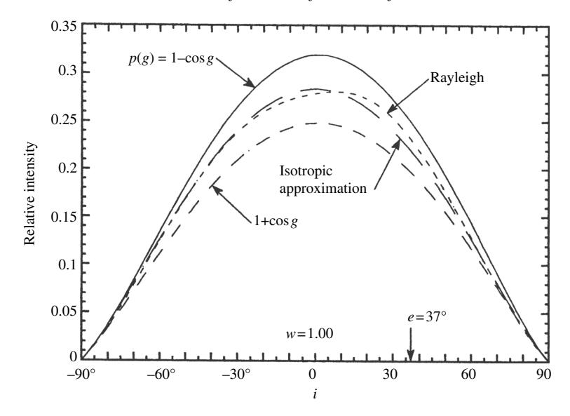

Figure 8.8 Multiply scattered component of the radiance scattered into the principal plane from media with w=1.00 and single-particle scattering functions as shown; e is held constant at  $37^{\circ}$ , while i varies.

#### 8.7.4.3 The isotropic multiple-scattering approximation (IMSA)

An approximation that is useful if the particle scattering function is not too anisotropic can be obtained by noting that most of the effects of anisotropy are carried by the single-scattering term. As emphasized by Chandrasekhar (1960) and Hansen and Travis (1974), the brighter the surface, the more times the average photon is scattered before emerging from the surface. This tends to randomize the directions of the scattered photons and average out directional effects in the multiply scattered intensity distribution, causing it to be not too different from the distribution produced by isotropically scattering particles.

The dependence of the multiply scattered component of the scattered radiance on p(g) is illustrated in Figure 8.8 for the cases where w=1 and p(g)=1,  $1\pm\cos g$ , and  $\frac{3}{4}(1+\cos^2 g)$ .

Although the curve for p(g) = 1 is somewhat too low when  $p(g) = 1 - \cos g$ , and high when  $p(g) = 1 + \cos g$ , all three curves have similar shapes. When p(g) is symmetric, even though it is not isotropic, the multiply scattered component is quite close to that for isotropic scatterers, as illustrated by the curve for Rayleigh scatterers.

The relative insensitivity of the multiply scattered term to p(g) suggests that the solution for isotropic scatterers be used to approximate the multiply scattered

contribution to the bidirectional reflectance of a medium of nonisotropic scatterers, while retaining the exact expression for the singly scattered contribution. The exact single-scattering contribution to the radiance at the detector for an arbitrary particle phase function is given by equation [\(8.35a\)](#page-0-0),

$$I_{SS} = J \frac{w}{4\pi} \frac{\mu_0}{\mu_0 + \mu} p(g),$$

and the contribution of multiple scattering from isotropic scatterers is the difference between [\(8.51\)](#page-0-0) and [\(8.35a\)](#page-0-0) with *p(g)* = 1,

$$I_{MS} = J \frac{w}{4\pi} \frac{\mu_0}{\mu_0 + \mu} [H(\mu_0)H(\mu) - 1].$$

Hence, the bidirectional reflectance may be approximated by

$$r(i, e, g) = \frac{w}{4\pi} \frac{\mu_0}{\mu_0 + \mu} [p(g) + H(\mu_0)H(\mu) - 1], \tag{8.60}$$

where *H (x)* is given by [\(8.53\)](#page-0-0) or [\(8.56\)](#page-0-0), depending on the degree of precision required. Equation [\(8.60\)](#page-0-0) is the isotropic multiple-scattering approximation, or IMSA model. It is widely used in planetary work to analyze the light reflected from surfaces of solar system bodies.

The adequacy of this approximation clearly depends on the single-scattering albedo and the degree of nonisotropy of the scatterers. The approximation would be poor for a medium consisting of large, weakly absorbing, widely separated particles, which have strong refractive and diffractive forward scattering. However, in planetary regoliths and laboratory powders the diffractive term is absent, some absorption is invariably present, and the irregular shapes and presence of internal scatterers cause the particle phase functions to be fairly isotropic. For these materials this approximation should be reasonably accurate. When the medium consists of large, well-separated particles, as in a cloud, the diffraction term in *p(g)* cannot be ignored, and [\(8.60\)](#page-0-0) will be seriously in error. In this case, Joseph *et al.* [\(1976\)](#page-0-0) suggest treating diffraction as a delta function in the radiative-transfer equation.

Lumme and Bowell [\(1981a](#page-0-0)) have suggested using a polynomial fit to the exact isotropic solution, equation [\(8.48\)](#page-0-0), for the multiple-scattering term, except that they replace *w* by *w*∗, where *w*∗ is given by the similarity relations [\(8.59\)](#page-0-0). However, as Sobolev [\(1975\)](#page-0-0) has emphasized, the similarity relations are reasonably accurate only for hemispherically averaged fluxes. In particular, when *w* = 1, *w*∗ = *w* independently of ξ ; hence, in this case the desired correction to the multiple-scattering term does not happen.

*8.7.4.4 The modified IMSA model (MIMSA)*

The principal difficulty with the IMSA model is that, although the general shape of a predicted curve of reflectance with angle is correct, the amplitude is slightly high compared with the exact solution if the particle phase function is forward-scattering and low if it is backscattering. The IMSA model may be modified to obtain a more accurate, but still analytic, approximate expression for the bidirectional reflectance of anisotropic scatterers. The modification uses the general invariance equation (7.57) and makes two approximations in order to evaluate the integrals: the particle angular scattering functions are replaced by their averages over the range of integration and taken out from under the integral; and the H functions for isotropic scatterers, equation (8.48), replace the L functions in the integrals. With these approximations the integrals are independent of azimuth and the invariance equation becomes

$$\begin{split} L(\mu_0,\mu) &\approx p(\Omega_0,\Omega) + L_1(\mu_0) \frac{w}{2} \mu H(\mu) \int_0^1 \frac{H(\mu_0')}{\mu_0' + \mu} d\mu_0' \\ &+ L_1(\mu) \frac{w}{2} \mu_0 H(\mu_0) \int_0^1 \frac{H(\mu')}{\mu' + \mu_0} d\mu' \\ &+ L_2 \left[ \frac{w}{2} \mu_0 H(\mu_0) \int_0^1 \frac{H(\mu')}{\mu' + \mu_0} \right] \left[ \frac{w}{2} \mu H(\mu) \int_0^1 \frac{H(\mu_0')}{\mu_0' + \mu} \right], \end{split}$$

Where  $L_1(\mu_0)$ ,  $L_1(\mu)$ , and  $L_2$  are defined as follows.

The function  $L_1(\mu_0)$  is the directionally averaged radiance scattered into the entire lower hemisphere by a particle illuminated from a single direction making an angle i with the vertical,

$$L_1(\mu_0) = \frac{1}{2\pi} \int_{e'=\pi/2}^{\pi} \int_{\psi'=0}^{2\pi} p(g') \sin e' de' d\psi'.$$
 (8.61)

 $L_1(\mu)$  is the radiance scattered by a particle into a single direction in the upper hemisphere that makes an angle e with the vertical when uniformly illuminated from the entire lower hemisphere. Since photons can travel in either direction along a ray path,  $L_1(\mu)$  has the same functional dependence on  $\mu$  as  $L_1(\mu_0)$  does on  $\mu_0$ .  $L_2$  is the average intensity scattered back into the entire lower hemisphere by a particle uniformly illuminated from the entire lower hemisphere,

$$L_2 = \frac{1}{(2\pi)^2} \int_{i'=0}^{\pi/2} \int_{\psi'=0}^{2\pi} \int_{e'=0}^{\pi/2} \int_{\psi_e=0}^{2\pi} p(g') \sin e' de' d\psi'_e \sin i' di' d\psi'_i.$$
 (8.62)

With these approximations, and using equation (8.48), the bidirectional reflectance becomes

$$r(i, e, g) = \frac{w}{4\pi} \frac{\mu_0}{\mu_0 + \mu} \{ p(g) + L_1(\mu_0) [H(\mu) - 1] + L_1(\mu) [H(\mu_0) - 1]$$

$$+ L_2[H(\mu) - 1] [H(\mu_0) - 1] \}.$$
(8.63)

Equation (8.63) is the modified IMSA (MIMSA) model.

In general, the quantities  $L_1$  and  $L_2$  must be evaluated numerically using equations (8.61) and (8.62). In the case where p(g) can be represented as a sum of Legendre polynomials

$$p(g) = 1 + \sum_{n=1}^{\infty} b_n P_n(\cos g), \tag{8.64}$$

they can be found analytically by using a property of Legendre polynomials known as the addition theorem. This theorem states that

$$P_n(\cos g) = P_n(\cos i) P_n(\cos e) + 2 \sum_{m=1}^{\infty} \frac{(n-m)!}{(n+m)!} P_{nm}(\cos i) P_{nm}(\cos e) \cos m\psi,$$
(8.65)

where the  $P_{nm}$  are the associated Legendre polynomials (see Appendix C). Inserting (8.64) and (8.65) into (8.61), the integral over the azimuth vanishes, giving

$$L_1(\mu_0) = \frac{1}{2\pi} \int_{e'=/2}^{\pi} \int_{\psi'=0}^{2\pi} \left[ 1 + \sum_{n=1}^{\infty} b_n P_n(\cos i) P_n(\cos e') \right] \sin e' de' d\psi'$$
$$= 1 + \sum_{n=1}^{\infty} b_n P_n(\mu_0) \int_{\mu'=-1}^{0} P_n(\mu') d\mu'.$$

The integral may be evaluated using the recurrence relation

$$P_n(\mu') = \frac{1}{2\pi} \left[ \frac{dP_{n+1}(\mu')}{d\mu'} - \frac{dP_{n-1}(\mu')d\mu'}{d\mu'} \right],$$

which gives

$$L_1(\mu_0) = 1 + \sum_{n=1}^{\infty} \frac{b_n P_n(\mu_0)}{2n+1} \{ [P_{n+1}(0) - P_{n-1}(0)] - [P_{n+1}(-1) - P_{n-1}(-1)] \}.$$

Now,  $P_n(-1) = (-1)^n P_n(+1)$  and  $P_n(+1) = 1$ ; also  $P_n(0) = 0$  if n is odd, and

$$P_n(0) = \frac{(-1)^{n/2}}{n+1} \frac{1 \cdot 3 \cdot 5 - - - (n+1)}{2 \cdot 4 \cdot 6 - - - n}$$

if n is even. Using these values  $L_1(\mu_0)$  can be found;  $L_2$  can be evaluated in a similar manner. After a little algebra, the final results are

$$L_1(\mu_0) = 1 + \sum_{n=1}^{\infty} A_n b_n P_n(\mu_0), \tag{8.66a}$$

$$L_1(\mu) = 1 + \sum_{n=1}^{\infty} A_n b_n P_n(\mu), \tag{8.66b}$$

$$L_2 = 1 + \sum_{n=1}^{\infty} A_n^2 b_n, \tag{8.66c}$$

| n  | A n | A_n^2    |
|----|----------------|----------|
| 1  | -0.5000        | 0.2500   |
| 3  | 0.1250         | 0.0156   |
| 5  | -0.0625        | 0.00391  |
| 7  | 0.0391         | 0.00153  |
| 9  | -0.0273        | 0.000748 |
| 11 | 0.0205         | 0.000421 |
| 13 | -0.0161        | 0.000259 |
| 15 | 0.0131         | 0.000172 |

Table 8.2. Legendre scattering function coefficients

*Note:* For n = even,  $A_n = A_n^2 = 0$ .

where  $A_n = 0$  if n = even, and

$$A_n = \frac{(-1)^{(n+1)/2}}{n} \frac{1 \cdot 3 \cdot 5 - - n}{2 \cdot 4 \cdot 6 - - - (n+1)}$$
 (8.66d)

if n = odd. The coefficients  $A_n$  and  $A_n^2$  are listed to 15th order in Table 8.2. (Note: there was a typographical error in equation [8.66c] published in the original paper [Hapke, 2001].)

The procedure for calculating the bidirectional reflectance using the MIMSA is as follows. The coefficients  $b_n$  must be known. If they are not known they can be calculated from p(g) using the procedure outlined in Appendix C. The  $b_n$ s are then inserted into (8.66) to find both  $L_1$ s and  $L_2$ . These are then inserted into (8.63) to give r(i, e, g).

#### 8.8 Comparison of the IMSA model with measurements

Because the isotropic multiple-scattering approximation is analytic and relatively mathematically simple it has been widely used in remote-sensing work to analyze and characterize photometric and spectroscopic observations. Hence, its ability to correctly predict and/or describe measured data has been tested extensively. Such tests are of two types: forward and reverse modeling. In forward modeling the reflectance of a material of known properties is calculated from the model and compared with the measured reflectance. It is a test of the physical correctness and absolute accuracy of the model. In reverse modeling the reflectance calculated by the model is fitted to measured reflectance by adjusting the parameters of the model until the differences between the reflectances are minimized. If the parameters are known independently comparison of the retrieved and known values tests the absolute validity of the model. If a model has been sufficiently tested parameters retrieved

in this way allow values of microphysical properties of a surface to be inferred and thus, the model is useful in remote sensing. However, a word of caution concerning the accuracy of such inferences is in order. The reflectance equation contains several parameters that may have opposite effects on it, so that often unique values of all parameters are difficult to obtain. Parameter retrieval is discussed in more detail in Chapter 14.

The most stringent forward-modeling test was by Hapke *et al.* (2009) who compared the predicted and measured angular variation of reflectance of a medium of anisotropically scattering particles. The material was a white powder consisting of spheres of soda-lime (SiO2 + Na2O + CaO) glass. The spheres ranged in size from 1 to 56  $\mu$ m with a distribution  $N(r) \propto r^{-3}$ , where r is the radius, and mean equivalent particle diameter  $D = 5.1 \,\mu$ m. The filling factor was  $\Phi = 43\%$ , and the refractive index was  $n = 1.51 + i3.5 \times 10^{-5}$ . The bidirectional reflectance was measured in the principal plane at i = 0 with e varying between  $0 < e = g < 80^{\circ}$ , and  $i = 60^{\circ}$  with e varying between  $0 < e < 80^{\circ}$  on both sides of the normal, so that  $-20^{\circ} < g < 140^{\circ}$ .

The volume-averaged extinction, scattering and absorption efficiencies, single-scattering albeo, and particle phase function were calculated as if the spheres of the medium were widely separated using Mie theory. The diffraction peak was then removed from p(g), a diffraction efficiency  $Q_D = 1$  subtracted from  $Q_S$ , and w recalculated. The results are shown in Figure 8.9.

These quantities, with and without diffraction, were inserted into the IMSA equation (8.60) and the bidirectional reflectance calculated. The results are shown in Figure 8.10.

The agreement between prediction and measurement is quite satisfactory when Fraunhofer diffraction is removed (solid lines), but is rather poor when the diffraction peak is retained (dashed lines). This reinforces the arguments in Chapter 7 that Fraunhofer diffraction does not exist in a closely packed medium. It must be emphasized that no parameters were adjusted in the model calculations. The largest discrepancy between theory and measurement occurs in the i=0 curve at large values of g. However, the agreement there would be improved if p(g) is larger at mid-phase angles and smaller at large and small phase angles from that shown by the solid line in Figure 8.9, that is, if the particles are more isotropic than predicted by Mie theory, even after diffraction is removed. We have seen in Chapter 6 that near-field and coherent interactions between adjacent particles could cause such changes in the effective particle scattering functions.

Note that spherical particles are among the most highly anisotropic scatterers likely to be found in nature. Yet the IMSA model does a credible job of matching the measured reflectance. Most particles to be found in laboratory powders and planetary regoliths are probably irregular and filled with internal scatterers, so that

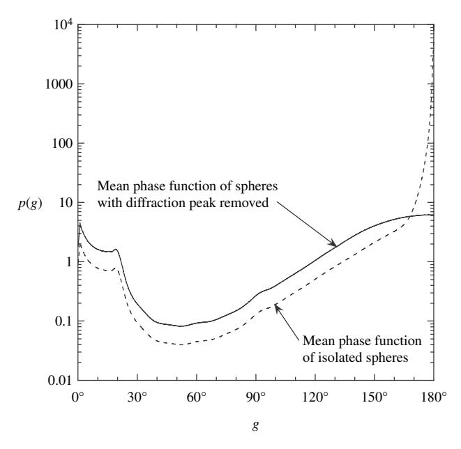

Figure 8.9 Mean single-scattering phase function vs. phase angle for a distribtion of spherical particles with the Fraunhofer diffraction peak removed (solid line) and retained (dashed line). See text for details of the properties of the spheres.

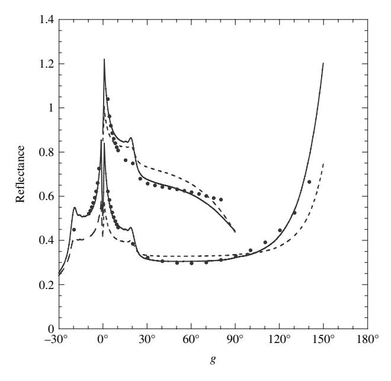

Figure 8.10 Comparison of the measured reflectance (dots) of a powder of spheres with the particle scattering function shown in Figure [8.9](#page-0-0) with the reflectance calculated using the IMSA model with the diffraction peak removed (solid line) and retained (dashed line).

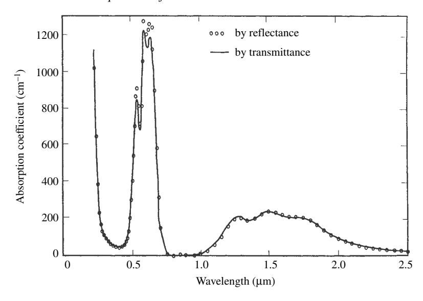

Figure 8.11 Spectral absorption coefficient of cobalt-doped silicate glass. The line shows the spectrum measured by transmission of thin sections; the circles show the spectrum calculated from the bidirectional reflectance using the espat function. (Reproduced from Hapke *et al.* [\[1981\]](#page-0-0), copyright [1981](#page-0-0) by the American Gephysical Union.)

their phase functions are much more isotropic than the spheres of this experiment. Hence, the IMSA model should be well able to describe such materials.

An important test of the reverse modeling type used the synthetic silicate glass containing Co2+ described in Chapter [6.](#page-0-0) This material was chosen because its absorption coefficient varied over a wide range of values in the visible portion of the spectrum. Part of the glass was sliced and polished into a thin section. Its spectral absorption coefficient α*(*λ*)* was measured by transmission over the wavelength range from 0.25 to 2*.*5 µm. The spectrum is shown as the solid line in Figure [8.11.](#page-0-0)

The remainder of the glass was ground into a powder and its bidirectional reflectance measured in the principal plane at *i* = 30!*, e* = 30!, *g* = 60! over the same wavelengths. The particle phase function was assumed to be isotropic, *p(g)* = 1. In that case the only adjustable parameter in equation [\(8.47\)](#page-0-0) is the singlescattering albedo, so that the measured valued of the reflectance could be solved for *w(*λ*)* at each wavelength. Solving approximate equation [\(6.40\)](#page-0-0) for the absorption coefficient gives α*(*λ*)* = [1 − *w(*λ*)*]*/w(*λ*)De*, where *De* is the effective particle size. An empirical value for the effective particle size *De* was found from the value of *a* measured by transmission in blue wavelengths, and the absorption coefficient

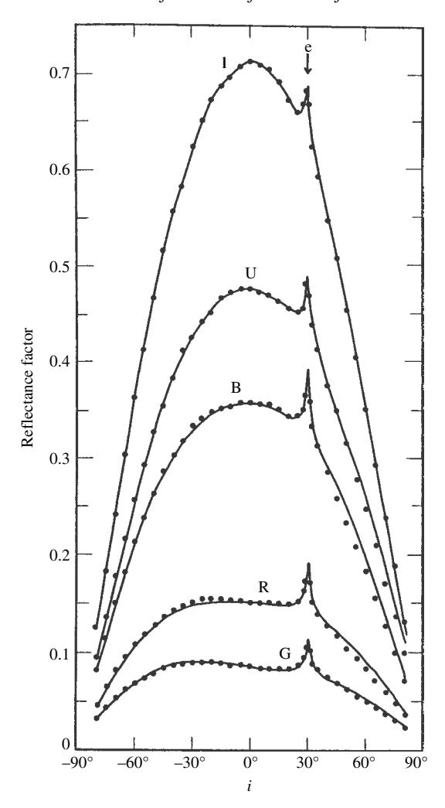

Figure 8.12 Bidirectional reflectance vs. *i* for a powder of size *<*37 µm made from the cobalt glass whose absorption spectrum is shown in Figure [8.11.](#page-0-0) The detector views the powder at *e* = 30!, while *i* is varied in the principal plane. The dots show the reflectance measured at five wavelengths in the ultraviolet (U), blue (B), green (G), red (R), and infrared (I). The lines show the IMSA model, equation [\(8.47\)](#page-0-0), fitted to the data. The peaks at *i* = 40! are the opposition effect, which is treated in Chapter [9.](#page-0-0) (Reproduced from Hapke and Wells [\[1981](#page-0-0)], copyright [1981](#page-0-0) by the American Geophysical Union.)

was then calculated from *w(*λ*)* for the other wavelengths. The values of *a(*λ*)* found in this way are shown as the circles in Figure [8.11.](#page-0-0) The agreement between the two spectra is excellent, except at the highest values, where the approximate equation [\(6.40\)](#page-0-0) for *w* becomes inaccurate.

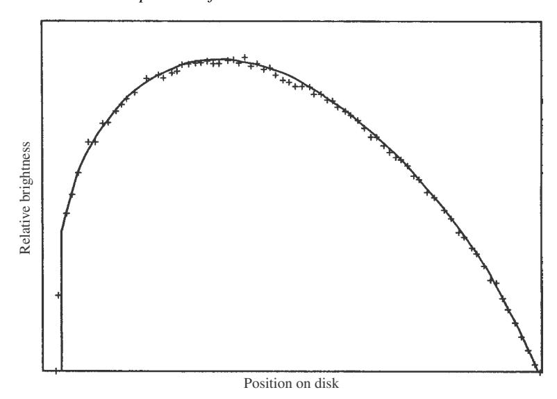

Figure 8.13 Relative brightness profile along the equator of Venus as a function of longitude. The crosses show data measured by the *Mariner 10* spacecraft. The line shows equation [\(8.47\)](#page-0-0). (Reproduced from Hapke and Wells [\[1981\]](#page-0-0), copyright 1981 by the American Geophysical Union.)

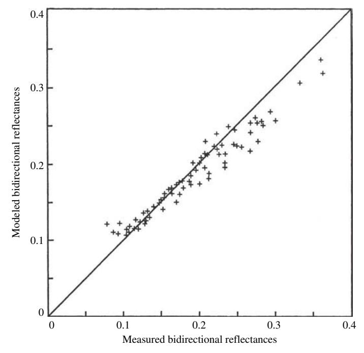

Figure 8.14 Comparison (crosses) between the reflectances in visible light of the bare soil in a plowed field predicted by the theory and measured in various geometries. If the predicted and measured values agreed exactly, the crosses would fall on the straight line. (Reproduced from Pinty *et al.* [\[1989\]](#page-0-0), copyright [1989](#page-0-0) with permission of Elsevier.)

A wide variety of other tests of the IMSA model have been reported in the literature (e.g., Hapke and Wells, [1981](#page-0-0); Pinty *et al.*, [1989](#page-0-0); Clark *et al.*, [1993](#page-0-0)). Some of these are illustrated in Figures [8.12–8.14.](#page-0-0) The IMSAmodel appears to be capable of satisfactorily describing the bidirectional reflectances of particulate material where all but the highest accuracy is required.

# **8.9 Bidirectional reflectance of a medium of arbitrary filling factor**

One of the frustrations of persons who measure the reflectances of particulate media is that the reflectance amplitude often depends on the porosity of the powder (Blevin and Brown, [1967](#page-0-0); Hapke and Wells, [1981](#page-0-0); Capaccioni *et al.*, [1990](#page-0-0); Kaasalainan, [2003;](#page-0-0) Naranen *et al.*, [2004](#page-0-0); Shepard and Helfenstein, [2007](#page-0-0)), which tends to make reproducibility problematic. Figure [8.15](#page-0-0) plots the ratios of reflectances of a variety of powders measured in compressed and loosely packed form versus the reflectance of the compressed powder. Note that compression increases the reflectance, but that the amount of increase decreases as the reflectance

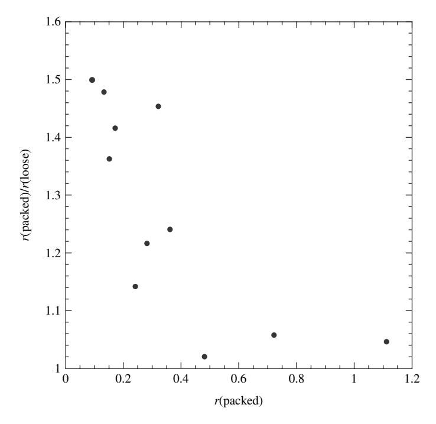

Figure 8.15 The ratios of the reflectances of a variety of powders in packed form to those of the same powders in loose packing plotted against the reflectances of the packed powders. (Reproduced from Hapke [\[2008](#page-0-0)], copyright [2008](#page-0-0) with permission of Elsevier.)

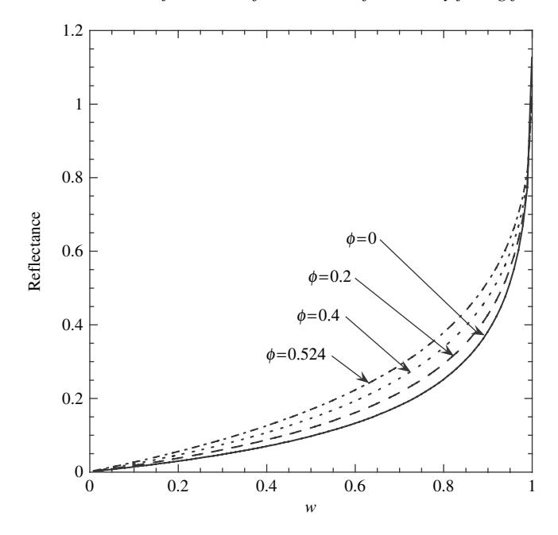

Figure 8.16 Reflectance (relative to a perfectly diffuse surface) of a medium of isotropic scatterers illuminated and viewed normally vs. single-scattering albedo w for several different values of the filling factor  $\phi$ .(Reproduced from Hapke [2008], copyright 2008 with permission of Elsevier.)

increases. However, models based on the equation of radiative transfer in its usual sparse packing form, equation (7.38), are independent of porosity or filling factor.

The porosity dependence arises because, as discussed in Section 7.4.3, the simple transmissivity function for well-separated particles, equation (7.25) is incorrect and equation (7.46) must be used instead in any part of the derivation involving the transmissivity. This means that in the derivation of the reflectance from the radiative transfer equation  $\exp(-\tau/\mu)$  and  $\exp(-\tau/\mu)$  must be replaced everywhere by  $K \exp(-K\tau/\mu)$  and  $K \exp(-K\tau/\mu)$ , respectively. The procedure for finding the reflectance is exactly the same as in Section 8.7.3.1. The result is

$$r(i, e, g) = K \frac{w}{4\pi} \frac{\mu_0}{\mu_0 + \mu} [p(g) + H(\mu_0/K)H(\mu/K) - 1], \tag{8.70a}$$

where

$$H(x/K) = \frac{1 + 2x/K}{1 + 2\gamma x/K},$$
 (8.70b)

and  $K = -\ln(1 - 1.209\phi^{2/3})/1.209\phi^{2/3}$  for media of equant particles.

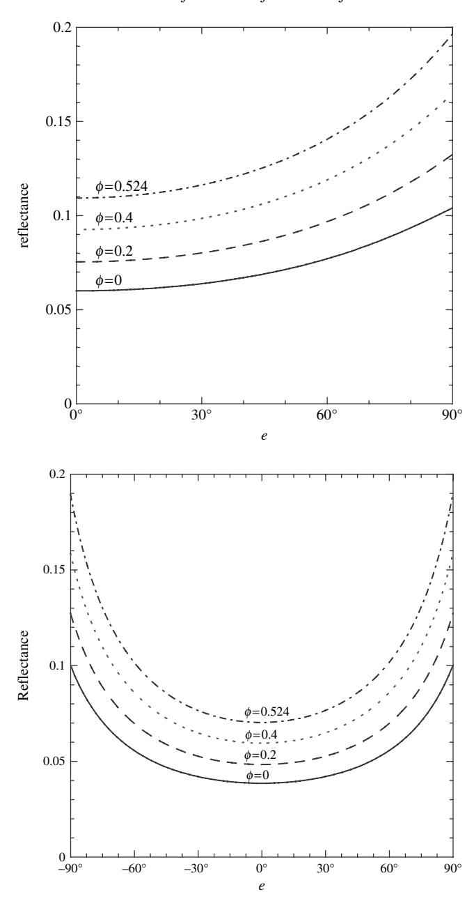

Figure 8.17 Reflectance (relative to a perfectly diffuse surface) of a medium of isotropic scatterers and *w* = 0.36 vs. viewing angle *e* for several different values of φ; (a) *i* = 0; (b) *i* = 60!. (Reproduced from Hapke [\[2008](#page-0-0)], copyright [2008](#page-0-0) with permission of Elsevier.)

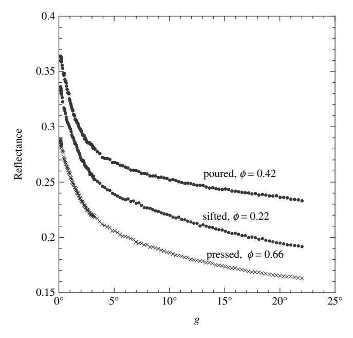

Figure 8.18 Measured reflectance of SiC powder of particles approximately 17µm in size illuminated at *i* = 0 vs. phase angle *g*. All reflectances are relative to a perfectly diffuse surface.

With increasing filling factor *K* increases but the *H* functions decrease. The net result is that at low albedos *r* increases as φ increases, but the amount of increase becomes smaller as the single-scattering albedo increases, consistent with Figure [8.15,](#page-0-0) until at the highest values of *w*, *r* decreases at certain angles. Equation [\(8.70\)](#page-0-0) of *r* vs. *w* with *p(g)* = 1 is plotted in Figure [8.16](#page-0-0) for several values of the filling factor. The figure shows that, depending on *w*, compression can increase the reflectance by as much as a factor of 2 over the sparse packing values.

Figures [8.17](#page-0-0) plots the reflectance as a function of emission angle. Note that the shapes of the curves are virtually independent of φ. Thus a difference in porosity can easily be misinterpreted as a difference in single-scattering albedo, as emphasized by Shepard and Helfenstein [\(2007\)](#page-0-0).This makesit difficult to retrieve a unique value of *w* by reverse modeling of an observational data set.

As φ increases, equation [\(8.70\)](#page-0-0) is valid only up to the critical point φ *<* 52% where coherent effects become important. This avoids the difficulty that this equation predicts that the reflectance would become very large when φ → 75%. However, this means that equation [\(8.70\)](#page-0-0) is not applicable to solid rocks or extremely compressed powders. Figure [8.18](#page-0-0) shows the reflectances of the same sample of SiC powder with grain sizes about 17 µm measured in three conditions of packing. The sifted sample with  $\phi=22\%$  has a lower reflectance than the poured powder with  $\phi=42\%$ , as expected. However, the pressed powder with  $\phi=66\%$  has the lowest reflectance of all three samples. Evidently at large densities coherent and collective effects cause the individual grains to behave like larger particles, resulting in lower effective single-scattering albedos and reflectances.

A possible example of porosity effects occurred in the calibration of absolute reflectances of images of the Moon observed by the *Clementine* spacecraft. Initially the reflectances were calibrated by comparing the radiance of an area in the lunar highlands measured by *Clementine* with that of a sample from the same area brought to Earth by a spacecraft. However, comparison with well-calibrated telescopic observations of the Moon found that these *Clementine* reflectances were a factor of 2 too high (Shkuratov *et al.*, 1999a; Hillier *et al.*, 1999). The probable explanation of this discrepancy is that the act of collecting and handing the lunar samples, combined with the increased gravity, caused the samples in the laboratory to be denser and, thus, to have higher reflectances than their natural state on the lunar surface.