# The opposition effect

# **9.1 Introduction**

The *opposition effect* is a sharp surge observed in the reflected brightness of a particulate medium around zero phase angle. Its name derives from the fact that the phase angle is zero for solar-system objects at astronomical opposition when the Sun, the Earth, and the object are aligned. Depending on the material the angular width of the peak can range from about 1! to more than 20!. It has many names including the *heiligenschein* (literally*"holy glow"*), *hot spot*, *bright shadow* and *backscatter peak*. We have already encountered the opposition effect peak in Figures [8.12](#page--1-0) and [8.18.](#page--1-0) and it is further illustrated in Figures [9.1–9.3.](#page--1-0) It should not be confused with the glory in the phase function of a sphere (Chapter [5\)](#page--1-0), which is also often called the heiligenschein.

The opposition effect is a nearly ubiquitous property of particulate media, includingvegetation(Hapke *et al.*,[1996\)](#page--1-0),laboratorypowders(Hapke and Van Horn,[1963;](#page--1-0) Oetking,[1966;](#page--1-0)Egan and Hilgeman[,1976;](#page--1-0)Montgomery and Kohl,[1980;](#page--1-0)Nelson *et al.*, [1998,2000\)](#page--1-0),andregolithsoftheMoon(Gehrels *et al.*,[1964](#page--1-0);Whitaker,[1969;](#page--1-0)Wildey, 1978; Buratti *et al.*, [1996\)](#page--1-0), Mars (Thorpe, [1978\)](#page--1-0), asteroids (Gehrels *et al.*, [1964;](#page--1-0) Bowell and Lumme, [1979;](#page--1-0) Belskaya and Shevchenko, [2000\)](#page--1-0), satellites of the outer planets(Brown and Cruikshank, [1983;](#page--1-0) Domingue *et al.*, [1991\)](#page--1-0), and the rings of Saturn (French *et al.*, [2007](#page--1-0)). On a clear day you can see it as a glow around the shadow of your head when your shadow falls on grass or soil. It is readily observed from an airplane as a bright glow around the shadow of the plane when the shadow falls on vegetation or soil. The halo disappears on pavement. It is particularly pronounced in powders with grains a few micrometers in size.

The first historical record of the opposition effect is in the autobiography of the sixteenth-century Florentine artist, sculptor, and rogue, Benvenuto Cellini. Cellini noted that he often saw a glow around the shadow of his head on grass. Since he did not see it around the shadow of anyone else, he took this as evidence that he was

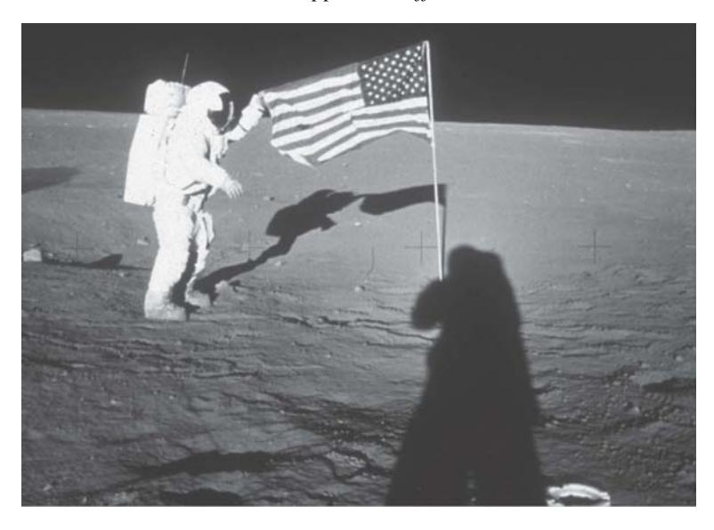

Figure 9.1 The opposition effect on the surface of the Moon can be seen as the glow around the shadow of the head of the astronaut. (Courtesy of the National Aeronautics and Space Administration.)

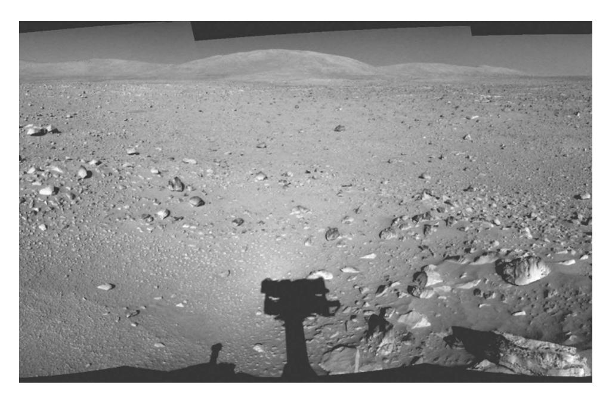

Figure 9.2 The opposition effect on the surface of Mars is seen around the shadow of the camera on the Mars rover *Spirit*. (Courtesy of the National Aeronautics and Space Administration.)

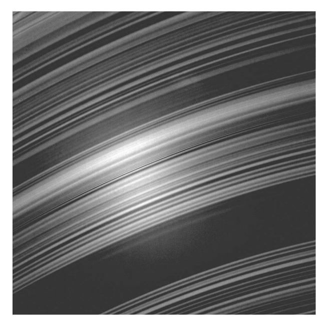

Figure 9.3 The opposition effect in the rings of Saturn as imaged by the visual and infrared imaging spectrometer on the *Cassini* spacecraft. (Courtesy of the National Aeronautics and Space Administration.)

especially favored by God. He noted that it was more pronounced when the grass was covered with morning dew, so obviously the glory partly contributed to Cellini's observation. However, the glow persisted even after the dew had evaporated, so the opposition effect also contributed. Cellini would doubtless have been delighted to know that 500 years later the phenomenon is still sometimes referred to as "Cellini's halo."

The first modern discovery of the opposition effect was by Seeliger [\(1887,](#page-0-0) [1895\)](#page-0-0) in the light scattered by Saturn's rings. It was later independently discovered by Gehrels on asteroids and the Moon (Gehrels *et al.*, [1964\)](#page-0-0).

Several mechanisms have been suggested to explain the opposition effect observed on solar system bodies, including shadow-hiding, coherent backscatter, glories from glass beads, and crystalline corner reflectors. The last two hypotheses can be readily eliminated. The ubiquitous nature of the phenomenon in the solar system, and the fact that glass beads are not required to cause a backscatter peak in laboratory powders, makes the third explanation superfluous. In principle, the faces of crystals with a cubic structure could act as corner reflectors, which consist of three planes set at right angles to one another and have the property that a ray incident on one of the planes is redirected by multiple specular reflections back toward the source (Trowbridge, [1978](#page-0-0); Muinonen *et al.*, [1989](#page-0-0)). However, the surfaces of all of the airless bodies on which the effect is observed are continuously abraded by micrometeorites, which would destroy the smooth surfaces necessary for retroreflection. Furthermore, the effect is observed on laboratory powders made of irregular particles. Thus, while corner reflectors may contribute to the opposition effect in certain cases, they are not the major cause. Hence we are left with shadow-hiding and coherent backscatter, and there are considerable experimental and observational indications that both processes are operating. Both will be discussed in detail in this chapter. We will use the convenient acronyms SHOE for the shadow-hiding opposition effect and CBOE for the coherent backscatter opposition effect.

# **9.2 The shadow-hiding opposition effect (SHOE)** *9.2.1 Physical principles*

The shadow-hiding backscatter surge occurs in any particulate medium in which the grains are larger than the wavelength so that they have shadows. Particles near the surface cast shadows on the deeper grains. These shadows are visible at large phase angles, but close to zero phase they are hidden by the objects that cast them.

Another way of understanding the phenomenon is to think of the interstices between the particles that make up a powder as resembling tunnels through which light penetrates. At large phase angles the interiors of these tunnels visible to the detector are in shadow, the light being blocked by the particles that make up the walls of the tunnels. However, when the phase angle is small, the sides and bottoms of the tunnels are illuminated, resulting in enhanced brightness.

The opposition effect is particularly pronounced in fine powders with a mean grain size less than about 20µm (Figure [9.4\)](#page-0-0). The shadow-hiding hypothesis accounts for this by noting that for particles as fine as this the intermolecular adhesive (electrostatic and van der Waals) forces that act between the contacting surfaces of two adjacent grains exceed the gravitational forces attracting them to the planet. Consequently, only one point of contact is necessary to stably support the weight of a small particle, instead of the minimum of three for a large particle. Because of this, the microstructures formed by fine cohesive powders can be very open, porous, and intricate, consisting oflacy towers and bridgesthat Hapke and Van Horn [\(1963\)](#page-0-0) dubbed "fairy castle structures." Because the Moon has a strong opposition effect these authors argued, well before the *Surveyor* and *Apollo* missions, that the upper layers of the lunar regolith are fine-grained and have a high porosity.

The equation of radiative transfer does not account for the SHOE, so that it must be added ad hoc. This was first done by Seeliger [\(1887](#page-0-0)), and it has been treated theoretically by several persons in addition to Seeliger, including Bobrov [\(1962](#page-0-0)),

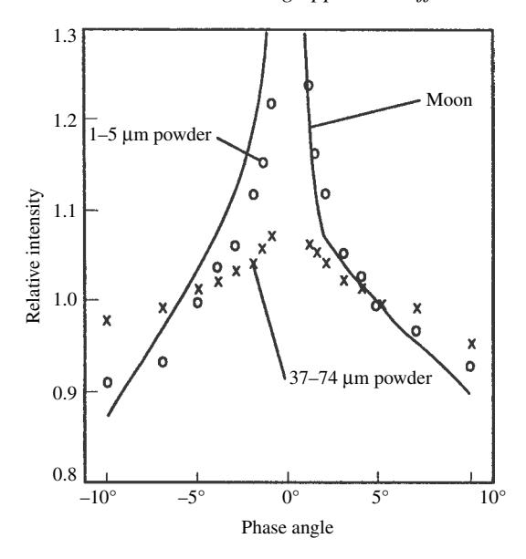

Figure 9.4 Relative brightnesses of an area on the lunar surface (the crater Copernicus,from data of Van Diggelen [\[1965\]](#page-0-0)) and pulverized basalt oftwo differentsizes, illustrating the opposition effect. (Reproduced from Hapke [\[1968\]](#page-0-0), copyright [1968](#page-0-0) with permission of Pergamon Press, Ltd.)

Hapke [\(1963,1986\)](#page-0-0), Irvine [\(1966\)](#page-0-0), Lumme and Bowell [\(1981a\)](#page-0-0), and Shkuratov *et al.* (1999a). Some of the models require a computer to obtain a numerical answer; others give approximate analytic equations that are valid only when the porosity is large.In thissection the general treatment ofHapke [\(1986\)](#page-0-0)will be followed, because this gives a convenient, approximate analytic expression whose parameters can be given a straightforward interpretation in terms of physical properties of the medium. The result will be seen to be a modification to the singly scattered, Lommel–Seeliger part of the bidirectional reflectance.

An order-of-magnitude estimate of the expected half-width of the shadow-hiding peak can be made as follows. The average distance a ray travels in a particulate medium before encountering a particle and being either absorbed or scattered is the extinction length, !*E*, so that this will also be the mean length of a shadow cast by a particle in the medium. Thus, the system may be crudely idealized as a spherical particle of radius *a* casting its shadow on a screen a distance !*E* away (Figure [9.5\)](#page-0-0). When the phase angle between the source and detector is zero the particle hides its own shadow. As the phase angle increases the detector sees some of the shadow. Half of the shadow will be visible when the ray from the center of the shadow to the detector just grazes the edge of the particle, so that the half-width of the peak is HWHM ∼ *a*/!*E* .

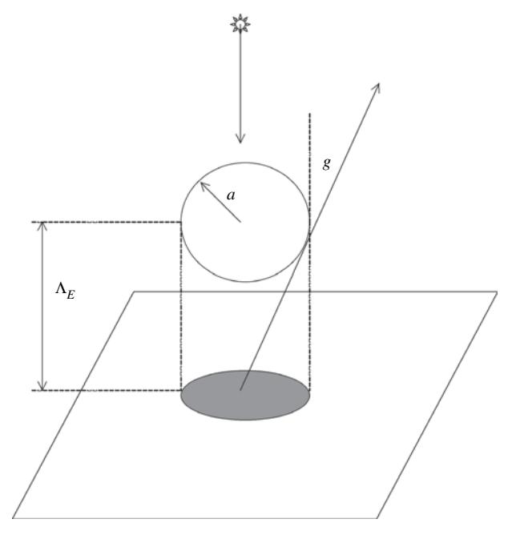

Figure 9.5 Simple model of the shadow-hiding backscatter effect.

#### 9.2.2 Derivation

To make a more rigorous model, we begin by considering light that has been scattered only once. In Section 8.7 the following expression for the singly scattered radiance was derived:

$$I_{SS}(i, e, g) = \frac{J}{4\pi} \frac{1}{\mu} \int_0^\infty w(\tau) p(\tau, g) T_i(\tau, \mu_0) T_e(\tau, \mu) d\tau, \tag{9.1}$$

where

$$T_i(\tau, \mu_0) = Ke^{-K\tau/\mu_0}$$
 (9.2a)

is the incident transmissivity, the probability that the incident irradiance J will penetrate to a level  $\tau = \int_z^\infty E(z')dz'$  in the medium. The transmissivity has been generalized by the addition of the porosity factor K, in accordance with the discussion in Sections 7.4 and 8.9. Similarly, in Section 8.7.2 it was assumed that

$$\mathcal{T}_e(\tau, \mu) = Ke^{-K\tau/\mu} \tag{9.2b}$$

is the exit transmissivity, the probability that the light scattered in the direction of the detector by a particle at this level will escape the medium. In this case (9.1) can be easily integrated to give the generalized Lommel–Seeliger law,

$$I_{SS}(i, e, g) = JK \frac{w}{4\pi} \frac{\mu_0}{\mu_0 + \mu} p(g).$$

Note that at zero phase,

$$I_{SS}(i, e = i, 0) = JK \frac{w}{8\pi} p(0).$$
 (9.3)

Let

$$\sigma_E = \langle \sigma Q_E \rangle = E(z)/N(z) \tag{9.4}$$

be the volume-average extinction cross section, and

$$a_E(z) = \sqrt{\sigma_E(z)/\pi} \tag{9.5}$$

be the mean extinction radius; that is, *aE* is the radius of an equivalent sphere having the cross-sectional area σ*E*. Note that τ is equal to the total average number of particles having their centers in a vertical cylinder of radius *aE* lying above altitude *z*. It will be assumed that σ*E*, *w*, and *p(g)* are independent of τ .

Expressions [\(9.2\)](#page-0-0) assume that the incident probability *Ti* and exit probability *Te* are independent of each other. However, if the phase angle is small, the probabilities are not independent, and [\(9.3\)](#page-0-0) underestimates *Te*. To understand this, suppose a ray of light from the source is scattered through phase angle *g* at some point **P** located at altitude *z* in the medium. Now, *Ti* is the probability that no particle has its center in a cylinder of radius *aE* whose axis is the ray connecting the source and **P**. If *Te* were independent of *Ti*, then, similarly, *Te* would be the probability that no particle has its center in the cylinder with radius *aE* coaxial with the ray connecting **P** with the detector. However, portions of the two probability cylinders overlap, as is illustrated schematically in Figure [9.6,](#page-0-0) and the probability of extinction by any particles that are in the common volume has been counted twice. Let *Vc* be the common volume. In Figure [9.6](#page-0-0) the area **APBC** is the cross section of *Vc* in the scattering plane containing **P**. Correcting for this effect, the escape probability can be written

$$T_i T_e = K^2 \exp[-K(\tau/\mu_0 + \tau/\mu - \tau_c)],$$
 (9.6a)

where

$$\tau_c = \int_{V_c} n_e(z) dV, \tag{9.6b}$$

and *V* denotes volume.

The overlap can be calculated exactly at zero phase. Then the direction to the detector coincides with the direction to the source, and the two cylinders overlap perfectly, so that τ*c* = τ*/µ*0*,* and

$$I_{SS}(i, e = i, 0) = -J \frac{w}{4\pi} p(0) \frac{1}{\mu} \int_0^\infty K^2 e^{-K\tau/\mu} d\tau = JK \frac{w}{4\pi} p(0), \qquad (9.7)$$

which is exactly twice [\(9.3\)](#page-0-0). In effect, the incident ray has preselected a preferential escape path for rays leaving the medium at small phase angles. That is, if a ray is

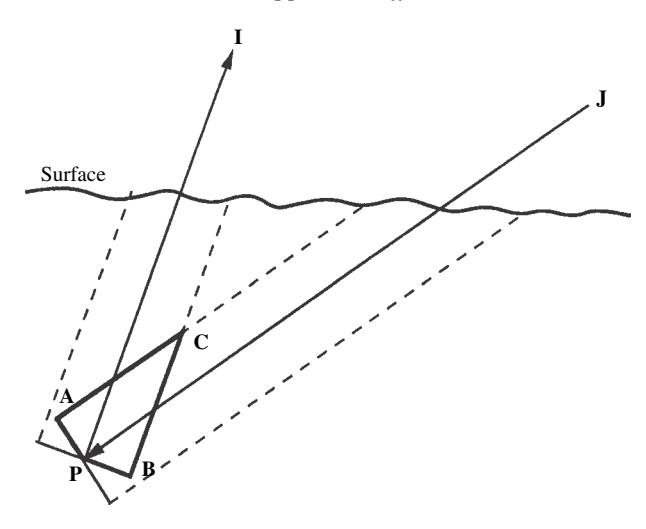

Figure 9.6 Cross section through the scattering plane containing point **P**. The polygon **APBC** is the cross section in the scattering plane of the common volume  $V_c$ .

able to penetrate to a given level in the medium and illuminate a point there without being extinguished, then rays scattered from that same point exactly back toward the source are able to escape without being blocked by any particle.

It is sometimes erroneously stated that the opposition effect requires opaque particles. However, the blocking is by extinction, not absorption, and occurs whether the particles are transparent or opaque. It is important to note the clear difference between the scattering properties of a continuous medium and a particulate medium. In a continuous medium  $a_E = 0$  so that exponential attenuation occurs along the entire incident and exit paths of the rays, and a shadow-hiding opposition effect cannot arise. The common volume is the intersection of two circular cylinders, of which **APBC** is the cross section in the scattering plane containing **P**, and its calculation is mathematically cumbersome (e.g., Irvine, 1966; Goguen, 1981). An approximate value for  $V_E$  may be derived as follows.

Let  $\sigma_E = \sigma Q_E$ , the mean particle extinction cross section. Now, the area **APBC** consists of two right triangles with sides  $a_E$  and  $a_E \cot(g/2)$ , common hypotenuse  $\zeta = \mathbf{PC} = a_E \csc(g/2)$  and area  $a_E^2 \cot(g/2)$ . Let  $z_1$  be the projection of  $\zeta$  onto the vertical axis. Then  $z_1$  is given by the following system of simultaneous equations

$$q^{2} = \frac{z_{1}^{2}}{\mu^{2}} + a_{E}^{2} \csc^{2} \frac{g}{2} - 2 \frac{z_{1} \cos \frac{g}{2}}{\mu} a_{E} \csc^{2} \frac{g}{2} = \left(\frac{z_{1}}{\mu} - a_{E} \cot \frac{g}{2}\right)^{2} + a_{E}^{2},$$

$$q_{0}^{2} = \frac{z_{1}^{2}}{\mu_{0}^{2}} + a_{E}^{2} \csc^{2} \frac{g}{2} - 2 \frac{z_{1} \cos \frac{g}{2}}{\mu_{0}} a_{E} \csc^{2} \frac{g}{2} = \left(\frac{z_{1}}{\mu_{0}} - a_{E} \cot \frac{g}{2}\right)^{2} + a_{E}^{2},$$

$$(q+q_0)^2 = z_1^2(\tan^2 i + \tan^2 e - 2\tan i \tan e \cos \psi) \cos g,$$
$$\cos g = \cos i \cos e + \sin i \sin e \cos \psi$$

where q is the distance from  $\mathbf{C}$  to the intersection of the exit ray with the horizontal plane containing  $\mathbf{C}$ ,  $q_0$  is the corresponding distance for the incident ray, and  $\psi$  is the azimuth angle between the projections of the incident and exit rays on the horizontal plane.

For small phase angles,  $\cot(g/2) \gg 1$ , so that

$$q \simeq \pm [z_1/\mu - a_E \cot(g/2)],$$
  
$$q_0 \simeq \mp [z_1/\mu_0 - a_E \cot(g/2)],$$

where the positive sign is to be used for q and the negative sign for  $q_0$  if e > i, and oppositely if i > e. When g is small, each term on the right-hand side of the last two equations is large, but both q and  $q_0$  are small. Hence, the difference between q and  $q_0$  will be small also, and to a sufficient approximation,

$$|q - q_0| \simeq z_1/\mu + z_1/\mu_0 - 2a_E \cot(g/2) \simeq 0$$
,

so that

$$z_1 \simeq \langle \mu \rangle a_E \cot(g/2),$$
 (9.8)

where

$$\frac{1}{\langle \mu \rangle} = \frac{1}{2} \left( \frac{1}{\mu_0} + \frac{1}{\mu} \right) \text{ or } \langle \mu \rangle = \frac{2\mu_0 \mu}{\mu_0 + \mu}$$
 (9.9)

is the average secant of the incident and exit ray paths. Expression (9.8) for  $z_1$  is a good approximation when g is small. It is poor when g is large and the incident and exit rays are on opposite sides of the normal. However, when g is large, the opposition effect makes only a small contribution to the brightness. Hence, using (9.8) will cause a negilgible error in the total radiance for any value of g.

At any altitude z' between z and  $z + z_1$  a horizontal cut through  $V_c$  consists of the common area between two overlapping ellipses. The thickness of this area in the direction perpendicular to the scattering plane is much less sensitive to z' than is the width in the parallel direction. Hence, only a small error will result if  $V_c$  is approximated by a volume of constant thickness u whose cross section in any plane parallel to the scattering plane is a triangle. This approximation essentially involves replacing the ellipses by rectangles. We require the area of the triangles to have the same area  $a_E^2 \cot(g/2)$  and projected altitude  $z_1$  as **APBC**, and its base is required to lie in the horizontal plane containing **P**. Then

$$V_c \simeq u a_E^2 \cot(g/2). \tag{9.10}$$

The portion of  $V_c$  lying above any plane at z' between z and  $z + z_1$  is  $V_{ca}(z') = V_c[1 - (z'-z)/z_1]^2$ .

Differentiating,

$$dV = (dV_{ca}/dz')dz' = -2V_c[1 - (z'-z)/z_1]dz'/z_1$$
  
= -(2uaE/\mu)[1 - (z'-z)/z\_1]dz'.

Thus, the value of  $\tau_c$  in (9.6) is

$$\tau_c = \int_{V_c} N(z') dV \simeq -\int_{z}^{z+z_1} N(z') \frac{2ua_E}{\langle \mu \rangle} \left( 1 - \frac{z'-z}{z_1} \right) dz'. \tag{9.11}$$

The thickness u of the approximation to common volume is determined by requiring that  $\tau_c = \tau/\mu$ , at g = 0, when  $\langle \mu \rangle = \mu = \mu_0$  and  $z_1 \to \infty$ ; or

$$\int_{z}^{\infty} N(z') \frac{2ua_{E}}{\langle \mu \rangle} dz' = \frac{1}{\mu} \int_{z}^{\infty} E(z') dz' = \frac{1}{\mu} \int_{z}^{\infty} N(z') \sigma_{E} dz'.$$

Thus.

$$u = \sigma_E / 2a_E = \pi a_E / 2,$$
 (9.12)

so that

$$\tau_{c} = -\frac{1}{\langle \mu \rangle} \int_{z}^{z+z_{1}} N_{E}(z) \sigma_{E} \left( 1 - \frac{z'-z}{z_{1}} \right) dz' = -\frac{1}{\langle \mu \rangle} \int_{\tau(z)}^{\tau(z+z_{1})} \left( 1 - \frac{z'-z}{z_{1}} \right) d\tau(z')$$

$$\tag{9.13}$$

Integrating by parts gives

$$\tau_c = \tau/\langle \mu \rangle - \tau'/\langle \mu \rangle, \tag{9.14}$$

where

$$\tau' = \frac{1}{z_1} \int_{z}^{z+z_1} \tau(z') dz'. \tag{9.15}$$

Inserting this result into (9.6) gives

$$\tau/\mu_0 + \tau/\mu - \tau_c = (\tau + \tau')/\langle \mu \rangle. \tag{9.16}$$

Thus, the singly scattered radiance can be written

$$I_{SS}(i,e,g) = J \frac{w}{4\pi} p(g) \int_0^\infty K^2 e^{-K(\tau+\tau')/\langle \mu \rangle} \frac{d\tau}{\mu}.$$
 (9.17)

Equations (9.15) and (9.17) can be readily evaluated for a slab particle density distribution. Let

$$N(z) = \begin{cases} 0 \text{ for } z < -D \text{ and } z > 0, \\ N = \text{constant} > 0 \text{ for } -D < z < 0, \end{cases}$$

Where D is the thickness of the slab.

$$\tau_1 = E_{Z_1},$$
 (9.18a)

and  $z_1$  is defined by (9.8), and

$$\tau_D = ED. \tag{9.18b}$$

Then

$$\tau' = \tau^2/2\tau_1 \text{ for } -D < z < 0, \quad \text{if } z_1 > D,$$

$$\tau' = \tau^2/2\tau_1 \text{ for } -D < z < 0, \quad \text{if } z_1 < D \text{ and } -z_1 < z < 0,$$

$$\tau' = \tau - \tau_1/2 \text{ for } -D, z < 0, \quad \text{if } z_1 < D \text{ and } -D < z < -z_1,$$

$$\tau' = 0 \text{ for } z < -D \quad \text{or } z > 0.$$

Equation (9.17) can be readily evaluated to give

$$I_{SS}(i, e, g) = JK \frac{w}{4\pi} p(g) \frac{\mu_0}{\mu_0 + \mu} B(g),$$
 (9.19)

where

$$U(g) = \sqrt{\frac{4\pi}{y}} \exp\left(\frac{1}{y}\right) \left[ erf\left(\frac{K\tau_D\sqrt{y}}{2 < \mu >} + \frac{1}{\sqrt{y}}\right) - erf\left(\frac{1}{\sqrt{y}}\right) \right],$$
\nif  $y \le \frac{2 < \mu >}{K\tau_D}$ , (9.20a)
$$U(g) = \sqrt{\frac{4\pi}{y}} \exp\left(\frac{1}{y}\right) \left[ erf\left(\sqrt{\frac{4}{y}}\right) - erf\left(\sqrt{\frac{1}{y}}\right) \right]$$

$$+ \exp(-3/y) - \exp\left(-\frac{2K\tau_D}{< \mu >} + \frac{1}{y}\right), \quad \text{if } y \ge \frac{2 < \mu >}{K\tau_D}, \quad \text{(9.20b)}$$

$$y = 2\frac{\langle \mu \rangle}{K\tau_1} = 2\frac{\tan(g/2)}{KN\sigma_E a_E}, \quad \text{(9.20c)}$$

and  $erf(x) = (2/\sqrt{\pi}) \int_0^x \exp(-t^2) dt$  is the error function of argument x.

(The error function is tabulated in many places. For those persons whose computers may not have a program that evaluates the error function, a useful approximation is

$$erf(\pm x) \approx \pm \left\{ 1 - \frac{\exp(-x^2)}{2|x|/\sqrt{\pi} + \left[ \left( \sqrt{\pi} - 2/\sqrt{\pi} \right)^2 x^2 + 1 \right]^{1/2}} \right\}.$$

This expression is accurate to better than 1% everywhere.)

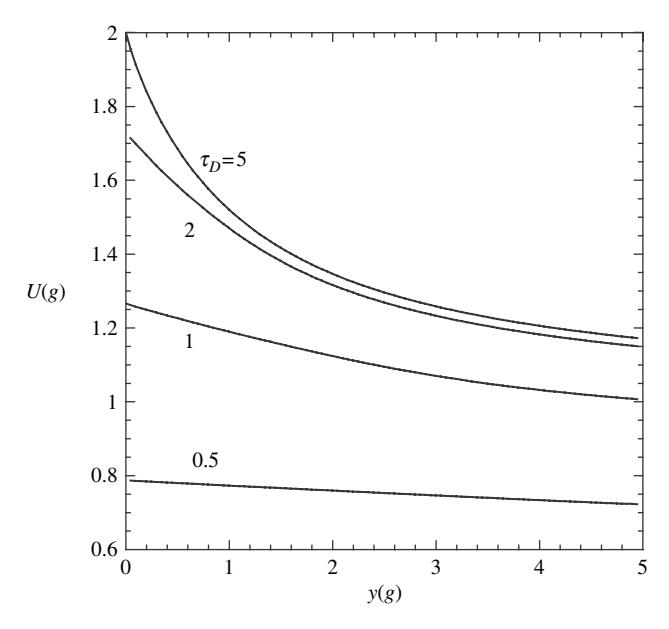

Figure 9.7 The opposition function U(g) (equation 9.20) plotted against the parameter y(g) for several values of the optical thickness of the scattering layer.

Equations (9.20) are plotted versus y in Figure 9.7 for several values of the optical thickness  $\tau_D$  of the slab. When the optical thickness is small, U(g) is low because of the fewer particles scattering incident light into the detector. There is only a slight increase in brightness as g decreases toward zero phase. As the optical thickness increases the general reflectance level increases and the zero phase peak becomes narrower and higher. When the medium completely fills the lower half-space,  $\tau_D \to \infty$  and the singly scattered reflectance is equal to the Lommel–Seeliger law, except for a sharp spike near g=0. Thus, for the important case of an optically thick medium,  $D \to \infty$ , we write

$$U(g) = 1 + B_S(g),$$
 (9.21a)

where  $B_S(g)$  is the shadow-hiding opposition function of a semi-infinite medium

$$B_S(g) = \sqrt{\frac{4\pi}{y}} \exp\left(\frac{1}{y}\right) \left[ erf\left(\sqrt{\frac{4}{y}}\right) - erf\left(\sqrt{\frac{1}{y}}\right) \right] + \exp(-3/y) - 1. \quad (9.21b)$$

Equation (9.21b) is plotted as the solid line in Figure 9.8.

Although equation (9.21) is analytic, it is cumbersome and inconvenient. To good accuracy it may be approximated by the function

$$B_S(g) \simeq (1+y)^{-1} = \left(1 + \frac{1}{h_S} \tan \frac{g}{2}\right)^{-1},$$
 (9.22)

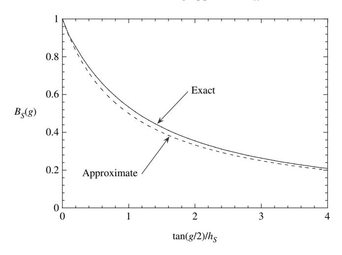

Figure 9.8 The shadow-hiding opposition effect function vs. tan*(g/*2*)*/*hS* for a semi-infinte medium. The solid line is the exact equation [\(9.21\)](#page-0-0). The dashed line is the approximate equation [\(9.22\)](#page-0-0).

where

$$h_S = \frac{1}{2}KN\sigma_E a_E = \frac{KEa_E}{2}. (9.23)$$

Expression [\(9.22\)](#page-0-0) is shown as the dashed line in Figure [9.8.](#page-0-0) It is much more convenient than [\(9.21b](#page-0-0)), and the difference between the two curves probably cannot be distinguished observationally. It will be used to describe the SHOE in the rest of this book.

## *9.2.3 The angular width of the SHOE*

The angular half-width at half-maximum of the opposition-effect peak is

$$HWHM \simeq 2h_S = KEa_E = a_E/\Lambda_E. \tag{9.24}$$

Thus, the rough estimate made in Section [9.2.1](#page-0-0) turns out to be surprisingly accurate. In Hapke [\(1986](#page-0-0)) the equations of the previous section were also evaluated for a density distribution that was exponential with altitude and one that had a hyperbolictangent altitude distribution. In these cases it was found that the behavior of *BS(g)* was very similar to that predicted by [\(9.22\)](#page-0-0), except that the angular-width parameter *hS* refers to the density *N (z)* at the altitude where the slant-path optical depth τ *(z)/*)*µ*\* ' 1.

Equation [\(9.24\)](#page-0-0) shows that *hS* increases as φ increases and becomes infinite as φ + 0*.*752, so that the peak is infinitely wide. This states that a surface in which the particles are so closely packed that light cannot penetrate between the particles does not have a SHOE. As  $\phi$  decreases, the angular width of the peak narrows. Eventually the width of the peak becomes much smaller than the angular width of the source or detector as seen from the surface. In that case it is averaged over the combined angular widths of the source and detector and appears as a lower, wider peak.

The existence of the opposition effect depends on the presence of sharp extinction shadows, and the derivation implicitly assumes that the shadows are infinitely long cylinders. However, when the source of illumination has a finite angular width, the penumbras of the shadows are cones, and a well-defined peak will occur only if one particle has a large probability of being in the penumbra of another particle. An equant particle of radius a has a cone-shaped penumbra of volume  $2\pi a^3/3\theta_s$ , where  $\theta_s$  is the angular width of the source. The fraction of the volume occupied by the penumbras is  $2N\pi a^3/3\theta_s = \phi/2\theta_s$ , where N is the particle density. The opposition effect will be negligible if this fraction is small, say  $\leq 0.1$ . Thus, the condition for the opposition effect to occur is

$$\phi \ge \theta_s / 5. \tag{9.25}$$

At 1 astronomical unit (AU) from the Sun,  $\theta_s \sim 0.01$  so that the critical filling factor is  $\phi \geq 0.002$ ; that is, the particles must be separated by less than about seven times their diameter. Thus, most clouds would not be expected to cause an opposition effect, but planetary regoliths would.

If the particles are larger than the wavelength and are equant, and the particle size distribution is narrow, then  $Q_E \simeq 1$ ,  $a_E \simeq a$ ,  $\sigma_E \simeq \pi a^2$ , and  $\phi \simeq N \frac{4}{3} \pi a^3$ , so that equation (9.23) is

$$h_S = 3K\phi/8. \tag{9.26}$$

For a powder with  $\phi=0.4$ , K=1, and a narrow size distribution,  $h_S=0.24$ , and the predicated half-width is about 28°. However, if the material has a wide range of sizes, then  $h_S$  can be much smaller. In Table 9.1,  $h_S$  is evaluated for a variety of particle size distributions, including a power law of the form  $N(a) \propto \alpha^{-v}$ . Figure 9.9 illustrates the behavior of  $h_S$  when the size distribution is a power law and the ratio of the largest to smallest particle sizes is  $a_l/a_s=1000$ . The case when v=4 is of special interest because this distribution characterizes products of a comminution process. Lunar regolith approximates this size distribution (McKay *et al.*, 1974) because it is the product of comminution or grinding by meteorite impacts. For v=4,

$$h_S = \frac{3\sqrt{3}}{8} \frac{K\phi}{\ln(a_l/a_s)},\tag{9.27}$$

Table 9.1. Shadow-hiding opposition effect width factors for various particle size distributions

| N(a)                   | $8hs/3K\phi$                            |
|------------------------|-----------------------------------------|
| $\delta (a - \bar{a})$ | 1                                       |
| $ae^{-a/\overline{a}}$ | $\sqrt{3/8}$                            |
| $a^{-v}$ :             |                                         |
| v = 0                  | $4/3\sqrt{3}$                           |
| v = 1                  | $3/\sqrt{8\ln(a_l/a_s)}$                |
| v = 2                  | $2\sqrt{a_s/a_l}$                       |
| v = 3                  | $\sqrt{2}[\ln(a_l/a_s)]^{3/2}(a_s/a_l)$ |
| v = 4                  | $\sqrt{3}/\ln(a_l/a_s)$                 |
| v = 5                  | $1/\sqrt{2}$                            |

*Note:*  $a_l$  and  $a_s$  are the radii of the largest and smallest particles in the distribution, respectively;  $\bar{a}$  is the average particle radius.

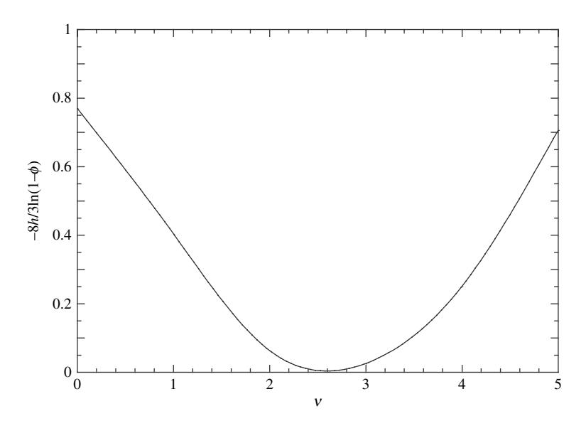

Figure 9.9 Opposition effect angular width parameter for a power-law particle size distribution of the form  $n(a) \propto a^- v \text{ vs. } v$ . The ratio of the largest to the smallest particle is 1000.

where  $a_l$  and  $a_s$  are the largest and smallest particle sizes, respectively, in the distribution. If  $a_l/a_s \simeq 1000$  and  $\phi = 0.4$ , then  $h_S = 0.061$ , corresponding to a half-width of about  $7^{\circ}$ .

## *9.2.4 The amplitude of the SHOE*

## *9.2.4.1 The contribution of multiply scattered light*

It is easy to show that the shadow-hiding effect is negligible for the multiply scattered component. The enhanced brightness is caused by the overlap of the incident and emergent probability cylinders associated with a ray scattered from a single point within the medium. If the ray is scattered between two or more particles before emerging, the probability that the incident and emergent cylinders will overlap is very small. Esposito [\(1979](#page-0-0)) carried out a numerical calculation of the opposition effect including doubly scattered light and found a negligible addition to the reflectance. The main effect of multiple scattering is to reduce the height of the peak relative to the total continuum reflectance, which includes both singly and multiply scattered light.

## *9.2.4.2 Effects of finite particle size*

Theoretically, the opposition effect should increase the singly scattered component of the radiance by a factor of exactly 2 at zero phase. The derivation of the opposition effect assumed that the ray was scattered by a point; that is, the finite size of the particle at point **P** was neglected. However, suppose a ray is scattered only once by a particle in the medium, but the point at which the ray leaves the particle is different from the point at which it entered. Then the amount of overlap between the probability cylinders is less than that calculated in equations [\(9.21\)](#page-0-0)–[\(9.23\)](#page-0-0), and the amplitude of the opposition effect is decreased. If the ray is scattered by specular reflection directly from the particle surface, or after penetrating only a short distance into the particle and scattered back out by subsurface imperfections, then the overlap is large, and the amplitude of the opposition effect will be close to its theoretical value of 1. However, the refracted rays and the internally reflected, backscattered rays may enter and leave the particle at points that are separated by up to nearly the entire particle diameter, and for this light the opposition effect is negligible.

In order to take account of these effects,*BS(g)* will be multiplied by the empirical factor *BS*0, so that equation [\(9.21a](#page-0-0)) is replaced by

$$B(g) = 1 + B_{S0}B_S(g).$$

For a SHOE, 0 ≤ *BS*0 ≤ 1, and *BS*0 is the ratio of the light scattered from near the illuminated portion of the surface of the particle to the total amount of light scattered at zero phase:

$$B_{S0} \simeq S(0)/wp(0),$$
 (9.28)

where *S(*0*)* is the fraction of incident light scattered at or close to the illuminated part of the surface of the particle facing the source, and *wp(*0*)* is the total amount of light scattered by the particle at zero phase. A lower limit to S(0) occurs when the particle is opaque. Then S(0) is the specular component of the particle scattering function,

$$S(0) = R(0) = \frac{(n_r - 1)^2 + n_i^2}{(n_r + 1)^2 + n_i^2},$$
(9.29)

the Fresnel reflection coefficient at normal incidence. However, subsurface scattering (Chapter 6) will increase S(0) above this value for most particles except true opaques.

If a particle is sufficiently large and complex the sub-particle structures can also cast shadows on one another, so that the individual particle scattering functions can have their own SHOE. This would properly be considered to be part of p(g), but could have the effect of making  $B_{S0}$  appear to be > 1. Because particles with size parameter  $X \lesssim 1$  do not have well-defined shadows, it might be expected that a SHOE does not occur in the reflectance of a medium made up of small particles. However, small particles tend to cohere to one another and form clumps. Large clumps of small particles can cast shadows, allowing a SHOE in such media.

# 9.3 The coherent backscatter opposition effect (CBOE) 9.3.1 Physical principles

An entirely different phenomenon can cause a surge in the brightness of a disordered medium at small phase angles whether the particles are larger or smaller than the wavelength. The phenomenon is known variously as *coherent backscatter*, *time-reversal symmetry*, and *weak photon localization*. It was first discussed by Watson (1969) in connection with radar observations of plasmas. The first laboratory identification was in the reflectance of a particulate medium in visible light by Kuga and Ishimaru (1984). At optical wavelengths it has been investigated both experimentally and theoretically by several other researchers, including Wolf and Maret (1985), Akkermans *et al.* (1986), MacKintosh and John (1988), Hapke (1990), Mishchenko (1995), Nelson *et al.* (1998, 2000), Muinonen (2004), and many others. It was independently suggested as a cause of the opposition effect observed on solar system bodies by Shkuratov (1988), Muinonen (1990), and Hapke (1990).

The term *weak localization* comes from an analogy with the transport of electrons through conducting and semiconducting media. There a similar phenomenon occurs in the transition region between the conditions where the electrons may be described as waves propagating through the medium and where the electron wave functions become localized on individual atoms. Although a photon never becomes permanently confined to an atom it can temporarily follow looping, nearly closed, multiply scattered paths and, hence, be "weakly" localized.

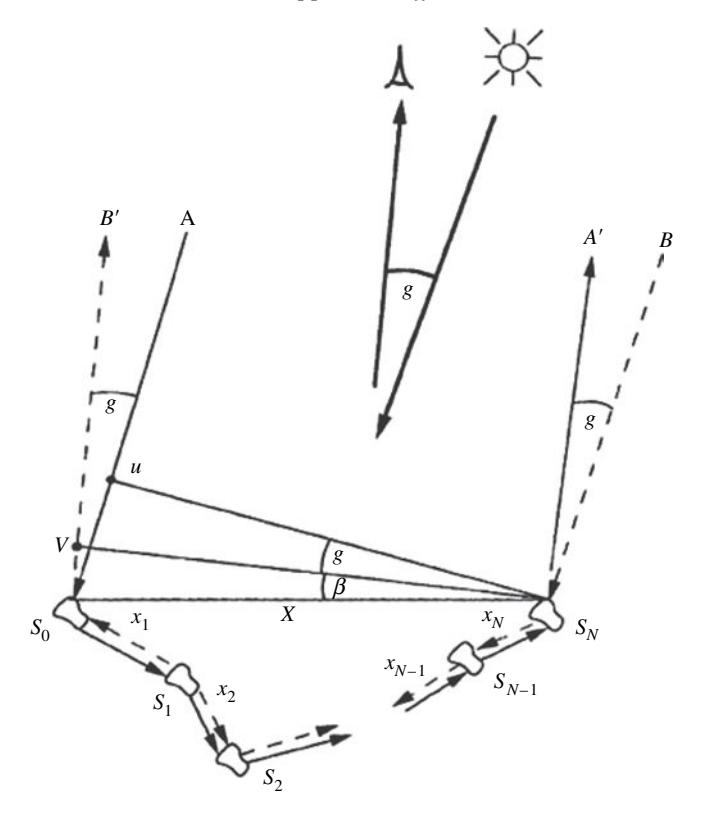

Figure 9.10 Schematic diagram of the coherent backscatter opposition effect.

The principle of coherent backscatter is illustrated in Figure 9.10. Part of a wave front incident on a particulate medium encounters a scattering center and is scattered two or more times before exiting the medium at a small phase angle. For every such path another portion of the same wave front will traverse the same path within the medium but in the opposite direction. At large phase angles there is no coherence between the two wavelets and the total intensity is twice the individual intensities. At zero phase angle the two wavelets will be in phase upon emerging from the medium and will combine coherently so as to interfere with each other positively (Chapter 2), and the total intensity is quadruple the individual intensities.

In Figure 9.10  $S_0$  and  $S_N$  are the initial and final scatterers, respectively, encountered by part of the wave and are separated by distance X. There can be any number of additional scatterers between  $S_0$  and  $S_N$ . Denote the incident wave front by  $S_N - U$  and the emergent wave front by  $S_N - V$ . Consider two wave paths in the principal plane  $A - S_0 - \cdots - S_N - A'$  (shown as the solid line in the figure) and its reverse  $B - S_N - \cdots - S_0 - B'$  (dashed line). Let  $L = \sum_{1}^{N} X_N$  be the total distance traveled by the two partial waves between  $S_0$  and  $S_N$ . Then

just after emerging from the medium wavelet A-A' has traveled a distance  $X\sin(\beta+g)+L$  and wavelet B-B' has traveled a distance  $X\sin\beta+L$ , so that the path difference is  $\Delta X=X\sin(\beta+\widetilde{g})-X\sin\beta$ . The difference in phase between the two waves is  $\Delta\phi=2\pi\Delta\widetilde{X}/\lambda=(2\pi/X\beta\lambda)[\sin(\beta+g)-\sin a]=(2\pi X/\lambda)(\sin\beta\cos g+\cos\beta\sin g-\sin\alpha)\approx 2\pi Xg\cos\beta/\lambda$  to first order in g.

If the amplitude of each of the wavelets is  $E_0$  and if the relative phases of the waves are random, then the combined intensity is proportional to  $|E_0|^2 + |E_0|^2 = 2|E_0|^2$ . However, in the exact backscatter direction,  $\Delta \phi = 0$ , and the amplitudes add coherently, so that the combined intensity is proportional to  $|E_0 + E_0|^2 = 4|E_0|^2$ . Thus, the intensity of the multiply scattered contribution to the reflectance is doubled.

#### 9.3.2 Derivation

It must be emphasized that no rigorous theory of the CBOE in a closely packed, semi-infinite medium of complex particles large compared to the wavelength currently exists. An approximate model of the CBOE for isotropic scatterers has been derived by Akkermans *et al.* (1986) and an empirical model by Shkuratov and Ovcharenko (1998). The exact solution for Rayleigh scatterers that takes account of the vector nature of light has been published by Ozrin (1992) and a numerical simulation by Mishchenko, (2000). We will follow the general scheme of Akkermans *et al.* (1986) because it is relatively mathematically simple and analytic, yet gives surprisingly good agreement with a number of observations.

The general procedure will be as follows. The medium is assumed to consist of point particles that scatter light isotropically. Only the case of vertically incident light will be treated. Consider two portions of an incident wave that enter the medium through two infinitesimal surface regions of area  $\Delta A$  separated by a horizontal distance r. We will use the two-stream approximation to the radiative transfer equation to find the directionally averaged radiance emerging from each area. The radiance emerging in a given direction from the two areas will be combined coherently and then integrated over the entire surface to give the reflectance as a function of phase angle.

To find the intensity in a semi-infinite medium we start by solving the twostream approximation to the radiative-transfer equation in an infinite medium from a single point source located at the origin. We will then add a sink of photons in such a manner that the boundary conditions appropriate to a semi-infinite medium are approximately satisfied. Although this solution has no physical meaning for the part of the medium above the surface, this does not concern us because it does satisfy both the radiative-transfer equation and the boundary conditions for the portion of the medium at and below the surface. The expression governing the distribution of the directionally averaged radiance  $\varphi$  is given by equation (8.38),

$$\frac{1}{4}\frac{d^2\varphi}{d\tau^2} = \frac{1}{4E^2}\frac{d^2\varphi}{dz^2} = -\gamma^2\varphi + source,$$

where z is the vertical direction. Now, the operator  $d^2/dz^2$  is actually the *del-squared* operator  $\nabla^2$  (see Appendix C) in rectangular coordinates for a horizontally stratified medium. Our initial goal is to find the intensity from a point source located at the origin in an infinite uniform medium, which is a problem with spherical symmetry. In spherical coordinates the appropriate equation is

$$\frac{1}{4E^2}\nabla^2\varphi = \frac{1}{4E^2R^2}\frac{d}{d}\left(R^2\frac{d\varphi}{dR}\right) = -\gamma^2\varphi + S\delta(R),\tag{9.30}$$

where R is the distance to the source, S is the radiant power emitted per unit solid angle by the point source, and  $\delta(R)$  is the Dirac delta function (Chapter 5). The solution is (hint: substitute  $\varphi = F/R$ )

$$\varphi = C \exp(-2\gamma ER)/R$$
.

The constant C is found by requiring that the total power  $4\pi S$  emitted by the source is equal to the power absorbed per unit volume,  $4\pi \varphi A$  integrated over all space, where A is the volume-averaged absorption coefficient,  $A = (E - S) = (1 - S/E)E = (1 - w)E = \gamma^2 E$ . This gives

$$4\pi S = \int_0^\infty 4\pi \, \varphi A 4\pi \, R^2 dR = 4\pi^2 C/E,$$

Hence,  $C = ES/\pi$  and

$$\varphi = \frac{ES}{\pi} \frac{e^{-2\gamma ER}}{R}.$$
 (9.31)

To find the solution for a semi-infinite medium we change to cylindrical coordinates  $(r, z, \varphi)$ , where r is the distance from the z-axis,  $\varphi$  is the azimuth angle, and z is the vertical distance. Let the surface of the medium be the z = 0 plane. The source is placed at a point on the vertical axis, r = 0, a distance  $z_1$  below the surface. The distance from any point to the source is  $R = [r^2 + (z_1 + z)^2]^{1/2}$ .

The solution must satisfy the boundary condition (equation 8.44),

$$\varphi = (1/2)(d\varphi/d\tau) = -(1/2E)(d\varphi/dz)$$

at the surface z = 0 of the medium. We can try to accomplish this by mathematically adding a virtual sink of photons (that is, a negative source) on the z-axis at some distance above the surface. Unfortunately, it turns out to be mathematically difficult to satisfy the boundary condition exactly for all values of r on the surface z = 0. However, we can satisfy it approximately as follows.

It is desired to force the radiance to have a slope at the surface  $d\varphi(0)/dz = -2E\varphi(0)$ . Suppose this slope is linearly extrapolated from the surface to the distance  $z_E$  above the surface where the extrapolated radiance becomes zero. Then  $d\varphi(0)/dz = -\varphi(0)/z_E = -2E\varphi(0)$ , so that the extrapolation length is given by  $z_E = 1/2E$ . Hence, we will replace equation (8.40) by the approximate boundary condition  $\varphi(z_E) = 0$ . This condition can be satisfied by placing a sink of strength -S at the mirror point at r = 0,  $z = z_1 + 2z_E$ . Then the combined directionally averaged intensity from the source and sink is

$$\varphi(r,z,\psi) = \frac{ES}{\pi} \left[ \frac{\exp\left(-2\gamma E\sqrt{r^2 + (z_1 + z)^2}\right)}{\sqrt{r^2 + (z_1 + z)^2}} - \frac{\exp\left(-2\gamma E\sqrt{r^2 + (z_1 + 2z_E - z)^2}\right)}{\sqrt{r^2 + (z_1 + 2z_E - z)^2}} \right],$$
(9.32)

where z < 0.

For the CBOE calculation we have an area  $\Delta A$  on the surface of a semi-infinite medium illuminated vertically by irradiance J, which penetrates to a depth  $z_1$ . Therefore, we let the source be the light scattered per unit solid angle by an incremental volume of area  $\Delta A$  and thickness  $dz_1$  located a distance  $z_1$  below the surface:

$$S = JwET(z_1)\Delta Adz_1/4\pi$$
,

where  $T(z_1) = K \exp(-K\tau_1/\mu_0) = K \exp(KEz_1)$ , since  $\mu_0 = 1$ . This scattered light diffuses through the medium and illuminates another infinitesimal volume  $\Delta A dz_2$  at the point  $(r_2, z_2, \psi_2)$  with total radiant power  $4\pi \varphi(r_2, z_2, \psi_2)$ . A fraction  $wE/4\pi$  per unit solid angle of this is directed toward the surface and is attenuated by an amount  $T(z_2) = K \exp(-K\tau_2/\mu) = K \exp(KEz_2/\mu)$  before exiting in a direction making a small phase angle with the vertical. Since the problem involves only small phase angles we may take  $\mu \approx 1$  to a sufficient approximation. Then the increment of radiant power leaving the surface above point 2 due to a source at point 1 is

$$dI_{1-2} = \frac{JwEK \exp(KEz_1)}{4\pi} \Delta A dz_1 \frac{E}{\pi} \varphi(r_2, z_2, \psi_2) \frac{wEK \exp(KEz_2)}{4\pi} \Delta A dz_2. \quad (9.33)$$

It is trivial to show that the incremental radiant power  $dI_{2-1}$  leaving the surface above point 1 from a source located at point 2 is the same:  $dI_{2-1} = dI_{1-2}$ . These will interfere coherently, depending on the phase difference between them. The geometry is shown schematically in Figure 9.11. From the law of cosines,  $\cos \beta = \cos(\pi/2 - g)\cos\psi_2 + \sin(\pi/2 - g)\sin\psi_2\cos(\pi/2) = \sin g\cos\psi_2$ ,  $\approx g\cos\psi_2$  for small g, and from the figure,  $\Delta L = r_2\cos\beta = r_2g\cos\psi_2$ . Let the field of the wave emerging at the point  $(r_2, 0, \psi_2)$  on the surface be  $E_0$  and from the origin be  $E_0\exp(\Delta\varphi)$ , where  $\Delta\varphi = 2\pi\,\Delta L/\lambda$  is the phase difference. Then the combined

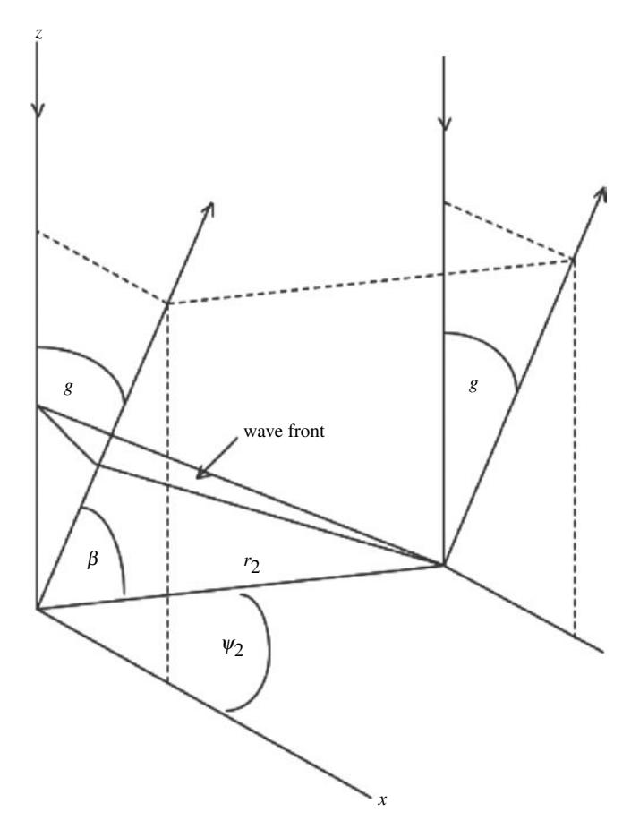

Figure 9.11 Schematic diagram of the wave front leaving the surface above source points 1 and 2.

radiant power from the two reverse-path pairs is

$$dI \propto |E_0 + E_0 e^{i\Delta\phi}|^2 = (E_0 + E_0 e^{i\Delta\phi})(E_0 + E_e^{-i\Delta\phi})$$

$$= E_0^2 \left(1 + 2\frac{e^{i\Delta\phi} + e^{-i\Delta\phi}}{2} + 1\right) = 2E_0^2 (1 + \cos\Delta\phi) \propto dI_{1-2} (1 + \cos\Delta\phi).$$
(9.34)

The integral of *dI* over the entire medium is the power per unit solid angle emerging from the area -*A* on the axis at *r* = 0 combined with the power emerging from all its reverse-pair areas around it,

$$I = \int_{z_2 = -\infty}^{0} \int_{z_1 = -\infty}^{0} \int_{r_2 = 0}^{\infty} \int_{\psi_2 = 0}^{2\pi} 2(1 + \cos \Delta \phi) dI_{1 - 2} d\psi_2 r_2 dr_2 dz_2 dz_1.$$
 (9.35)

The integration over azimuth can be carried out using the relation (Jahnke and Emde, 1945)

$$J_{2j}(\nu) = (-1)^j \frac{2}{\pi} \int_0^{\pi/2} \cos(\nu \cos \psi) \cos(2j\psi) d\psi,$$

where  $J_{2j}(\nu)$  is the Bessel function of the first kind of argument  $\nu$  and order 2j. Putting j=0 and  $\nu=2\pi r_2g/\lambda$  gives

$$\int_{0}^{2\pi} [1 + \cos \Delta \phi] d\psi_{2} = 4 \int_{0}^{\pi/2} \left[ 1 + \cos \left( \frac{2\pi g r_{2}}{\lambda} \cos \psi_{2} \right) \right] d\psi_{2}$$

$$= 2\pi \left[ 1 + J_{0} \left( \frac{2\pi g r_{2}}{\lambda} \right) \right]. \tag{9.36}$$

The emerging radiance is radiant power per unit area  $I/\Delta A$ , and the reflectance is the radiance divided by the incident power  $J\Delta A$ . Thus the reflectance is

$$r_{M} = \frac{w^{2}K^{2}E^{3}}{8\pi^{2}} \int_{z_{2}} \int_{z_{1}} \int_{r_{2}} \left[ 1 + J_{0} \left( \frac{2\pi g r_{2}}{\lambda} \right) \right]$$

$$\left[ \frac{\exp\left( -2\gamma E \sqrt{r_{2}^{2} + (z_{1} + z_{2})^{2}} \right)}{\sqrt{r_{2}^{2} + (z_{1} + z_{2})^{2}}} - \frac{\exp\left( -2\gamma E \sqrt{r_{2}^{2} + (z_{1} + 2z_{E} - z_{2})^{2}} \right)}{\sqrt{r_{2}^{2} + (z_{1} + 2z_{E} - z_{2})^{2}}} \right]$$

$$\exp(KEz_{2}) \exp(KEz_{1}) r_{2} d r_{2} dz_{1} dz_{2}, \tag{9.37}$$

where the subscript M is to indicate that this is the multiply scattered part of the reflectance r, since the singly scattered light does not contribute to the CBOE.

**Non-absorbing particles** If the particles of the medium do not absorb light and are perfect scatterers, w = 1 and  $\gamma = 0$ . In this case the integration can be performed analytically. The integrals over  $r_2$  can be evaluated using the relation (Bracewell, 2000)

$$\int_0^\infty J_0(f\,r) \frac{1}{\sqrt{r^2 + b^2}} r d\,r = \frac{\exp(-fb)}{f},$$

and putting  $f = 2\pi g/\lambda$ ,  $r = r_2$ , and  $b = z_1 + z_2$  or  $b = z_1 + z_E - z_2$ . The rest of the integrations are straightforward, but tedious. The result is

$$r_{M} = \frac{w^{2}}{K\pi} \left\{ 1 + 2z_{E}KE + \frac{1}{(1 + 2\pi g/KE\lambda)^{2}} \left[ 1 + \frac{1 - \exp(4\pi gz_{E}/\lambda)}{2\pi g/KE\lambda} \right] \right\}. \quad (9.38)$$

This is of the same form as that obtained by Akkermans *et al.* (1986), except that they considered only well-separated particles, so K = 1 in their expression. Since the particles are assumed to be nonabsorbing, w = 1 and  $E = S = 1/\Lambda_S$ , so these

authors made the approximation, commonly used in diffusion theory to correct for anisotropic particle phase functions, of replacing  $\Lambda_S$  by the transport mean free path  $\Lambda_T$ . They also used a more accurate value for the extrapolation length  $z_E$  from diffusion theory of  $z_E = 0.71 \Lambda_T$ .

With these substitutions, but retaining K,  $r_M$  can be written

$$r_M = r_{M0}[1 + B_c(g)] (9.39)$$

where  $r_{M0} = (1 + 1.42K)/K\pi$  is the multiply scattered background intensity and

$$B_C(g) = \frac{1}{(1 + 1.42K)(1 + 2\pi \Lambda_T g/\lambda)^2} \left[ 1 + \frac{1 - \exp(1.42K2\pi \Lambda_T g/\lambda)}{2\pi \Lambda_T g/\lambda} \right]$$
(9.40)

is the coherent backscatter angular function for a nonabsorbing scattering medium. Recall that in deriving (9.40)  $\sin g$  was replaced by g. When using a computer to calculate the intensity over a wide range of phase angles, if  $\sin g$  is used  $B_S(g)$  will decrease and then increase again when  $g > 90^\circ$ . In order to prevent this from happening it is often convenient to replace  $\sin g$  or g by  $2\tan(g/2)$ . Then (9.40) can be written

$$B_C(g) = \frac{1}{1 + 1.42K} \frac{1}{\left(1 + \frac{1}{h_C} \tan\frac{g}{2}\right)^2} \left[ 1 + \frac{1 - \exp(-1.42K \frac{1}{h_C} \tan\frac{g}{2})}{\frac{1}{h_C} \tan\frac{g}{2}} \right], \quad (9.41a)$$

where

$$h_C = \frac{\lambda}{4\pi \Lambda_T}.\tag{9.41b}$$

Equation (9.41a) for  $B_C(g)$  is plotted as the solid lines in Figure 9.12 as a function of  $\tan(g/2)/h_C$  for K=1 and 1.9. Like the SHOE it is sharply peaked peak at g=0 and falls rapidly as g increases. However, it should be noted that it does not fall off as rapidly as an exponential function. The angular half-width at half-maximum occurs at

$$HWHM = 0.33 \cdot 2h_c = 0.33\lambda/2\pi \Lambda_T.$$
 (9.42)

An empirical approximation to  $B_C(g)$  that is much more convenient than (9.41a) is

$$B_C(g) \approx \left\{ 1 + [1.3 + K] \left[ \left( \frac{1}{h_C} \tan \frac{g}{2} \right) + \left( \frac{1}{h_C} \tan \frac{g}{2} \right)^2 \right] \right\}^{-1}.$$
 (9.43)

This is plotted as the dashed lines in Figure 9.12.

**Absorbing media** The integration over the radial distance cannot be carried out analytically when  $\gamma > 0$  in (9.35), corresponding to particles with w < 1 in a quasicontinuous approximation to a particulate medium. It is clear from the discussion

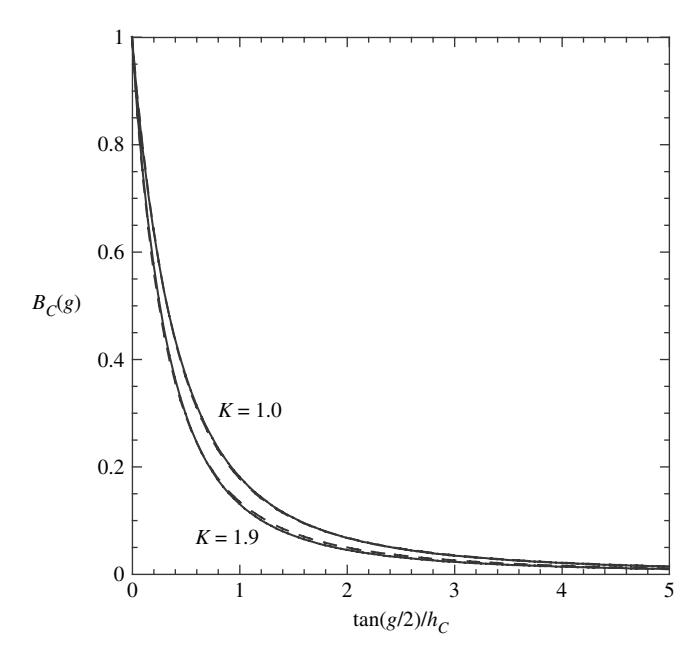

Figure 9.12 The coherent backscatter opposition effect function vs. tan*(g/*2*)*/*hC* for two values of the parameter *K*. The solid lines are the exact equation [\(9.41\)](#page-0-0) and the dashed lines are the approximate equation [\(9.43\)](#page-0-0).

in Section [9.3.1](#page-0-0) that photons that travel only a short distance before emerging will combine coherently over a wide range of phase angles and, thus, contribute to the wide base of the CBOE peak. Photons that travel a long distance before emerging are much fewer in number and combine coherently only over a short range of phase angles, thus forming the narrow top of the peak. Although the contribution from each radial distance is a rounded hump, the cumulative effect of all paths is a sharp peak when *w* = 1. However, if the photons are absorbed as they propagate between the scatterers, few will be able to travel a long distance, so that the peak would be expected to be lower and rounded off.

Akkermans *et al.* [\(1988\)](#page-0-0) studied the interaction of a short pulse of light as it propagated and spread out through a medium, so that they were able to ascertain the effect of eliminating the long paths. They found that the coherent backscatter peak of an absorbing medium is an equation of the same form as [\(9.38\)](#page-0-0) for *BC(g)*, except that 2ζ!*T g*/. is replaced by

$$\frac{2\pi g \Lambda_T}{\lambda} \to \sqrt{\left(\frac{2\pi g \Lambda_T}{\lambda}\right)^2 + \frac{3\Lambda_T}{\Lambda_A}}.$$
 (9.44)

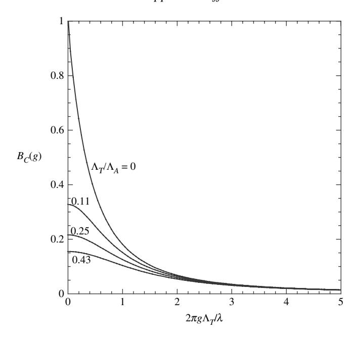

Figure 9.13 CBOE peak shape predicted for scatterers embedded in an absorbing medium for several values of !T/!*A*.

Where !*A* is the absorption mean free path. This expression for *BC(g)* is plotted in Figure [9.13](#page-0-0) for several values of !*T* /!*A*. When this parameter is not zero the backscatter peak is rounded instead of sharply peaked.As the value of the parameter increases the peak height is predicted to decrease and the angular width to increase. When !*T /*!*A* = 0*.*70 the HWHM is 1*.*45.*/*2ζ!*T* , over four times as wide as when !*/*!*A* = 0*.*

# *9.3.3 Comparison of CBOE models with experiment*

## *9.3.3.1 Media of particles smaller than the wavelength*

The backscatter peak has been studied in a large variety of colloidal suspensions of polystyrene spheres and TiO2 particles smaller than the wavelength (Van Albada *et al.*, [1988](#page-0-0), [1990](#page-0-0); Wolf *et al.*, [1988](#page-0-0)). For the suspensions of small particles, the relatively simple model of Akkermans *et al.* [\(1986](#page-0-0)) seems to work remarkably well. Figure [9.14](#page-0-0) from Van der Mark *et al.* [\(1988\)](#page-0-0) shows a plot of the angular widths of the peaks in colloidal suspensions of a variety of nonabsorbing particles versus the ratio of the transport mean free path to the wavelength. The measured data agree quite well with predictions of theory over a wide range.

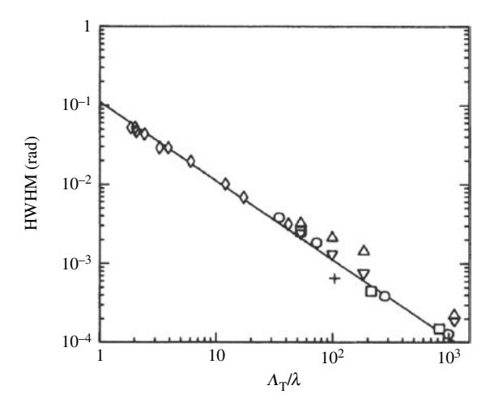

Figure 9.14 Measured full widths of the coherent backscatter peaks of optically thick colloidal suspensions versus the ratio of the transport mean free path to the wavelength. Diamonds: 220 nm TiO2 in 2-methylpentane-2,4-diol. Circles: 1091-nm polystyrene spheres in water. Squares: 482-nm polystyrene spheres in water. Triangles (point up): 214-nm polystyrene spheres in water, polarized light, polarizer parallel to plane of emergence. Triangles (point down): 214-nm polystyrene spheres in water, polarized light, polarizer perpendicular to plane of emergence. Plus signs: 2020-nm polyvinyltoluene spheres in water. Line: theoretical prediction. (Reproduced from Van der Mark *et al.* [\[1988\]](#page-0-0), copyright [1988](#page-0-0) by the American Physical Society.)

The effect of eliminating the long paths that make the CBOE peak high and sharp were studied experimentally in two ways: by adding absorbing dyes to the suspending media, and using optically thin layers so that photons that were scattered more than a few times escaped in a downward direction. The peaks in these media were found to become low and rounded, in agreement with theory.

# *9.3.3.2 The shape of the CBOE peak in powders of particles larger than the wavelength*

When the model developed in the preceding section is extrapolated to media of large particles in contact it is found that the line shape for a nonabsorbing medium, equation [\(9.41\)](#page-0-0), can be fitted empirically to the data with good agreement. However, the predicted shape and dependence on wavelength, transport mean free path, and absorption does not agree with experimental results.

The two-stream diffusion model of the CBOE derived in Section [9.3.2](#page-0-0) predicts that the peak should be sharp only when the particles are pure scatterers, because absorption cuts off the long diffusion paths that control the top of the peak. However,

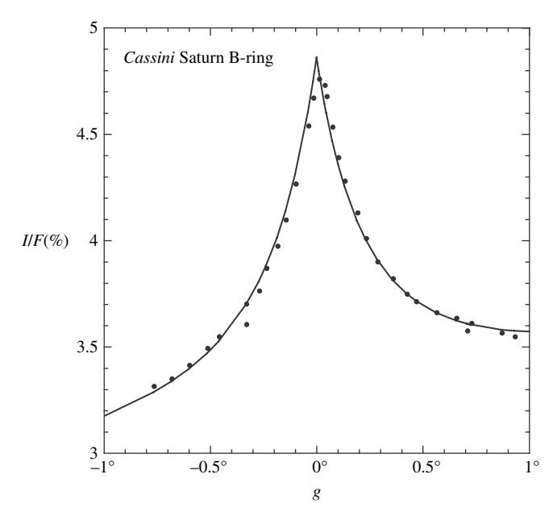

Figure 9.15 The opposition effect shown in Figure [9.3](#page-0-0) in a ringlet of the B-ring of Saturn measured along the ringlet a constant distance from the planet. Dots: measured data from *Cassini* spacecraft. Line: theoretical prediction (equation [\[9.41\]](#page-0-0) with the addition of a linear slope to account for detector nonuniformity).

measurements on particulate media of a wide variety of particle sizes and compositions (Hapke *et al.*, [1993](#page-0-0); Shkuratov *et al.*, [1997](#page-0-0); Nelson *et al.*, [1998](#page-0-0), [2000](#page-0-0)), find that the peaks are invariably sharp and are well described by equation [\(9.41\)](#page-0-0) This is illustrated by Figure [8.18](#page-0-0) for commercial SiC abrasive particles approximately 17µm in size measured using a He–Ne laser at . = 633nm. The samples have reflectances at 10! ranging from only 18% to 26%, yet there is no sign of a rounding off. The same is true of the opposition effect in the rings of Saturn shown in Figure [9.3.](#page-0-0) The relative radiance along the ring through the zero phase point is plotted in Figure [9.15,](#page-0-0) where the slight rounding can be accounted for entirely by the finite angular size of the Sun at Saturn (about 0*.*05!).

In the experiments where a dye was continuously distributed between the scatterers the long scattering paths were absorbed. However, in powders of absorbing particles in clear media the absorber is confined entirely to the scatterers. The sharp peak implies that long nonabsorbing paths between scattering locations exist, even in low-albedo powders. This would not be the case for photons that are forwardscattered multiple times deeply into the medium, but it would be true the if the photons that contribute significantly to the CBOE peak are those that, upon the first encounter with the medium, are scattered sideways, more or less parallel to the irregular surface, so that they travel several particle diameters before scattering again. This would explain why equation [\(9.41\)](#page-0-0) for nonabsorbing particles also correctly describes the shapes of the coherent backscattering peaks of powders of absorbing particles embedded in a nonabsorbing medium. The sharp peak observed in low-albedo powders is another case where attempts to model a system of discrete particles by a quasi-continuous medium breaks down. This problem has also been discussed by Weaver [\(1993\)](#page-0-0).

# *9.3.3.3 The height of the CBOE peak in powders of particles large compared to the wavelength*

The fact that coherent backscatter operates only on the multiply scattered portion of the reflectance of a particulate medium might lead the reader to predict that lowalbedo media should not possess a CBOE, and that the amplitude of the peak should increase monotonically as the albedo increases. However, samples of lunar soil with albedos of the order of 10% possess well-developed opposition effects which have been shown to be CBOEs, Hapke *et al.* [\(1993\)](#page-0-0). Shkuratov and Ovcharenko [\(1998\)](#page-0-0) discovered that mixtures of MgO and amorphous C powder have strong CBOEs, whereas the opposition effects of the pure end members are weak. There are two reasons for this behavior.

To understand the first reason we must carefully be aware of what is meant by "scattering" in the context of the CBOE. In Chapters [5–8](#page-0-0) the term referred to the interaction of a light wave with an entire particle. However, in the CBOE the term refers to any event that changes the direction of a wave. This can occur by refraction, reflection, or internal scattering within a single particle, as well as from a particle as a whole. If a particle is complex, as most large particles are, multiple scattering can occur between parts of the surface or between internal scatterers. Thus, depending on the nature of the particle, the CBOE can amplify much of the singly scattered portion of the reflectance in addition to all of the multiply scattered terms, so that even low-albedo media can exhibit a CBOE. All of the light in the SHOE that is multiply scattered within or on the surface of the particle is also amplified by coherent backscatter. These arguments are supported by the paper by Zubko *et al.* [\(2008\)](#page-0-0) who studied computer models of scattering by complex single particles and found that they exhibited coherent backscatter.

The second reason arises because of the vector nature of light. Each scattering event tends to rotate the plane of polarization by an amount that depends on the nature of the event. The initial direction of polarization becomes randomized after a few scatterings and the reverse pairs can no longer combine coherently (Van Albada *et al.*, [1988\)](#page-0-0). Thus, the longer multiple scattering paths that occur in high-albedo media only contribute to the background reflectance, but not to the coherent backscatter peak. The CBOE angular function equation [\(9.41\)](#page-0-0) was derived

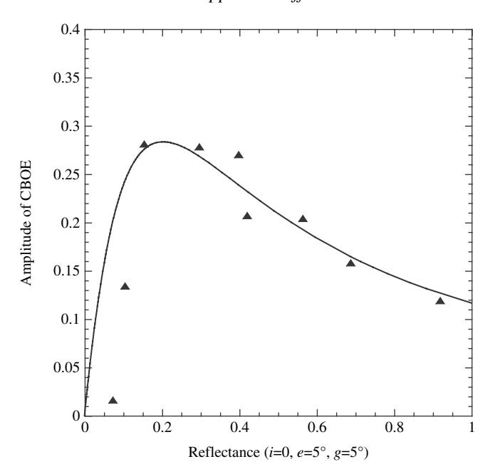

Figure 9.16 Height of the CBOE peak relative to the continuum reflectance for mixtures of Al2O3 and B4C abrasive powders. Triangles: data. Line: theoretical prediction.

using a scalar treatment that did not take polarization randomization into account and so overestimated the height of the peak.

To study these effects Nelson *et al.* [\(2004](#page-0-0)) measured the height of the backscatter peak, relative to the background reflectance, of mixtures of 22-µm abrasive powders of Al2O3, which has a high albedo, and B4C, which has a low albedo. The results are plotted versus reflectance as the points in Figure [9.16.](#page-0-0) When the reflectances are low the peak amplitude first increases as the reflectance increases, but goes through a maximum at a reflectance around 20% and then decreases.

To analyze their data Nelson *et al*. assumed that the background could be modeled to sufficient accuracy by equation [\(8.47\)](#page-0-0) for the bidirectional reflectance of a medium of isotropic scatterers. This equation was expanded in powers of *w* up to *w*4, which gave the contribution of each order of scattering to the reflectance. These contributions, relative to the entire reflectance, are plotted in Figure [9.17.](#page-0-0) Each of these curves was multiplied by an adjustable weighting factor between 0 and 1 and then added together, and the sum compared with the data. The best fit, shown as the solid line in Figure [9.16,](#page-0-0) was obtained if singly scattered light and light scattered more than four times made negligible contributions to the coherent backscatter peak, while the peak consisted of 75% of the light scattered

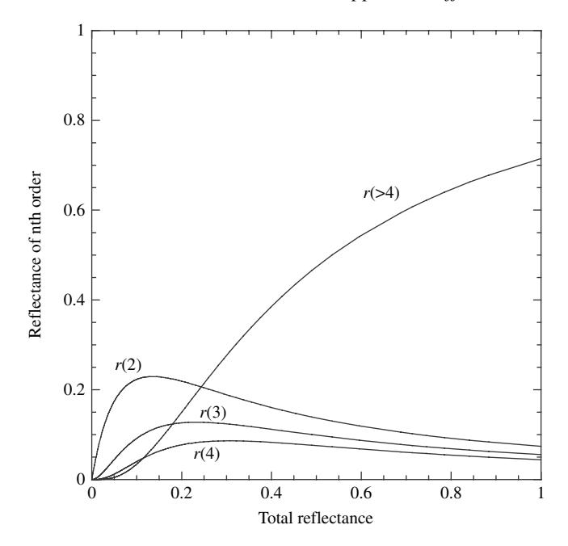

Figure 9.17 Ratio of each order of scattering to the total reflectance of a medium of isotropic scatterers plotted against the total reflectance.

twice, 65% of the light scattered three times, and 50% of the light scattered four times.

The main discrepancy occurs at small values of the reflectance, where the theoretical curve is too high. The reason is that this crude model averages the albedos of all the particles, so that the weighting factors are assumed to be independent of the mixing ratio. However, in the low-reflectance mixtures most of the second-order scattering occurs between the abundant low-albedo B4C particles, so that a photon has to be scattered more than twice before encountering a high-albedo Al2O3 particle. In real media of low reflectance this effect decreases the relative importance of second-order scattering below the predicted curve.

These effects can be taken into account by multiplying *BC(g)* by an amplitude factor *BC*0, so that the reflectance is amplified by the coherent backscattering factor

$$1 + B_{C0}B_C(g), (9.45)$$

where *BC*0 is an empirical quantity that cannot be predicted exactly at the present time, but is related to the albedo.

# *9.3.3.4 Polarization effects associated with the CBOE in media of particles larger than the wavelength*

The effects of coherent backscattering when polarized light is incident depends on the type of polarization. They have been discussed by Van Albada *et al.* [\(1990](#page-0-0)) and MacKintosh *et al.* [\(1989](#page-0-0)). It is useful to define two quantities, the *linear polarization ratio* and the *circular polarization ratio*, which are defined as follows.

Let polarized light be incident vertically on a specularly reflecting surface. If the incident light is linearly polarized the reflected light has the same direction of polarization and no light with orthogonal polarization is reflected. If the incident light is circularly polarized the reflected light has the opposite helicity and no light with same helicity is reflected. Now let the polarized light be incident on a medium and the intensity in the same and orthogonal polarizations measured. Then the ratios are defined to be the ratio of the intensity reflected in the mode of polarization that would not be expected if the target were a specular reflector to the intensity in the mode that would be expected from a specular reflector. Thus, the linear polarization ratio of light scattered from a medium is defined as the ratio of the intensity scattered with its plane of polarization perpendicular to that of the incident light to the intensity scattered with its plane of polarization parallel to that of the incident light. Similarly, the circular polarization ratio of light scattered from a medium is defined as the ratio of the intensity scattered with the same direction of helicity as that of the incident light to the intensity scattered with the opposite direction of helicity as that of the incident light.

If the polarization is completely randomized the polarization ratios are equal to 1. The polarization ratios are a measure of the degree to which the incident light is depolarized by multiple scattering within the medium. For that reason they are sometimes referred to as *depolarization ratios.*

Because multiple scattering tends to randomize the polarization, the lowest orders of scattering contribute the most toward the polarization effects associated with coherent backscatter. Large particles scatter light primarily by two processes: specular reflection from the surface and transmission. If the particle is opaque all of the light is scattered by surface reflection. If the particle is not opaque, the transmitted light is forward-scattered deeper within the medium, where on average it has to undergo several scatterings to escape in the backward direction, and so contributes relatively little to the lower orders. Thus, light that is scattered only a few times by specular reflection with intermediate paths in directions roughly parallel to the surface makes the largest contribution to the polarization effects.

When circularly polarized light is incident the light reflected by single scattering directly back toward the source has helicity opposite to that of the incident light. Light that is doubly scattered has its helicity reversed twice, so that light of the same helicity as incident is backscattered. The doubly reflected light is slightly elliptically polarized because the Fresnel reflection coefficients at oblique incidence for the times when the electric vectors are instantaneously perpendicular or parallel to the local scattering plane are not equal. Since elliptically polarized light can be decomposed into two circularly polarized components of opposite helicity (Chapter [4\)](#page-0-0), the light has been partially depolarized. However, the amount of depolarization is fairly minor.

To understand the circular polarization effects it will be sufficient to consider only singly and doubly scattered light. Let the intensity of the singly scattered light be 2*I*1, let the unenhanced intensity of the doubly scattered light with the same helicity as incident be *I*2*S* and of the doubly scattered light with the opposite heliciy be *I*2*O*. Then outside of the coherent peak the circular polarization ratio is *I*2*S*/(*I*1 + *I*2*O)*. Suppose that inside the coherent peak each component of the doubly scattered light is enhanced by a factor of *E*. Then inside the peak the circular polarization ratio is *EI* 2*S*/*(I*1 +*EI* 2*O)* = *I*2*S*/*(I*1*/E* +*I*2*S)*, which is greater than the ratio outside the peak. Thus, the circular polarization ratio is *increased* inside the coherent peak.

MacKintosh *et al.* [\(1989\)](#page-0-0) have pointed out another mechanism that preserves helicity in a medium in which large particles are sufficiently separated that diffraction is important. In this case a significant amount of light can be forward-scattered by diffraction at each scattering, which does not change the helicity. Eventually by repeated scattering through several small angles the light can be scattered back out of the medium with its helicity intact.

Another way of thinking about helicity preservation is that multiple scatterings depolarize by rotating the electric vectors. However, in circularly polarized light the electric vector is already rotating. Hence, the original direction of helicity tends to be preserved through many scatterings to a much greater extent than either the direction of polarization of linearly polarized light or the direction of propagation.

Van Albada *et al.* [\(1990\)](#page-0-0) have discussed the case when linearly polarized light is incident on a medium of particles smaller than the wavelength. They showed that the linear polarization ratio decreases in the coherent backscatter peak. Here we show how their analysis can be extended to the case of large particles. When linearly polarized light is incident the singly backscattered light has its electric vector parallel to that of the incident radiation. However, it is not coherently amplified. The doubly scattered light has its electric vector rotated by an amount that depends on the angle between the direction of the line connecting the two scatterers and the incident electric vector and is strongly randomized. Coherent backscattering enhances both the polarized and depolarized components of the doubly scattered light.

However, let us consider triple scattering in detail, as illustrated schematically in Figure [9.18.](#page-0-0) We are looking down vertically, parallel to the direction of incidence,

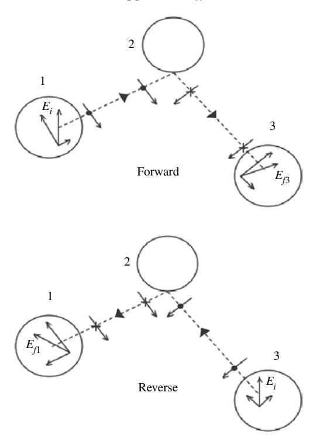

Figure 9.18 Schematic diagram of the reflections and relative phases of triply scattered light.

at three particles near the surface of the medium. For purposes of illustration, the figure shows the situation where the scattering facets on the surfaces of the particles are separated by integral multiples of the wavelength, but the phase relationships between the final forward and reverse states are the same for arbitrary separations. The upper figure shows the case where part of the incident wave is scattered from particle 1 to 2 to 3 and then to the detector. The electric vector of the incident light is labeled *Ei*. Part of the light incident on particle 1 is specularly reflected from a surface facet of particle 1 towards particle 2. The wave reflected from particle 1 has two components parallel and perpendicular to the scattering plane formed by the direction of incidence and the direction from particle 1 to 2. These components are shown either as arrows, or as dots if the electric vector points up, or as plus signs if the field points down. As discussed in Chapter [4,](#page-0-0) the directions of both vectors are reversed at each reflection. The light is reflected from a facet on particle 2 towards particle 3 and finally reflected from a facet on particle 3 towards the observer with electric vector *Ef* 3.

Now consider the light that travels the reverse path, shown schematically in the lower figure. Light with electric vector *Ei* incident on particle 3 is reflected to 2 and 1 and then reflected upward towards the observer as *Ef* 1. Note that *Ef* 3 points toward the top of the page and to the right, while *Ef* 1 points to the top and to the left. That is, the components of the triply scattered vectors parallel to the incident radiation point in the same direction, but the components perpendicular to *Ei* point oppositely to one another. Outside of the coherent backscatter peak the scatterings are uncorrelated. However, inside the peak the components of the triply backscattered light parallel to *E*1 tend to add coherently, but the components perpendicular to *Ei* tend to cancel each other. Thus coherence tends to increase the polarized component of the scattered light, but reduce the depolarized component, so that the linear polarization ratio *decreases* in the peak.

By contrast, the SHOE is dominated by single reflections from the surface of a particle. This preserves the direction of linearly polarized light, but reverses the helicity of circularly polarized light. Thus, both the linear and the circular polarization ratios *decrease* in the SHOE peak.

These effects are illustrated in Figure [9.19,](#page-0-0) which shows the polarization ratios of the light scattered by 17-µm SiC abrasive powder illuminated by linearly and circularly polarized light. Note the dip in the linear polarization ratio and the peak in the circular polarization ratio of about the same angular width as the intensity surge. Based on these polarization relationships, there is little doubt that the narrow peak in the reflectance of the SiC powder is caused by coherent backscatter, rather than shadow hiding.

Since this book is concerned mainly with particles larger than the wavelength we will not consider small particles in detail. It turns out that the linear polarization ratio decreases in the coherent backscatter peak in media of small particles, just as for large particles. However, the increase in the circular polarization ratio in small particles is much smaller than is the case for large particles, and it may even decrease slightly in certain cases (MacKintosh *et al.*, [1989;](#page-0-0) Van Albada *et al.*, [1990\)](#page-0-0).

# *9.3.3.5 The angular width of the CBOE peak in close-packed powders as a function of particle size and wavelength*

The model for the shape of the peak derived in Section [9.2](#page-0-0) predicts that the angular width of the peak should be proportional to .*/*!*T* . This is also predicted by every theory of the CBOE published to date, and implies that the width should depend strongly on particle size, filling factor and wavelength. For equant particles of diameter *D* the reciprocal of the transport mean free path is given by

$$\Lambda_T = [KN\sigma Q_S(1-\xi)]^{-1}$$

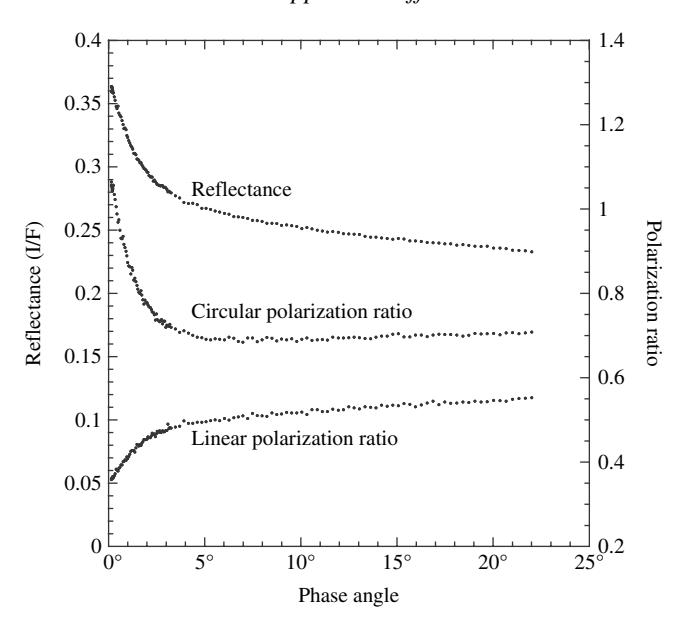

Figure 9.19 Measured reflectance and polarization ratios of a powder of 17- $\mu m$  SiC abrasive particles.

$$= [K\frac{\phi}{v}\sigma Q_S(1-\xi)]^{-1} \approx \left[\frac{K\phi}{\pi D^3/6}(\pi D^2/4)Q_S(1-\xi)\right]^{-1}$$

$$= \frac{2}{3}\frac{D}{K\phi Q_S(1-\xi)}.$$
(9.46)

If the size parameter X < 1, then  $Q_S \propto X^4 \propto D^4$ , and  $\xi \approx 0$ , so the peak width is predicted to be proportional to  $D^3$  for constant filling factor. On the other hand, if X > 1, then  $Q_S = wQ_E$ , where w decreases as D increases for constant absorption coefficient. Now,  $Q_E \approx 1$  for close-packed powders, and  $\xi$  will not change very much with size. Thus, for constant  $\varphi$  the peak width decreases proportional to or faster than 1/D as D increases. Starting with particles smaller than the wavelength, as the size increases, the peak width is predicted to first increase and then decrease, with the maximum occurring around the wavelength, as illustrated by the line in Figure 9.20 for a constant w. If the particle size is much larger or smaller than  $\lambda$  the peak width should be so small as to be unobservable.

If  $\Lambda_T$  is held constant, the peak width is predicted to be directly proportional to the wavelength.

However, none of these predictions are borne out by measurements on close-packed particles. The observed widths of the opposition effect peaks are too wide by orders of magnitude and are insensitive to particle size, filling factor, or wavelength.

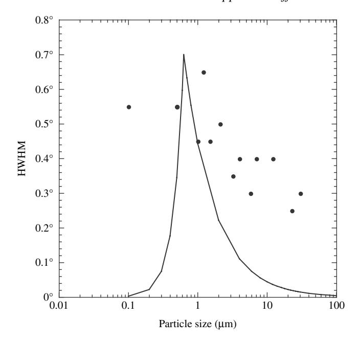

Figure 9.20 Width of the CBOE peak of a particulate medium plotted against particle size. Dots: measured widths for Al2O3 abrasive powders. Line: predicted widths for particles of constant single-scattering albedos.

For example, the narrow peak observed for the SiC powder of Figure [9.19](#page-0-0) has a HWHM of 1*.*4!. This figure shows that the circular polarization ratio also has a peak of about the same width as the intensity peak, while the linear polarization ratio simultaneously decreases. No explanation other than coherent backscatter has been advanced for this behavior of the polarization ratios, so it is highly likely that the peak is indeed a CBOE. The transport mean free path can be calculated from equation [\(9.46\)](#page-0-0) using the known size, single scattering albedo, and filling factor to be !*T* ∼ 175µm. The peak width predicted from equation [\(9.42\)](#page-0-0) is only 0*.*01!.

Figure [8.18](#page-0-0) shows the curves of reflectance versus phase angle for the 17-µm SiC powder samples measured at different filling factors. The widths of the opposition peaks are virtually indistinguishable, even though the porosity changes by a factor of 3.

Nelson *et al.*[\(1998,](#page-0-0) [2000\)](#page-0-0) and Piatek *et al.*[\(2004\)](#page-0-0) havemeasured the reflectances of powders of varying composition over a wide range of sizes in both linearly and circularly polarized light. The light source was a He–Ne laser emitting a wavelength of 633 nm. Representative results are shown as the dots in Figure [9.20.](#page-0-0)All the peaks had increased circular polarization ratios associated with them and are undoubtedly caused by coherent backscatter. Although the peak width is a maximum around the wavelength, as predicted by equation [\(9.46\)](#page-0-0), the drop-off to either large or small particle sizesismuch smallerthan predicted.Shkuratov *et al.*[\(1997\)](#page-0-0)measured powders of metallic Fe with diameters of 5, 40, and 100µm. Kaasalainan [\(2003](#page-0-0)) measured basalt and alumina powders with sizes between 75 and 500µm. Psarev *et al.* [\(2007\)](#page-0-0) measured powders of olivine particles 3, 5, and 8µm in size. No strong dependence of peak widths on size was found in any of these materials.

Similar results were obtained when the particle size was fixed and the wavelength varied. Hapke *et al.* [\(1993](#page-0-0)) measured a sample of *Apollo* lunarsoil at 633 and 442 nm. Nelson *et al.* [\(2002](#page-0-0)) measured powders of Al2O3 using laser sources with wavelengths of 633 and 543 nm. Shkuratov *et al.*[\(2002\)](#page-0-0) and Shkuratov *et al.*[\(2004\)](#page-0-0) measured a variety of powdered minerals, metals, glasses, clays, and volcanic ashes at 633 and 442 nm. Kaasalainen *et al.*[\(2005](#page-0-0))measured Al2O3 at wavelengths of 633 and 1024 nm. The peak widths showed virtually no dependence on wavelength.

When the sample consists of close-packed particles smaller than the wavelength the probable explanation of the insensitivity to .*/*!*T* is cooperative effects between the particles. Figure [7.5](#page-0-0) shows that when the particle are smaller than the wavelength they no longer scatter independently, so that several of them tend to behave like a single particle. In such media amplitude and wavelength effects are probably determined more by the statistics of the clumps within the medium than the properties of the individual particles. However, this needs to be investigated.

No adequate explanation has been advanced for the behavior of large particles. If the medium consists of complex particles the CBOE could be dominated by multiple scattering between internal and surface irregularities of complex particles rather than between particles. While this could account for the insensitivity to particle size in low-albedo media it does not explain the lack of wavelength dependence. Neither does it explain the wide, readily observable CBOE peak in high-albedo Al2O3 powders (Nelson *et al.*, [1998](#page-0-0)), nor in media of smooth uniform spherical particles (Hapke *et al.*, 2007).

Interestingly, when Van der Mark *et al.* [\(1988](#page-0-0)) measured the transport mean free path of suspensions of TiO2 as the filling factor was varied they noted that !*T* appeared to saturate when φ *>*∼15%. They did not offer any explanation for this behavior. Hence, equation [\(7.24b\)](#page-0-0) for !*T* may not be valid for media of large particles in contact.

The observed lack of dependence on .*/*!*T* could be understood if, instead of !*T* , a parameter of the order of . is the critical distance in close-packed media of large particles. In that case the ratio would be independent of particle size or wavelengh separately. For example, it is possible that the CBOE in close-packed media is dominated by evanescent waves, which can transfer energy between particles when their surfaces are within about a wavelength of each other (Petrova, [2007](#page-0-0)), so that the separation distance is the critical length that determines the peak width.

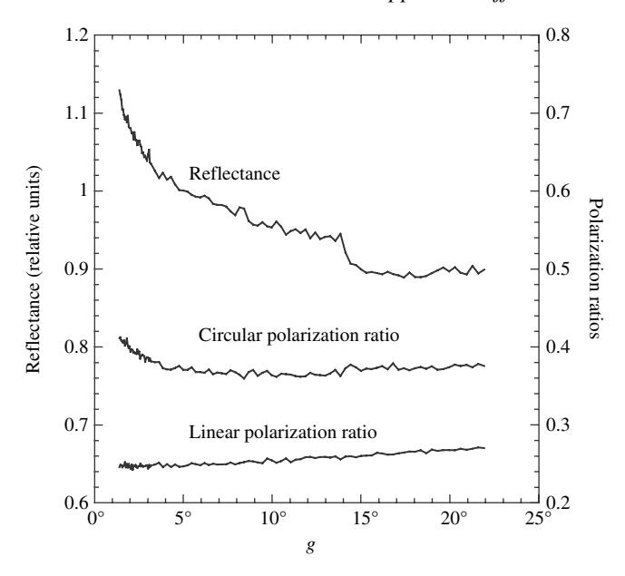

Figure 9.21 Reflectance and polarization ratios of the CBOE peak of the fractured surface of a solid basaltic rock.

Further complicating this discussion is the surprising discovery by Shepard and Arvidson [\(1999\)](#page-0-0) that the fractured surface of a basaltic rock had a weak opposition effect. Subsequent polarized reflectance measurements showed that the peak was a CBOE (Figure [9.21\)](#page-0-0). It is probably caused by scattering between imperfections inside the rock.

Of course, it is possible that the opposition effect in powders of large closepacked particles is dominated by shadow-hiding rather than coherent backscatter. This would explain the insensitivity to wavelength and particle size. However, it would not account for the lack of dependence on porosity or the strong peaks observed in high-albedo materials. Moreover, it would not be consistent with the increased circular polarization ratio in the peaks, for which no explanation other than coherent backscatter has ever been advanced.

At the present time we do not understand the coherent backscatter opposition effect in media of touching particles larger than the wavelength. In principle, techniques like the T-matrix method and the discrete dipole approximation could be used to study the problem, but the CPU and memory requirements to model realistic semi-infinite media are well beyond present technology. Present capabilities allow the calculation of scattering by clusters of only a few particles, but these are poor simulations of semi-infinite media because major amounts of light leak out of the fronts and sides of the clusters, instead of being backscattered. As computer capabilities increase we may expect to see improvements in such models that may resolve the problem. It is likely that the correct explanation will again be found to be the result of a breakdown of approximating a discrete medium by a quasi-continuous one.

## **9.4 Combined SHOE, CBOE, and IMSA models**

Combining the shadow-hiding and coherent backscattering opposition effects with the IMSA model, the SHOE amplifies only the single scattering term, while the CBOE amplifies both the multiple and the single scattering. Thus, the reflectance becomes

$$r(i, e, g) = K \frac{w}{4\pi} \frac{\mu_0}{\mu_0 + \mu} \{ p(g) [1 + B_{S0} B_S(g)] + [H(\mu_0/K) H(\mu/K) - 1] \} [1 + B_{C0} B_S(g)]$$
(9.47)

where *BS(g)*, *hS*, *BC(g)*, and *hC* are given respectively by [\(9.22\)](#page-0-0), [\(9.23\)](#page-0-0), [\(9.43\)](#page-0-0), and [\(9.41b\)](#page-0-0), *K* by [\(7.44\)](#page-0-0) and [\(7.45\)](#page-0-0), and *H (x)* by [\(8.70b\)](#page-0-0).

The shapes of *BC(g)* and *BS(g)* are compared in Figure [9.22.](#page-0-0) In these curves the angular width parameters have been adjusted so that the curves are equal at the half-maximum points. Also shown for comparison is the exponential function, which is often used empirically to describe the opposition effect. The curves are indistinguishable between *g* = 0 and the HWHM. However, the SHOE and CBOE functions fall off more slowly than the exponential function at larger phase angles.

A question of interest in remote sensing is how to tell what type of opposition effect is being observed in the reflectance of a medium. Shortly after the CBOE was discovered, it was thought that the two types could be distinguished by their wavelength dependence, but subsequent laboratory investigations have shown that this test is unreliable. The most definitive test seems to be the behavior of the polarization ratios. As the phase angle decreases the circular polarization ratio increases and the linear ratio decreases if the opposition peak is a CBOE. If the peak is a SHOE both ratios decrease. These ratios can be measured for samples in the laboratory, but usually not in remote-sensing situations, where the illumination is natural sunlight.

Another test, but one that is less stringent, is the angular width. A CBOE peak tends to be one or two degrees wide, while a SHOE peak tends to be several degrees wide if the medium has a wide particle size distribution, and 10!–20! wide, or more, if the size distribution is narrow. Thus the CBOE peak can easily be distinguished from the rest of the phase curve of a medium by its narrow width. However, when the SHOE peak is narrow it is difficult to separate it from the CBOE because of the

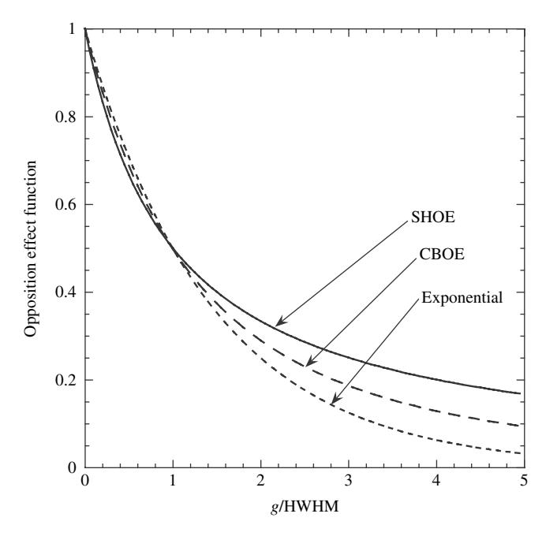

Figure 9.22 The CBOE and SHOE functions. For comparison, the exponential function is also shown. The angular width parameters have been adjusted so that the curves are equal at the half-power point.

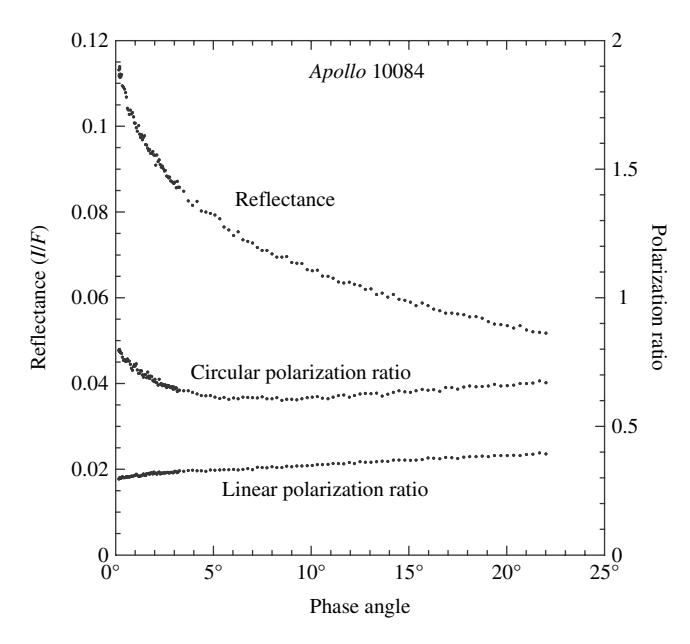

Figure 9.23 Measured reflectance and polarization ratios of a sample of lunar soil (*Apollo* 10084).

similarity in shapes. When the SHOE peak is wide it may be hard to distinguish its base from the continuum reflectance. When illuminated normally the phase function of most particulate materials has a high, narrow CBOE peak, outside of which it decreases almost linearly as the phase angle increases. Within the CBOE peaks the circular polarization ratio decreases with increasing phase angle, but in the linear region it increases or is flat (Figure [9.19\)](#page-0-0). At least part of the linear portion of the reflectance may be a SHOE, but the departure from a straight line may be so slight that it is difficult to tell how much is contributed by the SHOE and how much by the single-particle phase function.

The polarized reflectances of a large number and variety of powdered samples have been reported in the literature. Based on their polarization ratios, the only materials that have been found to have unamiguous SHOE peaks were certain varieties of vegetation (Hapke *et al.* [\(1996\)](#page-0-0). All materials of geological interest had CBOE peaks (Nelson *et al.*, [1998](#page-0-0)), including samples of lunar soil (Figure [9.23\)](#page-0-0) from the *Apollo* missions (Hapke *et al.*, [1993](#page-0-0)). Thus, even though we cannot measure the circular polarization ratios of bodies of the solar system, it is highly likely that their sharp, narrow, opposition effects are caused primarily by coherent backscatter. This CBOE peak is probably superposed on a weaker SHOE peak combined with the wide backscattered lobe of *p(g)*.